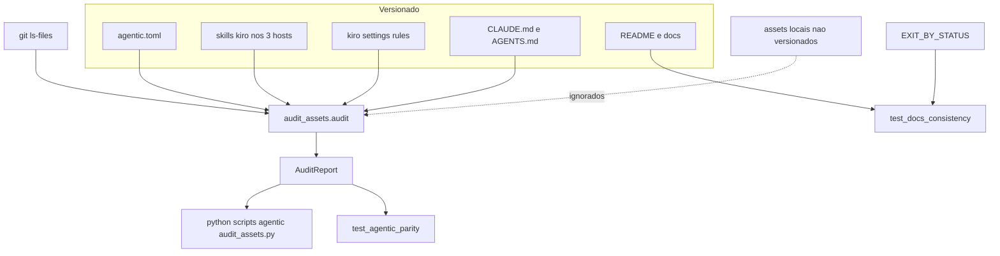
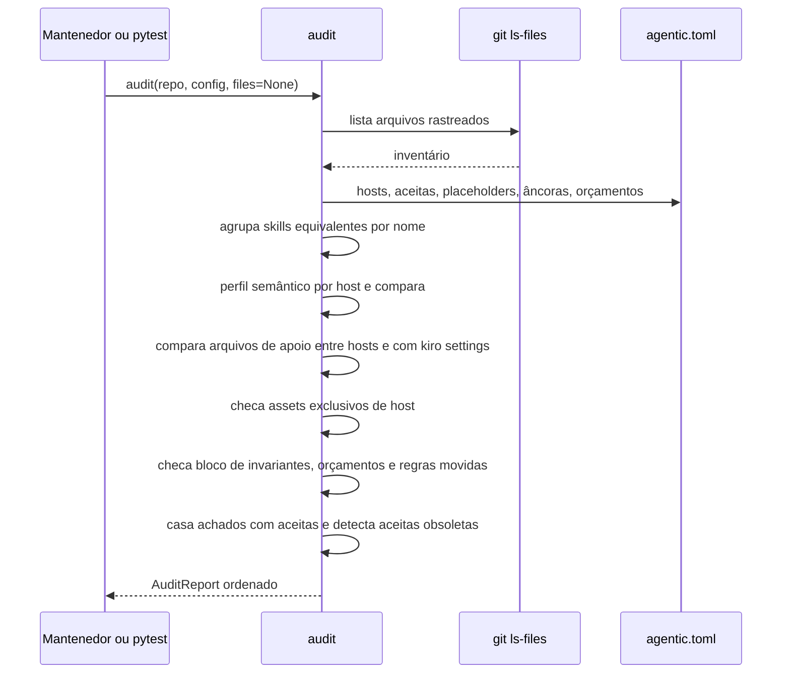

# Design Document — agentic-maintainability (Wave E)

## Overview

**Purpose**: Esta spec fecha o Cycle 2 de The Forge. Ela torna os assets agentic versionados (skills, comandos e instruções de host) auditáveis e protegidos contra drift por um teste offline, leva as invariantes do projeto a todos os hosts com o menor contexto sempre carregado possível, registra a decisão sobre fonte canônica e plugin sem migrar nada, consolida documentação e ADRs do ciclo e publica o relatório final do Cycle 2.

**Users**: mantenedores (auditoria, paridade, docs consistentes, relatório), agentes de código Claude Code, Codex e Devin (instruções curtas com as mesmas invariantes) e autores de provider (documentação coerente com o comportamento final).

**Impact**: nenhum código em `src/theforge/` muda. Entram uma ferramenta de manutenção em `scripts/agentic/` com configuração declarativa, dois arquivos de teste, `docs/agentic.md`, `docs/adr/0020-…`, `docs/adr/README.md` e `docs/reports/cycle-2.md`. `CLAUDE.md` e `AGENTS.md` são reescritos e encurtados; `.claude/commands/kiro/` é removido; README e documentos de `docs/` recebem a passada final de consolidação.

### Goals
- Auditoria reprodutível de drift entre hosts, com classificação sintaxe/aceita/drift (1.x).
- Teste offline que falha em drift semântico, skill faltante, arquivo de apoio divergente ou registro de aceitas desatualizado (2.x).
- Bloco de invariantes idêntico em `CLAUDE.md` e `AGENTS.md`, verificado (3.x).
- `CLAUDE.md` ≤ 2 500 bytes e `AGENTS.md` ≤ 6 000 bytes sem perda de regras, com mapa de regras movidas verificado (4.x).
- ADR 0020 com proposta de fonte canônica/plugin e política de hooks, sem migração (5.x).
- Raiz do repositório sem arquivos acidentais, com guarda (6.x).
- README/docs consistentes, links válidos, exit codes alinhados, índice de ADRs completo, relatório final verificável (7.x–9.x).
- Runtime intacto e verificações determinísticas, offline, iguais em Linux e Windows, independentes de assets locais (10.x).

### Non-Goals
- Migração automática para plugin ou geração dos mirrors a partir de uma fonte canônica.
- Criar `.kiro/steering/{product,tech,structure}.md` ou versionar `.kiro/specs/`, `.kiro/steering/`, `.claude/agents/`, `.agents/skills/source-command-*`.
- Adicionar hooks ao workflow de desenvolvimento.
- Redigir ADRs 0014–0019 ou reescrever seções técnicas entregues pelas Waves B–D.
- Novo job de CI, nova dependência (runtime ou dev), mudança de contrato ou de comportamento da CLI.

## Boundary Commitments

### This Spec Owns
- A ferramenta `scripts/agentic/audit_assets.py`, sua configuração `scripts/agentic/agentic.toml` (hosts, assets exclusivos de host, divergências aceitas, placeholders de instalação, âncoras de invariantes, orçamentos, regras movidas) e o formato do relatório de auditoria.
- `tests/test_agentic_parity.py` (paridade, invariantes, orçamentos, regras movidas, higiene da raiz) e `tests/test_docs_consistency.py` (links, índice do README, CLI canônica, exit codes, índice de ADRs, seções do relatório).
- O conteúdo de `CLAUDE.md` e `AGENTS.md`, incluindo o bloco de invariantes e seus marcadores.
- `docs/agentic.md` (workflow Kiro, hosts, manutenção de mirrors, correspondência de comandos legados, política de hooks).
- ADR 0020 (fonte canônica de assets agentic e política de hooks) e `docs/adr/README.md` (índice e mapa de decisões exigidas).
- `docs/reports/cycle-2.md` (relatório final do ciclo).
- A passada final de consolidação: estado do ciclo e índice no README, títulos de documentos ainda marcados "Wave A", tabela de exit codes do README alinhada à de `docs/cli.md`, links quebrados.
- A remoção de `.claude/commands/kiro/` e dos arquivos acidentais da raiz.

### Out of Boundary
- Qualquer arquivo em `src/theforge/`, `schemas/`, `adapters/`, workflows de CI e `pyproject.toml`: nada muda neles.
- Conteúdo técnico das seções de `docs/protocol.md`, `docs/provider-authoring.md`, `docs/architecture.md`, `docs/security.md`, `docs/cli.md` e dos documentos `docs/real-providers.md`, `docs/versioning.md`, `docs/capabilities.md`, `docs/performance.md`, `docs/errors.md`, que pertencem às specs donas; aqui só se corrigem resíduos de consolidação (título, status, link, índice).
- ADRs 0014–0019 e o teste de taxonomia de erros (`test_error_taxonomy.py`, Wave D), que já confere `docs/errors.md` contra `CODE_FAMILIES`.
- A paridade de schemas (step existente do CI e `tests/test_schemas.py`).
- Assets locais não versionados e os arquivos de steering.
- Conteúdo de `.kiro/settings/` (cópias de referência; só lidas).

### Allowed Dependencies
- Python stdlib ≥ 3.11 (`tomllib`, `re`, `json`, `pathlib`, `subprocess`, `argparse`, `dataclasses`) na ferramenta; pytest (já nos extras de dev) para os testes.
- Binário `git` só para `git ls-files` (somente leitura) na ferramenta; ausente → o teste pula com motivo explícito.
- Leitura de `theforge.cli.commands.EXIT_BY_STATUS` pelo teste de docs (import de leitura, sem executar a CLI).
- Upstream: ADRs e documentos entregues por `real-provider-integration`, `context-intelligence-v2` e `cross-forge-foundation`; resultados medidos que eles registraram.
- `src/theforge/` nunca importa `scripts/agentic/`; `scripts/agentic/` nunca importa `theforge`.

### Revalidation Triggers
- Mudança nas invariantes do projeto ou nos comandos de teste/lint/tipos/schemas: atualizar o bloco nos dois arquivos de instrução e as âncoras em `agentic.toml` na mesma mudança.
- Novo host, nova skill ou reinstalação do instalador Kiro: atualizar `agentic.toml` e rodar a auditoria; reaplicar bloco de invariantes e orçamentos no `AGENTS.md`.
- Gatilho recebido de `cross-forge-foundation`: mudança em `ExplainReport`, `CODE_FAMILIES`, códigos publicados, nomes de artefatos do run (ex.: `workspace-descriptor`) ou exit codes → revalidar README, `docs/cli.md`, o relatório e `tests/test_docs_consistency.py` (lista `CLI_FIXED_EXITS`, checagem de `docs/errors.md` como lista canônica).
- Entrega faseada de `cross-forge-foundation`: a spec tem um gate de validação explícito após sua tarefa 5 e pode ser dividida em D1 (execução multi-provider) e D2 (integridade, explain, taxonomia de erros e `docs/errors.md`). A dependência desta spec em D é revalidada após cada metade mesclada: após D1, conferir ADR 0018, artefatos do run e documentos tocados; após D2, conferir ADR 0019, `docs/errors.md`, exit 6 e `CLI_FIXED_EXITS`. As tarefas 5.x só fecham depois da revalidação pós-D2.
- Gatilho recebido de `real-provider-integration`: mudança no comando de setup de desenvolvimento (instalação editável dos adapters), no piso de Python dos adapters ou na fronteira de redação de `.forge/runs/<id>/work/` → atualizar o bloco de invariantes nos dois arquivos e as âncoras em `agentic.toml` na mesma mudança.
- Bump de `theforge.__version__` em qualquer wave: exige a linha correspondente na matriz de compatibilidade de `docs/versioning.md` (verificada por `test_compat_matrix.py` de `real-provider-integration`) na mesma mudança; esta spec não altera a versão, mas a validação final e o relatório conferem que a versão vigente tem linha na matriz.
- Novo ADR ou novo documento em `docs/`: atualizar `docs/adr/README.md` e o índice do README.
- Downstream: o próximo ciclo consome o relatório final e o ADR 0020 como ponto de partida.

## Architecture

### Existing Architecture Analysis
- O repositório já usa o padrão "lógica de gate em `scripts/`, exercitada por testes que a carregam por `importlib`" (`scripts/ci/`, `tests/test_packaging.py`); mypy estrito e ruff já cobrem `scripts/`.
- `tests/conftest.py` exige categoria em `FILE_MARKERS` para todo arquivo de teste novo; a suíte offline (`-m "not slow and not real_provider"`) já roda no gate de PR em Ubuntu e Windows × 3.11–3.14.
- `.gitattributes` só força LF para `schemas/*.json` e `tests/golden/*`; Markdown pode chegar com CRLF no Windows, então toda comparação normaliza fins de linha.
- Mirrors: 17 skills `kiro-*` em `.claude/skills`, `.agents/skills` (Codex, com `agents/openai.yaml` por skill) e `.devin/skills`; arquivos de apoio idênticos; `.codex/agents/spec-reviewer.toml` exclusivo do Codex.

### Architecture Pattern & Boundary Map



**Architecture Integration**:
- Selected pattern: funções puras sobre um inventário de arquivos rastreados + configuração declarativa; teste e CLI consomem o mesmo `AuditReport`.
- Domain/feature boundaries: auditoria de assets (ferramenta) separada da consistência de documentação (teste próprio); nenhuma ligação com o runtime.
- Existing patterns preserved: ferramenta em `scripts/`, testes offline categorizados, stdlib-only, mypy estrito.
- New components rationale: `AssetAudit` (requisitos 1–4), `DocsConsistency` (7–9), `RootHygiene` (6), mais os artefatos de documentação.
- Steering compliance: `.kiro/steering/` só tem o roadmap; seguidas as invariantes do `CLAUDE.md`.

### Technology Stack

| Layer | Choice / Version | Role in Feature | Notes |
|-------|------------------|-----------------|-------|
| Ferramenta | Python 3.11 stdlib (`tomllib`, `re`, `subprocess`, `argparse`) | auditoria e relatório | sem dependência nova; tipada (mypy strict) |
| Configuração | TOML (`scripts/agentic/agentic.toml`) | hosts, aceitas, orçamentos, âncoras, regras movidas | lido com `tomllib` |
| Testes | pytest (dev existente) | paridade, docs, raiz | categorias em `FILE_MARKERS` |
| Inventário | `git ls-files -z` | só arquivos rastreados | `-c core.fsmonitor=false`, sem escrita |
| CI | `ci.yml` existente | suíte offline já roda os testes | nenhum job novo |

## File Structure Plan

### Directory Structure
```
scripts/agentic/
├── audit_assets.py      # inventário, perfis, comparação, checagens de instrução, relatório, main()
└── agentic.toml         # configuração declarativa da auditoria
tests/
├── test_agentic_parity.py     # requisitos 1, 2, 3, 4.3–4.6, 6, 10.2–10.3
└── test_docs_consistency.py   # requisitos 7.1 (errors.md canônico), 7.2–7.6, 8.1–8.3, 9.1, 9.2, 9.4, 9.5
docs/
├── agentic.md                 # hosts, workflow Kiro, manutenção de mirrors, comandos legados, hooks
├── adr/
│   ├── 0020-agentic-assets-canonical-source.md   # decisão + proposta + política de hooks
│   └── README.md              # índice de ADRs e mapa das decisões exigidas
└── reports/
    └── cycle-2.md             # relatório final do Cycle 2
```

### Modified Files
- `CLAUDE.md` — reescrito: título, bloco de invariantes com marcadores, comandos, regra de idioma, ponteiros para `docs/agentic.md` e `.claude/skills/`; ≤ 2 500 bytes.
- `AGENTS.md` — reescrito: um único documento com bloco de invariantes idêntico, seção comum (workflow Kiro resumido e ponteiro para `docs/agentic.md`), seção Codex (`.agents/skills`, `$kiro-*`, subagentes) e seção Devin (`.devin/skills`, `/kiro-*`, delegação local/CLI); ≤ 6 000 bytes.
- `tests/conftest.py` — `FILE_MARKERS`: `test_agentic_parity.py: ("integration",)` (usa subprocesso `git`), `test_docs_consistency.py: ("unit",)`.
- `README.md` — estado "Cycle 2 concluído", índice completo de `docs/` (incluindo `agentic.md`, `adr/README.md`, `reports/cycle-2.md` e os documentos das Waves B–D), tabela de exit codes igual à de `docs/cli.md`, comando da auditoria em "Desenvolvimento".
- `docs/architecture.md`, `docs/security.md` — só títulos/estado ("ciclos 1 e 2") e links de consolidação; conteúdo técnico das specs donas preservado.
- `docs/cli.md`, `docs/protocol.md`, `docs/provider-authoring.md` — só correções de resíduo apontadas pelos testes de consistência (links, exemplos com `forge` em vez de `theforge`), se houver.
- `.claude/skills/kiro-*`, `.agents/skills/kiro-*`, `.devin/skills/kiro-*` — alterados só se a auditoria encontrar drift que não seja fraseado (esperado: nenhum).

### Removed Files
- `.claude/commands/kiro/{spec-design,spec-impl,spec-init,spec-requirements,spec-status,spec-tasks,steering,steering-custom,validate-design,validate-gap,validate-impl}.md` — substituídos pelas skills equivalentes.
- Raiz: `tuple[str` (e `(3`, `dict[str`, se reaparecerem) — não versionados; remoção local.

## System Flows



- Ordem determinística: achados ordenados por (categoria, skill/arquivo, host, elemento); relatório idêntico para o mesmo conteúdo (1.5).
- `files=None` → inventário via `git ls-files`; testes unitários passam `files` explícito sobre árvores temporárias.
- Falha de configuração (TOML inválido, host sem `skills_dir`) → `AgenticConfigError`, exit 2 na CLI e erro do teste.

## Requirements Traceability

| Requirement | Summary | Components | Interfaces | Flows |
|-------------|---------|------------|------------|-------|
| 1.1 | auditoria e relatório por skill | AssetAudit | `audit`, `AuditReport.to_text/to_json`, `main` | auditoria |
| 1.2 | classificação sintaxe/aceita/drift | AssetAudit | `FindingKind` | auditoria |
| 1.3 | assets exclusivos de host | AssetAudit, AgenticConfig | `host_only`, `FindingKind.HOST_ONLY_UNDECLARED` | auditoria |
| 1.4 | apoio vs `.kiro/settings` | AssetAudit | `compare_support`, `install_placeholders` | auditoria |
| 1.5 | relatório idêntico em reexecução | AssetAudit | ordenação total de `Finding` | auditoria |
| 1.6 | sem rede, sem escrita, sem locais | AssetAudit | `tracked_files` (`git ls-files`) | auditoria |
| 2.1 | teste falha em drift | ParityTest | `report.drift()` | — |
| 2.2 | tolera sintaxe de host | AssetAudit | `normalize_text`, `SkillProfile` | — |
| 2.3 | skill faltante | AssetAudit, ParityTest | `FindingKind.MISSING_SKILL` | — |
| 2.4 | apoio divergente | AssetAudit, ParityTest | `FindingKind.SUPPORT_DRIFT` | — |
| 2.5 | aceita obsoleta | AssetAudit, ParityTest | `FindingKind.STALE_ACCEPTED` | — |
| 2.6 | mesma execução do gate, sem dep nova | ParityTest, conftest | `FILE_MARKERS` | — |
| 3.1 | invariantes nos hosts | InstructionFiles, AssetAudit | âncoras `invariants.required` | — |
| 3.2 | texto idêntico | AssetAudit | `check_invariants` | — |
| 3.3 | teste falha em ausência/divergência | ParityTest | `FindingKind.INVARIANTS` | — |
| 3.4 | comandos atualizados juntos | InstructionFiles, AgenticDoc | gatilho de revalidação + âncoras de comando | — |
| 4.1 | CLAUDE.md curto | InstructionFiles, AgenticDoc | — | — |
| 4.2 | AGENTS.md único | InstructionFiles | — | — |
| 4.3 | orçamento documentado | AgenticConfig, AgenticDoc | `budgets` | — |
| 4.4 | teste de orçamento | AssetAudit, ParityTest | `FindingKind.BUDGET` | — |
| 4.5 | regras movidas registradas | AgenticConfig, AgenticDoc | `moved_rules` | — |
| 4.6 | teste de regras movidas | AssetAudit, ParityTest | `FindingKind.MOVED_RULE` | — |
| 4.7 | ponteiros por host | InstructionFiles | âncoras `pointers` por arquivo | — |
| 4.8 | remover comandos duplicados | LegacyCommandRemoval, AgenticDoc | tabela de correspondência | — |
| 5.1 | ADR com alternativas | Adr0020 | — | — |
| 5.2 | runtime independente | Adr0020, AssetAudit | `scripts/` fora do wheel | — |
| 5.3 | sem migração | Adr0020 | — | — |
| 5.4 | assets locais e steering | Adr0020, AgenticDoc | — | — |
| 5.5 | hooks focados | Adr0020, AgenticDoc | política de hooks | — |
| 5.6 | política documentada | Adr0020, AgenticDoc | — | — |
| 6.1 | remover arquivos acidentais | RootHygiene | — | — |
| 6.2 | teste de nomes da raiz | RootHygiene (ParityTest) | `ROOT_NAME` regex | — |
| 7.1 | docs refletem o ciclo | DocsConsolidation, DocsTest | `docs/errors.md` canônico, matriz de versões | — |
| 7.2 | README com estado e índice | DocsConsolidation, DocsTest | `test_readme_indexes_all_docs` | — |
| 7.3 | `theforge` canônico | DocsConsolidation, DocsTest | `test_examples_use_canonical_cli` | — |
| 7.4 | tabela de exit codes | DocsConsolidation | — | — |
| 7.5 | links válidos, sem `.kiro/` | DocsTest | `iter_links`, `test_errors_doc_is_canonical` | — |
| 7.6 | exit codes README = CLI | DocsTest | `EXIT_BY_STATUS`, `CLI_FIXED_EXITS` | — |
| 7.7 | schemas regenerados | (verificação existente) | step "Schema parity" + `test_schemas.py` | — |
| 8.1 | ADRs exigidos | AdrIndex, Adr0020 | `REQUIRED_DECISIONS` | — |
| 8.2 | índice com mapa | AdrIndex | `docs/adr/README.md` | — |
| 8.3 | teste de ADRs | DocsTest | `test_adr_index` | — |
| 8.4 | ausência = bloqueio da dona | AdrIndex, DocsTest | mensagem do teste nomeia a spec dona | — |
| 9.1 | seções do relatório | CycleReport | `REPORT_SECTIONS` | — |
| 9.2 | origem de cada medida | CycleReport, DocsTest | coluna "Origem" | — |
| 9.3 | prova real não executada declarada | CycleReport | — | — |
| 9.4 | sem links `.kiro/` | CycleReport, DocsTest | `iter_links` | — |
| 9.5 | teste de seções | DocsTest | `test_cycle_report_sections` | — |
| 10.1 | runtime intacto | Boundary | nenhum arquivo em `src/` | — |
| 10.2 | determinístico, offline, Linux/Windows | AssetAudit, DocsTest | normalização LF, ordenação | — |
| 10.3 | locais não alteram resultado | AssetAudit | `tracked_files` | auditoria |
| 10.4 | locais fora do git e de docs | DocsTest, AgenticDoc | `iter_links` sem `.kiro/` | — |

## Components and Interfaces

| Component | Domain/Layer | Intent | Req Coverage | Key Dependencies (P0/P1) | Contracts |
|-----------|--------------|--------|--------------|--------------------------|-----------|
| AssetAudit | ferramenta (`scripts/agentic/audit_assets.py`) | inventário, perfis, comparação, checagens de instrução, relatório | 1.x, 2.2–2.5, 3.1–3.3, 4.4, 4.6, 5.2, 10.2, 10.3 | AgenticConfig (P0), git (P0) | Service, Batch |
| AgenticConfig | ferramenta (`scripts/agentic/agentic.toml`) | declaração de hosts, aceitas, placeholders, âncoras, orçamentos, regras movidas | 1.3, 1.4, 3.1, 4.3, 4.5 | — | State |
| ParityTest | testes (`tests/test_agentic_parity.py`) | falhar o gate em drift, invariantes, orçamentos, regras movidas, raiz | 2.1, 2.3–2.6, 3.3, 4.4, 4.6, 6.2, 10.2, 10.3 | AssetAudit (P0) | — |
| DocsTest | testes (`tests/test_docs_consistency.py`) | links, índice, CLI canônica, exit codes, `errors.md` canônico, ADRs, relatório | 7.1, 7.2, 7.3, 7.5, 7.6, 8.3, 8.4, 9.2, 9.4, 9.5, 10.4 | `EXIT_BY_STATUS` (P1) | — |
| InstructionFiles | instruções (`CLAUDE.md`, `AGENTS.md`) | invariantes + regras persistentes por host | 3.1, 3.2, 3.4, 4.1, 4.2, 4.7 | — | — |
| AgenticDoc | docs (`docs/agentic.md`) | destino das regras movidas, manutenção de mirrors, comandos legados, hooks | 3.4, 4.1, 4.3, 4.5, 4.8, 5.4–5.6 | — | — |
| LegacyCommandRemoval | assets (`.claude/commands/kiro/`) | remover comandos duplicados | 4.8 | AgenticDoc (P0) | — |
| RootHygiene | repositório (raiz) | remover arquivos acidentais | 6.1, 6.2 | — | — |
| Adr0020 | docs (`docs/adr/0020-…`) | decisão, proposta de fonte canônica/plugin, política de hooks | 5.1–5.6, 8.1 | — | — |
| AdrIndex | docs (`docs/adr/README.md`) | índice e mapa das decisões exigidas | 8.1, 8.2, 8.4 | ADRs 0009–0011, 0014–0019 (P0, upstream) | — |
| DocsConsolidation | docs (`README.md`, `docs/*.md`) | passada final de coerência | 7.1–7.4 | docs das Waves B–D (P0, upstream) | — |
| CycleReport | docs (`docs/reports/cycle-2.md`) | relatório final | 9.1–9.4 | resultados registrados pelas Waves A–D (P0) | — |

### Ferramenta de manutenção

#### AssetAudit

| Field | Detail |
|-------|--------|
| Intent | Produzir um `AuditReport` determinístico sobre os assets agentic rastreados |
| Requirements | 1.1–1.6, 2.2–2.5, 3.1–3.3, 4.4, 4.6, 5.2, 10.2, 10.3 |

**Responsibilities & Constraints**
- Só lê; nunca escreve no repositório nem acessa rede. Considera apenas arquivos do inventário rastreado.
- Toda leitura de texto: UTF-8, `\r\n` → `\n`.
- Agrupa skills equivalentes pelo nome do diretório `kiro-*` sob `skills_dir` de cada host; um grupo deve existir em todos os hosts com `skills_dir`.
- Arquivos de metadado de host declarados (`host_metadata`, ex.: `agents/openai.yaml`) são excluídos do conjunto de arquivos de apoio e reportados como sintaxe de host.
- Tolerância de sintaxe (2.2) vem só do perfil: frontmatter além de `name`, envelopes, prefixos de invocação, forma do argumento e termos de delegação não entram no perfil.

**Dependencies**
- Inbound: ParityTest, mantenedor via CLI (P0).
- Outbound: AgenticConfig (P0).
- External: binário `git` (P0 para inventário real; testes unitários injetam `files`).

**Contracts**: Service [x] / API [ ] / Event [ ] / Batch [x] / State [ ]

##### Service Interface
```python
from dataclasses import dataclass
from enum import StrEnum
from pathlib import Path
from collections.abc import Sequence


class FindingKind(StrEnum):
    HOST_SYNTAX = "host-syntax"  # texto difere, perfil igual (tolerado)
    ACCEPTED = "accepted"  # divergência registrada com justificativa
    DRIFT = "drift"  # elemento do perfil diverge
    MISSING_SKILL = "missing-skill"  # skill ausente num host
    SUPPORT_DRIFT = "support-drift"  # arquivo de apoio diverge (hosts ou .kiro/settings)
    HOST_ONLY = "host-only"  # asset exclusivo declarado (informativo)
    HOST_ONLY_UNDECLARED = "host-only-undeclared"
    STALE_ACCEPTED = "stale-accepted"  # aceita sem divergência correspondente
    INVARIANTS = "invariants"  # bloco ausente, divergente ou sem âncora
    BUDGET = "budget"  # arquivo de instrução acima do orçamento
    MOVED_RULE = "moved-rule"  # regra movida ausente no destino
    POINTER = "pointer"  # ponteiro obrigatório ausente (4.7)


FAILING: frozenset[FindingKind]  # tudo exceto HOST_SYNTAX, ACCEPTED, HOST_ONLY


@dataclass(frozen=True, order=True)
class Finding:
    kind: FindingKind
    subject: str  # skill (kiro-x) ou caminho de arquivo
    hosts: tuple[str, ...]  # ordenado
    element: str  # "name" | "paths" | "skills" | "phases" | "support" | ...
    detail: str  # valores divergentes, tamanho/orçamento, âncora ausente


@dataclass(frozen=True)
class SkillProfile:
    name: str
    paths: frozenset[str]  # caminhos .kiro/..., rules/..., templates/... normalizados
    skill_refs: frozenset[str]  # kiro-* referenciadas, sem prefixo de invocação
    phases: frozenset[str]  # valores de phase de spec.json citados
    support_files: frozenset[str]  # caminhos relativos ao dir da skill, sem metadados de host


@dataclass(frozen=True)
class AuditReport:
    findings: tuple[Finding, ...]  # ordenados
    skills: tuple[tuple[str, tuple[str, ...]], ...]  # (skill, hosts em que existe)

    def failing(self) -> tuple[Finding, ...]: ...
    def to_text(self) -> str: ...
    def to_json(self) -> str: ...  # json.dumps(sort_keys=True, indent=2)


class AgenticConfigError(Exception): ...


def load_config(path: Path) -> "AgenticConfig": ...
def tracked_files(repo: Path) -> frozenset[str]: ...  # git -c core.fsmonitor=false ls-files -z
def normalize_text(text: str) -> str: ...  # CRLF -> LF
def profile_skill(skill_md: str, support_files: frozenset[str]) -> SkillProfile: ...
def audit(
    repo: Path, config: "AgenticConfig", files: frozenset[str] | None = None
) -> AuditReport: ...
def main(
    argv: Sequence[str] | None = None,
) -> (
    int
): ...  # [--root DIR] [--config FILE] [--json]; 0 sem falhas, 1 com falhas, 2 erro de config/git
```
- Preconditions: `repo` é a raiz do checkout; `config` validado por `load_config`.
- Postconditions: `audit` é pura dado (`repo` conteúdo, `config`, `files`); reexecução produz `AuditReport` igual (1.5).
- Invariants: nenhum `Finding` referencia arquivo fora do inventário; `findings` em ordem total.

**Regras do perfil (normalização)**
- `paths`: regex sobre `.kiro/[A-Za-z0-9_./{}$-]+`, `rules/[a-z0-9-]+\.md`, `templates/[a-z0-9-]+\.md`; placeholders `$1`, `$ARGUMENTS`, `{feature-name}` → `{feature}`; ponto final removido.
- `skill_refs`: `[/$]?kiro[-:]([a-z-]+)` → `kiro-<nome>` (cobre `/kiro-`, `$kiro-` e `/kiro:` legado).
- `phases`: `phase:?\s*"([a-z-]+)"`.
- `name`: chave `name` do frontmatter YAML-like (`^name:\s*(\S+)` entre os delimitadores `---`).

**Arquivos de apoio (1.4, 2.4)**
- Entre hosts: conteúdo normalizado idêntico para o mesmo caminho relativo.
- Contra referência: `rules/<f>.md` da skill ↔ `.kiro/settings/rules/<f>.md`; antes de comparar, aplica `install_placeholders` (lista de pares regex → token fixo, ex.: `` `spec.json.language` / `[a-z]{2}` `` → `` `spec.json.language` / <lang> ``). Templates sem cópia de referência só são comparados entre hosts.

**Checagens de instrução (3.x, 4.x)**
- Bloco entre `invariants.begin` e `invariants.end` presente em cada arquivo de `instructions` de cada host; blocos normalizados idênticos entre arquivos; cada âncora de `invariants.required` contida no bloco.
- `budgets`: `len(normalize_text(texto).encode("utf-8")) <= orçamento`.
- `moved_rules`: cada `anchor` presente (substring, após normalização de espaços) em `to`.
- `pointers`: por arquivo de instrução, âncoras obrigatórias (ex.: `docs/agentic.md`, diretório de skills do host, regra de idioma).

**Implementation Notes**
- Integration: `git` executado com `cwd=repo`, `env` mínimo (`PATH`, `SYSTEMROOT` no Windows, `GIT_CONFIG_NOSYSTEM=1`), `timeout=30`, `check=True`; caminhos com `/`.
- Validation: `load_config` rejeita chaves desconhecidas e tipos errados com `AgenticConfigError` (mensagem com a chave).
- Risks: perfil não captura prosa; mitigado pela comparação de conteúdo dos arquivos de apoio (onde ficam as regras de review).

#### AgenticConfig

| Field | Detail |
|-------|--------|
| Intent | Fonte declarativa e revisável da auditoria |
| Requirements | 1.3, 1.4, 3.1, 4.3, 4.5, 4.7 |

**Contracts**: State [x]

##### State Management
```toml
[hosts.claude]
skills_dir = ".claude/skills"
instructions = ["CLAUDE.md"]

[hosts.codex]
skills_dir = ".agents/skills"
instructions = ["AGENTS.md"]
host_metadata = ["agents/openai.yaml"]

[hosts.devin]
skills_dir = ".devin/skills"
instructions = ["AGENTS.md"]

[reference]
rules_dir = ".kiro/settings/rules"

[[install_placeholders]]
pattern = '`spec\.json\.language` / `[a-z]{2}`'
replacement = '`spec.json.language` / <lang>'

[[host_only]]
path = ".codex/agents/spec-reviewer.toml"
host = "codex"
reason = "agente de revisão cross-spec usado pelo kiro-spec-batch no Codex"

[[accepted]]
skill = "kiro-spec-quick"
element = "paths"
hosts = ["codex", "devin"]
value = ".kiro/specs/{feature}/design.md"
reason = "fraseado do texto de saída; o Claude cita specs/{feature}/design.md"

[invariants]
begin = "<!-- theforge:invariants:begin -->"
end = "<!-- theforge:invariants:end -->"
required = ["stdlib", "src/theforge", "adapters/", "Forge Protocol", "ambiguous", "ExecutionResult",
            "security.redact", ".forge/runs/<id>/work/", "domínio", "theforge/<Name>/v1",
            "python -m theforge.contracts.schema schemas",
            "-e ./adapters/sparkforge -e ./adapters/apiforge",
            "python -m pytest", "ruff check .", "mypy"]

[budgets]
"CLAUDE.md" = 2500
"AGENTS.md" = 6000

[pointers]
"CLAUDE.md" = ["docs/agentic.md", ".claude/skills/", "spec.json.language"]
"AGENTS.md" = ["docs/agentic.md", ".agents/skills/", ".devin/skills/", "spec.json.language"]

[[moved_rules]]
anchor = "3-phase approval workflow"
from = "CLAUDE.md"
to = "docs/agentic.md"
```
- Seções opcionais: `[invariants]`, `[budgets]`, `[pointers]` e `[[moved_rules]]`; cada checagem de instrução só roda quando sua seção está declarada (permite a baseline da auditoria antes da reescrita das instruções).
- Persistence & consistency: versionado; toda entrada `accepted` e `host_only` exige `reason` não vazio. A lista final de `accepted` e `moved_rules` é fechada na implementação a partir da auditoria real (valores acima são exemplos fiéis aos achados da pesquisa).
- Concurrency strategy: n/a.

### Testes

#### ParityTest (`tests/test_agentic_parity.py`)

| Field | Detail |
|-------|--------|
| Intent | Transformar achados de falha em falha do gate de PR, com mensagens por categoria |
| Requirements | 2.1, 2.3–2.6, 3.3, 4.4, 4.6, 6.2, 10.2, 10.3 |

**Responsibilities & Constraints**
- Carrega `scripts/agentic/audit_assets.py` por `importlib.util.spec_from_file_location` (padrão de `test_packaging.py`).
- Testes contra o repositório real (um por categoria de falha, mensagem lista `Finding`s): pula com motivo explícito se `git` não existir.
- Testes de comportamento sobre árvores temporárias com `files` explícito: sintaxe de host tolerada; skill faltante; drift de perfil; arquivo de apoio divergente com e sem placeholder; aceita obsoleta; asset local não rastreado ignorado; relatório idêntico em duas execuções; CRLF vs LF iguais; orçamento excedido; regra movida ausente; bloco de invariantes divergente.
- `main()` em subprocesso: exit 0 no repositório real; exit 1 numa árvore com drift; `--json` parseável.
- Higiene da raiz: toda entrada de `REPO.iterdir()` casa `^[A-Za-z0-9._-]+$`.

#### DocsTest (`tests/test_docs_consistency.py`)

| Field | Detail |
|-------|--------|
| Intent | Garantir coerência mecânica da documentação versionada |
| Requirements | 7.1, 7.2, 7.3, 7.5, 7.6, 8.3, 8.4, 9.2, 9.4, 9.5, 10.4 |

**Responsibilities & Constraints**
- Escopo: `README.md`, `CLAUDE.md`, `AGENTS.md`, `docs/**/*.md`; leitura UTF-8 com normalização LF. Os registros históricos do ciclo 1 em `docs/superpowers/` ficam fora da resolução de links (são snapshots), mas continuam sujeitos à regra de não linkar `.kiro/`.
- `iter_links(md) -> Iterator[tuple[str, str]]`: links Markdown `[..](alvo)` sem esquema (`http`, `https`, `mailto`) e sem âncora pura; alvo resolvido relativo ao arquivo; falha se inexistente ou se o caminho resolvido estiver sob `.kiro/specs`, `.kiro/steering` ou outro asset local declarado.
- `test_readme_indexes_all_docs`: todo `docs/*.md`, `docs/adr/README.md` e `docs/reports/cycle-2.md` linkado no README.
- `test_examples_use_canonical_cli`: em blocos de código `bash`/`sh`/sem linguagem, nenhuma linha de comando começa com `forge ` (o alias só aparece em prosa); README e `docs/cli.md` mencionam o alias.
- `test_exit_codes_tables`: extrai a primeira coluna da tabela "Exit codes" do README e de `docs/cli.md`; conjuntos iguais e iguais a `set(EXIT_BY_STATUS.values()) | CLI_FIXED_EXITS`, com `CLI_FIXED_EXITS = {1, 2, 5, 6, 70, 130}` (constante comentada como gatilho de revalidação da Wave D). `CLI_FIXED_EXITS` reúne os exit codes emitidos fora de `EXIT_BY_STATUS` (que mapeia status de run: `ok`/`partial`/`planned` → 0, `ambiguous`/`no_route` → 3, `refused`/`provider_failure` → 4; `ReplayRefused` também sai com 4, já coberto): 1 = `doctor`/`providers health` com falha; 2 = uso inválido, workspace não inicializado ou run desconhecido; 5 = falha ao persistir o run; 6 = divergência de integridade, emitida por `explain` com divergência e por `replay --mode verify` com divergência (conforme `cross-forge-foundation`: "divergência de integridade → 6"); 70 = erro interno; 130 = interrupção. As duas tabelas descrevem a linha 6 como divergência de integridade de `explain` e `replay --mode verify`.
- `test_errors_doc_is_canonical`: `docs/errors.md` (de `cross-forge-foundation`) é a lista canônica de códigos; o conteúdo dela contra `CODE_FAMILIES` já é conferido por `test_error_taxonomy.py` (Wave D) e não é duplicado aqui. Este teste verifica só a consolidação: `docs/errors.md` está no índice do README; `docs/protocol.md` linka `errors.md`; todo outro documento de `docs/` que contém tabela com células `FORGE-[A-Z0-9-]+` linka `errors.md` (tabelas de códigos fora dele são recortes, não fonte).
- `test_adr_index`: arquivos `docs/adr/NNNN-*.md` com números únicos e linha `- Status:`; cada um linkado em `docs/adr/README.md`; `REQUIRED_DECISIONS` (8 decisões → ADR e spec dona) presentes no índice e com arquivo existente; mensagem de falha de ADR ausente nomeia a spec dona (8.4).
- `test_cycle_report_sections`: `REPORT_SECTIONS` (11 títulos de 9.1) presentes como `##` em `docs/reports/cycle-2.md`; a tabela da seção "Resultados medidos" tem coluna "Origem" sem célula vazia (cada linha: origem ou "não medido").

Numeração de ADRs congelada para o Cycle 2 (sem numeração alternativa): 0014 e 0017 `real-provider-integration`; 0015 e 0016 `context-intelligence-v2`; 0018 e 0019 `cross-forge-foundation`; 0020 `agentic-maintainability`. `REQUIRED_DECISIONS` usa exatamente esses números; um número diferente no arquivo entregue é falha do teste, não remapeamento.

```python
REQUIRED_DECISIONS: dict[str, tuple[str, str]] = {
    "ownership dos adapters reais": ("0014", "real-provider-integration"),
    "taxonomia de capabilities": ("0017", "real-provider-integration"),
    "matriz de suporte de CI": ("0011", "cycle2-reality-hardening"),
    "integridade de contexto": ("0015", "context-intelligence-v2"),
    "local do cache do registry": ("0009", "cycle2-reality-hardening"),
    "modelo de execução multi-provider": ("0018", "cross-forge-foundation"),
    "fonte canônica de assets agentic": ("0020", "agentic-maintainability"),
    "modelo de policy": ("0010", "cycle2-reality-hardening"),
}
REPORT_SECTIONS: tuple[str, ...] = (
    "Implementado",
    "Mudanças de arquitetura",
    "Integração real Spark/API",
    "Contexto e economy",
    "Hardening de segurança",
    "CI",
    "Prova cross-forge",
    "Resultados medidos",
    "Limitações",
    "Adiamentos intencionais",
    "Próximo ciclo recomendado",
)
```

### Instruções e documentação

#### InstructionFiles (`CLAUDE.md`, `AGENTS.md`)

| Field | Detail |
|-------|--------|
| Intent | Regras persistentes curtas e invariantes idênticas por host |
| Requirements | 3.1, 3.2, 3.4, 4.1, 4.2, 4.7 |

**Responsibilities & Constraints**
- Bloco de invariantes (texto único, em português, como o atual CLAUDE.md), com escopo explícito entre core e adapters:
  - Core (`src/theforge`): runtime stdlib-only, Python ≥ 3.11, dependências só em `[dev]`; integração com providers só via Forge Protocol (subprocess + JSON) e nunca `import` de especialistas (`sparkforge`/`apiforge`) no core.
  - Adapters (`adapters/`, de `real-provider-integration`): distribuições separadas, stdlib-only, instaladas no interpretador de cada especialista (piso Python 3.10; o Spark adapter pode rodar em 3.10, o API adapter em 3.12); são o único lugar que importa `sparkforge`/`apiforge`; nunca importam `theforge`.
  - Routing determinístico, ambiguidade vira `ambiguous`, sem LLM no core; nenhum sucesso sem `ExecutionResult` válido; nenhum conhecimento de domínio no core.
  - Tudo que o core persiste passa por `security.redact` e credenciais nunca chegam ao env dos providers; o diretório `.forge/runs/<id>/work/` (cwd do execute) contém dados escritos pelo provider e fica fora dessa invariante de redação (conforme `real-provider-integration`).
  - Contratos `theforge/<Name>/v1` com regeneração (`python -m theforge.contracts.schema schemas`).
  - Comandos: setup de desenvolvimento `python -m pip install -e .[dev] -e ./adapters/sparkforge -e ./adapters/apiforge` (os adapters instalados em modo editável são exigidos pela conformance offline; mesmo comando que `real-provider-integration` define para `ci.yml`/`compat.yml`); `python -m pytest`, `python -m pytest -m slow`, `ruff check .`, `mypy`.
- `CLAUDE.md`: título, bloco, regra de idioma ("pense em inglês, responda em português; Markdown de spec no idioma de `spec.json.language`"), "Mais contexto" (`docs/architecture.md`, `docs/protocol.md`, `docs/adr/`, `docs/agentic.md`), skills em `.claude/skills/kiro-*`, `-y` só para fast-track intencional.
- `AGENTS.md`: bloco; seção comum (mesmos ponteiros e regra de idioma, workflow Kiro em uma linha com link); "Codex" (`.agents/skills/kiro-*`, invocação `$kiro-*`, subagentes com contexto novo e fallback inline identificado); "Devin Local / CLI" (`.devin/skills/kiro-*`, invocação `/kiro-*`, `run_subagent`/`read_subagent`, escritores sequenciais, fallback inline).

#### AgenticDoc (`docs/agentic.md`)

| Field | Detail |
|-------|--------|
| Intent | Destino versionado do workflow Kiro e da manutenção de assets agentic |
| Requirements | 3.4, 4.1, 4.3, 4.5, 4.8, 5.4–5.6 |

**Responsibilities & Constraints**
- Seções: Hosts suportados (tabela host → arquivo de instrução → diretório de skills → prefixo de invocação); Workflow Kiro (fases, aprovação em 3 fases, `-y`, `/kiro-spec-status`, steering local); Assets versionados vs locais (lista e decisão de não versionar `.kiro/specs`, `.kiro/steering`); Manutenção dos mirrors (editar os três hosts na mesma mudança, rodar `python scripts/agentic/audit_assets.py`, registrar aceitas com motivo, procedimento após reinstalar o instalador Kiro); Invariantes (onde vivem, como mudar os dois arquivos juntos); Orçamentos; Comandos legados (tabela `/kiro:<x>` → skill); Política de hooks (resumo + link ADR 0020).

#### LegacyCommandRemoval

| Field | Detail |
|-------|--------|
| Intent | Eliminar comandos Claude duplicados e desatualizados |
| Requirements | 4.8 |

- Correspondência: `spec-init`→`kiro-spec-init`, `spec-requirements`→`kiro-spec-requirements`, `spec-design`→`kiro-spec-design`, `spec-tasks`→`kiro-spec-tasks`, `spec-impl`→`kiro-impl`, `spec-status`→`kiro-spec-status`, `steering`→`kiro-steering`, `steering-custom`→`kiro-steering-custom`, `validate-gap`→`kiro-validate-gap`, `validate-design`→`kiro-validate-design`, `validate-impl`→`kiro-validate-impl`.
- Depois da remoção, a auditoria não acusa nenhum arquivo rastreado em `.claude/` fora de `skills/kiro-*`.

#### Adr0020 (`docs/adr/0020-agentic-assets-canonical-source.md`)

| Field | Detail |
|-------|--------|
| Intent | Registrar decisão e proposta sobre fonte canônica, plugin e hooks |
| Requirements | 5.1–5.6, 8.1 |

- Status: aceito (decisão de não migrar agora; proposta registrada para o próximo ciclo).
- Contexto: 3 mirrors gerados por instalador, diferenças de sintaxe por host, `AGENTS.md` compartilhado por Codex e Devin, comandos legados, steering local.
- Alternativas: (A) mirrors à mão + auditoria/paridade testada; (B) reinstalar a partir do instalador upstream com versão fixada + auditoria; (C) fonte canônica no repositório (`.kiro/settings` estendido com corpo neutro das skills) + script stdlib que renderiza os hosts; (D) plugin do Claude Code (serve só ao Claude; Codex/Devin continuam com mirrors).
- Critério de decisão: custo de manutenção observado (sincronizações manuais por ciclo), número de hosts, risco de divergência, independência do runtime, custo de migração.
- Decisão: (A) agora; recomendação (C) quando houver um 4º host ou mais de N sincronizações manuais por ciclo registradas; (D) só como empacotamento adicional para Claude, nunca como fonte. Nenhuma migração nesta wave. O wheel `theforge` nunca inclui nem requer os assets.
- Assets locais: `.kiro/specs`, `.kiro/steering` (incluindo `product.md`, `tech.md`, `structure.md`) e scaffolds de terceiros ficam locais; as skills funcionam sem steering, e as regras persistentes estão em `CLAUDE.md`/`AGENTS.md`/`docs/`.
- Política de hooks: se adicionados, só checagens focadas e determinísticas sobre os arquivos alterados (ruff nos arquivos tocados, teste relevante, paridade de schemas quando `contracts/` muda, auditoria agentic quando assets agentic mudam); nunca a suíte completa a cada edição; nenhum hook com rede.
- Limitação: a paridade por perfil não detecta prosa divergente sem efeito em caminhos, skills, fases ou arquivos de apoio.

#### AdrIndex (`docs/adr/README.md`)
- Tabela: número, título (link), status. Seção "Decisões exigidas pelo Cycle 2" com as 8 linhas de `REQUIRED_DECISIONS` (decisão → ADR → spec dona).

#### DocsConsolidation
- README: "Status: Cycle 2 concluído" com resumo de uma linha por wave e link para o relatório; tabela de exit codes igual à de `docs/cli.md` (inclui 6 após a Wave D, divergência de integridade de `explain` e `replay --mode verify`); índice com todos os documentos; comando da auditoria e setup de desenvolvimento com os adapters editáveis em "Desenvolvimento".
- `docs/errors.md` é a lista canônica de códigos; tabelas de códigos em `docs/protocol.md` (e em outros documentos) ficam como recortes que linkam `errors.md`; a consolidação só acrescenta o link quando faltar, sem reescrever a tabela da spec dona.
- Versões: esta spec não muda `theforge.__version__`; a consolidação confere que a versão vigente tem linha na matriz de `docs/versioning.md` (`test_compat_matrix.py` verde) e, se não tiver, registra bloqueio da wave que fez o bump.
- `docs/architecture.md`/`docs/security.md`: títulos sem "Wave A"; demais edições só onde o DocsTest acusar.
- Regra: se uma seção técnica de spec dona estiver desatualizada em relação ao código, registrar no relatório (Limitações) e avisar a spec dona, em vez de reescrevê-la.

#### CycleReport (`docs/reports/cycle-2.md`)
- 11 seções de `REPORT_SECTIONS`. "Resultados medidos": tabela `Métrica | Valor | Origem`, com origem = comando + data, workflow + run, ou documento (ex.: `docs/performance.md`); sem fonte → "não medido".
- "Prova cross-forge": real (com ambiente e data) ou "não executada neste ambiente: <motivo>; substituto offline: <teste em replay>" (9.3). Sabido hoje: API Forge exige Python 3.12, ausente na máquina do mantenedor.
- Sem links para `.kiro/`; specs citadas pelo nome apenas.
- Versões citadas (The Forge, protocolo, adapters, especialistas) vêm da matriz de compatibilidade de `docs/versioning.md`, com ela como origem; nomes de artefatos do run seguem os nomes finais de `cross-forge-foundation` (ex.: `workspace-descriptor`, não `workspace`).

## Data Models
Sem modelos persistidos novos. As estruturas de dados são `Finding`, `SkillProfile`, `AuditReport` e `AgenticConfig` (seção anterior), todas em memória; o único estado versionado é `agentic.toml`.

## Error Handling

### Error Strategy
- Ferramenta: `AgenticConfigError` (TOML inválido, chave desconhecida, `reason` vazio, host sem `skills_dir`) → mensagem `audit_assets: error: <detalhe>` e exit 2; `git` ausente ou falhando → exit 2 com mensagem; achados de falha → relatório e exit 1; sem falhas → exit 0. Nunca traceback na CLI.
- Testes: mensagens de falha listam os `Finding`s formatados (`kind subject hosts element: detail`) para correção direta.

### Error Categories and Responses
- Drift real → corrigir o mirror divergente na mesma mudança ou registrar `accepted` com motivo.
- Aceita obsoleta → remover a entrada.
- ADR exigido ausente → bloqueio reportado à spec dona (não redigir).
- Link quebrado ou `.kiro/` linkado → corrigir o documento.

### Monitoring
Não aplicável (ferramenta de desenvolvimento; o resultado aparece no gate de PR).

## Testing Strategy

### Unit Tests
- `profile_skill`: duas versões de SKILL.md com envelopes, `$1`/`{feature}`, `/kiro-`/`$kiro-`/`/kiro:` produzem o mesmo `SkillProfile` (2.2).
- Arquivo de apoio com `` `spec.json.language` / `en` `` vs `pt` não gera `SUPPORT_DRIFT`; outra diferença gera (1.4, 2.4).
- `accepted` sem divergência correspondente gera `STALE_ACCEPTED` (2.5); `host_only` não declarado gera `HOST_ONLY_UNDECLARED` (1.3).
- CRLF vs LF: perfis, blocos de invariantes e tamanhos iguais (10.2).
- Exit codes: extração de tabela Markdown e comparação com `EXIT_BY_STATUS | CLI_FIXED_EXITS` (7.6).

### Integration Tests
- `audit()` no repositório real (`git ls-files`): nenhum achado de falha; `skills` lista as 17 skills em `claude`, `codex`, `devin` (2.1, 2.3).
- Árvore temporária com diretório não rastreado `source-command-x` só num host: resultado igual ao sem ele (10.3).
- Duas execuções de `main(["--json"])` em subprocesso produzem saída idêntica e exit 0; árvore com drift → exit 1 (1.5, 1.6).
- Bloco de invariantes e orçamentos verificados no `CLAUDE.md` e `AGENTS.md` reais (3.3, 4.4); `moved_rules` presentes em `docs/agentic.md` (4.6).
- Raiz do repositório sem nomes fora do padrão (6.2).

### Documentation Tests
- Todos os links relativos de README/docs/instruções resolvem e nenhum aponta para `.kiro/` (7.5, 9.4, 10.4).
- README indexa todo `docs/*.md`, o índice de ADRs e o relatório (7.2).
- Exemplos de comando usam `theforge` (7.3).
- Índice de ADRs completo, números únicos, status presente, 8 decisões exigidas mapeadas aos números congelados (8.1–8.3).
- `docs/errors.md` indexado e linkado por `docs/protocol.md` e por todo documento com tabela de códigos `FORGE-*` (7.1, 7.5).
- Linha 6 presente nas duas tabelas de exit codes (7.6).
- Relatório com as 11 seções e coluna "Origem" preenchida (9.1, 9.2, 9.5).

### Final Validation (sem teste novo)
- Ambiente com `python -m pip install -e .[dev] -e ./adapters/sparkforge -e ./adapters/apiforge` (exigido pela conformance offline de `real-provider-integration`).
- `python -m pytest`, `ruff check .`, `mypy` verdes; step "Schema parity" inalterado e verde (7.7); `git diff --stat -- src schemas adapters pyproject.toml .github` vazio (10.1).
- `test_compat_matrix.py` verde: a versão vigente de `theforge.__version__` tem linha em `docs/versioning.md`; as versões citadas no relatório coincidem com essa linha.

## Security Considerations
- A ferramenta executa só `git ls-files` com ambiente mínimo e `core.fsmonitor=false`, sem hooks nem programas configurados pelo repositório; não lê fora de `repo`.
- Instruções e documentação não podem conter segredos; o relatório cita resultados, não variáveis de ambiente nem tokens (o segredo `SIBLING_REPOS_TOKEN` é mencionado só pelo nome, como já em `docs/real-providers.md`).

## Migration Strategy
- Ordem: (1) ferramenta, configuração e testes de paridade com a baseline real; (2) instruções curtas, `docs/agentic.md`, remoção de comandos legados, raiz; (3) ADR 0020; (4) após a Wave D mesclada (se dividida, revalidando após D1 e de novo após D2): índice de ADRs, consolidação de docs, relatório final e testes de docs; (5) validação final.
- Reversão: tudo é arquivo versionado; os comandos removidos voltam por `git revert` se necessário.
