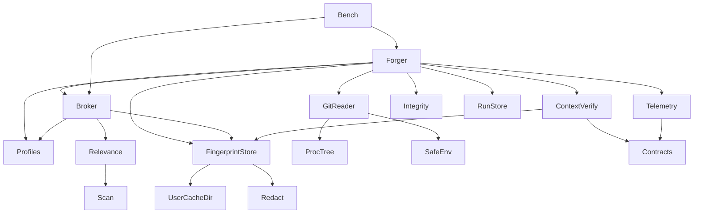
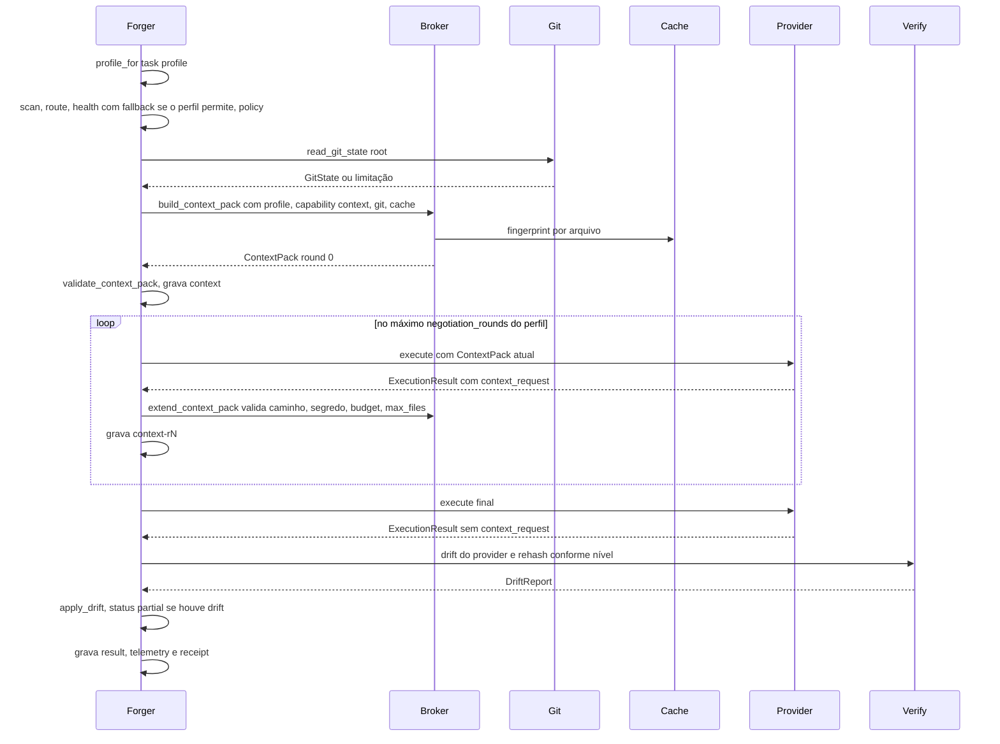
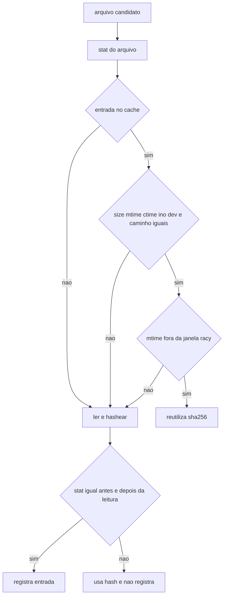

# Design Document — context-intelligence-v2 (Wave C)

## Overview

**Purpose**: Esta spec evolui o Context Broker de The Forge para entregar ao provider o contexto mais barato suficiente, explicável e íntegro. O ContextPack continua por referência (ADR 0007): caminho, sha256 e tamanho, sem conteúdo. A seleção ganha tiers, sinais determinísticos (incluindo git somente leitura), cache de fingerprints conservador, reverificação pós-execução contra TOCTOU e negociação limitada de contexto adicional. Os perfis `economy`, `balanced` e `max` passam a ser uma tabela única com diferenças observáveis, e todo run grava telemetria. Um baseline de performance medido antes da otimização fundamenta os budgets de regressão.

**Users**: usuários de The Forge (custo e profundidade previsíveis via `--profile`), autores de providers (tiers, pedido de contexto e obrigação de revalidação documentados no protocolo) e mantenedores (telemetria, baseline e budgets).

**Impact**: muda a fase de contexto do fluxo `ask` (relevância por sinais, tiers, git, cache), acrescenta um laço de negociação e uma etapa de reverificação após `execute`, grava o artefato `telemetry` em todo run e torna `economy` sem fallback de health. Todas as mudanças de contrato são aditivas e opcionais dentro de `theforge/<Name>/v1`; o Forge Protocol continua `forge/v1`.

### Goals
- ContextPack com tiers `metadata`/`reference`/`excerpt`/`requested`, seleção determinística e explicação por item (1.x, 2.x, 4.x).
- Sinais git sem nenhuma escrita no repositório e sem executar programas configurados pelo repositório (3.x).
- Fingerprints reutilizados só quando não há nenhuma evidência de mudança (5.x).
- Divergência entre hash e leitura nunca resulta em evidência `confirmed` nem em run `ok` (6.x).
- Bytes medidos e tokens honestos (7.x); negociação de contexto validada e limitada a 2 rodadas (8.x).
- Perfis materialmente diferentes, provados por teste e registrados no run (9.x); telemetria por run (10.x).
- Baseline medido e budgets de regressão documentados (11.x), sem quebrar contratos nem runs antigos (12.x).

### Non-Goals
- Embeddings, busca semântica, LLM ou qualquer serviço de rede na seleção.
- Execução de mais de um provider por run, `ExecutionPlan`, `WorkspaceDescriptor`, `VerificationResult`, replay e o formato completo de `explain` (`cross-forge-foundation`).
- Adapters reais, conformance e taxonomia de capabilities (`real-provider-integration`).
- Estimador de tokens no core, índice persistente do workspace, parsers por linguagem ("estruturas" de código).
- Novos comandos de CLI; o uso de `.forge/cache/` (continua reservado e efêmero).

## Boundary Commitments

### This Spec Owns
- A tabela de perfis (`theforge/profiles.py`) e o significado de cada parâmetro: budget, limite de arquivos, tiers, rodadas de negociação, limite de providers, fallback, nível de verificação e timeout de `execute`.
- A seleção de contexto: sinais de relevância, prioridade entre sinais, tiers, explicação por item e motivos de exclusão (`context/relevance.py`, `context/broker.py`).
- A consulta git somente leitura usada para contexto (`context/git.py`), incluindo o hardening contra execução de programas do repositório.
- O cache de fingerprints de arquivos, seu formato e local (`context/fingerprints.py`).
- A detecção e o tratamento de divergência de contexto (TOCTOU) e a reverificação pós-execução (`context/verify.py`).
- Os campos aditivos de contrato: `ContextPack` (tiers, `workspace`, `tier_bytes`, `tokens`, `round`), `ContextFile` (`tier`, `lines`, `signals`), `ExcludedFile.signals`, `Capability.context`, `ForgeManifest.context_revalidation`, `ExecutionResult.context_request`, `ExecutionReceipt.telemetry_sha256`, `ReceiptInputs.context_round_sha256`, e o novo contrato `RunTelemetry` v1.
- Os códigos `FORGE-CONTEXT-REQUEST-UNSUPPORTED`, `FORGE-CONTEXT-REQUEST-LIMIT` e `FORGE-CONTEXT-REQUEST-INVALID`.
- O procedimento de benchmark (`scripts/bench/`), o baseline e os budgets de regressão (`docs/performance.md`).
- As seções de contexto em `docs/protocol.md`, `docs/provider-authoring.md`, `docs/architecture.md`, `docs/security.md` e dois ADRs novos.

### Out of Boundary
- Executar mais de um provider em um run: `max_providers` só é declarado e registrado aqui; o executor de plano de `cross-forge-foundation` é quem o aplica.
- `WorkspaceDescriptor` multi-repo: o resumo `WorkspaceSummary` é local ao ContextPack e não modela repositórios, relações nem tecnologias.
- Seam com `cross-forge-foundation`: quando o `WorkspaceDescriptor` precisar de HEAD e estado sujo, ele deve reutilizar `context.git.read_git_state` (dono da consulta git endurecida) em vez de executar o git por conta própria; o `WorkspaceSummary` não deve ser promovido a descritor de workspace.
- `VerificationResult` e a classificação "auto-relato vs verificação independente": a reverificação desta spec só compara hashes de contexto.
- Taxonomia formal de códigos `FORGE-*` (Wave D); aqui só se criam códigos no prefixo `CONTEXT` existente.
- Qualquer conhecimento de domínio (Spark, API): sinais vêm só do manifest do provider e de propriedades genéricas do workspace.
- Mudanças no routing: o router continua usando os mesmos sinais e a mesma função pura; git não entra no routing.

### Allowed Dependencies
- Python stdlib ≥ 3.11 no runtime; nenhuma dependência nova (nem de dev).
- O binário `git` do sistema, opcional e somente leitura; ausência é uma limitação, nunca um erro.
- Direção de imports (obrigatória, estende a da Wave A): `contracts.codes → contracts → errors/security → profiles → protocol → registry → routing/context → policy → runs → forger → cli`. `profiles` importa apenas `contracts`. `context/*` pode importar `contracts`, `security`, `profiles`, `protocol.proctree` e `registry.config.user_cache_dir`; nunca `routing`, `policy`, `runs`, `forger` ou `cli`. `scripts/bench/` pode importar qualquer módulo de `theforge` (é ferramenta, não runtime).
- Upstream `cycle2-reality-hardening`: `validate_context_pack`, `validate_result`, `RunStore.write` (redação + hash do conteúdo em disco), `security.env.safe_env`, `protocol.proctree`.

### Revalidation Triggers
- Mudança em `ContextPack`, `ContextFile`, `ExcludedFile`, `Capability.context`, `ForgeManifest.context_revalidation` ou `ExecutionResult.context_request` exige que `real-provider-integration` revalide adapters e conformance.
- Mudança em `ExecutionReceipt`/`ReceiptInputs`, `RunTelemetry`, nos valores de `max_providers` ou nos níveis de verificação exige que `cross-forge-foundation` revalide o executor de plano e `explain`.
- Telemetria de runs de plano (seam com `cross-forge-foundation`, decisão cruzada): a Wave D grava um artefato `telemetry` (`RunTelemetry` v1) também para o run do plano — durações de varredura e routing, `providers_executed` = nós executados, `ProfileSnapshot` — e acrescenta `telemetry_sha256` ao receipt do plano. Os campos de `RunTelemetry` que pressupõem um único provider são opcionais ou têm semântica documentada para runs de plano (ver ContextContracts). Mudança na semântica de qualquer campo de `RunTelemetry`, nos nomes de fase ou contador de `TelemetryRecorder` ou na regra "`providers_executed` > 1 só em run de plano" exige revalidar a telemetria de plano da Wave D; mudança na telemetria de plano da Wave D (campos preenchidos, agregação dos nós) exige revalidar `RunTelemetry`, `test_schemas.py` e o teste de leitura estrita desta spec.
- `explain` em texto (seam com `cross-forge-foundation`): a Wave D reescreve `cmd_explain` sobre `ExplainReport`. As seções de texto introduzidas aqui — itens de contexto com tier, intervalo e sinais; tiers efetivos e bytes por tier; excluídos com motivo; `unmatched (no_signal)`; git (ou limitação); rodadas de negociação; drift; linha `Telemetry:` — e os testes que as verificam (`test_cli.py`, teste de `explain --json` com `telemetry`) devem ser preservados pela Wave D, que passa a lê-las de `artifacts.context`, `artifacts.context-r*` e `artifacts.telemetry`. Mudança nessas seções aqui exige revalidar o renderizador de texto da Wave D, e vice-versa.
- Semântica de `Evidence.hash` (seam com `real-provider-integration`): a definição em ContextVerify e em `docs/protocol.md` é a única. Mudança nela exige que os adapters da Wave B revalidem como preenchem `Evidence.hash`; os adapters da Wave B declaram `ForgeManifest.context_revalidation` (estratégia `hash`), e mudança nos valores de `RevalidationStrategy` exige revalidar essa declaração. Nenhuma mudança nesta spec decorre disso além do registro do seam.
- Mudança no local ou formato do cache de fingerprints exige revisar `docs/security.md` e o ADR de contexto.
- Mudança na lista de chaves de configuração git consideradas executáveis, nos argumentos ou no ambiente da consulta git exige reexecutar os testes de não escrita e não execução.
- Mudança de códigos `FORGE-CONTEXT-*` exige revalidar a taxonomia da Wave D e `docs/errors.md` (lista canônica testada da Wave D).
- Mudança nos budgets de regressão exige novo baseline registrado com origem.
- Versão de pacote: esta wave não prevê alterar `theforge.__version__`. Se a implementação alterar a versão, a mesma mudança precisa acrescentar a linha correspondente na matriz de compatibilidade de `docs/versioning.md` exigida por `test_compat_matrix.py` (Wave B); vale para qualquer wave que altere a versão.

## Architecture

### Existing Architecture Analysis
- `Forger._run`: scan → route/revalidação → health/fallback → policy → `build_context_pack` → `validate_context_pack` → grava `context` → `execute` → integridade → grava `result` → `_finish` (receipt). A ordem "contexto depois da policy, gravado antes do execute" é preservada.
- `build_context_pack` é função pura sobre `WorkspaceScan`; seleciona só arquivos casados por glob e lê todo arquivo selecionado. `BUDGETS` (context) e `EXECUTE_TIMEOUTS` (forger) são tabelas separadas que só variam bytes e tempo.
- O orquestrador sobrescreve `ExecutionResult.metrics` com `tokens=unknown`, perdendo medições do provider.
- Padrões preservados: tudo persistido via `RunStore.write`; releitura estrita de artefatos do core; contratos `frozen, kw_only` com defaults para compatibilidade; transporte injetável; validadores puros em `contracts/integrity.py`.

### Architecture Pattern & Boundary Map



**Architecture Integration**:
- Padrão: pipeline de funções puras no pacote `context`, orquestrado pelo `forger` (o mesmo estilo do router e do broker atuais). Efeitos de I/O ficam isolados em `GitReader` (subprocesso) e `FingerprintStore` (cache em disco), ambos injetáveis nos testes.
- Fronteiras: `relevance` decide o que é relevante e por quê; `broker` decide tier e budget; `fingerprints` decide se um hash pode ser reutilizado; `verify` decide se houve divergência; `forger` só orquestra e registra.
- Componentes novos: `profiles` (fonte única dos perfis), `relevance`, `git`, `fingerprints`, `verify`, `forger/telemetry` e `scripts/bench`.
- Conformidade: stdlib-only, integração com providers só via protocolo, seleção determinística sem LLM, sucesso só com `ExecutionResult` válido, persistência só via `redact`, contratos `theforge/<Name>/v1` com schemas regenerados.

### Technology Stack

| Layer | Choice / Version | Role in Feature | Notes |
|-------|------------------|-----------------|-------|
| CLI | stdlib `argparse` (existente) | `explain` exibe contexto e telemetria | sem comando novo |
| Runtime | Python ≥ 3.11 stdlib (`os.stat`, `hashlib`, `re`, `time.perf_counter_ns`) | relevância, tiers, fingerprints, verificação, telemetria | 0 deps runtime (gate existente) |
| Ferramenta externa | `git` ≥ 2.26 do sistema, opcional | branch, HEAD, alterados | só leitura; ausente ou antigo → limitação |
| Data / Storage | JSON local: artefatos do run e cache em `user_cache_dir()/context/` | `telemetry`, `context-r1/r2`, fingerprints | escrita atômica, redação |
| Dev tooling | pytest, hypothesis, ruff, mypy strict (existentes) | testes de propriedade (determinismo, cache on/off) | benchmark fora da suíte padrão |

## File Structure Plan

### Directory Structure
```
src/theforge/
├── profiles.py                 # NOVO: ContextProfile, PROFILES, profile_for, MAX_NEGOTIATION_ROUNDS
├── context/
│   ├── __init__.py             # reexporta API pública do pacote (BUDGETS derivado de PROFILES)
│   ├── scan.py                 # (inalterado) candidatos e exclusões de segurança
│   ├── relevance.py            # NOVO: sinais, referências da intenção, prioridade, contagem no_signal
│   ├── git.py                  # NOVO: GitReader somente leitura (rev-parse, config local, status)
│   ├── fingerprints.py         # NOVO: FingerprintStore (cache conservador fora do workspace) e HashStats
│   ├── broker.py               # MODIFICADO: tiers, budget, max_files, extend_context_pack
│   └── verify.py               # NOVO: itens a reverificar por nível, drift do provider, rehash, apply_drift
├── forger/
│   ├── orchestrator.py         # MODIFICADO: perfis, git+cache, negociação, reverificação, telemetria
│   └── telemetry.py            # NOVO: TelemetryRecorder (fases, contadores) → RunTelemetry
└── contracts/
    ├── telemetry.py            # NOVO: RunTelemetry v1 e ProfileSnapshot
    └── (context, manifest, result, receipt, types, codes, integrity, schema, __init__ modificados)
scripts/bench/
├── run_bench.py                # NOVO: mede baseline; --out, --check budgets
├── workspace.py                # NOVO: gerador determinístico de workspaces sintéticos (1k, 10k)
├── baseline.json               # NOVO: baseline medido com origem (gerado e commitado)
└── budgets.json                # NOVO: budgets derivados do baseline, com origem e fator
docs/
├── performance.md              # NOVO: procedimento, baseline, budgets e origem
└── adr/
    ├── 0015-context-intelligence.md   # NOVO: tiers, fingerprints fora do projeto, TOCTOU, perfis
    └── 0016-git-read-only-signals.md  # NOVO: consulta git endurecida
tests/
├── test_profiles.py            # NOVO (unit)
├── test_context_relevance.py   # NOVO (unit)
├── test_context_git.py         # NOVO (integration, security)
├── test_fingerprints.py        # NOVO (unit, security)
├── test_context_verify.py      # NOVO (unit)
├── test_context_flow.py        # NOVO (integration): Forger + negociação + drift + telemetria
└── test_bench.py               # NOVO (unit): comparação com budgets e gerador sintético
```

ADRs: numeração congelada entre as waves — 0015 (inteligência de contexto) e 0016 (sinais git somente leitura) são desta spec; 0014 e 0017 pertencem a `real-provider-integration`, 0018 e 0019 a `cross-forge-foundation` e 0020 à Wave E. Não há fallback de numeração.

### Modified Files
- `src/theforge/contracts/types.py` — `Tier`, `ItemTier`, `VerificationLevel`, `RevalidationStrategy`, `Metric` (movido de `result.py`), `DEPENDENCY_MANIFESTS`, `MAX_CONTEXT_REQUEST_ITEMS`.
- `src/theforge/contracts/context.py` — `LineRange`, `GitSummary`, `WorkspaceSummary`; campos aditivos em `ContextFile`, `ExcludedFile` e `ContextPack`.
- `src/theforge/contracts/manifest.py` — `CapabilityContext`; `Capability.context`; `ForgeManifest.context_revalidation`.
- `src/theforge/contracts/result.py` — `ContextRequestItem`, `ContextRequest`; `ExecutionResult.context_request`; reexporta `Metric`.
- `src/theforge/contracts/receipt.py` — `ExecutionReceipt.telemetry_sha256`, `ReceiptInputs.context_round_sha256`.
- `src/theforge/contracts/codes.py` — três códigos `CONTEXT_REQUEST_*`.
- `src/theforge/contracts/integrity.py` — `validate_context_pack` cobre tiers e `tier_bytes`; novo `validate_context_request`; `validate_receipt` cobre os hashes novos.
- `src/theforge/contracts/__init__.py`, `contracts/schema.py` — exportam `RunTelemetry` (schema fechado); `schemas/` regenerado.
- `src/theforge/routing/signals.py` — usa `DEPENDENCY_MANIFESTS` de `contracts.types` (fonte única com o contexto).
- `src/theforge/runs/store.py` — artefatos `context-r1`, `context-r2`, `telemetry`.
- `src/theforge/cli/render.py` — seção de contexto (tiers, itens, sinais, exclusões, git, drift) e linha de telemetria em `explain`.
- `src/theforge/providers/echo/provider.py` — declara `context_revalidation="hash"`.
- `tests/fixtures/providers/bad_forge.py` — modos `context-request`, `context-request-loop`, `context-request-undeclared`, `context-request-invalid`, `drift-report`, `mutate-context`, `tokens-measured`, `excerpts`.
- `tests/conftest.py` — `FILE_MARKERS` dos testes novos; isolamento do cache de contexto (já coberto por `THEFORGE_CACHE_DIR` por teste).
- `tests/test_broker.py`, `tests/test_forger.py`, `tests/test_cli.py`, `tests/test_schemas.py`, `tests/test_protocol_adversarial.py` — novos casos; o monkeypatch de `build_context_pack` passa a aceitar `**kwargs`.
- `docs/protocol.md`, `docs/provider-authoring.md`, `docs/architecture.md`, `docs/security.md` — contexto v2.

## System Flows

### Fluxo `ask` com contexto v2



- A consulta git e o cache só rodam depois da policy: runs `no_route`, `ambiguous` e `refused` nunca executam git.
- Uma resposta com `context_request` nunca é persistida como `result`. Excesso de rodadas, capability sem `context.requests` ou pedido estruturalmente inválido terminam em `provider_failure` com `FORGE-CONTEXT-REQUEST-*`.
- `_finish` grava `telemetry` em todo desfecho e depois o receipt com `telemetry_sha256`.

### Decisão de reutilização de fingerprint



## Requirements Traceability

| Requirement | Summary | Components | Interfaces | Flows |
|-------------|---------|------------|------------|-------|
| 1.1 | quatro tiers | Contracts (context), Broker | `ContextFile.tier`, `WorkspaceSummary` | ask v2 |
| 1.2 | metadata sempre, sem bytes | Broker | `ContextPack.workspace`, `tier_bytes` | ask v2 |
| 1.3 | reference quando cabe | Broker | `build_context_pack` | ask v2 |
| 1.4 | excerpt de prefixo | Broker, Profiles | `_select_item` | ask v2 |
| 1.5 | excerpt de intervalo citado | Relevance, Broker | `IntentRefs.ranges` | ask v2 |
| 1.6 | sem declaração → sem excerpt | Broker | `effective_tiers` | ask v2 |
| 1.7 | sem conteúdo persistido | Broker, Contracts | `ContextFile` (só hash e tamanho) | — |
| 1.8 | determinismo | Relevance, Broker | `priority_key` | — |
| 2.1 | tipos de sinal | Relevance | `rank_candidates` | — |
| 2.2 | prioridade fixa | Relevance | `priority_key` | — |
| 2.3 | caminho citado na intenção | Relevance | `parse_intent_refs` | — |
| 2.4 | citação inválida excluída | Relevance, Broker | `IntentRefs.rejected` | — |
| 2.5 | sem regra de domínio | Relevance | `DEPENDENCY_MANIFESTS` genérico | — |
| 2.6 | sem embeddings/LLM/rede | Relevance, Git | — (só stdlib e git local) | — |
| 3.1 | branch, HEAD, alterados | GitReader | `read_git_state`, `GitSummary` | ask v2 |
| 3.2 | nenhuma escrita no repo | GitReader | args e ambiente endurecidos | — |
| 3.3 | sem programas do repo, sem credenciais | GitReader | checagem de config local, `safe_env` | — |
| 3.4 | git ausente/falha → limitação | GitReader, Broker | `GitState.limitations` | ask v2 |
| 3.5 | estados não usuais | GitReader | `GitSummary.state` | — |
| 4.1 | tier e sinais por item | Broker | `ContextFile.signals` | — |
| 4.2 | motivos de exclusão fechados | Broker, Relevance | `ExclusionReason` | — |
| 4.3 | agregado `no_signal` | Relevance | `WorkspaceSummary.unmatched_files` | — |
| 4.4 | explain mostra contexto | CLI render | `render.explain` | — |
| 5.1 | reutiliza sem ler | FingerprintStore | `fingerprint` | reutilização |
| 5.2 | qualquer evidência → rehash | FingerprintStore | `_trusted` | reutilização |
| 5.3 | cache inválido descartado | FingerprintStore | `load` | — |
| 5.4 | cache fora do workspace | FingerprintStore | `user_cache_dir()/context` | — |
| 5.5 | falha de escrita → aviso | FingerprintStore | `save(warnings)` | — |
| 5.6 | mesmos hashes com ou sem cache | FingerprintStore, Broker | — | — |
| 6.1 | drift → partial e caminhos | ContextVerify, Forger | `DriftReport`, `apply_drift` | ask v2 |
| 6.2 | evidência rebaixada | ContextVerify | `apply_drift` | — |
| 6.3 | hash do provider diverge | ContextVerify | `provider_reported_drift` | — |
| 6.4 | obrigação documentada | Docs | `docs/protocol.md`, `provider-authoring.md` | — |
| 6.5 | estratégia declarada registrada | Forger, Telemetry | `ForgeManifest.context_revalidation` | — |
| 6.6 | estratégia ausente → limitação | Forger, Telemetry | `provider_revalidation="undeclared"` | — |
| 6.7 | nunca `ok` com drift | Forger | status `partial` | ask v2 |
| 7.1 | bytes por tier | Broker | `ContextPack.tier_bytes` | — |
| 7.2 | tokens com tipo | Contracts, Forger | `Metric` | — |
| 7.3 | bytes nunca viram tokens | Forger | `_metrics` | — |
| 7.4 | tokens do provider preservados | Forger | `_metrics` | — |
| 8.1 | pedido declarado e estruturado | Contracts (manifest, result) | `CapabilityContext.requests`, `ContextRequest` | ask v2 |
| 8.2 | validação e `requested` | Broker | `extend_context_pack` | ask v2 |
| 8.3 | rodadas por perfil, máx. 2 | Profiles, Forger | `negotiation_rounds`, `MAX_NEGOTIATION_ROUNDS` | ask v2 |
| 8.4 | falhas de negociação | Forger, Integrity | `validate_context_request`, códigos | ask v2 |
| 8.5 | packs por rodada persistidos | RunStore, Forger | `context-r1`, `context-r2` | ask v2 |
| 8.6 | sucesso só no resultado final | Forger | `_execute_negotiated` | ask v2 |
| 9.1 | economy | Profiles, Forger | `PROFILES["economy"]` | ask v2 |
| 9.2 | balanced | Profiles, Forger | `PROFILES["balanced"]` | ask v2 |
| 9.3 | max | Profiles, Forger | `PROFILES["max"]` | ask v2 |
| 9.4 | parâmetros efetivos no run | Telemetry | `ProfileSnapshot` | — |
| 9.5 | testes de diferença | Tests | `test_profiles.py`, `test_context_flow.py` | — |
| 9.6 | um provider por `ask` | Forger | `max_providers` só registrado | — |
| 10.1 | métricas por run | TelemetryRecorder | `RunTelemetry` | ask v2 |
| 10.2 | tipo por métrica | TelemetryRecorder | `Metric` | — |
| 10.3 | redigida e vinculada por hash | RunStore, Contracts | `telemetry_sha256` | — |
| 10.4 | telemetria em falhas | Forger | `_finish` | — |
| 10.5 | runs antigos legíveis | Contracts, RunStore | defaults, leitura estrita | — |
| 11.1 | procedimento de benchmark | Bench | `run_bench.py`, `workspace.py` | — |
| 11.2 | baseline com origem antes da otimização | Bench, Docs | `baseline.json`, ordem das tarefas | — |
| 11.3 | budgets a partir do baseline | Bench, Docs | `budgets.json`, `performance.md` | — |
| 11.4 | `--check` reporta regressões | Bench | `compare_budgets` | — |
| 12.1 | campos aditivos | Contracts | defaults | — |
| 12.2 | schemas regenerados | Contracts schema | `python -m theforge.contracts.schema schemas` | — |
| 12.3 | redação de tudo persistido | RunStore, FingerprintStore | `redact` | — |
| 12.4 | entrada alterada pela redação não é gravada | FingerprintStore | `save` | — |
| 12.5 | integridade para todos os tiers | Integrity | `validate_context_pack` | — |

## Components and Interfaces

| Component | Domain/Layer | Intent | Req Coverage | Key Dependencies (P0/P1) | Contracts |
|-----------|--------------|--------|--------------|--------------------------|-----------|
| Profiles | profiles | tabela única de perfis | 8.3, 9.1–9.6 | contracts.types (P0) | Service, State |
| ContextContracts | contracts | campos aditivos de contexto, manifest, resultado, receipt e `RunTelemetry` | 1.1, 1.7, 7.2, 8.1, 10.3, 10.5, 12.1, 12.2 | contracts.base (P0) | State |
| Integrity (ext.) | contracts | invariantes de tiers, pedido e receipt | 8.4, 12.5 | Codes (P0) | Service |
| Relevance | context | sinais, prioridade, referências da intenção | 1.5, 1.8, 2.1–2.6, 4.2, 4.3 | scan (P0) | Service |
| GitReader | context | estado git somente leitura | 3.1–3.5, 2.6 | proctree (P0), safe_env (P0), git (External, P1) | Service |
| FingerprintStore | context | reuso conservador de sha256 | 5.1–5.6, 12.3, 12.4 | user_cache_dir (P0), redact (P0) | Service, State |
| Broker (ext.) | context | tiers, budget, limites, extensão por pedido | 1.1–1.8, 4.1, 4.2, 7.1, 8.2 | Relevance, FingerprintStore, Profiles (P0) | Service |
| ContextVerify | context | drift reportado e reverificado; rebaixamento | 6.1–6.3, 6.7, 9.1–9.3 | contracts (P0), FingerprintStore hash_lines (P0) | Service |
| TelemetryRecorder | forger | medir fases e contadores; montar `RunTelemetry` | 9.4, 10.1–10.4, 6.5, 6.6 | contracts (P0) | Service |
| Forger (ext.) | forger | orquestrar perfil, git, cache, negociação, verificação, telemetria | 6.1, 6.5–6.7, 7.3, 7.4, 8.3–8.6, 9.1–9.6, 10.4 | todos acima (P0) | Service |
| RunStore (ext.) | runs | novos artefatos | 8.5, 10.3, 10.5 | redact (P0) | State |
| ExplainRender (ext.) | cli | exibir contexto e telemetria | 4.4 | — | — |
| Bench | scripts | baseline e budgets | 11.1–11.4 | theforge (P1) | Batch |
| Docs | docs | protocolo, autoria, arquitetura, segurança, ADRs, performance | 6.4, 11.2, 11.3 | — | — |

### profiles

#### Profiles

| Field | Detail |
|-------|--------|
| Intent | Fonte única dos parâmetros de `economy`, `balanced` e `max` |
| Requirements | 8.3, 9.1, 9.2, 9.3, 9.4, 9.5, 9.6 |

**Responsibilities & Constraints**
- Tabela imutável; nenhum outro módulo define budgets, timeouts ou rodadas.
- `negotiation_rounds ≤ MAX_NEGOTIATION_ROUNDS = 2` para todo perfil (8.3).
- `context.BUDGETS` e o timeout de `execute` do orquestrador passam a ser derivados desta tabela.

| Parâmetro | economy | balanced | max |
|-----------|---------|----------|-----|
| `budget_bytes` | 65 536 | 262 144 | 1 048 576 |
| `max_files` | 16 | 64 | 256 |
| `tiers` | metadata, reference | metadata, reference, excerpt, requested | metadata, reference, excerpt, requested |
| `negotiation_rounds` | 0 | 1 | 2 |
| `max_providers` | 1 | 1 | 4 |
| `fallback` | não | sim | sim |
| `verification` | minimal | conditional | strong |
| `execute_timeout_s` | 60 | 180 | 600 |

**Contracts**: Service [x] / State [x]

##### Service Interface
```python
Tier = Literal["metadata", "reference", "excerpt", "requested"]  # contracts.types
VerificationLevel = Literal["minimal", "conditional", "strong"]  # contracts.types
MAX_NEGOTIATION_ROUNDS: Final = 2


@dataclass(frozen=True, kw_only=True)
class ContextProfile:
    name: BudgetProfile
    budget_bytes: int
    max_files: int
    tiers: frozenset[Tier]
    negotiation_rounds: int
    max_providers: int
    fallback: bool
    verification: VerificationLevel
    execute_timeout_s: float


PROFILES: Final[Mapping[BudgetProfile, ContextProfile]]


def profile_for(name: BudgetProfile) -> ContextProfile: ...
```
- Invariantes: `budget_bytes` e `max_files` estritamente crescentes de `economy` a `max`; `metadata` e `reference` em todos os perfis; `max_providers > 1` só em `max`.

**Implementation Notes**
- Integration: `economy` sem fallback muda o comportamento atual (antes havia fallback de health em todos os perfis); documentado em Migration Strategy.
- Validation: `test_profiles.py` verifica a tabela e as invariantes (9.5).
- Risks: valores iniciais; mudanças são gatilho de revalidação da Wave D.

### contracts

#### ContextContracts

| Field | Detail |
|-------|--------|
| Intent | Campos aditivos e contrato `RunTelemetry` v1 |
| Requirements | 1.1, 1.7, 7.2, 8.1, 10.3, 10.5, 12.1, 12.2 |

**Responsibilities & Constraints**
- Todo campo novo é opcional, com default que reproduz o comportamento v1. Providers v1 continuam válidos; runs antigos são relidos com `strict=True` sem os campos novos.
- `RunTelemetry` nunca cruza o protocolo: schema fechado (`CLOSED_SCHEMAS`). `ContextPack` e `ExecutionResult` continuam com schema aberto.
- Nenhum campo novo carrega conteúdo de arquivo (1.7).

**Contracts**: State [x]

##### State Management
```python
# contracts/types.py
ItemTier = Literal["reference", "excerpt", "requested"]
RevalidationStrategy = Literal["hash", "core", "none"]
ExclusionReason = Literal[
    "budget",
    "max_files",
    "tier_not_allowed",
    "secret",
    "outside_root",
    "unreadable",
    "missing",
    "symlinked_dir",
    "max_files_reached",
]
DEPENDENCY_MANIFESTS: Final = ("pyproject.toml", "requirements*.txt", "package.json")
MAX_CONTEXT_REQUEST_ITEMS: Final = 64


@dataclass(frozen=True, kw_only=True)
class Metric:  # movido de result.py; reexportado
    value: float | None = None
    kind: MetricKind = "unknown"


# contracts/context.py
@dataclass(frozen=True, kw_only=True)
class LineRange:
    start: int  # 1-based, >= 1
    end: int  # inclusivo, >= start


@dataclass(frozen=True, kw_only=True)
class ContextFile:
    path: str
    sha256: str  # do arquivo inteiro (reference) ou do intervalo (excerpt/requested com lines)
    bytes: int
    reason: str = ""  # resumo legível (compat v1)
    tier: ItemTier = "reference"
    lines: LineRange | None = (
        None  # obrigatório se tier == "excerpt"; proibido se tier == "reference"
    )
    signals: list[str] = field(default_factory=list)


@dataclass(frozen=True, kw_only=True)
class ExcludedFile:
    path: str
    reason: str  # um valor de ExclusionReason
    signals: list[str] = field(default_factory=list)


@dataclass(frozen=True, kw_only=True)
class GitSummary:
    available: bool
    branch: str | None = None
    head: str | None = None
    detached: bool = False
    dirty: bool | None = None
    changed_files: int | None = None
    state: list[str] = field(default_factory=list)  # no_commits, merge, rebase, cherry_pick, bisect


@dataclass(frozen=True, kw_only=True)
class WorkspaceSummary:
    files_scanned: int
    unmatched_files: int  # agregado no_signal (4.3)
    dependency_files: list[str] = field(default_factory=list)
    git: GitSummary | None = None

    # ContextPack: campos novos
    workspace: WorkspaceSummary | None = None  # tier metadata (sempre presente em packs v2)
    tier_bytes: dict[str, int] = field(default_factory=dict)
    tokens: Metric = field(default_factory=Metric)  # sempre unknown no core (7.2, 7.3)
    round: int = 0  # 0 = inicial; 1..2 = rodada de negociação


# contracts/manifest.py
@dataclass(frozen=True, kw_only=True)
class CapabilityContext:
    excerpts: bool = False
    requests: bool = False


# Capability.context: CapabilityContext = CapabilityContext()
# ForgeManifest.context_revalidation: RevalidationStrategy | None = None


# contracts/result.py
@dataclass(frozen=True, kw_only=True)
class ContextRequestItem:
    path: str
    lines: LineRange | None = None
    reason: str = ""


@dataclass(frozen=True, kw_only=True)
class ContextRequest:
    items: list[ContextRequestItem]


# ExecutionResult.context_request: ContextRequest | None = None

# contracts/receipt.py
# ReceiptInputs.context_round_sha256: list[str] = []      # hashes de context-r1, context-r2
# ExecutionReceipt.telemetry_sha256: str | None = None

# contracts/telemetry.py
TELEMETRY_SCHEMA = "theforge/RunTelemetry/v1"


@dataclass(frozen=True, kw_only=True)
class ProfileSnapshot:
    name: BudgetProfile
    budget_bytes: int
    max_files: int
    tiers: list[str]
    effective_tiers: list[
        str
    ]  # perfil ∩ declaração da capability (vazio se não chegou ao contexto)
    negotiation_rounds: int
    max_providers: int
    fallback: bool
    verification: VerificationLevel
    execute_timeout_s: float


@dataclass(frozen=True, kw_only=True)
class RunTelemetry:
    schema: str = TELEMETRY_SCHEMA
    producer: Producer
    created_at: str
    run_id: str
    profile: ProfileSnapshot
    # todas as métricas têm default Metric() (kind="unknown"): quem monta só preenche o que mediu
    scan_ms: Metric = field(default_factory=Metric)
    routing_ms: Metric = ...
    context_ms: Metric = ...
    provider_ms: Metric = ...
    files_scanned: Metric = ...
    files_selected: Metric = ...
    files_hashed: Metric = ...
    bytes_hashed: Metric = ...
    cache_hits: Metric = ...
    cache_misses: Metric = ...
    context_bytes: Metric = ...
    providers_executed: Metric = ...
    fallbacks_used: Metric = ...
    negotiation_rounds: Metric = ...
    provider_revalidation: Literal["hash", "core", "none", "undeclared"] | None = None
    verification_performed: VerificationLevel | None = None
    context_drift: list[str] = field(default_factory=list)
    limitations: list[str] = field(default_factory=list)
    unknowns: list[str] = field(default_factory=list)
```
- Run de `ask` e run de plano: o mesmo contrato representa os dois. O tipo do run vem do receipt (`ExecutionReceipt.kind`, da Wave D); `RunTelemetry` não duplica esse campo.
  - Run de `ask` (esta spec): `providers_executed` ≤ 1 (9.6); todos os campos preenchidos conforme o run alcançou cada fase.
  - Run de plano (gravado pela Wave D): preenche `scan_ms`, `routing_ms`, `files_scanned`, `providers_executed` (= número de nós executados, o único caso em que pode ser > 1) e `profile` (`ProfileSnapshot` com `effective_tiers` vazio, pois o plano não monta ContextPack próprio). Os campos que pressupõem um único provider ou um único ContextPack — `context_ms`, `provider_ms`, `files_selected`, `files_hashed`, `bytes_hashed`, `cache_hits`, `cache_misses`, `context_bytes`, `fallbacks_used`, `negotiation_rounds`, `provider_revalidation`, `verification_performed`, `context_drift` — ficam no default (`unknown`, `None` ou vazio) salvo se a Wave D definir e documentar uma agregação dos nós; os valores por nó estão na telemetria de cada run de nó.
  - O validador do contrato não impõe `providers_executed` ≤ 1 (isso quebraria runs de plano); o invariante de `ask` é provado pelos testes de fluxo desta spec (9.6).
- `ContextFile.__post_init__`: `excerpt` exige `lines`; `reference` proíbe `lines`; `lines` com `start < 1` ou `end < start` é `ContractError`.
- `ContextRequest.__post_init__` não limita itens (o limite é relacional, em `validate_context_request`, para gerar código específico).

**Implementation Notes**
- Integration: o hash do manifest muda para providers existentes porque `to_dict` passa a incluir os defaults novos; o cache do registry é descartado uma vez com aviso e regenerado (ver Migration Strategy).
- Validation: `test_schemas.py` (paridade após `python -m theforge.contracts.schema schemas`), `test_contracts_models.py` (defaults e releitura estrita de artefatos antigos), `test_fuzz_contracts.py` (novos contratos na varredura).
- Risks: o `Metric` movido precisa continuar importável de `theforge.contracts.result`.

#### Integrity (extensão)

| Field | Detail |
|-------|--------|
| Intent | Invariantes relacionais de tiers, pedido de contexto e receipt |
| Requirements | 8.4, 12.5 |

**Contracts**: Service [x]

##### Service Interface
```python
def validate_context_pack(pack: ContextPack) -> None: ...


# Ordem: used vs budget; used vs soma dos itens; soma de tier_bytes == used_bytes (quando
# tier_bytes não vazio, tier metadata = 0); caminhos; round >= 0.  Códigos: CONTEXT_BYTES, CONTEXT_PATH.


def validate_context_request(request: ContextRequest) -> None: ...


# 1 <= len(items) <= MAX_CONTEXT_REQUEST_ITEMS, senão Codes.CONTEXT_REQUEST_INVALID.
# Caminhos de item NÃO são validados aqui: item inválido é recusado individualmente pelo broker (8.2).


def validate_receipt(receipt: ExecutionReceipt, *, result_sha256: str | None) -> None: ...


# Acrescenta ao check de formato: telemetry_sha256 e cada inputs.context_round_sha256[i].
```
- Códigos novos (`contracts/codes.py`): `CONTEXT_REQUEST_UNSUPPORTED = "FORGE-CONTEXT-REQUEST-UNSUPPORTED"`, `CONTEXT_REQUEST_LIMIT = "FORGE-CONTEXT-REQUEST-LIMIT"`, `CONTEXT_REQUEST_INVALID = "FORGE-CONTEXT-REQUEST-INVALID"`.

### context

#### Relevance

| Field | Detail |
|-------|--------|
| Intent | Atribuir sinais genéricos aos arquivos e ordená-los de forma determinística |
| Requirements | 1.5, 1.8, 2.1, 2.2, 2.3, 2.4, 2.5, 2.6, 4.2, 4.3 |

**Responsibilities & Constraints**
- Sinais (códigos estáveis registrados em `ContextFile.signals`): `intent_lines`, `intent_path`, `target:<alvo>`, `glob:<glob>`, `git:changed`, `dependency_manifest`.
- `target` só vale para alvos explícitos diferentes de `.`; com o alvo padrão `["."]` nenhum arquivo recebe o sinal.
- Prioridade fixa (2.2), chave de ordenação crescente: `(not intent, not target, not glob, not git, -len(glob_hits), not dependency, path)`. Arquivos citados pela tarefa vêm primeiro, depois alvos, depois globs da capability (os alterados no git antes), depois só-git, depois só-dependência.
- Referência na intenção: um token é referência de caminho se contém `/` ou termina em `.<ext>` com `ext` começando por letra; aceita sufixos `:N`, `:N-M`, `:LN-LM` e `#LN-LM`. Normaliza `\` → `/` e remove `./` inicial. Casa somente o caminho relativo exato presente na varredura.
- Citação rejeitada (2.4): caminho absoluto, com drive ou com segmento `..` → `outside_root`; nome de segredo ou presente em `scan.excluded` como `secret` → `secret`; inexistente → `missing`.
- Nenhuma regra de domínio: `DEPENDENCY_MANIFESTS` é a mesma lista genérica que o routing já usa (fonte única em `contracts.types`).

**Contracts**: Service [x]

##### Service Interface
```python
@dataclass(frozen=True, kw_only=True)
class IntentRefs:
    paths: frozenset[str]
    ranges: Mapping[str, LineRange]
    rejected: Mapping[str, ExclusionReason]


@dataclass(frozen=True, kw_only=True)
class RankedFile:
    path: str
    signals: tuple[str, ...]
    lines: LineRange | None  # intervalo citado na intenção, se houver


def parse_intent_refs(intent: str, scan: WorkspaceScan) -> IntentRefs: ...
def rank_candidates(
    task: TaskSpec,
    globs: Sequence[str],
    scan: WorkspaceScan,
    changed: frozenset[str],
    refs: IntentRefs,
) -> tuple[list[RankedFile], int]: ...  # (candidatos ordenados, unmatched_files)
```
- Pós-condição: o resultado depende só do conteúdo das entradas, nunca da ordem de `scan.files` ou de `globs` (testado por permutação com hypothesis).

#### GitReader

| Field | Detail |
|-------|--------|
| Intent | Ler branch, HEAD e arquivos alterados sem modificar o repositório nem executar programas dele |
| Requirements | 2.6, 3.1, 3.2, 3.3, 3.4, 3.5 |

**Responsibilities & Constraints**
- Executável: `shutil.which("git")`; ausente → `GitSummary(available=False)` e limitação `git: not available`.
- Ambiente: `security.env.safe_env()` (sem credenciais) mais `GIT_OPTIONAL_LOCKS=0`, `GIT_TERMINAL_PROMPT=0`, `GIT_PAGER=cat`, `LC_ALL=C`. `cwd` = raiz do workspace. Spawn via `protocol.proctree` com kill de árvore no timeout. Orçamento total `GIT_TIMEOUT_S = 5.0` para todas as chamadas.
- Chamadas, em ordem, sempre com `-c core.fsmonitor=false`:
  1. `git rev-parse --show-toplevel --absolute-git-dir --abbrev-ref HEAD` → toplevel, git dir, branch (`HEAD` = destacado). Falha "not a git repository" → limitação `git: not a repository`; "dubious ownership" → limitação `git: repository not trusted by git (safe.directory)`; nunca sobrescreve `safe.directory`.
  2. `git rev-parse --verify -q HEAD` → oid; falha → estado `no_commits`.
  3. `git config --list --show-scope --includes -z` → se alguma chave nos escopos `local` ou `worktree` casar com `EXECUTABLE_CONFIG_KEYS` (`core.fsmonitor`, `filter.*.clean`, `filter.*.smudge`, `filter.*.process`: as únicas chaves que fazem o `status` executar um programa; hooks, pager, editor e comandos de diff não rodam no `status --porcelain`), o `status` não roda e a limitação `git: status skipped: repository config defines <key>` é registrada. git sem `--show-scope` (< 2.26) → mesma recusa conservadora com limitação `git: version too old for safe status`.
  4. `git status --porcelain=v1 -z --untracked-files=all --ignore-submodules=all --no-renames` → caminhos alterados (relativos ao toplevel), convertidos para relativos à raiz do workspace; caminhos fora da raiz são descartados.
- Estados (3.5): existência léxica, dentro do git dir absoluto, de `MERGE_HEAD` (`merge`), `rebase-merge`/`rebase-apply` (`rebase`), `CHERRY_PICK_HEAD` (`cherry_pick`), `BISECT_LOG` (`bisect`); `no_commits`; `detached`. Nenhum estado falha o run.
- Saídas do git são limitadas (64 KB de stdout por chamada além do necessário para a lista de alterados, truncada em `MAX_FILES` caminhos) e decodificadas com `surrogateescape`.

**Contracts**: Service [x]

##### Service Interface
```python
@dataclass(frozen=True, kw_only=True)
class GitRun:
    returncode: int
    stdout: bytes
    stderr_tail: str
    timed_out: bool


GitRunner = Callable[[Sequence[str], Path, float], GitRun]


@dataclass(frozen=True, kw_only=True)
class GitState:
    summary: GitSummary
    changed: frozenset[str]  # relativos à raiz do workspace
    limitations: tuple[str, ...]


def read_git_state(
    root: Path,
    *,
    executable: str | None = None,
    runner: GitRunner | None = None,
    timeout_s: float = GIT_TIMEOUT_S,
) -> GitState: ...
```
- Pós-condição: nunca levanta exceção; toda falha vira limitação (3.4).
- Invariante: o conjunto de arquivos sob o git dir (conteúdo e mtime) é idêntico antes e depois da chamada (testado em 3.2).

#### FingerprintStore

| Field | Detail |
|-------|--------|
| Intent | Reutilizar sha256 de arquivos inalterados com regra conservadora |
| Requirements | 5.1, 5.2, 5.3, 5.4, 5.5, 5.6, 12.3, 12.4 |

**Responsibilities & Constraints**
- Local: `user_cache_dir()/context/<digest12>.json`, onde `digest12` = 12 primeiros hex do sha256 da raiz resolvida (string POSIX). Nunca dentro do workspace (5.4).
- Documento `theforge/FingerprintCache/v1` (core-only, não exportado em `schemas/`), relido com `strict=True`. Ausente, ilegível, malformado, versão desconhecida ou `root` diferente → descartado (sem aviso quando ausente; com aviso nos demais) (5.3).
- Reuso (5.1, 5.2): entrada com `size`, `mtime_ns`, `ctime_ns`, `ino`, `dev` e caminho resolvido iguais ao `stat` atual **e** `recorded_ns - mtime_ns > RACY_WINDOW_NS` (2 s). Qualquer outra situação lê e hasheia.
- Registro: só quando o `stat` antes e depois da leitura são iguais.
- Gravação: uma vez por run, atômica (`mkstemp` + `os.replace`), depois de `redact`; se a redação alterar o documento, ele não é gravado e um arquivo anterior é removido, com aviso (12.4). Falha de escrita → aviso (5.5).
- `enabled=False` produz exatamente os mesmos hashes (5.6) e é usado pelo benchmark "frio".

**Contracts**: Service [x] / State [x]

##### Service Interface
```python
@dataclass
class HashStats:
    files_hashed: int = 0
    bytes_hashed: int = 0
    hits: int = 0
    misses: int = 0


@dataclass(frozen=True, kw_only=True)
class Fingerprint:
    sha256: str
    size: int
    reused: bool


class FingerprintStore:
    def __init__(
        self, root: Path, *, cache_dir: Path | None = None, enabled: bool = True
    ) -> None: ...

    stats: HashStats
    warnings: list[str]

    def file(self, rel: str, resolved: Path) -> Fingerprint | None: ...  # None = ilegível
    def save(self) -> None: ...
```
- Excerpts não usam o cache: hash e tamanho do intervalo são sempre calculados a partir do conteúdo e contam em `files_hashed`/`bytes_hashed`.
- Dono único do hash de intervalo: `hash_lines` e `prefix_lines` (abaixo) são usados pelo broker (excerpt e `requested` com `lines`) e pela reverificação de `ContextVerify`, garantindo a mesma regra de quebra de linha (linhas delimitadas por `
`, a última linha sem `
` final incluída como está).
```python
def hash_lines(
    resolved: Path, lines: LineRange
) -> tuple[str, int] | None: ...  # (sha256, bytes); None = ilegível ou intervalo além do fim
def prefix_lines(
    resolved: Path, max_bytes: int
) -> tuple[LineRange, str, int] | None: ...  # maior prefixo de linhas completas
```

#### Broker (extensão)

| Field | Detail |
|-------|--------|
| Intent | Montar o ContextPack por tiers dentro de budget e limite de arquivos, e estendê-lo por pedido |
| Requirements | 1.1, 1.2, 1.3, 1.4, 1.5, 1.6, 1.7, 1.8, 4.1, 4.2, 7.1, 8.2 |

**Responsibilities & Constraints**
- Tiers efetivos = `profile.tiers` ∩ (`{metadata, reference}` ∪ `{excerpt}` se `capability.context.excerpts` ∪ `{requested}` se `capability.context.requests`) (1.6).
- Para cada candidato, em ordem: limite de arquivos atingido → `max_files`; intervalo citado e `excerpt` efetivo → `excerpt` do intervalo; intervalo citado sem `excerpt` → tratado como arquivo inteiro; cabe inteiro → `reference` (via `FingerprintStore`); não cabe e `excerpt` efetivo → `excerpt` do maior prefixo de linhas completas que caiba (pelo menos uma linha), senão `budget`; não cabe sem `excerpt` → `budget`.
- `status = "truncated"` se houve exclusão por `budget` ou `max_files`.
- `workspace` (tier `metadata`) sempre presente; `tier_bytes` com `metadata: 0`; `tokens = Metric(kind="unknown")`.
- `reason` (compat) = sinais unidos por `;`. `ExcludedFile.signals` preenchido para excluídos com sinal; exclusões de segurança da varredura são mantidas.
- `extend_context_pack`: cada item do pedido passa pelas mesmas regras (caminho léxico, presença na varredura, segredo, budget restante, `max_files`); aprovados entram como `requested` (com `lines` se pedido), recusados entram em `excluded` com motivo; `round` incrementado; itens anteriores preservados.

**Contracts**: Service [x]

##### Service Interface
```python
BUDGETS: Final[Mapping[str, int]]  # derivado de PROFILES (compat)


def build_context_pack(
    task: TaskSpec,
    provider_id: str,
    globs: list[str],
    scan: WorkspaceScan,
    *,
    profile: ContextProfile | None = None,  # default: profile_for(task.budget_profile)
    capability_context: CapabilityContext = CapabilityContext(),
    git: GitState | None = None,
    fingerprints: FingerprintStore | None = None,  # default: store desabilitado
) -> ContextPack: ...


def extend_context_pack(
    pack: ContextPack,
    request: ContextRequest,
    scan: WorkspaceScan,
    *,
    profile: ContextProfile,
    fingerprints: FingerprintStore,
) -> ContextPack: ...
```
- Pós-condição: o pack retornado passa em `validate_context_pack`.

#### ContextVerify

| Field | Detail |
|-------|--------|
| Intent | Detectar divergência entre o hash entregue e o conteúdo lido, e aplicar o rebaixamento |
| Requirements | 6.1, 6.2, 6.3, 6.7, 9.1, 9.2, 9.3 |

**Responsibilities & Constraints**
- Semântica de `Evidence.hash` (definição normativa, publicada em `docs/protocol.md`): sha256 de exatamente o conteúdo entregue para `location.path` — o arquivo inteiro quando o item correspondente é `reference` ou `requested` sem `lines`; os bytes do intervalo `lines` do item (mesma regra de quebra de linha de `hash_lines`) quando o item é `excerpt` ou `requested` com `lines`. `Location.line` (ponto único no contrato v1) não altera o escopo do hash. O provider deve deixar `hash` nulo em qualquer outro caso: evidência sem `location`, caminho fora do ContextPack, ou leitura que não cobre exatamente o conteúdo do item (por exemplo, só parte de um arquivo entregue como `reference`).
- Correspondência evidência ↔ item: `evidence.location.path` igual a `item.path`; sem `location`, `evidence.subject` igual a `item.path` (apenas para seleção por nível; sem `location`, `hash` não é comparado).
- Drift reportado (6.3), só sob a definição acima: evidência com `location` e `hash` não nulo cujo valor difere do `sha256` de todos os itens com o mesmo `path` no pack final. A comparação é contra `item.sha256`, que já é o hash do intervalo para `excerpt`/`requested` com `lines` e o hash do arquivo inteiro para os demais — nunca contra o hash do arquivo inteiro quando o item tem intervalo. Quando o mesmo caminho aparece em mais de um item (por exemplo `reference` na rodada 0 e `requested` com `lines` numa rodada de negociação), basta coincidir com um deles. Evidência com `hash` nulo nunca gera drift reportado; o item continua sujeito à reverificação do nível.
- Itens a reverificar por nível: `minimal` → nenhum (limitação `context-not-reverified`); `conditional` → itens referenciados por evidências `confirmed` ou `observed`; `strong` → todos os itens do pack final.
- Reverificação: recalcula o hash com o mesmo escopo do item — `hash_lines(item.lines)` para itens com intervalo, arquivo inteiro para os demais — sem cache, e compara com `item.sha256`; arquivo ausente, ilegível, intervalo além do fim ou fora da raiz conta como drift.
- `apply_drift`: evidências `confirmed`/`observed` sobre itens divergentes → `unresolved` com limitação `context-drift: was <status>`; limitações `context-drift: <path>` no resultado; status `partial`.

**Contracts**: Service [x]

##### Service Interface
```python
@dataclass(frozen=True, kw_only=True)
class DriftReport:
    drifted: tuple[str, ...]  # caminhos ordenados
    checked: int
    level: VerificationLevel
    limitations: tuple[str, ...]


def provider_reported_drift(pack: ContextPack, result: ExecutionResult) -> frozenset[str]: ...
def items_to_verify(
    pack: ContextPack, result: ExecutionResult, level: VerificationLevel
) -> list[ContextFile]: ...
def reverify(root: Path, items: Sequence[ContextFile]) -> frozenset[str]: ...
def check_drift(
    root: Path, pack: ContextPack, result: ExecutionResult, level: VerificationLevel
) -> DriftReport: ...
def apply_drift(result: ExecutionResult, report: DriftReport) -> ExecutionResult: ...
```
- Invariante: `apply_drift` com `drifted` vazio devolve o resultado inalterado.

### forger

#### TelemetryRecorder

| Field | Detail |
|-------|--------|
| Intent | Medir fases e contadores do run e montar `RunTelemetry` |
| Requirements | 6.5, 6.6, 9.4, 10.1, 10.2, 10.4 |

**Contracts**: Service [x]

##### Service Interface
```python
class TelemetryRecorder:
    def __init__(self, run_id: str, profile: ContextProfile) -> None: ...
    def phase(
        self, name: Literal["scan", "routing", "context", "provider"]
    ) -> AbstractContextManager[None]: ...
    def count(
        self, name: str, value: int
    ) -> None: ...  # nomes fechados = campos Metric de RunTelemetry
    def note(self, limitation: str) -> None: ...
    def set_effective_tiers(self, tiers: Iterable[str]) -> None: ...
    def set_revalidation(
        self, strategy: RevalidationStrategy | None
    ) -> None: ...  # None → "undeclared" + limitação
    def set_drift(self, report: DriftReport) -> None: ...
    def build(self) -> RunTelemetry: ...
```
- Fase não alcançada → `Metric(kind="unknown")`; fase medida → `kind="measured"` em ms com 3 casas.
- `provider_ms` soma todas as chamadas `execute` (todas as rodadas).
- Reutilizável pelo run de plano da Wave D: só as fases `scan` e `routing` e o contador `providers_executed` (sem limite superior no registrador) precisam ser usados; o que não for registrado sai `unknown`/default em `build()`. Nenhum método pressupõe que contexto ou provider foram alcançados.

#### Forger (extensão)

| Field | Detail |
|-------|--------|
| Intent | Orquestrar perfil, git, cache, negociação, verificação e telemetria no `ask` |
| Requirements | 6.1, 6.5, 6.6, 6.7, 7.3, 7.4, 8.3, 8.4, 8.5, 8.6, 9.1, 9.2, 9.3, 9.6, 10.4 |

**Responsibilities & Constraints**
- `profile = profile_for(task.budget_profile)`; timeout de `execute` = `execute_timeout` injetado ou `profile.execute_timeout_s`.
- `_select_healthy`: com `profile.fallback = False`, só o primário é tentado; se ele falhar no health, `provider_failure` com limitação `profile economy: fallback disabled` (9.1).
- Fase de contexto (após policy): `read_git_state`, `FingerprintStore(root)`, `build_context_pack(...)`, `validate_context_pack`, grava `context`, `fingerprints.save()` (avisos → limitações do receipt).
- `_execute_negotiated`: laço de no máximo `profile.negotiation_rounds + 1` chamadas `execute`. Cada resposta passa pela validação existente (producer, status, schema, integridade). Com `context_request`: capability sem `context.requests` → `CONTEXT_REQUEST_UNSUPPORTED`; rodadas esgotadas → `CONTEXT_REQUEST_LIMIT`; `validate_context_request` falha → `CONTEXT_REQUEST_INVALID`; senão `extend_context_pack`, validação, grava `context-rN` e o hash entra em `ReceiptInputs.context_round_sha256`. Nenhuma dessas respostas é gravada como `result` (8.5, 8.6).
- Pós-execução: `check_drift` com `profile.verification`; `apply_drift`; métricas: `duration_ms` medido, `context_bytes` medido, `tokens` do provider preservado se `measured`/`estimated`, senão `unknown` (7.3, 7.4); status final `partial` se houve drift ou se o provider respondeu `partial` (6.7).
- Estratégia de revalidação: `manifest.context_revalidation` registrada na telemetria; ausente → `undeclared` + limitação no receipt (6.5, 6.6).
- `_finish`: monta `RunTelemetry`, grava `telemetry`, grava o receipt com `telemetry_sha256`; vale para todo desfecho, inclusive `UsageError` e erro interno (10.4).
- Um único provider executa por run em qualquer perfil; `max_providers` só é registrado (9.6).

**Contracts**: Service [x]

##### Service Interface
```python
class Forger:
    def ask(self, request: AskRequest) -> AskOutcome: ...  # assinatura inalterada
    def _execute_negotiated(
        self,
        trace: _Trace,
        task: TaskSpec,
        record: RegistryRecord,
        capability: Capability,
        selection: Selection,
        pack: ContextPack,
        scan: WorkspaceScan,
        profile: ContextProfile,
        fingerprints: FingerprintStore,
        telemetry: TelemetryRecorder,
    ) -> tuple[ExecutionResult | None, ContextPack, ErrorInfo | None, Outcome | None]: ...
```

**Implementation Notes**
- Integration: `_Trace` ganha `context_round_shas: list[str]` e `telemetry: TelemetryRecorder`.
- Validation: `test_context_flow.py` cobre negociação, drift, tokens, economy sem fallback e telemetria em todo desfecho.
- Risks: crescimento do orquestrador; o laço fica em um método privado próprio.

### runs

#### RunStore (extensão)
- `ARTIFACTS = ("task", "routing", "risk", "context", "context-r1", "context-r2", "result", "telemetry", "receipt")`; `ARTIFACT_TYPES` mapeia `context-r*` → `ContextPack` e `telemetry` → `RunTelemetry`.
- Redação e hash do conteúdo em disco inalterados (10.3, 12.3). Runs antigos sem os artefatos novos continuam legíveis (10.5).

### cli

#### ExplainRender (extensão)
- Seção `Context:` passa a mostrar: tiers efetivos e bytes por tier; uma linha por item (`tier path[:start-end] signals`); excluídos com motivo; `unmatched (no_signal): N`; git (`branch@head dirty changed=N` ou a limitação); rodadas de negociação; drift. Linha `Telemetry:` com durações por fase, cache hits/misses e providers/fallbacks (4.4). `explain --json` já inclui `telemetry` e `context-r*` por ler `ARTIFACTS`.
- Seam com `cross-forge-foundation`: a Wave D reescreve `cmd_explain` via `ExplainReport` e deve preservar estas seções de texto e seus testes, lendo-as de `artifacts.context`, `artifacts.context-r*` e `artifacts.telemetry` (ver Revalidation Triggers).

### scripts

#### Bench

| Field | Detail |
|-------|--------|
| Intent | Medir baseline reprodutível e comparar com budgets |
| Requirements | 11.1, 11.2, 11.3, 11.4 |

**Contracts**: Batch [x]

##### Batch / Job Contract
- Trigger: `python scripts/bench/run_bench.py [--quick] [--out PATH] [--check scripts/bench/budgets.json]`; nunca roda na suíte padrão nem no gate de PR.
- Medições (mediana e p90 de N repetições, `time.perf_counter_ns`): `cli_startup` (`python -m theforge --help` em subprocesso), `registry_cold` e `registry_warm` (registry com echo e fixtures, `THEFORGE_CACHE_DIR` temporário vazio e depois populado), `scan_1k`, `scan_10k`, `routing_10k`, `context_1k_cold`, `context_1k_warm`, `context_10k_cold`, `context_10k_warm` (cache de fingerprints desabilitado/frio e quente; antes da tarefa do cache, `warm` = `cold`), `persist_run` (gravação de `task`, `routing`, `context`, `result`, `telemetry`, `receipt`).
- Input: workspaces sintéticos determinísticos gerados por `workspace.py` (semente fixa; mistura de `.md`, `.txt`, `.py`, `.json`; tamanhos fixos) em diretório temporário.
- Output: JSON `{"schema": "theforge-bench/v1", "origin": {machine, os, python, date, forge_version, git_head}, "results": {name: {median_ms, p90_ms, runs}}}`.
- `--check`: compara cada mediana com `budgets.json` (`{name: {budget_ms, baseline_ms, factor, origin}}`), imprime regressões e sai com código 1 se houver alguma; medições sem budget são reportadas como `no budget`.
- Idempotência: só escreve em diretórios temporários e no `--out` indicado.

##### Service Interface
```python
def generate_workspace(root: Path, files: int, *, seed: int = 0) -> None: ...
def measure(name: str, fn: Callable[[], object], runs: int) -> Measurement: ...
def compare_budgets(
    results: Mapping[str, Measurement], budgets: Mapping[str, Budget]
) -> list[Regression]: ...
```

**Implementation Notes**
- Integration: `baseline.json` é medido e commitado antes da tarefa do cache de fingerprints (11.2); `budgets.json` e `docs/performance.md` são escritos a partir do baseline e remedidos ao final (11.3), com fator de tolerância documentado (inicial 1.5× a mediana do baseline).
- Validation: `test_bench.py` testa `compare_budgets`, o gerador (contagem e determinismo, com 50 arquivos) e o formato de saída, sem medir tempo.
- Risks: variação entre máquinas; budgets valem para a máquina de origem registrada e a verificação não bloqueia a suíte offline (11.4).

### docs

#### Docs
- `docs/protocol.md`: seção "Contexto v2" (tiers, `lines` 1-based inclusivo, `signals`, `workspace`, `tier_bytes`, `tokens`, `round`), "Pedido de contexto" (declaração, formato, limites, rodadas por perfil, códigos), "Revalidação de contexto (TOCTOU)" com a obrigação: o provider recalcula o sha256 do que leu e informa `Evidence.hash`, ou declara `context_revalidation` (`hash`, `core` ou `none`) (6.4). Texto planejado para a semântica de `Evidence.hash`: "`Evidence.hash` é o sha256 de exatamente o conteúdo entregue em `location.path`: o arquivo inteiro para itens `reference` (e `requested` sem `lines`); os bytes do intervalo `lines` (1-based, inclusivo; linhas delimitadas por `\n`, a última sem `\n` final incluída como está) para itens `excerpt` e `requested` com `lines`. `location.line` não altera esse escopo. Em qualquer outro caso o provider deve deixar `hash` nulo. The Forge compara `hash` com o `sha256` do item correspondente do ContextPack; divergência rebaixa as evidências `confirmed`/`observed` sobre o item para `unresolved` e o run termina `partial`." Tabela de códigos atualizada com os `FORGE-CONTEXT-REQUEST-*`, com link para `docs/errors.md` (lista canônica testada da Wave D).
- `docs/provider-authoring.md`: checklist de leitura por intervalo, obrigação de revalidação (com a mesma semântica de `Evidence.hash`, incluindo quando deixá-lo nulo), como declarar `context.excerpts`/`context.requests`.
- `docs/architecture.md`: fluxo `ask` atualizado, responsabilidades do `context`, tabela de estado com `<cache do usuário>/context/`, perfis.
- `docs/security.md`: consulta git endurecida e suas limitações; cache de fingerprints fora do projeto.
- `docs/adr/0015-context-intelligence.md` e `docs/adr/0016-git-read-only-signals.md`; `docs/performance.md` (11.2, 11.3).

## Data Models

### Domain Model
- **Run** (agregado em `.forge/runs/<id>/`): `task → routing → risk → context → context-r1? → context-r2? → result? → telemetry → receipt`. O receipt referencia `context_sha256`, `context_round_sha256[]` e `telemetry_sha256`.
- **ContextPack** (valor): itens ordenados por prioridade; invariantes de integridade (12.5) e de tier (`excerpt` ⇒ `lines`).
- **FingerprintCache** (cache do usuário, por raiz): entradas `{path, size, mtime_ns, ctime_ns, ino, dev, resolved, sha256, recorded_ns}`; sem relação com os runs (perder o cache só custa tempo).

### Data Contracts & Integration
- Aditivos e opcionais: `ContextFile.{tier, lines, signals}`, `ExcludedFile.signals`, `ContextPack.{workspace, tier_bytes, tokens, round}`, `Capability.context`, `ForgeManifest.context_revalidation`, `ExecutionResult.context_request`, `ReceiptInputs.context_round_sha256`, `ExecutionReceipt.telemetry_sha256`.
- Novo exportado: `RunTelemetry` v1 (schema fechado). `FingerprintCache` v1 não é exportado (documento interno, como o cache do registry).
- `schemas/` regenerado com `python -m theforge.contracts.schema schemas` (12.2).
- Providers v1 que ignoram os campos novos recebem só `reference` (sem declaração de `excerpts`) e nunca enviam `context_request`.

## Error Handling

### Error Strategy
- **Degradação graciosa** (nunca falha o run): git ausente, não repositório, timeout, ownership, config executável, versão antiga; cache de fingerprints inválido ou não gravável; citação inválida na intenção. Tudo vira limitação no ContextPack ou aviso no receipt.
- **Falha do provider** (`provider_failure`, nenhum `result` gravado): pedido de contexto não declarado, além do limite ou estruturalmente inválido.
- **Resultado parcial** (`partial`): divergência de contexto detectada.
- **Erro interno** (`FORGE-INTERNAL`): ContextPack montado pelo core que falha na integridade (comportamento existente).

### Error Categories and Responses

| Situação | Código | Outcome | Exit |
|----------|--------|---------|------|
| `context_request` sem `context.requests` declarado | `FORGE-CONTEXT-REQUEST-UNSUPPORTED` | `provider_failure` | 4 |
| rodadas além do perfil (inclui qualquer pedido em `economy`) | `FORGE-CONTEXT-REQUEST-LIMIT` | `provider_failure` | 4 |
| 0 itens ou mais de 64 itens no pedido | `FORGE-CONTEXT-REQUEST-INVALID` | `provider_failure` | 4 |
| `LineRange` inválido no pedido | `FORGE-PROTO-SCHEMA` (schema do resultado) | `provider_failure` | 4 |
| item do pedido fora da raiz, segredo, ausente, sem budget | — (item recusado em `excluded`) | segue o run | — |
| drift de contexto | — (limitações `context-drift: …`) | `partial` | 0 |
| primário unhealthy em `economy` | código do health existente | `provider_failure` | 4 |

### Monitoring
- `telemetry` em todo run; limitações de git e de cache no ContextPack e no receipt; drift no resultado, no receipt e na telemetria; `explain` exibe tudo.

## Testing Strategy

### Unit
- `test_profiles.py`: tabela completa; invariantes (budget e `max_files` crescentes, `negotiation_rounds ≤ 2`, `max_providers > 1` só em `max`); `BUDGETS` derivado (9.1–9.5, 8.3).
- `test_context_relevance.py`: cada tipo de sinal; ordem de prioridade com um arquivo por classe; referências `a/b.md`, `b.md:10-20`, `b.md#L3-L4`; rejeições `../x`, `C:/x`, `.env`, inexistente; alvo padrão sem sinal; agregado `no_signal`; permutação de `scan.files` e `globs` (hypothesis) com mesma saída (1.8, 2.1–2.5, 4.2, 4.3).
- `test_fingerprints.py`: hit sem leitura (arquivo trocado por conteúdo diferente com stat forjado é impossível; verifica-se que `read` não é chamado via contador); miss por size, mtime, ctime, ino, caminho resolvido; janela racy; cache malformado, de outra raiz e de versão desconhecida descartados; diretório do cache fora do workspace; falha de escrita → aviso; redação que altera → não grava; hypothesis: cache on/off produz os mesmos hashes (5.1–5.6, 12.4).
- `test_broker.py` (estendido): `metadata` sempre presente com 0 bytes; `reference`; prefixo `excerpt` com linhas completas; intervalo citado; capability sem `excerpts` não recebe `excerpt` mesmo em `max`; `max_files`; `tier_bytes` soma igual a `used_bytes`; nenhum campo com conteúdo; passa em `validate_context_pack` (1.1–1.8, 4.1, 7.1, 12.5).
- `test_context_verify.py`: itens por nível; drift reportado por `Evidence.hash` contra item `reference` (hash do arquivo) e contra item `excerpt` (hash do intervalo: o hash do arquivo inteiro informado para um excerpt conta como drift, o hash do intervalo não); mesmo caminho em dois itens (coincidir com um basta); `hash` nulo ou evidência sem `location` não gera drift reportado; rehash de arquivo e intervalo; ausente conta como drift; `apply_drift` rebaixa só `confirmed`/`observed` e marca `partial` (6.1–6.3, 6.7).
- `test_integrity.py` (estendido): `tier_bytes` inconsistente; `excerpt` sem `lines`; pedido com 0 e 65 itens; receipt com `telemetry_sha256` malformado (8.4, 12.5).
- `test_bench.py`: `compare_budgets`, gerador determinístico, formato de saída (11.1, 11.4).

### Integration
- `test_context_git.py` (pula com motivo se não houver git): repositório real em tmp com commit, arquivo modificado e não rastreado → branch, HEAD, dirty, `git:changed`; snapshot (caminho, tamanho, mtime, sha256) de todo o git dir antes e depois é idêntico e não existe `index.lock` (3.2); `core.fsmonitor` local apontando para um script que cria um marcador → marcador nunca criado e limitação registrada; `filter.x.clean` local → `status` pulado com limitação (3.3); variável de credencial no ambiente do pai não chega ao git (runner gravador); sem git (`executable=None`), não repositório, timeout (runner falso) → limitação sem exceção (3.4); HEAD destacado, sem commits, `MERGE_HEAD` presente (3.5); workspace em subdiretório do toplevel.
- `test_context_flow.py` (Forger completo com `bad_forge`/echo):
  - mesmo workspace e tarefa em `economy`, `balanced` e `max` → `budget_bytes`, `max_providers` e `verification_performed` diferentes na telemetria (9.5);
  - `economy` com primário unhealthy e fallback compatível → `provider_failure` sem tentar o fallback; `balanced` → fallback usado (9.1, 9.2);
  - `context-request` em `balanced` → `context-r1` gravado, `requested` presente, resultado final `ok`; o mesmo em `economy` → `CONTEXT_REQUEST_LIMIT`; `context-request-loop` em `max` → `CONTEXT_REQUEST_LIMIT` após 2 rodadas; `context-request-undeclared` → `UNSUPPORTED`; `context-request-invalid` → `INVALID`; nenhum `result` gravado nas falhas (8.1–8.6);
  - item pedido fora da raiz e `.env` → recusados em `excluded`, run segue (8.2);
  - `drift-report` → `partial`, evidência `unresolved` com limitação, `context-drift: <path>` no resultado e no receipt (6.1–6.3, 6.7);
  - `mutate-context` (provider altera o arquivo e reporta `confirmed` sem hash) → detectado em `max` (strong) e em `balanced` (conditional), não detectado em `economy` com limitação `context-not-reverified` (9.1–9.3);
  - `tokens-measured` → valor e tipo preservados; echo → `unknown` (7.2–7.4);
  - provider sem `context_revalidation` → limitação `undeclared`; echo → `hash` (6.5, 6.6);
  - telemetria presente e vinculada ao receipt em `ok`, `refused` (policy), `no_route`, `ambiguous` e `provider_failure` (10.1–10.4);
  - `providers_executed` ≤ 1 em todo run de `ask`, em todos os perfis (9.6);
  - run gravado no formato anterior (sem `telemetry`, sem campos novos) relido com `read_contract` (10.5).
- `test_schemas.py`: paridade de `schemas/` incluindo `RunTelemetry` fechado (12.2).
- `test_contracts_models.py` (estendido): `RunTelemetry` com só `scan_ms`, `routing_ms`, `files_scanned`, `providers_executed` > 1 e `profile` preenchidos (forma de run de plano) é válido e relido em modo estrito, com os demais campos no default.

### E2E
- `test_cli.py`: `theforge ask --profile max` seguido de `theforge explain <run>` mostra tiers, itens com sinais, excluídos com motivo, git e a linha `Telemetry:`; `explain --json` contém `telemetry` (4.4).
- `test_e2e.py`: `ask` com echo em workspace git real mantém o git dir intacto (3.2).

### Performance
- `scripts/bench/run_bench.py --quick` executado manualmente para o baseline (antes do cache) e ao final (depois do cache), com resultados registrados em `docs/performance.md`; `context_10k_warm` deve reportar `cache_hits` igual ao número de arquivos selecionados e `files_hashed = 0` para `reference` (5.1, 11.1–11.3).

## Security Considerations
- Ameaças herdadas: repositório analisado malicioso; provider malicioso ou defeituoso. Novas superfícies: execução do `git` sobre o repositório, cache de fingerprints e pedido de contexto do provider.
- Controles:
  - git: `--no-optional-locks` via `GIT_OPTIONAL_LOCKS=0`, `-c core.fsmonitor=false`, `--ignore-submodules=all`, recusa de `status` quando a configuração local/worktree define chaves executáveis, ambiente sem credenciais (`safe_env`), timeout com kill de árvore, nenhuma alteração de `safe.directory`.
  - cache de fingerprints fora do projeto (o repositório não consegue pré-popular hashes), releitura estrita, redação antes de gravar.
  - pedido de contexto passa pelas mesmas regras de caminho e segredo da varredura; nunca amplia o budget nem o limite de arquivos do perfil; nunca entrega conteúdo.
  - divergência nunca resulta em `confirmed`.
- Limitações explícitas (`docs/security.md`, ADR 0016): filtros e hooks definidos na configuração **global** do usuário (por exemplo `git-lfs`) continuam podendo rodar durante `status`, por serem configuração do próprio usuário; o cache de fingerprints não protege contra um usuário local com escrita no próprio home (mesmo modelo do ADR 0009); a reverificação só cobre o que o nível de verificação do perfil manda checar.

## Performance & Scalability
- Alvos: nenhum budget numérico é fixado antes do baseline (11.3). O baseline é medido em `--quick` (1k e 10k arquivos) e registrado com origem; os budgets iniciais são 1.5× a mediana do baseline por medição.
- Expectativa a confirmar pelo benchmark: com cache quente, `context_*_warm` não lê o conteúdo de arquivos `reference` inalterados (`files_hashed` só conta excerpts e misses).
- Custos novos por `ask`: até 4 processos `git` (orçamento de 5 s total, só após a policy); 1 leitura e 1 gravação do cache; reverificação proporcional ao nível; até 2 processos `execute` extras em negociação.

## Migration Strategy
- Contratos: só campos opcionais; runs antigos legíveis (10.5); providers v1 inalterados.
- Cache do registry: o hash dos manifests muda uma vez (defaults novos em `to_dict`); a entrada é descartada com aviso e regenerada no primeiro uso.
- Comportamento: `economy` deixa de fazer fallback de health; o `ContextPack` passa a incluir arquivos citados, de alvo, alterados no git e de dependência, além dos casados por glob, e `status` pode ser `partial` por drift. Documentado no changelog de `docs/architecture.md` e no ADR 0015.
- `.forge/cache/` continua criado por `init` e sem uso; nenhum dado é migrado para ele.
