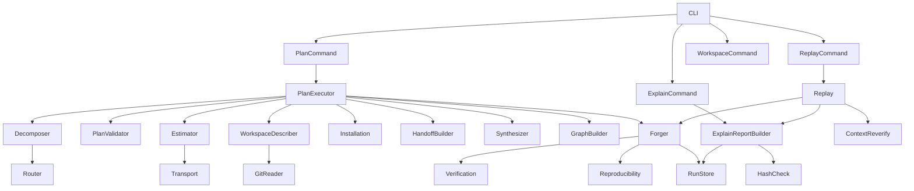
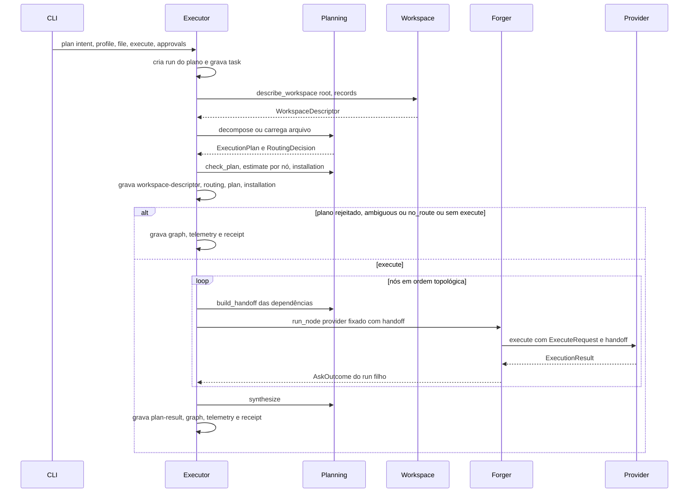
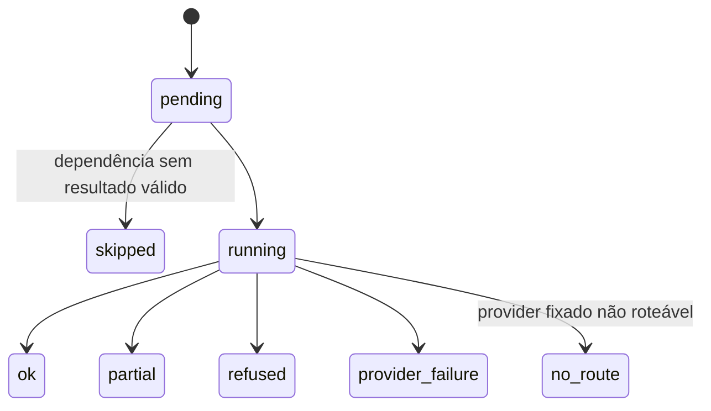
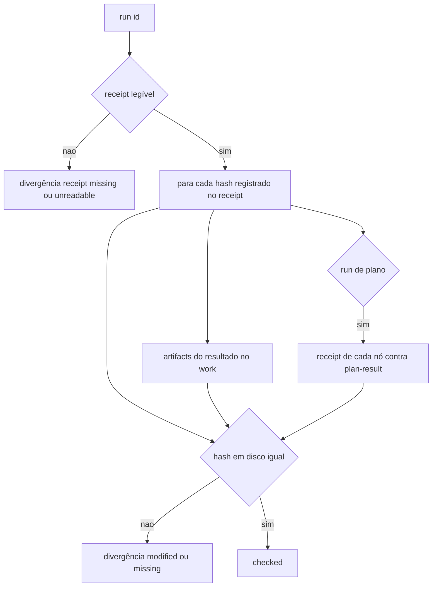
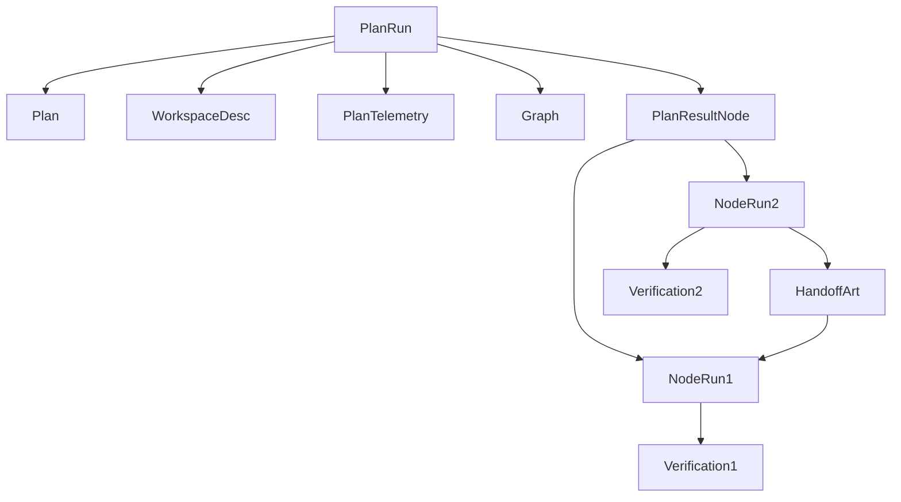

# Design Document — cross-forge-foundation (Wave D)

## Overview

**Purpose**: Esta spec ativa os contratos multi-provider reservados de The Forge e prova a coordenação entre especialistas reais. Uma tarefa híbrida vira um `ExecutionPlan` (DAG) por decomposição determinística ou por arquivo do usuário; o plano é validado antes de qualquer execução e executado localmente, um nó por vez, em ordem topológica determinística. Cada nó é um run completo de um único provider (as garantias das Waves A–C valem sem exceção), recebe dos nós de que depende apenas um handoff estruturado e termina com um `VerificationResult`. O plano produz uma síntese determinística, um `WorkspaceDescriptor` multi-repo e um grafo mínimo com evidência. A prova é Spark Forge real → API Forge real → síntese.

**Users**: usuários com tarefas híbridas (`theforge plan`), automações (`explain --json` estável, taxonomia `FORGE-*`, nível de reprodutibilidade, `replay`) e autores de providers (op `plan`, handoff, declaração de determinismo).

**Impact**: novo fluxo `plan` ao lado de `ask` (que continua com um provider por run); campos aditivos em `RoutingDecision`, `ExecuteRequest`, `ForgeManifest` e `ExecutionReceipt`; novos contratos v1; `explain` passa a emitir um relatório versionado com verificação de hashes; a CLI passa a classificar todo erro por família e ganha `--debug`, `workspace show` e `replay`. O Forge Protocol continua `forge/v1`.

### Goals
- `ExecutionPlan` validado antes da execução e executado em sequência, com falha parcial explícita (1.x, 3.x).
- Decomposição determinística, sem domínio e sem LLM, que degrada para `route` quando o perfil limita a 1 provider (2.x).
- Handoff estruturado com origem e status epistêmico preservados, redigido e limitado (4.x); síntese determinística (5.x).
- Prova real Spark → API e seu equivalente offline (6.x).
- `WorkspaceDescriptor` multi-repo, grafo com evidência, `VerificationResult`, op `plan` e `InstallationPlan` (7.x–10.x).
- `explain` completo, `--json` versionado, verificação de hashes, taxonomia de erros, `--debug`, reprodutibilidade e replay (11.x–14.x), sem quebrar contratos e runs existentes (15.x).

### Non-Goals
- Scheduler, fila, retomada de plano, execução concorrente, processo persistente, server, banco de dados, banco de grafos.
- Execução dos padrões `delegate`, `parallel` e `debate` (só representados); ativação de `verify` e `estimate`.
- Mudanças nos adapters reais ou no catálogo de capabilities (Wave B); mudanças em seleção de contexto, git, perfis ou telemetria (Wave C).
- Re-execute de runs de plano; instalação automática; conhecimento de domínio no core.
- Consolidação final de documentação/ADRs e relatório do ciclo (`agentic-maintainability`).

## Boundary Commitments

### This Spec Owns
- Os contratos `ExecutionPlan`, `PlanResult`, `PlanEstimate`, `PlanRequest`, `Handoff`, `WorkspaceDescriptor`, `WorkspaceGraph` (com `GraphNode`/`GraphEdge`), `VerificationResult`, `InstallationPlan`, `ExplainReport` e `Diagnostic` (todos `theforge/<Name>/v1`), e os campos aditivos: `RoutingDecision.pattern` (valores `delegate`, `parallel`, `pipeline`, `debate`), `ExecuteRequest.handoff`, `Capability.accepts_handoff`, `ExecutionInfo.deterministic`, `ExecutionReceipt.{kind, parent_run, plan_node, replay_of, verification_sha256, reproducibility, plan}`, `ReceiptInputs.handoff_sha256` e o desfecho `planned`.
- A validação estrutural e relacional de planos, a decomposição determinística, a ordem topológica, o handoff, a síntese e o executor sequencial de planos.
- O descritor de workspace multi-repo, a configuração de relações `.forge/config/workspace.toml` e o grafo mínimo.
- A construção do `VerificationResult` e do nível de reprodutibilidade para runs de `ask`, runs de nó e runs de plano.
- A op `plan` do protocolo (ativação, chamada e uso na policy) e a decisão documentada de manter `verify` e `estimate` reservadas.
- A taxonomia de códigos (`CODE_FAMILIES`), os códigos novos `FORGE-PLAN-*`, `FORGE-WORKSPACE-*`, `FORGE-PERSIST-*`, `FORGE-REPLAY-*`, `docs/errors.md` e o golden de valores publicados.
- O `explain` (texto e `ExplainReport`), a verificação de hashes, `--debug`, `workspace show`, `plan` e `replay` na CLI.
- O `RunTelemetry` v1 (contrato da Wave C, reutilizado sem mudança) do run do plano: tempos de varredura/routing, `providers_executed` = nós executados e `ProfileSnapshot`, vinculado ao receipt de plano por `telemetry_sha256`.
- ADR 0018 (modelo de execução multi-provider) e ADR 0019 (taxonomia de erros e reprodutibilidade) — números congelados (`agentic-maintainability` os indexa por esses números) —, e as seções correspondentes de `docs/protocol.md`, `docs/architecture.md`, `docs/cli.md`, `docs/provider-authoring.md` e `docs/security.md`.

### Out of Boundary
- Tabela de perfis e o valor de `max_providers`, seleção de contexto, consulta git, reverificação de contexto (`DriftReport`) e `RunTelemetry` (`context-intelligence-v2`): esta spec só os consome.
- Adapters reais, suas capabilities, sinais, IDs de evidência, replay e contrato `THEFORGE_REAL_*`, workflow `real-providers.yml` (`real-provider-integration`): esta spec só os consome. Nenhum adapter passa a declarar `accepts_handoff`, `deterministic` ou `plan` nesta wave.
- Routing de um provider: `route()` continua a mesma função pura; a decomposição só lê `RoutingDecision.candidates`.
- `WorkspaceSummary` do ContextPack: não é promovido nem reutilizado como descritor. Para evitar confusão com `ContextPack.workspace` (`WorkspaceSummary`), o artefato de run desta spec chama-se `workspace-descriptor`, nunca `workspace`. `GitSummary` (Wave C) é reutilizado tal como está dentro de `RepositoryInfo`.
- Resolução de aliases de capability e notas de routing (`capability-alias`, `capability-deprecated`, `capability-overlap`), `ForgeManifest.resolve` e a matriz de compatibilidade de `docs/versioning.md` com `test_compat_matrix` (`real-provider-integration`): esta spec só os consome.
- Paridade de assets agentic, CLAUDE.md/AGENTS.md, consolidação de docs/ADRs e relatório final (`agentic-maintainability`).

### Allowed Dependencies
- Python stdlib ≥ 3.11; nenhuma dependência nova de runtime ou de dev.
- Direção de imports (obrigatória, estende a das Waves A–C): `contracts.codes → contracts → errors/security/diagnostics → profiles → protocol → registry → routing/context → workspace → planning → policy → runs → explain → forger → cli`. `workspace` importa `contracts`, `security`, `context` (só `read_git_state` e `WorkspaceScan`), `routing.signals` e `registry` (tipos); `planning` importa `contracts`, `profiles`, `protocol`, `registry` (inclusive `check_health`), `routing`, `workspace` — nunca `policy`, `runs`, `forger` ou `cli` (a comparação de decisões de policy usa só o contrato `PolicyDecision`); `explain` importa `contracts`, `runs`; `forger` importa todos à esquerda. Nenhum módulo importa adapters ou especialistas.  (actual: explain imports errors, security, context, meta, runs — see docs/architecture.md)
- Upstream Wave C: `profiles.profile_for`, `ContextProfile.max_providers`, `context.git.read_git_state`, `GitSummary`, `context.verify.reverify`, `DriftReport` produzido pelo `Forger`, artefato `telemetry` e `RunTelemetry`/`ProfileSnapshot`/`TelemetryRecorder` (reutilizados pelo run do plano), funções de renderização de texto de contexto e telemetria do `explain` (`cli/render.py`).
- Upstream Wave B: adapters em modo `--replay` para testes offline (describe com o snapshot empacotado; cenário `default` de `tests/fixtures/native/<adapter>/`); `ForgeManifest.resolve` e as notas de routing em `RoutingDecision.limitations`; `tests/real_providers.py::require_forge` e o marker `real_provider` para a prova real; IDs de evidência nativos; `docs/versioning.md` + `test_compat_matrix`.
- Upstream Wave A: `validate_result`, `validate_receipt`, `check_producer`, `RunStore.write`, `security.redact`, `registry.fingerprint`, `policy.evaluate`.

### Revalidation Triggers
- Mudança em `ExecuteRequest.handoff`, `Handoff`, `Capability.accepts_handoff`, `ExecutionInfo.deterministic` ou na op `plan`: `real-provider-integration` revalida que os adapters ignoram/aceitam os campos (conformance em replay).
- Mudança na tabela de capabilities expostas, nos sinais ou nos IDs de evidência dos adapters (Wave B): revalidar a decomposição da tarefa de prova (`test_decompose.py` com os manifests empacotados), os cenários `scenarios/cross/` possuídos por esta spec e a prova real. Mudança no formato de cenário de replay da Wave B: regravar `scenarios/cross/`.
- Mudança em `max_providers`, níveis de verificação, `DriftReport`, `read_git_state`, `GitSummary`, `RunTelemetry`/`ProfileSnapshot` ou nas seções de texto do `explain` da Wave C: revalidar decomposição, reprodutibilidade, `VerificationResult`, a telemetria do run do plano e `explain` (texto e JSON), incluindo o teste de texto do `explain` da Wave C (`tests/test_cli.py`: tiers, itens com sinais, exclusões, git e linha `Telemetry:`).
- Mudança em `ForgeManifest.resolve` ou no texto das notas de routing da Wave B (`capability-alias`, `capability-deprecated`, `capability-overlap`): revalidar `check_plan`/`load_plan_file` e o texto do `explain`, incluindo os testes de notas de routing da Wave B (`tests/test_router.py`, `tests/test_cli.py`).
- Mudança em `ExplainReport`, `CODE_FAMILIES`, códigos publicados ou exit codes: `agentic-maintainability` revalida documentação consolidada e automações (`CLI_FIXED_EXITS = {1, 2, 5, 6, 70, 130}` em `tests/test_docs_consistency.py`); esta spec não acrescenta nenhum exit code fora de `EXIT_BY_STATUS` ∪ `CLI_FIXED_EXITS`.
- Mudança no formato de `ExecutionReceipt`/`ReceiptInputs`: revalidar verificação de hashes e replay.
- Qualquer wave que altere `theforge.__version__` (inclusive esta, se o fizer) acrescenta na mesma mudança a linha correspondente da matriz de compatibilidade em `docs/versioning.md`, exigida por `test_compat_matrix` (Wave B).
- Fim de cada metade de implementação (ver "Seams de implementação"): `agentic-maintainability` re-checa a consolidação (docs, exit codes, índice de ADRs) após a metade (a) e de novo após (b)+(c).

## Architecture

### Existing Architecture Analysis
- `Forger.ask` é o único caminho que executa um provider e já garante: run persistido desde o início, revalidação do registry, health, policy antes do execute, contexto validado, integridade do resultado e receipt em todo desfecho. Com a Wave C, acrescenta perfil, git, cache, negociação, reverificação de contexto e telemetria.
- `route()` é pura e determinística; `RoutingDecision.candidates` traz, por capability, os sinais discriminantes casados e `rank_key`.
- `RunStore` grava artefatos por nome fechado, redige, e devolve o hash do JSON em disco; `explain` só lê e despeja.
- Padrões preservados: contratos `frozen, kw_only` com defaults aditivos; releitura estrita de artefatos do core; schemas fechados para contratos core-only; transporte injetável; códigos só em `codes.py`.

### Architecture Pattern & Boundary Map



**Architecture Integration**:
- Padrão: **run filho por nó**. O executor de plano orquestra; cada nó é executado pelo `Forger` existente com provider fixado, handoff e vínculo ao plano. Nenhuma garantia de um run é reimplementada.
- Fronteiras: `planning` decide *o quê* (plano, validação, ordem, handoff, síntese, estimativa, grafo); `workspace` descreve *onde*; `forger` executa e verifica; `explain` lê e confere; `cli` apresenta e classifica erros.
- Componentes novos: `planning/*` (decomposição, validação, ordem, handoff, síntese, estimativa, instalação, grafo), `workspace/*` (descritor e relações), `explain/*` (relatório e hashes), `forger/plan_executor.py`, `forger/verification.py`, `forger/reproducibility.py`, `forger/replay.py`, `diagnostics.py`.
- Conformidade com steering: stdlib-only, integração só por protocolo, decisões determinísticas (ambíguo → `ambiguous`), sucesso só com `ExecutionResult` válido (por nó), tudo persistido via `RunStore.write` (redação), contratos `theforge/<Name>/v1` com `schemas/` regenerado.

### Seams de implementação
A spec continua única (a divisão é decisão do usuário; ver `research.md`), mas é implementada em três costuras com um gate entre a primeira e as demais:
- **(a) Execução multi-provider** — taxonomia/códigos e contratos (1.x), workspace e planejamento (2.x), verificação/reprodutibilidade/diagnóstico usados pelo `Forger` (3.x), integração no orquestrador (4.x) e executor de plano com telemetria do run do plano (5.x). Requisitos 1–10, 14.1–14.3. Termina no **gate de integração (tarefa 5.3)**: checagens no estilo `/kiro-validate-impl` sobre essa metade (suíte offline, lint, tipos, paridade de schemas, direção de imports, decomposição com os manifests da Wave B, fluxo de plano com fixtures) antes de iniciar (b) e (c).
- **(b) Integridade, explicabilidade e replay** — `HashCheck`, `ExplainReport` (texto e JSON), replay e a CLI correspondente (6.x, 7.3). Requisitos 11, 12, 14.4–14.9.
- **(c) Governança de erros** — mensagens governadas, `--debug`, exit codes e `docs/errors.md` como lista canônica (7.1, partes de 9.x). Requisito 13. Os códigos (1.1) e o `Diagnostic` (3.3) ficam em (a) porque o executor e o `Forger` já os usam.
- `agentic-maintainability` re-checa a consolidação após o gate de (a) e de novo após (b)+(c) (gate final 9.3).

### Technology Stack

| Layer | Choice / Version | Role in Feature | Notes |
|-------|------------------|-----------------|-------|
| CLI | stdlib `argparse` (existente) | `plan`, `workspace show`, `replay`, `explain` estendido, `--debug` | exit 6 novo (divergência de integridade) |
| Runtime | Python ≥ 3.11 stdlib (`tomllib`, `traceback`, `hashlib`) | planejamento, execução sequencial, verificação, diagnóstico | 0 deps runtime |
| Data / Storage | JSON local em `.forge/runs/<id>/` | artefatos `plan`, `plan-result`, `workspace-descriptor`, `graph`, `installation`, `handoff`, `verification`, `diagnostic` (e `telemetry` da Wave C também no run do plano) | redação + hash em disco |
| Ferramenta externa | `git` via `read_git_state` (Wave C), opcional | HEAD/sujo por repositório | ausente → limitação; orçamento total por plano `WORKSPACE_GIT_BUDGET_S = 20` |
| Testes | pytest, hypothesis (existentes); adapters Wave B em `--replay`; marker `real_provider` | prova offline e real | sem dependência nova |

## File Structure Plan

### Directory Structure
```
src/theforge/
├── diagnostics.py                 # NOVO: build_diagnostic(exc, stage) -> Diagnostic redigido (quadros só de theforge.*)
├── contracts/
│   ├── plan.py                    # NOVO: ExecutionPlan, PlanNode, PlanDependency, PlanViolation, PlanEstimate, PlanRequest, PlanResult, NodeOutcome, Synthesis
│   ├── handoff.py                 # NOVO: Handoff, HandoffItem, HandoffOrigin
│   ├── workspace.py               # NOVO: WorkspaceDescriptor, RepositoryInfo, Technology, WorkspaceRelation
│   ├── graph.py                   # NOVO: WorkspaceGraph, GraphNode, GraphEdge
│   ├── verification.py            # NOVO: VerificationResult, VerificationCheck, ReproducibilityInfo
│   ├── installation.py            # NOVO: InstallationPlan, InstallationItem
│   ├── explain.py                 # NOVO: ExplainReport e seções, IntegrityReport, Divergence
│   ├── diagnostic.py              # NOVO: Diagnostic, DiagnosticFrame, DiagnosticCause
│   └── (codes, types, routing, envelope, manifest, receipt, integrity, schema, __init__ modificados)
├── workspace/
│   ├── __init__.py                # NOVO: reexporta describe_workspace, repository_of
│   ├── describe.py                # NOVO: descoberta de repositórios, git por repositório, tecnologias, relações
│   └── relations.py               # NOVO: leitura de .forge/config/workspace.toml (relações explícitas)
├── planning/
│   ├── __init__.py                # NOVO: reexporta API pública
│   ├── execution.py               # NOVO: valores em memória NodeExecution e SourceResult (não persistidos)
│   ├── graph.py                   # NOVO: GraphBuilder e build_graph com rejeição de aresta sem evidência
│   ├── decompose.py               # NOVO: decompose(task, decision, records, descriptor, profile)
│   ├── validate.py                # NOVO: check_plan (estrutura + providers + perfil)
│   ├── order.py                   # NOVO: topological_order (Kahn com desempate por id), blocked_by
│   ├── handoff.py                 # NOVO: build_handoff (seleção, prioridade, truncagem, redação)
│   ├── synthesis.py               # NOVO: synthesize(plan, outcomes) -> Synthesis
│   ├── estimate.py                # NOVO: request_estimate via op plan; stricter_decision
│   └── installation.py            # NOVO: build_installation_plan (registry + health)
├── explain/
│   ├── __init__.py                # NOVO
│   ├── hashcheck.py               # NOVO: verify_run_hashes (artefatos do run, artifacts do provider, runs filhos)
│   └── report.py                  # NOVO: build_explain_report(store, run_id) -> ExplainReport
├── forger/
│   ├── orchestrator.py            # MODIFICADO: AskRequest.{provider, node, replay_of}, sem fallback quando fixado, handoff no execute, verification, reprodutibilidade, diagnóstico
│   ├── plan_executor.py           # NOVO: PlanExecutor.plan/execute (run do plano, nós em sequência, síntese, grafo, telemetria, receipt)
│   ├── verification.py            # NOVO: build_verification(response, result, drift, work_dir)
│   ├── reproducibility.py         # NOVO: assess_run, combine_levels
│   └── replay.py                  # NOVO: render, reverify, reexecute (elegibilidade e comparação)
├── runs/store.py                  # MODIFICADO: artefatos novos e validação do receipt de plano
├── errors.py                      # MODIFICADO: ForgeError.code; ReplayRefused; PersistenceError com código
└── cli/
    ├── main.py                    # MODIFICADO: subcomandos, --debug, mensagens governadas com código e família, exit 6
    ├── commands.py                # MODIFICADO: cmd_plan, cmd_workspace_show, cmd_replay, cmd_explain via ExplainReport
    └── render.py                  # MODIFICADO: plano, nós, handoffs, verificação, reprodutibilidade, integridade, workspace
docs/
├── errors.md                      # NOVO: taxonomia de códigos (fonte documental, testada)
└── adr/
    ├── 0018-multi-provider-execution-model.md   # NOVO
    └── 0019-error-taxonomy-and-reproducibility.md  # NOVO
tests/
├── test_plan_contracts.py         # NOVO (unit, contract)
├── test_plan_validation.py        # NOVO (unit)
├── test_decompose.py              # NOVO (unit, integration): inclui manifests dos adapters da Wave B via describe em --replay
├── test_handoff.py                # NOVO (unit, security)
├── test_synthesis.py              # NOVO (unit)
├── test_workspace_descriptor.py   # NOVO (integration, security)
├── test_graph.py                  # NOVO (unit)
├── test_verification.py           # NOVO (unit)
├── test_reproducibility.py        # NOVO (unit)
├── test_plan_flow.py              # NOVO (integration)
├── test_cross_forge_replay.py     # NOVO (integration): adapters Wave B em replay
├── test_cross_forge_real.py       # NOVO (real_provider, integration)
├── test_explain_report.py         # NOVO (integration)
├── test_error_taxonomy.py         # NOVO (unit)
├── test_cli_governed.py           # NOVO (e2e)
├── test_replay.py                 # NOVO (integration)
├── cross_workspace.py             # NOVO: monta o workspace multi-repo de prova em tmp (git init quando disponível)
├── golden/forge_codes.json        # NOVO: valores publicados de Codes
└── fixtures/
    ├── workspaces/cross/data-pipeline/   # NOVO: job PySpark + requirements (pyspark)
    ├── workspaces/cross/orders-api/      # NOVO: openapi.yaml + app FastAPI + requirements (fastapi)
    ├── native/sparkforge/scenarios/cross/  # NOVO (dono: esta spec): gravações de replay do Spark Forge sobre cross/data-pipeline
    └── native/apiforge/scenarios/cross/    # NOVO (dono: esta spec): gravações de replay do API Forge sobre cross/orders-api
```
- Gravações de replay da prova (decisão): esta spec **possui** os cenários `tests/fixtures/native/{sparkforge,apiforge}/scenarios/cross/` (cenário completo no formato da Wave B: `environment.json`, `health.json` e uma gravação de execute por ação exercitada sobre o workspace `cross`). A gravação do Spark Forge é feita com o auxiliar de gravação da Wave B a partir do Spark Forge real local; a do API Forge é montada à mão no formato de caso e marcada `"provenance": "hand-built"` até a primeira execução do workflow real, como na Wave B. Os cenários `default` da Wave B não são alterados nem reaproveitados para a prova (os workspaces `cross/*` não são cópias dos de exemplo da Wave B).

### Modified Files
- `src/theforge/contracts/codes.py` — códigos novos; `ErrorFamily`, `CODE_FAMILIES`, `family_of`.
- `src/theforge/contracts/types.py` — **fonte única** dos tipos e limites compartilhados desta spec: `Outcome` ganha `planned`; `PlanPattern`, `EXECUTABLE_PATTERNS`, `EdgeEpistemic`, `Reproducibility`, `MAX_PLAN_NODES`, `MAX_HANDOFF_ITEMS`, `MAX_HANDOFF_BYTES`, `MAX_CLAIM_CHARS`, `MAX_REPO_DEPTH`, `MAX_REPOSITORIES`, `MAX_GRAPH_NODES`. Os módulos `contracts/plan.py`, `handoff.py`, `workspace.py`, `graph.py` e `verification.py` só os importam; nenhum os redeclara.
- `src/theforge/contracts/routing.py` — `pattern: PlanPattern = "route"`.
- `src/theforge/contracts/envelope.py` — `ExecuteRequest.handoff: Handoff | None = None`; `PlanRequest` reexportado.
- `src/theforge/contracts/manifest.py` — `Capability.accepts_handoff: bool = False`; `ExecutionInfo.deterministic: bool | None = None`.
- `src/theforge/contracts/receipt.py` — campos de vínculo, verificação, reprodutibilidade e `PlanRefs`; `ReceiptInputs.handoff_sha256`.
- `src/theforge/contracts/integrity.py` — `validate_plan_structure`, `validate_handoff`, `validate_graph`, `validate_plan_result`; `validate_receipt` cobre os hashes novos e as regras de `kind`.
- `src/theforge/contracts/__init__.py`, `contracts/schema.py` — exportam os contratos novos (`ExecutionPlan`, `PlanResult`, `WorkspaceDescriptor`, `WorkspaceGraph`, `VerificationResult`, `InstallationPlan`, `ExplainReport`, `Diagnostic` fechados; `Handoff`, `PlanRequest`, `PlanEstimate` abertos); `schemas/` regenerado.
- `src/theforge/registry/registry.py` — `cached_records()`: registros a partir do cache do usuário, sem describe (usado por `workspace show`).
- `src/theforge/runs/store.py` — `ARTIFACTS` += `plan`, `plan-result`, `workspace-descriptor`, `graph`, `installation`, `handoff`, `verification`, `diagnostic` (`telemetry` já existe desde a Wave C e passa a ser gravado também no run do plano); `ARTIFACT_TYPES` correspondentes; receipt de plano validado contra `plan-result` e `telemetry`.
- `src/theforge/providers/echo/provider.py` — declara `execution.deterministic = true`.
- `tests/fixtures/providers/fixture_forge.py` — op `plan` (estimativa lida de uma chave `estimate` do manifest de fixture) e eco de handoff (contagem de itens recebidos como evidência).
- `tests/fixtures/providers/bad_forge.py` — modos `artifact-tamper`, `plan-error`, `plan-estimate-stricter`, `handoff-accept`, `internal-crash`.
- `tests/conftest.py` — `FILE_MARKERS` dos testes novos.
- `tests/test_cli.py`, `tests/test_schemas.py`, `tests/test_forger.py`, `tests/test_contracts_models.py` e o teste de `explain --json` da Wave C — migração para `ExplainReport` (artefatos crus em `artifacts.<nome>`) e novos campos. Os testes de **texto** do `explain` da Wave C (tiers, itens com tier e sinais, exclusões, `unmatched`, git, rodadas, drift, linha `Telemetry:`) e os de notas de routing da Wave B (`capability-alias`/`-deprecated`/`-overlap`) entram na lista de revalidação desta spec e devem passar **sem alteração de asserção** após a reescrita do `explain`.
- `docs/protocol.md`, `docs/architecture.md`, `docs/cli.md`, `docs/provider-authoring.md`, `docs/security.md`; `docs/versioning.md` (linha da matriz só se esta spec alterar `theforge.__version__`).

## System Flows

### Fluxo `theforge plan`



- Nós bloqueados (dependência sem resultado válido) não chamam o `Forger`; viram `NodeOutcome(status="skipped")` com o nó bloqueante.
- Cada `run_node` é um run completo com telemetria (Wave C), `verification` e reprodutibilidade.
- O run do plano também grava um artefato `telemetry` (`RunTelemetry` v1 da Wave C, montado pelo mesmo `TelemetryRecorder`) em todo desfecho: `scan_ms` (varredura e descrição do workspace), `routing_ms` (routing e decomposição/validação), `providers_executed` = número de nós cujo run chegou ao execute, `fallbacks_used = 0`, `negotiation_rounds = 0` e `ProfileSnapshot` do perfil do plano (`effective_tiers` vazio); `context_ms`, `provider_ms` e os contadores de arquivos/cache ficam `unknown` com a limitação `plan run: per-node metrics are in each node run telemetry`. O receipt de plano registra `telemetry_sha256` (campo existente desde a Wave C).

### Estados de um nó



### Verificação de hashes no `explain`



## Requirements Traceability

| Requirement | Summary | Components | Interfaces | Flows |
|-------------|---------|------------|------------|-------|
| 1.1 | DAG com nós e dependências | PlanContracts | `ExecutionPlan`, `PlanNode` | plan |
| 1.2 | rejeição antes de executar | PlanValidator | `validate_plan_structure`, `check_plan` | plan |
| 1.3 | limites de nós e providers | PlanValidator | `MAX_PLAN_NODES`, `profile.max_providers` | plan |
| 1.4 | padrões compatíveis | PlanContracts | `PlanPattern`, `RoutingDecision.pattern` | — |
| 1.5 | padrão reservado rejeitado | PlanValidator | `FORGE-PLAN-PATTERN-RESERVED` | plan |
| 1.6 | plano em arquivo | PlanExecutor, PlanValidator | `load_plan_file` (aliases via `ForgeManifest.resolve`) | plan |
| 1.7 | plano persistido antes do 1º nó | PlanExecutor, RunStore | artefato `plan` | plan |
| 2.1 | um nó por provider qualificado | Decomposer | `decompose` | plan |
| 2.2 | só sinais declarados | Decomposer | lê `RoutingDecision.candidates` | — |
| 2.3 | regra fixa e dependência inferida | Decomposer | `PlanDependency(rule="intent-order")` | plan |
| 2.4 | ambiguidade | Decomposer | `Decomposition.status="ambiguous"` | plan |
| 2.5 | `no_route` | Decomposer | `Decomposition.status="no_route"` | plan |
| 2.6 | perfil de 1 provider → `route` | Decomposer | `profile.max_providers == 1` | plan |
| 2.7 | determinismo | Decomposer, Order | ordenação por conteúdo | — |
| 2.8 | só planejar | PlanExecutor | `execute=False`, desfecho `planned` | plan |
| 3.1 | sequencial, ordem topológica | Order, PlanExecutor | `topological_order` | plan |
| 3.2 | garantias de run por nó | Forger | `run_node` reusa `ask` | plan |
| 3.3 | sem fallback | Forger | `AskRequest.provider` fixa | — |
| 3.4 | dependentes não executados | Order, PlanExecutor | `blocked_by` | estados |
| 3.5 | independentes continuam | PlanExecutor | laço de nós | estados |
| 3.6 | status do plano | PlanExecutor, Integrity | `plan_status`, `validate_plan_result` | — |
| 3.7 | aprovação por capability | PlanExecutor, Forger | `approvals` por nó | — |
| 3.8 | sem concorrência nem serviço | PlanExecutor | laço síncrono | — |
| 4.1 | só itens estruturados | HandoffBuilder | `HandoffItem` | plan |
| 4.2 | epistêmico e origem | HandoffBuilder | `HandoffOrigin` | — |
| 4.3 | só entradas declaradas | HandoffBuilder | `PlanNode.inputs` | — |
| 4.4 | truncagem determinística | HandoffBuilder | `MAX_HANDOFF_ITEMS`, `MAX_HANDOFF_BYTES` | — |
| 4.5 | redação antes de entregar | HandoffBuilder | `redact` | — |
| 4.6 | persistido e vinculado | Forger, RunStore | artefato `handoff`, `handoff_sha256` | plan |
| 4.7 | uso não declarado | Forger | `Capability.accepts_handoff`, limitação | — |
| 4.8 | providers antigos válidos | Contracts | `ExecuteRequest.handoff` opcional | — |
| 5.1 | síntese por nó | Synthesizer | `Synthesis.nodes` | plan |
| 5.2 | itens repassados | Synthesizer | `Synthesis.handoffs` | — |
| 5.3 | falhas e limitações | Synthesizer | `Synthesis.failures` | — |
| 5.4 | determinística, sem elevar epistêmico | Synthesizer | `synthesize` | — |
| 5.5 | persistida e vinculada | RunStore | `plan-result`, `PlanRefs.plan_result_sha256` | — |
| 6.1 | decomposição da tarefa de prova | Decomposer | `decompose` | plan |
| 6.2 | execução real e handoff | PlanExecutor, Forger | `run_node` | plan |
| 6.3 | teste real selecionável | CrossForgeReal | `require_forge`, `real_provider` | — |
| 6.4 | equivalente offline | CrossForgeReplay, PlanFlow | adapters `--replay`, fixtures | — |
| 6.5 | workflow agendado | CrossForgeReal | `real-providers.yml` (Wave B, inalterado) | — |
| 7.1 | campos do descritor | WorkspaceDescriber | `WorkspaceDescriptor` | — |
| 7.2 | multi-repo sem monorepo | WorkspaceDescriber | `discover_repositories` | — |
| 7.3 | git sem escrita | WorkspaceDescriber | `read_git_state` (Wave C), `GitSummary`, `WORKSPACE_GIT_BUDGET_S` | — |
| 7.4 | git ausente | WorkspaceDescriber | limitações por repositório | — |
| 7.5 | tecnologias genéricas | WorkspaceDescriber | `detect_technologies` | — |
| 7.6 | relações explícitas/observadas | WorkspaceRelations | `workspace.toml` | — |
| 7.7 | persistido no plano | PlanExecutor | artefato `workspace-descriptor` | plan |
| 7.8 | exibição sem provider | CLI | `workspace show` | — |
| 8.1 | grafo em memória e JSON | GraphBuilder | `WorkspaceGraph` | plan |
| 8.2 | evidência e epistêmico | GraphBuilder | `GraphEdge` | — |
| 8.3 | inferida exige regra | GraphContracts | `GraphEdge.__post_init__` | — |
| 8.4 | aresta inválida rejeitada | GraphBuilder, Integrity | `validate_graph` | — |
| 8.5 | determinismo | GraphBuilder | ordenação por id | — |
| 8.6 | sem banco de grafos | GraphBuilder | artefato `graph` | — |
| 9.1 | quatro níveis | Verification | `VerificationResult` | — |
| 9.2 | executado, resultado, base | Verification | `VerificationCheck` | — |
| 9.3 | auto-relato nunca é verificação | VerificationContracts | invariantes de status | — |
| 9.4 | independente não executado | Verification | `independent.status="not_performed"` | — |
| 9.5 | divergência → falha e não `ok` | Verification, Forger | `artifact_hashes`, `partial` | — |
| 9.6 | persistido e vinculado | RunStore | `verification_sha256` | — |
| 10.1 | estimativa via `plan` | Estimator | `request_estimate` | plan |
| 10.2 | policy mais restritiva | Estimator, Forger | `stricter_decision` | — |
| 10.3 | estimativa desconhecida | Estimator | `PlanNode.estimate=None` + limitação | — |
| 10.4 | ops reservadas | Docs, Estimator | ADR 0018 | — |
| 10.5 | um `InstallationPlan` | Installation | `build_installation_plan` | plan |
| 10.6 | só planejamento | InstallationContracts | `planning_only=True` | — |
| 11.1 | campos do explain | ExplainReportBuilder, CLI render | `ExplainReport`, texto sobre artefatos crus (Waves B/C) | — |
| 11.2 | explain de plano | ExplainReportBuilder | `PlanSection` | — |
| 11.3 | não registrado | ExplainReportBuilder | `not_recorded` | — |
| 11.4 | JSON versionado com schema | ExplainContracts | `schemas/ExplainReport.schema.json` | — |
| 11.5 | evolução aditiva | ExplainContracts, Docs | regra de versão | — |
| 12.1 | hashes do run | HashCheck | `verify_run_hashes` (inclui `telemetry_sha256` do run do plano) | hashes |
| 12.2 | artifacts do provider | HashCheck | `work/` | hashes |
| 12.3 | divergência e exit | HashCheck, CLI | `Divergence`, exit 6 | hashes |
| 12.4 | runs dos nós | HashCheck | `NodeOutcome.receipt_sha256` | hashes |
| 12.5 | sem provider, sem escrita | HashCheck | leitura apenas | — |
| 13.1 | famílias | Taxonomy | `CODE_FAMILIES` | — |
| 13.2 | verificação automatizada | ErrorTaxonomyTest | golden, `docs/errors.md` canônico, paridade com `docs/protocol.md`, literais | — |
| 13.3 | códigos nativos preservados | Taxonomy, CLI | `family_of → None` | — |
| 13.4 | código e família, sem traceback | CLI | mensagens governadas | — |
| 13.5 | debug redigido | Diagnostics, CLI | `--debug`, `Diagnostic` | — |
| 13.6 | sem debug → só mensagem | CLI | — | — |
| 13.7 | exit codes mantidos | CLI | `EXIT_BY_STATUS` | — |
| 14.1 | nível por run | Reproducibility | `ReproducibilityInfo` | — |
| 14.2 | nunca `reproducible` com externo | Reproducibility | `assess_run` | — |
| 14.3 | plano = mínimo | Reproducibility | `combine_levels` | — |
| 14.4 | runs antigos `unknown` | Reproducibility, Explain | default `None` → `unknown` | — |
| 14.5 | três modos | Replay, CLI | `replay --mode` | — |
| 14.6 | re-render | Replay | `render` | — |
| 14.7 | re-verify | Replay, CLI | `reverify_run`, exit 6 com divergência | — |
| 14.8 | re-execute vinculado | Replay, Forger | `replay_of`, comparação | — |
| 14.9 | recusa | Replay | `FORGE-REPLAY-NOT-REPRODUCIBLE` | — |
| 15.1 | protocolo e aditividade | Contracts | defaults | — |
| 15.2 | schemas | ContractsSchema | `python -m theforge.contracts.schema schemas` | — |
| 15.3 | redação | RunStore, HandoffBuilder, Diagnostics | `redact` | — |
| 15.4 | runs antigos legíveis | Contracts, ExplainReportBuilder | defaults, `not_recorded` | — |
| 15.5 | stdlib, sem LLM/rede | todos | — | — |
| 15.6 | documentação | Docs | protocol, architecture, cli, authoring, security, errors | — |
| 15.7 | ADRs | Docs | 0018, 0019 | — |

## Components and Interfaces

| Component | Domain/Layer | Intent | Req Coverage | Key Dependencies (P0/P1) | Contracts |
|-----------|--------------|--------|--------------|--------------------------|-----------|
| PlanContracts | contracts | plano, estimativa, resultado de plano, síntese | 1.1, 1.4, 5.x, 10.1 | contracts.base (P0) | State |
| HandoffContracts | contracts | handoff que cruza o protocolo | 4.1, 4.2, 4.8 | contracts.result (P0) | State |
| WorkspaceContracts / GraphContracts | contracts | descritor e grafo | 7.1, 8.1–8.3 | contracts.base (P0) | State |
| VerificationContracts | contracts | quatro níveis e reprodutibilidade | 9.1–9.4, 14.1 | contracts.base (P0) | State |
| InstallationContracts | contracts | plano de instalação inofensivo | 10.5, 10.6 | contracts.base (P0) | State |
| ExplainContracts / DiagnosticContracts | contracts | relatório estável e diagnóstico | 11.x, 13.5 | contracts (P0) | State |
| Taxonomy | contracts.codes | famílias de código | 13.1–13.3 | — | State |
| ContractExtensions | contracts | campos aditivos e integridade | 1.4, 4.6, 4.8, 9.6, 14.1, 15.1, 15.2 | contracts (P0) | State, Service |
| WorkspaceDescriber | workspace | descritor multi-repo | 7.1–7.8 | read_git_state (P0), routing.signals (P1) | Service |
| WorkspaceRelations | workspace | relações explícitas | 7.6 | tomllib (P0) | Service |
| GraphBuilder | planning | grafo com evidência | 8.1–8.6 | contracts (P0) | Service |
| Decomposer | planning | tarefa → plano | 2.1–2.8, 6.1 | router (P0), profiles (P0) | Service |
| PlanValidator | planning | validação antes da execução | 1.2, 1.3, 1.5, 1.6 | integrity (P0), registry (P0) | Service |
| Order | planning | ordem topológica e bloqueio | 3.1, 3.4 | — | Service |
| HandoffBuilder | planning | handoff estruturado | 4.1–4.5 | redact (P0) | Service |
| Synthesizer | planning | síntese determinística | 5.1–5.4 | — | Service |
| Estimator | planning | op `plan` | 10.1–10.3 | transport (P0), registry (P0) | Service |
| Installation | planning | `InstallationPlan` | 10.5, 10.6 | registry, health (P0) | Service |
| Forger (ext.) | forger | nó/ask com fixação, handoff, verificação, reprodutibilidade | 3.2, 3.3, 3.7, 4.6, 4.7, 9.5, 10.2, 14.1, 14.2 | todos acima (P0) | Service |
| PlanExecutor | forger | run do plano (inclui telemetria do run do plano) | 1.6, 1.7, 2.8, 3.1–3.8, 5.5, 6.2, 7.7, 8.1 | Forger, planning, workspace, TelemetryRecorder da Wave C (P0) | Service, State |
| Verification | forger | `VerificationResult` | 9.1–9.5 | DriftReport (Wave C, P0) | Service |
| Reproducibility | forger | nível por run | 14.1–14.4 | manifest, telemetry (P0) | Service |
| HashCheck | explain | integridade do persistido | 12.1–12.5 | RunStore (P0) | Service |
| ExplainReportBuilder | explain | relatório completo | 11.1–11.5, 14.4 | RunStore, HashCheck (P0) | Service |
| Replay | forger | re-render, re-verify, re-execute | 14.5–14.9 | ExplainReportBuilder, reverify (Wave C), Forger (P0) | Service |
| Diagnostics | diagnostics | diagnóstico redigido | 13.5 | redact (P0) | Service |
| CLI (ext.) | cli | comandos, mensagens governadas, exit codes | 7.8, 11.x, 12.3, 13.4–13.7, 14.5 | todos (P0) | Service |
| Docs | docs | protocolo, CLI, arquitetura, autoria, segurança, erros, ADRs | 10.4, 11.4, 13.1, 15.6, 15.7 | — | — |
| Tests | tests | prova offline/real, propriedades, golden | 2.7, 6.3–6.5, 13.2 | adapters replay (Wave B, P0) | — |

### contracts

#### PlanContracts

| Field | Detail |
|-------|--------|
| Intent | Plano, dependências, estimativa, resultado de plano e síntese |
| Requirements | 1.1, 1.4, 1.7, 2.3, 5.1–5.5, 10.1, 10.3 |

**Responsibilities & Constraints**
- `ExecutionPlan` é core-only com schema fechado; relido com `strict=True` (inclusive o plano em arquivo do usuário).
- Invariantes locais em `__post_init__` (schema, `status` ↔ `violations`); invariantes relacionais em `validate_plan_structure` para produzir todas as violações de uma vez (1.2).
- `PlanEstimate` e `PlanRequest` cruzam o protocolo (schema aberto).

**Contracts**: State [x]

##### State Management
```python
# contracts/types.py — fonte única dos tipos e limites compartilhados (os demais módulos só importam)
PlanPattern = Literal["route", "delegate", "parallel", "pipeline", "debate"]
EXECUTABLE_PATTERNS: Final = frozenset({"route", "pipeline"})
Outcome = Literal[
    "ok", "partial", "refused", "provider_failure", "ambiguous", "no_route", "planned"
]
EdgeEpistemic = Literal["explicit", "observed", "inferred"]
Reproducibility = Literal["reproducible", "partially_reproducible", "non_reproducible", "unknown"]
MAX_PLAN_NODES: Final = 8
MAX_HANDOFF_ITEMS: Final = 256
MAX_HANDOFF_BYTES: Final = 262_144  # JSON canônico do handoff
MAX_CLAIM_CHARS: Final = 500
MAX_REPO_DEPTH: Final = 3
MAX_REPOSITORIES: Final = 64
MAX_GRAPH_NODES: Final = 2_000

# contracts/plan.py
PLAN_SCHEMA = "theforge/ExecutionPlan/v1"
NodeRole = Literal["producer", "consumer", "standalone"]


@dataclass(frozen=True, kw_only=True)
class PlanDependency:
    node: str  # nó de que depende
    epistemic: Literal["explicit", "inferred"]
    rule: str | None = None  # obrigatório quando inferred (ex.: "intent-order")
    evidence: str  # ex.: "keyword 'spark'@3 < keyword 'api'@9" ou "plan file"


@dataclass(frozen=True, kw_only=True)
class PlanEstimate:  # payload de resposta da op plan
    context_needed: list[str] = field(default_factory=list)  # caminhos ou globs relativos
    operation_class: OperationClass | None = None
    expected_artifacts: list[str] = field(default_factory=list)
    unknowns: list[str] = field(default_factory=list)
    limitations: list[str] = field(default_factory=list)


@dataclass(frozen=True, kw_only=True)
class PlanNode:
    id: str  # ^[a-z][a-z0-9-]{0,31}$
    role: NodeRole
    provider: str
    capability: str
    action: str
    targets: list[str] = field(default_factory=lambda: ["."])  # entrada de contexto
    depends_on: list[PlanDependency] = field(default_factory=list)
    inputs: list[str] = field(default_factory=list)  # entrada de artifacts: ⊆ ids em depends_on
    estimate: PlanEstimate | None = None
    limitations: list[str] = field(default_factory=list)


@dataclass(frozen=True, kw_only=True)
class PlanViolation:
    code: str  # FORGE-PLAN-*
    node: str | None
    detail: str


@dataclass(frozen=True, kw_only=True)
class ExecutionPlan:
    schema: str = PLAN_SCHEMA
    producer: Producer
    created_at: str
    status: Literal["validated", "rejected"]
    plan_run: str
    task_id: str
    pattern: PlanPattern
    source: Literal["decomposed", "file"]
    profile: BudgetProfile
    nodes: list[PlanNode]
    violations: list[PlanViolation] = field(default_factory=list)  # vazio ⇔ validated
    limitations: list[str] = field(default_factory=list)
    unknowns: list[str] = field(default_factory=list)


@dataclass(frozen=True, kw_only=True)
class PlanRequest:  # payload de request da op plan
    task: TaskSpec
    capability: str
    action: str


NodeStatus = Literal["ok", "partial", "refused", "provider_failure", "no_route", "skipped"]


@dataclass(frozen=True, kw_only=True)
class NodeOutcome:
    node: str
    status: NodeStatus
    run_id: str | None = None  # None se skipped
    receipt_sha256: str | None = None
    result_sha256: str | None = None
    blocked_by: str | None = None  # obrigatório se skipped
    error: ErrorInfo | None = None
    reproducibility: ReproducibilityInfo | None = None


@dataclass(frozen=True, kw_only=True)
class SynthesisNode:
    node: str
    provider: str
    capability: str
    action: str
    status: NodeStatus
    run_id: str | None
    findings: list[Finding] = field(default_factory=list)  # cópia, ids originais
    evidence_by_epistemic: dict[str, int] = field(default_factory=dict)


@dataclass(frozen=True, kw_only=True)
class SynthesisHandoff:
    source: str
    target: str
    items: int
    truncated: bool


@dataclass(frozen=True, kw_only=True)
class Synthesis:
    nodes: list[SynthesisNode]
    handoffs: list[SynthesisHandoff] = field(default_factory=list)
    failures: list[str] = field(default_factory=list)  # "<node>: <status> <code>: <detail>"
    limitations: list[str] = field(default_factory=list)  # agregadas, prefixo "<node>: "
    unknowns: list[str] = field(default_factory=list)


PLAN_RESULT_SCHEMA = "theforge/PlanResult/v1"


@dataclass(frozen=True, kw_only=True)
class PlanResult:
    schema: str = PLAN_RESULT_SCHEMA
    producer: Producer
    created_at: str
    status: Outcome  # ok | partial | refused | provider_failure
    plan_run: str
    order: list[str]  # ordem efetiva de execução
    nodes: list[NodeOutcome]
    synthesis: Synthesis
    reproducibility: ReproducibilityInfo
    limitations: list[str] = field(default_factory=list)
    unknowns: list[str] = field(default_factory=list)
```

**Implementation Notes**
- Integration: `RoutingDecision.pattern: PlanPattern = "route"` mantém runs antigos válidos (1.4).
- Validation: `test_plan_contracts.py` cobre defaults, releitura estrita e invariantes locais.
- Risks: `Outcome` com `planned` só é usado por receipts `kind="plan"`; `EXIT_BY_STATUS["planned"] = 0`.

#### HandoffContracts

| Field | Detail |
|-------|--------|
| Intent | Itens estruturados entregues a um nó dependente |
| Requirements | 4.1, 4.2, 4.6, 4.8 |

##### State Management
```python
HANDOFF_SCHEMA = "theforge/Handoff/v1"
# definidos só em contracts/types.py e importados aqui:
#   MAX_HANDOFF_ITEMS = 256; MAX_HANDOFF_BYTES = 262_144 (JSON canônico do handoff); MAX_CLAIM_CHARS = 500


@dataclass(frozen=True, kw_only=True)
class HandoffOrigin:
    plan_run: str
    node: str
    run_id: str
    provider: Producer  # id e versão do provider de origem


@dataclass(frozen=True, kw_only=True)
class HandoffItem:
    kind: Literal["evidence", "finding", "artifact", "decision"]
    id: str  # id original (evidence/finding) ou caminho (artifact) ou "outcome"
    origin: HandoffOrigin
    epistemic: Epistemic | None = (
        None  # evidence: original; decision: "observed"; finding/artifact: None
    )
    subject: str = ""
    claim: str = ""  # ≤ MAX_CLAIM_CHARS
    location: Location | None = None
    hash: str | None = None  # evidence.hash ou artifact.sha256
    severity: Severity | None = None  # finding
    evidence_ids: list[str] = field(default_factory=list)  # finding


@dataclass(frozen=True, kw_only=True)
class Handoff:
    schema: str = HANDOFF_SCHEMA
    producer: Producer  # theforge
    created_at: str
    plan_run: str
    target_node: str
    items: list[HandoffItem] = field(default_factory=list)
    truncated: bool = False
    dropped: int = 0
    limitations: list[str] = field(default_factory=list)
```
- Nunca contém conteúdo de arquivo nem a saída integral do provider; `claim` vem de `Evidence.claim` (truncado com marcador `…[truncated]`) ou, em `decision`, de `"status=<s> capability=<c> action=<a>"`.

#### WorkspaceContracts e GraphContracts

| Field | Detail |
|-------|--------|
| Intent | Descritor multi-repo e grafo mínimo com evidência |
| Requirements | 7.1, 7.5, 7.6, 8.1, 8.2, 8.3 |

##### State Management
```python
WORKSPACE_SCHEMA = "theforge/WorkspaceDescriptor/v1"
# MAX_REPO_DEPTH e MAX_REPOSITORIES: importados de contracts/types.py
WORKSPACE_GIT_BUDGET_S: Final = (
    20.0  # orçamento total de git por descrição de workspace (ver WorkspaceDescriber)
)


@dataclass(frozen=True, kw_only=True)
class RepositoryInfo:
    path: str  # relativo à raiz, "." para a raiz
    git: GitSummary | None = None  # GitSummary da Wave C embutido sem redeclarar campos
    # (available, branch, head, detached, dirty, changed_files, state);
    # None = git não consultado (orçamento esgotado)
    dependency_files: list[str] = field(default_factory=list)  # caminhos relativos à raiz
    limitations: list[str] = field(default_factory=list)


@dataclass(frozen=True, kw_only=True)
class Technology:
    name: str  # dependência normalizada ou domínio declarado por provider
    repository: str
    source: Literal["dependency_manifest", "provider_signal"]
    evidence: str  # caminho que evidencia
    matched_by: list[str] = field(default_factory=list)  # "<provider>/<capability>"


@dataclass(frozen=True, kw_only=True)
class WorkspaceRelation:
    source: str
    target: str  # caminhos de repositório
    kind: Literal["contains", "depends_on"]
    epistemic: Literal["explicit", "observed"]
    evidence: str  # ".forge/config/workspace.toml" ou caminho do .git


@dataclass(frozen=True, kw_only=True)
class WorkspaceDescriptor:
    schema: str = WORKSPACE_SCHEMA
    producer: Producer
    created_at: str
    root: str
    repositories: list[RepositoryInfo] = field(default_factory=list)
    paths: list[str] = field(
        default_factory=list
    )  # raízes de repositório e arquivos de dependência
    technologies: list[Technology] = field(default_factory=list)
    relations: list[WorkspaceRelation] = field(default_factory=list)
    limitations: list[str] = field(default_factory=list)
    unknowns: list[str] = field(default_factory=list)


GRAPH_SCHEMA = "theforge/WorkspaceGraph/v1"
# MAX_GRAPH_NODES e EdgeEpistemic: importados de contracts/types.py
NodeKind = Literal[
    "workspace", "repository", "provider", "capability", "plan_node", "evidence", "artifact"
]
EdgeKind = Literal[
    "contains", "depends_on", "declares", "uses", "targets", "produced", "handed_off_to"
]


@dataclass(frozen=True, kw_only=True)
class GraphNode:
    id: str  # "<kind>:<chave>"
    kind: NodeKind
    label: str = ""


@dataclass(frozen=True, kw_only=True)
class GraphEdge:
    source: str
    target: str
    kind: EdgeKind
    epistemic: EdgeEpistemic
    evidence: str  # não vazio
    rule: str | None = None  # obrigatório se epistemic == "inferred"; proibido caso contrário


@dataclass(frozen=True, kw_only=True)
class WorkspaceGraph:
    schema: str = GRAPH_SCHEMA
    producer: Producer
    created_at: str
    plan_run: str
    nodes: list[GraphNode] = field(default_factory=list)
    edges: list[GraphEdge] = field(default_factory=list)
    truncated: bool = False
    limitations: list[str] = field(default_factory=list)
```
- `GraphEdge.__post_init__`: `evidence` vazio → `ContractError`; `inferred` sem `rule` → `ContractError` (8.3).
- `validate_graph(graph)`: aresta com extremidade inexistente → violação `FORGE-WORKSPACE-GRAPH-EDGE` (8.4).

#### VerificationContracts

| Field | Detail |
|-------|--------|
| Intent | Separar auto-relato, evidência do provider, verificação de The Forge e independente; nível de reprodutibilidade |
| Requirements | 9.1–9.4, 14.1 |

##### State Management
```python
VERIFICATION_SCHEMA = "theforge/VerificationResult/v1"
# Reproducibility: importado de contracts/types.py


@dataclass(frozen=True, kw_only=True)
class VerificationCheck:
    status: Literal["reported", "passed", "failed", "not_performed"]
    basis: list[str] = field(
        default_factory=list
    )  # ex.: "result-integrity", "context-reverification:conditional", "artifact-hashes"
    details: list[str] = field(default_factory=list)


@dataclass(frozen=True, kw_only=True)
class VerificationResult:
    schema: str = VERIFICATION_SCHEMA
    producer: Producer
    created_at: str
    run_id: str
    self_report: VerificationCheck  # status ∈ {reported, not_performed}
    provider_evidence: VerificationCheck  # status ∈ {reported, not_performed}
    forge: VerificationCheck  # status ∈ {passed, failed, not_performed}
    independent: VerificationCheck  # status ∈ {passed, failed, not_performed}
    limitations: list[str] = field(default_factory=list)


@dataclass(frozen=True, kw_only=True)
class ReproducibilityInfo:
    level: Reproducibility
    reasons: list[str] = field(default_factory=list)
```
- `__post_init__` impõe os conjuntos de status por nível: auto-relato e evidência do provider nunca podem ser `passed` (9.3).

#### InstallationContracts

| Field | Detail |
|-------|--------|
| Intent | Itens faltantes, somente planejamento |
| Requirements | 10.5, 10.6 |

```python
INSTALLATION_SCHEMA = "theforge/InstallationPlan/v1"


@dataclass(frozen=True, kw_only=True)
class InstallationItem:
    provider: str
    state: str  # estado do registry ou "unavailable" (health)
    reason: str  # detalhe do registry/provider (redigido)
    suggested_action: str  # ErrorInfo.unlock, senão o próprio detalhe
    source: Literal["registry", "health"]
    nodes: list[str] = field(default_factory=list)


@dataclass(frozen=True, kw_only=True)
class InstallationPlan:
    schema: str = INSTALLATION_SCHEMA
    producer: Producer
    created_at: str
    run_id: str
    planning_only: Literal[True] = True
    items: list[InstallationItem] = field(default_factory=list)  # ≥ 1
```

#### ExplainContracts e DiagnosticContracts

| Field | Detail |
|-------|--------|
| Intent | Estrutura estável do `explain --json`; diagnóstico de debug |
| Requirements | 11.1–11.5, 12.3, 13.5 |

```python
EXPLAIN_SCHEMA = "theforge/ExplainReport/v1"


@dataclass(frozen=True, kw_only=True)
class Divergence:
    artifact: str  # nome do artefato, "work/<path>" ou "<child_run>/receipt"
    kind: Literal["modified", "missing", "unreadable"]
    expected: str | None = None
    actual: str | None = None


@dataclass(frozen=True, kw_only=True)
class IntegrityReport:
    checked: list[str] = field(default_factory=list)
    divergences: list[Divergence] = field(default_factory=list)
    unrecorded: list[str] = field(
        default_factory=list
    )  # presentes sem hash registrado (runs antigos)


@dataclass(frozen=True, kw_only=True)
class RoutingSection:
    status: str
    pattern: str
    reason: str
    confidence: str
    signals: list[str]
    candidates: list[Candidate]
    selected: list[Selection]
    fallbacks: list[str]
    notes: list[str] = field(default_factory=list)  # notas da Wave B em RoutingDecision.limitations
    # (capability-alias / -deprecated / -overlap), texto intacto


@dataclass(frozen=True, kw_only=True)
class ContextSection:
    budget_bytes: int
    used_bytes: int
    files: int
    excluded: int
    truncated: bool
    tier_bytes: dict[str, int]
    rounds: int
    unmatched: int | None = None  # WorkspaceSummary.unmatched_files (Wave C)
    git: GitSummary | None = None  # WorkspaceSummary.git (Wave C)
    drift: list[str] = field(
        default_factory=list
    )  # RunTelemetry.context_drift / DriftReport (Wave C)
    # itens por tier/sinais e exclusões NÃO são duplicados aqui: ficam em artifacts.context / context-r*


@dataclass(frozen=True, kw_only=True)
class ProviderSection:
    id: str
    version: str
    trust: str
    observed_version: str | None = None
    fingerprint: str | None = None


@dataclass(frozen=True, kw_only=True)
class ResultSection:
    status: str
    findings: list[Finding]
    evidence_by_epistemic: dict[str, int]
    artifacts: int
    duration_ms: Metric


@dataclass(frozen=True, kw_only=True)
class PlanSection:
    plan: ExecutionPlan
    result: PlanResult | None = None
    workspace_descriptor: WorkspaceDescriptor | None = None  # artefato workspace-descriptor
    installation: InstallationPlan | None = None


@dataclass(frozen=True, kw_only=True)
class ExplainReport:
    schema: str = EXPLAIN_SCHEMA
    producer: Producer
    created_at: str
    run_id: str
    kind: Literal["run", "plan"]
    status: str | None  # Outcome do receipt; None se não registrado
    intent: str | None = None
    targets: list[str] = field(default_factory=list)
    profile: str | None = None
    routing: RoutingSection | None = None
    context: ContextSection | None = None
    provider: ProviderSection | None = None
    result: ResultSection | None = None
    risk: dict[str, Any] | None = None  # RiskAssessment cru (Wave A)
    telemetry: dict[str, Any] | None = (
        None  # RunTelemetry cru (Wave C); presente também em runs de plano
    )
    verification: VerificationResult | None = None
    reproducibility: ReproducibilityInfo  # "unknown" quando não registrado
    plan: PlanSection | None = None
    parent_run: str | None = None
    replay_of: str | None = None
    error: ErrorInfo | None = None
    error_family: str | None = None
    integrity: IntegrityReport
    limitations: list[str] = field(default_factory=list)
    unknowns: list[str] = field(default_factory=list)
    not_recorded: list[str] = field(default_factory=list)  # seções sem dado registrado
    artifacts: dict[str, Any] = field(default_factory=dict)  # artefatos crus redigidos, por nome


DIAGNOSTIC_SCHEMA = "theforge/Diagnostic/v1"


@dataclass(frozen=True, kw_only=True)
class DiagnosticFrame:
    module: str
    function: str
    line: int


@dataclass(frozen=True, kw_only=True)
class DiagnosticCause:
    type: str
    message: str


@dataclass(frozen=True, kw_only=True)
class Diagnostic:
    schema: str = DIAGNOSTIC_SCHEMA
    producer: Producer
    created_at: str
    stage: str  # ex.: "cli:plan", "forger:execute", "planning:decompose"
    code: str
    family: str | None
    error_type: str
    message: str  # redigido
    causes: list[DiagnosticCause] = field(default_factory=list)  # __cause__/__context__, redigidas
    frames: list[DiagnosticFrame] = field(
        default_factory=list
    )  # só módulos theforge.*, sem variáveis locais
```
- Regra de versão (11.5): campos novos de `ExplainReport` só como opcionais com default; remoção ou mudança de tipo exige `ExplainReport/v2`. Documentada em `docs/cli.md`.

#### Taxonomy

| Field | Detail |
|-------|--------|
| Intent | Cada código `FORGE-*` pertence a exatamente uma família |
| Requirements | 13.1, 13.2, 13.3 |

```python
ErrorFamily = Literal[
    "protocol",
    "registry",
    "routing",
    "plan",
    "context",
    "provider",
    "policy",
    "persistence",
    "security",
    "workspace",
    "replay",
    "usage",
    "internal",
]


class Codes:  # existentes inalterados, mais:
    PLAN_INVALID: Final = "FORGE-PLAN-INVALID"  # ciclo, dependência, id duplicado, inputs
    PLAN_CAPABILITY: Final = "FORGE-PLAN-CAPABILITY"  # provider sem capability/ação ou não pronto
    PLAN_LIMIT: Final = "FORGE-PLAN-LIMIT"  # nós ou providers acima do limite
    PLAN_PATTERN_RESERVED: Final = "FORGE-PLAN-PATTERN-RESERVED"
    PLAN_FILE: Final = "FORGE-PLAN-FILE"  # arquivo ilegível ou fora do contrato
    PLAN_DEPENDENCY_FAILED: Final = "FORGE-PLAN-DEPENDENCY-FAILED"  # nó skipped
    PLAN_ESTIMATE: Final = "FORGE-PLAN-ESTIMATE"  # op plan falhou (limitação)
    WORKSPACE_CONFIG: Final = "FORGE-WORKSPACE-CONFIG"  # workspace.toml inválido (aviso)
    WORKSPACE_GRAPH_EDGE: Final = "FORGE-WORKSPACE-GRAPH-EDGE"  # aresta rejeitada
    PERSIST_WRITE: Final = "FORGE-PERSIST-WRITE"
    PERSIST_READ: Final = "FORGE-PERSIST-READ"
    PERSIST_DIVERGENCE: Final = "FORGE-PERSIST-DIVERGENCE"  # explain/re-verify com divergência
    RESULT_ARTIFACT_HASH: Final = (
        "FORGE-RESULT-ARTIFACT-HASH"  # artifact no work difere do declarado
    )
    REPLAY_NOT_REPRODUCIBLE: Final = "FORGE-REPLAY-NOT-REPRODUCIBLE"
    REPLAY_UNSUPPORTED: Final = "FORGE-REPLAY-UNSUPPORTED"


CODE_FAMILIES: Final[Mapping[str, ErrorFamily]]  # cobre todo valor de Codes


def family_of(code: str) -> ErrorFamily | None: ...  # None ⇒ código nativo do provider (13.3)
```
- Mapeamento dos existentes: `PROTO_*` → protocol; `PROVIDER_BLOCKED`, `PROVIDER_UNTRUSTED` → security; `PROVIDER_NOT_READY`, `HEALTH_*`, `RESULT_*` → provider; `CONTEXT_*` (incl. `CONTEXT_REQUEST_*` da Wave C) → context; `RECEIPT_INVALID`, `PERSIST_*` → persistence; `REGISTRY_MANIFEST_CHANGED`, `MANIFEST_*` (incl. `MANIFEST_VERSION`/`MANIFEST_TAXONOMY` da Wave B) → registry; `POLICY_*` → policy; `PLAN_*` → plan; `WORKSPACE_*` → workspace; `REPLAY_*` → replay; `USAGE` → usage; `INTERNAL` → internal. A família `routing` não tem códigos: `ambiguous`/`no_route` são desfechos, não erros (documentado).
- `docs/errors.md` é a **lista canônica** de códigos (código → família → significado), conferida por teste contra `CODE_FAMILIES`. `docs/protocol.md` e os demais documentos não mantêm tabela concorrente: apontam para `docs/errors.md` e, quando citam um código, ele existe em `docs/errors.md` com a mesma família (teste de paridade em `test_error_taxonomy.py`).

#### ContractExtensions (campos aditivos e integridade)

| Field | Detail |
|-------|--------|
| Intent | Estender contratos v1 sem quebrar providers nem runs |
| Requirements | 1.4, 4.6, 4.8, 9.6, 14.1, 15.1, 15.2, 15.4 |

```python
# contracts/envelope.py
@dataclass(frozen=True, kw_only=True)
class ExecuteRequest:
    task: TaskSpec
    capability: str
    action: str
    context: ContextPack
    handoff: Handoff | None = None


# contracts/manifest.py
# Capability.accepts_handoff: bool = False
# ExecutionInfo.deterministic: bool | None = None     # None = não declarado


# contracts/receipt.py
@dataclass(frozen=True, kw_only=True)
class PlanRefs:
    plan_sha256: str
    workspace_descriptor_sha256: str | None = None
    graph_sha256: str | None = None
    installation_sha256: str | None = None
    plan_result_sha256: str | None = None  # None se não executado


# ReceiptInputs.handoff_sha256: str | None = None
# ExecutionReceipt.kind: Literal["run", "plan"] = "run"
# ExecutionReceipt.parent_run: str | None = None       # run do plano, em runs de nó
# ExecutionReceipt.plan_node: str | None = None
# ExecutionReceipt.replay_of: str | None = None
# ExecutionReceipt.verification_sha256: str | None = None
# ExecutionReceipt.reproducibility: ReproducibilityInfo | None = None   # None ⇒ unknown (runs antigos)
# ExecutionReceipt.plan: PlanRefs | None = None        # obrigatório se kind == "plan"
# ExecutionReceipt.telemetry_sha256 (existente, Wave C): preenchido também em receipts kind == "plan"
```
- `ExecutionReceipt.__post_init__`: `kind="plan"` exige `plan` e `provider is None`; `status="planned"` só com `kind="plan"`; `parent_run` e `plan_node` juntos ou ausentes.
- `validate_receipt` (estendido): formato de todos os hashes novos; para `kind="plan"`, `plan.plan_result_sha256` igual ao hash em disco de `plan-result` e `telemetry_sha256` igual ao hash em disco de `telemetry`; para `kind="run"`, comportamento atual inalterado.
- `validate_plan_result(result)`: `status="ok"` exige todo `NodeOutcome.status == "ok"` com `result_sha256`; `skipped` exige `blocked_by`; `order` é permutação dos nós (3.6).
- `validate_handoff(handoff)`: `len(items) ≤ MAX_HANDOFF_ITEMS`, tamanho canônico ≤ `MAX_HANDOFF_BYTES`, `claim` ≤ `MAX_CLAIM_CHARS`.
- `validate_plan_structure(plan)` (puro): ids únicos e válidos; dependências existentes; ciclo (Kahn); `inputs ⊆ depends_on`; `len(nodes) ≤ MAX_PLAN_NODES`; padrão em `EXECUTABLE_PATTERNS`; `pattern="route"` ⇒ 1 nó; dependência `inferred` sem `rule`. Devolve todas as violações (`PlanViolation`).

### workspace

#### WorkspaceDescriber

| Field | Detail |
|-------|--------|
| Intent | Descrever repositórios independentes, tecnologias e relações |
| Requirements | 7.1–7.8 |

**Responsibilities & Constraints**
- Descoberta: a raiz e subdiretórios até `MAX_REPO_DEPTH`, sem seguir symlinks, ignorando `IGNORED_DIRS` (Wave A) e `.forge`; um diretório com entrada `.git` (diretório ou arquivo) é repositório; não desce em `.git`; repositórios aninhados são independentes e geram relação `contains` observada do repositório pai; a raiz pode não ser repositório (7.2). Acima de `MAX_REPOSITORIES` → truncado com limitação.
- Git: `read_git_state(repo_path)` por repositório (Wave C); `RepositoryInfo.git` = o `GitSummary` devolvido, sem redeclarar campos (mantém `detached` e `changed_files`); limitações dele copiadas para `RepositoryInfo.limitations`; git ausente → `GitSummary(available=False)` com `head`/`dirty` `None` (7.3, 7.4).
- Orçamento de git (limite total, não 64 × 5 s): os repositórios são consultados na ordem de `path`; antes de cada consulta, se o tempo de git já gasto mais o orçamento por chamada da Wave C (`GIT_TIMEOUT_S = 5`) excederia `WORKSPACE_GIT_BUDGET_S = 20` s, o repositório e os seguintes ficam com `git = None` e a limitação `git: skipped: workspace git budget exhausted (20 s)`. Pior caso de git por plano: 20 s. O `git_reader` é injetável para testar o corte com relógio falso.
- Tecnologias (7.5): para cada repositório, `workspace_dependencies(repo_path)` (Wave A) ∩ `signals.dependencies` normalizadas de capabilities dos providers do registry → `Technology(source="dependency_manifest", evidence=<arquivo de dependência>)`; para cada capability cujos `file_globs` (não catch-all) casam arquivos do repositório → `Technology(name=<domain do manifest>, source="provider_signal", evidence=<primeiro arquivo casado>)`. Ordenação por `(repository, name, source)`.
- Relações (7.6): `contains` raiz→repositório e pai→aninhado (observadas, evidência = caminho do `.git`); `depends_on` lidas por `WorkspaceRelations` (explícitas). Nenhuma relação inferida.
- Nunca lê conteúdo além de arquivos de dependência (já lidos pela Wave A) e nunca persiste conteúdo.

**Contracts**: Service [x]

##### Service Interface
```python
def describe_workspace(
    root: Path,
    records: Sequence[RegistryRecord],
    scan: WorkspaceScan,
    *,
    git_reader: Callable[[Path], GitState] = read_git_state,
    clock: Callable[[], float] = time.monotonic,
    git_budget_s: float = WORKSPACE_GIT_BUDGET_S,
) -> WorkspaceDescriptor: ...
def repository_of(
    descriptor: WorkspaceDescriptor, path: str
) -> str | None: ...  # repositório mais profundo que contém path
```

#### WorkspaceRelations
- Arquivo opcional `.forge/config/workspace.toml` (committável, como `providers.toml`): `[[relations]] source = "orders-api"; target = "data-pipeline"; kind = "depends_on"`.
- Entrada inválida ou repositório inexistente → ignorada com aviso `FORGE-WORKSPACE-CONFIG` nas limitações do descritor; arquivo malformado → todas ignoradas com aviso. Nunca falha o run.
```python
def load_relations(
    forge_dir: Path | None, repositories: Sequence[str]
) -> tuple[list[WorkspaceRelation], list[str]]: ...
```

### planning

#### Decomposer

| Field | Detail |
|-------|--------|
| Intent | Transformar uma tarefa em plano de forma determinística e sem domínio |
| Requirements | 2.1–2.8, 6.1 |

**Responsibilities & Constraints**
- Entrada: `RoutingDecision` produzida por `route()` sobre a tarefa (sem capability pedida), com `files` = varredura completa e `dependencies` = união de `workspace_dependencies` da raiz e de cada repositório do descritor.
- Agrupa `decision.candidates` por provider; melhor capability = maior `rank_key[0]` (tipos de sinal discriminantes); empate de melhor capability no mesmo provider (com rank ≥ `MIN_SIGNAL_TYPES`) → `ambiguous` (2.4).
- Qualificado: melhor capability com `rank_key[0] ≥ MIN_SIGNAL_TYPES` e estado ≠ `unsupported` (2.1).
- `profile.max_providers == 1` ou ≤ 1 qualificado: plano de 1 nó `route` a partir da decisão (`routed`), ou o próprio `ambiguous`/`no_route` da decisão; com ≥ 2 qualificados e limite 1 → limitação `multi-provider decomposition not allowed by profile <name>` (2.5, 2.6).
- Qualificados > `max_providers` → `ambiguous` (2.4).
- Ordem (2.3): posição = menor índice, em `normalize_tokens(intent)`, do primeiro token de uma keyword casada (`Candidate.matched.keywords`); sem keyword → `ambiguous` ("cannot order <provider>"); posições iguais → `ambiguous`. Pipeline linear: nó *i* depende de *i−1* e recebe seus artifacts (`inputs = [i−1]`), dependência `inferred`, `rule="intent-order"`, `evidence="keyword '<k1>'@<p1> < keyword '<k2>'@<p2>"`.
- Ids de nó: `n1..nk` na ordem; papéis: sem dependência e com dependente → `producer`; com dependência → `consumer`; plano de 1 nó → `standalone`.
- Alvos do nó (entrada de contexto): repositórios do descritor que contêm arquivos casados pelos globs da capability ou cujas dependências casaram; nenhum → `task.targets`.
- Ação: `capability.default_action` (ou `task.requested_action` quando válida para a capability).
- `RoutingDecision` do plano: `status="routed"`, `pattern="pipeline"` (ou `route`), `selected` = uma `Selection` por nó (primeiro `primary`, demais `specialist`), `candidates` preservados.

**Contracts**: Service [x]

##### Service Interface
```python
@dataclass(frozen=True, kw_only=True)
class Decomposition:
    status: Literal["planned", "ambiguous", "no_route"]
    decision: RoutingDecision  # registrada como artefato routing do run do plano
    nodes: tuple[PlanNode, ...]  # vazio se não planned
    pattern: PlanPattern
    limitations: tuple[str, ...]


def decompose(
    task: TaskSpec,
    decision: RoutingDecision,
    records: Mapping[str, RegistryRecord],
    descriptor: WorkspaceDescriptor,
    scan: WorkspaceScan,
    profile: ContextProfile,
) -> Decomposition: ...
```
- Pós-condição: mesma entrada (conteúdo) ⇒ mesma saída, independentemente da ordem de `records`, `candidates` e `scan.files` (2.7).
- Limite conhecido da regra `intent-order`: a ordem textual da intenção é só um *proxy* do fluxo de dados e pode produzir uma dependência `inferred` errada (ex.: "uma API que consome dados do pipeline Spark" põe a API antes). Por isso a dependência é sempre `inferred` com regra e evidência, o plano pode ser revisado sem `--execute`, e a ordem explícita é feita com `plan --from FILE`. Isso é registrado no ADR 0018 e no texto de ajuda do comando `plan`.
- Validação antecipada com o catálogo real: `test_decompose.py` (tarefa 2.3) obtém os manifests de `spark-forge` e `api-forge` pelo describe dos adapters da Wave B em `--replay` (cenário `default`; o describe usa o snapshot empacotado) e prova que a tarefa de prova gera exatamente `pyspark.static-analysis` → `api.analyze`. Melhor capability não única (empate dentro do Spark Forge ou do API Forge) é detectada aí, não só na prova real; nesse caso a implementação para e reporta como revalidação do catálogo da Wave B — nunca acrescenta regra de domínio ao core.

#### PlanValidator

| Field | Detail |
|-------|--------|
| Intent | Rejeitar planos inválidos antes de qualquer execução |
| Requirements | 1.2, 1.3, 1.5, 1.6 |

- `check_plan` = `validate_plan_structure` + relacionais com o registry: provider existente e `ready`; capability resolvida por `ForgeManifest.resolve` (Wave B: ID canônico antes de alias), declarada e não `unsupported`; ação em `actions`; providers distintos ≤ `profile.max_providers`. Todas as violações reunidas; plano com violações é gravado com `status="rejected"`.
- `load_plan_file(path, records)`: lê JSON (≤ 1 MiB) e faz `from_dict(ExecutionPlan, strict=True)` com `source="file"`; erro → `UsageError` com código `FORGE-PLAN-FILE`. Campos `plan_run`, `producer`, `created_at`, `status` e `violations` do arquivo são substituídos pelos do run; `profile` do arquivo diferente do `--profile` da linha de comando vale o da linha de comando, com limitação. Capability de nó dada por alias é substituída pelo ID canônico (`ForgeManifest.resolve` do provider do nó) e o nó ganha a limitação com o mesmo texto da nota da Wave B, `capability-alias: '<alias>' resolved to '<canônico>' (<provider>)`; capability depreciada ganha `capability-deprecated: …`. Provider inexistente ou capability não resolvida ficam como estão para `check_plan` reportar.
```python
def check_plan(
    plan: ExecutionPlan, records: Mapping[str, RegistryRecord], profile: ContextProfile
) -> list[PlanViolation]: ...
def load_plan_file(path: Path, records: Mapping[str, RegistryRecord]) -> ExecutionPlan: ...
```

#### Execution values (`planning/execution.py`)
- Valores em memória, nunca persistidos diretamente, compartilhados por `HandoffBuilder`, `Synthesizer`, `GraphBuilder` e `PlanExecutor`.
```python
@dataclass(frozen=True, kw_only=True)
class NodeExecution:
    node: PlanNode
    outcome: NodeOutcome
    result: ExecutionResult | None  # relido do run filho; None se não houve resultado válido
    handoff: Handoff | None  # handoff entregue ao nó
    provider: Producer | None  # id e versão do provider que executou
```

#### Order
```python
def topological_order(plan: ExecutionPlan) -> list[str]: ...  # Kahn; prontos ordenados por id (3.1)
def blocked_by(
    node: str, plan: ExecutionPlan, failed: Mapping[str, str]
) -> str | None: ...  # primeiro ancestral sem resultado válido (3.4)
```

#### HandoffBuilder

| Field | Detail |
|-------|--------|
| Intent | Montar o handoff de um nó a partir dos resultados válidos das suas entradas |
| Requirements | 4.1–4.5 |

- Fontes: somente nós em `node.inputs` com `ExecutionResult` válido persistido (4.3); o resultado é relido do run filho (`read_contract`), já com o rebaixamento de drift aplicado pela Wave C.
- Itens por fonte: `decision` (desfecho do nó), `finding` (todos), `evidence` (todas, epistêmico original), `artifact` (caminho + sha256). Nunca texto livre além de `claim`/`title` estruturados (4.1, 4.2).
- Prioridade determinística para truncagem (4.4): por fonte na ordem de `inputs`; dentro dela: `decision`; `finding` por severidade desc e id; `evidence` referenciada por findings mantidos, depois demais por epistêmico (`confirmed` > `observed` > `inferred` > `proposed` > `unresolved`) e id; `artifact` por caminho. Corta ao atingir `MAX_HANDOFF_ITEMS` ou `MAX_HANDOFF_BYTES`; `truncated=True`, `dropped=n`, limitação `handoff-truncated: dropped <n> items`.
- Redação (4.5): `redact(to_dict(handoff))` e releitura; o handoff entregue e o persistido são o redigido.
```python
@dataclass(frozen=True, kw_only=True)
class SourceResult:
    node: str
    run_id: str
    provider: Producer
    status: NodeStatus
    capability: str
    action: str
    result: ExecutionResult


def build_handoff(
    plan_run: str, target: PlanNode, sources: Sequence[SourceResult]
) -> Handoff | None: ...  # None se node.inputs vazio
```

#### GraphBuilder

| Field | Detail |
|-------|--------|
| Intent | Grafo mínimo determinístico em que toda aresta tem evidência |
| Requirements | 8.1–8.6 |

- Nós: `workspace:.`, `repository:<path>`, `provider:<id>`, `capability:<provider>/<cap>`, `plan_node:<id>`, `evidence:<node>/<id>`, `artifact:<node>/<path>`.
- Arestas: `contains` (observed, `.git`), `depends_on` entre repositórios (explicit, `workspace.toml`), `declares` provider→capability (explicit, `manifest:<sha256>`), `uses` plan_node→capability (explicit, `plan:<sha256>`), `targets` plan_node→repository (explicit, `plan:<sha256>`), `depends_on` plan_node→plan_node (explicit para plano em arquivo; inferred com `rule="intent-order"` para plano decomposto), `produced` plan_node→evidence/artifact (observed, `result:<sha256>`), `handed_off_to` evidence→plan_node (observed, `handoff:<sha256>`).
- `add_edge` rejeita aresta sem evidência, com extremidade inexistente ou inferida sem regra, registrando limitação `FORGE-WORKSPACE-GRAPH-EDGE: …` (8.3, 8.4). Nós e arestas ordenados por id/(source, kind, target) (8.5). Acima de `MAX_GRAPH_NODES` → nós `evidence`/`artifact` cortados por ordem, `truncated=True`.
```python
class GraphBuilder:
    def __init__(self, plan_run: str) -> None: ...
    def add_node(self, node: GraphNode) -> None: ...
    def add_edge(self, edge: GraphEdge) -> bool: ...
    def build(self) -> WorkspaceGraph: ...


def build_graph(
    plan_run: str,
    descriptor: WorkspaceDescriptor,
    records: Sequence[RegistryRecord],
    plan: ExecutionPlan,
    plan_sha256: str,
    outcomes: Sequence[NodeExecution],
) -> WorkspaceGraph: ...
```

#### Synthesizer
- Uma `SynthesisNode` por nó na ordem efetiva; findings copiados com ids originais; contagem de evidência por epistêmico; `handoffs` com origem, alvo, quantidade e truncagem; `failures` dos nós sem resultado válido ou `skipped`; limitações e incógnitas dos resultados prefixadas por nó. Não cria finding, não altera epistêmico, não usa LLM (5.1–5.4).
```python
def synthesize(plan: ExecutionPlan, executions: Sequence[NodeExecution]) -> Synthesis: ...
```

#### Estimator

| Field | Detail |
|-------|--------|
| Intent | Op `plan` do protocolo e uso na policy |
| Requirements | 10.1–10.4 |

- Só para nós cujo provider declara `plan` em `ops`; request `PlanRequest(task, capability, action)` com o `TaskSpec` do nó; cwd temporário (`provider_cwd`), ambiente mínimo, timeout 10 s (mesmo de health); `producer` conferido; payload lido como `PlanEstimate` (não estrito).
- Falha (transporte, `refused`/`error`, schema) → `estimate=None` e limitação `estimate: FORGE-PLAN-ESTIMATE: <detail>` no nó; sem `plan` → limitação `estimate: provider does not declare op plan` (10.3).
- `stricter_decision`: a policy do nó é avaliada para a classe declarada e para a estimada; vale a mais restritiva (`deny` > `ask` > `allow`) (10.2).
- `verify` e `estimate` não são chamadas por nenhum caminho (10.4).
```python
def request_estimate(
    record: RegistryRecord,
    task: TaskSpec,
    capability: str,
    action: str,
    *,
    transport_factory: TransportFactory,
    timeout: float = 10.0,
) -> tuple[PlanEstimate | None, str | None]: ...  # (estimativa, limitação)
def stricter_decision(a: PolicyDecision, b: PolicyDecision) -> PolicyDecision: ...
```

#### Installation
- Itens: (1) cada provider referenciado por um nó (ou, na decomposição, cada provider registrado) cujo estado é `invalid`, `unreachable` ou `incompatible` → `source="registry"`, `reason=record.error`; (2) cada provider de nó cujo health é `unavailable`/`error` → `source="health"`, `suggested_action = error.unlock or error.detail`. Health de cada provider distinto do plano é consultado uma vez no planejamento. Sem itens → nenhum `InstallationPlan`. Nada é executado além de describe/health (10.5, 10.6).
```python
def build_installation_plan(
    run_id: str,
    plan: ExecutionPlan | None,
    records: Mapping[str, RegistryRecord],
    health: Mapping[str, HealthOutcome],
) -> InstallationPlan | None: ...
```

### forger

#### Forger (extensão)

| Field | Detail |
|-------|--------|
| Intent | Executar um run de um provider, opcionalmente fixado e vinculado a um plano |
| Requirements | 3.2, 3.3, 3.7, 4.6, 4.7, 9.5, 9.6, 10.2, 14.1, 14.2 |

**Responsibilities & Constraints**
- `AskRequest` ganha `provider: str | None` (fixação), `node: NodeBinding | None`, `replay_of: str | None` e `debug: bool`. `ask` sem esses campos é o comportamento atual.
- Fixação (3.3): o routing explícito pela capability é calculado e a seleção é substituída pelo provider fixado se ele estiver entre os candidatos roteáveis; senão `no_route` com motivo `pinned provider <id> is not routable for <capability>`. Nenhum fallback de health é tentado.
- `NodeBinding(plan_run, node, pattern, handoff, estimate_class)`: `TaskSpec.constraints["plan"] = {"run": plan_run, "node": node}`; `RoutingDecision.pattern` = padrão do plano; handoff persistido como artefato `handoff` antes do execute e enviado em `ExecuteRequest.handoff`; `ReceiptInputs.handoff_sha256`; receipt com `parent_run` e `plan_node` (4.6). Capability sem `accepts_handoff` → limitação `handoff-use-undeclared: <provider>/<capability>` no receipt (4.7).
- Policy (10.2): com `estimate_class`, avalia também a classe estimada e aplica `stricter_decision`; o `risk` gravado registra a classe efetiva e a limitação `operation-class: estimate <x> stricter than declared <y>` quando aplicável.
- Após o resultado validado e a reverificação de contexto (Wave C): `build_verification` → artefato `verification`; divergência de artifact → status `partial`, limitação `FORGE-RESULT-ARTIFACT-HASH: <path>` (9.5).
- `_finish`: `assess_run` → `receipt.reproducibility`; `verification_sha256`; para `FORGE-INTERNAL`, `build_diagnostic` guardado em `AskOutcome.diagnostic` e, com `debug=True`, gravado como artefato `diagnostic`.

##### Service Interface
```python
@dataclass(frozen=True, kw_only=True)
class NodeBinding:
    plan_run: str
    node: str
    pattern: PlanPattern
    handoff: Handoff | None = None
    estimate_class: OperationClass | None = None


# AskRequest (campos novos, todos opcionais)
#   provider: str | None = None; node: NodeBinding | None = None
#   replay_of: str | None = None; debug: bool = False
# AskOutcome (campos novos): verification: VerificationResult | None; diagnostic: Diagnostic | None


class Forger:
    def ask(self, request: AskRequest) -> AskOutcome: ...  # assinatura inalterada
```

#### PlanExecutor

| Field | Detail |
|-------|--------|
| Intent | Planejar, persistir e executar um plano em sequência |
| Requirements | 1.6, 1.7, 2.8, 3.1, 3.4–3.8, 5.5, 6.2, 7.7, 8.1, 10.5 |

**Responsibilities & Constraints**
- Run do plano: `task` → `workspace-descriptor` → `routing` → `plan` (+ estimativas) → `installation` (se houver) → [execução] → `plan-result` → `graph` → `telemetry` → `receipt` (`kind="plan"`, `PlanRefs`, `telemetry_sha256`). `plan` é gravado antes do primeiro nó (1.7). `telemetry` é gravado em todo desfecho do plano (rejeitado, `ambiguous`/`no_route`, `planned`, executado, erro interno), como no `Forger` da Wave C.
- Desfechos: plano rejeitado → `refused` com o primeiro código de violação; decomposição `ambiguous`/`no_route` → o mesmo desfecho; sem `--execute` → `planned` (2.8); executado → `plan_status` (3.6): `ok` se todos `ok`; `partial` se algum resultado válido e algum não-`ok`; sem resultado válido → `refused` se todos os nós tentados foram recusados, senão `provider_failure`, com `error` do primeiro nó que falhou (detalhe prefixado por `node <id>:`).
- Laço síncrono sobre `topological_order`; nó com ancestral sem resultado válido → `skipped` com `blocked_by` e `error=FORGE-PLAN-DEPENDENCY-FAILED`; demais continuam (3.4, 3.5, 3.8). Aprovações `--approve` aplicadas a cada nó pela capability (3.7).
- Reprodutibilidade do plano = `combine_levels` dos nós (14.3); `planned`/rejeitado → `unknown`.
- Erro inesperado no executor → receipt `provider_failure` com `FORGE-INTERNAL` e diagnóstico (mesmo invariante do `Forger`).

##### Service Interface
```python
@dataclass(frozen=True, kw_only=True)
class PlanCommand:
    intent: str
    targets: list[str] = field(default_factory=lambda: ["."])
    profile: BudgetProfile = "balanced"
    plan_file: Path | None = None
    execute: bool = False
    approvals: frozenset[str] = frozenset()
    allow_unverified: bool = False
    debug: bool = False


@dataclass(frozen=True, kw_only=True)
class PlanOutcome:
    run_id: str
    status: Outcome
    plan: ExecutionPlan | None
    result: PlanResult | None
    error: ErrorInfo | None
    diagnostic: Diagnostic | None = None


class PlanExecutor:
    def __init__(self, forger: Forger) -> None: ...
    def run(self, command: PlanCommand) -> PlanOutcome: ...
```

#### Verification
- `self_report`: `reported` com `provider status: <ok|partial>`; `not_performed` se não houve resposta.
- `provider_evidence`: `reported` com contagem por epistêmico e quantas têm `hash`/`location`; `not_performed` sem resultado.
- `forge`: checagens `result-integrity` (sempre, passou para haver resultado), `producer`, `context-reverification:<nível>` (do `DriftReport` da Wave C; `minimal` ⇒ não executada, registrada), `artifact-hashes` (recalcula sha256 de cada `artifacts[].path` sob `work/`; ausente ou diferente → `failed`). `passed` só se todas as executadas passaram.
- `independent`: `not_performed`, detalhe `no independent verifier: op verify is reserved` (9.4).
```python
def build_verification(
    run_id: str,
    response_status: str | None,
    result: ExecutionResult | None,
    drift: DriftReport | None,
    work_dir: Path,
) -> VerificationResult: ...
```

#### Reproducibility
- `unknown`: sem execução de provider (`no_route`, `ambiguous`, recusa antes do execute, `planned`) ou receipt antigo.
- `non_reproducible`: `execution.requires_network` ou não `offline`/`local`; `operation_class` ∈ {`external_read`, `external_mutation`, `destructive`}; divergência de contexto; handoff recebido de nó `non_reproducible`.
- `reproducible`: nenhum dos anteriores, `operation_class = read_only`, `execution.deterministic is True`, `fingerprint` do provider registrado, hash de contexto registrado, verificação de contexto executada (nível ≠ `minimal`) sem divergência, verificação `forge` `passed`, status `ok` e todo handoff de nós `reproducible`.
- Demais: `partially_reproducible`, com cada condição não atendida como motivo (14.2).
```python
def assess_run(
    *,
    executed: bool,
    manifest: ForgeManifest | None,
    capability: Capability | None,
    fingerprint: str | None,
    context_sha256: str | None,
    drift: DriftReport | None,
    verification: VerificationResult | None,
    status: Outcome,
    upstream: Sequence[Reproducibility],
) -> ReproducibilityInfo: ...
def combine_levels(
    levels: Sequence[ReproducibilityInfo],
) -> ReproducibilityInfo: ...  # mínimo; vazio → unknown
```

#### Replay

| Field | Detail |
|-------|--------|
| Intent | Re-render, re-verify e re-execute com fronteiras claras |
| Requirements | 14.5–14.9 |

- `render`: `build_explain_report` sem tocar o workspace nem providers (14.6).
- `reverify`: verificação de hashes + `context.verify.reverify(root, items)` (Wave C) sobre os itens do `context` e `context-r*` do run (e dos runs dos nós, em plano); devolve divergências; nada é escrito (14.7). Na CLI, `replay --mode verify` sai com **6** quando há ao menos uma divergência (mesmo exit de integridade do `explain`) e 0 sem divergência.
- `reexecute` (só `kind="run"`; plano → `FORGE-REPLAY-UNSUPPORTED`): elegível se nível ∈ {`reproducible`, `partially_reproducible`}, contexto sem divergência e provider atual com mesmo id, `version` e `fingerprint` do receipt; senão `ReplayRefused(FORGE-REPLAY-NOT-REPRODUCIBLE, motivos)` sem spawn (14.9). Executa `ask` com intent, alvos, capability, ação e perfil originais, provider fixado, aprovações da linha de comando e `replay_of` (14.8). Compara `result_fingerprint` (sha256 de findings, evidence, artifacts, status, limitations, unknowns; sem `created_at`/`metrics`) → `same`/`different`/`no-result`.
```python
@dataclass(frozen=True, kw_only=True)
class ReplayReport:
    mode: Literal["render", "verify", "execute"]
    run_id: str
    report: ExplainReport | None = None
    divergences: list[Divergence] = field(default_factory=list)
    new_run: str | None = None
    comparison: Literal["same", "different", "no-result"] | None = None


def replay(
    forger: Forger,
    store: RunStore,
    run_id: str,
    mode: str,
    *,
    approvals: frozenset[str] = frozenset(),
) -> ReplayReport: ...
```

### explain

#### HashCheck
- Para `kind="run"`: compara `inputs.{task,routing,context,risk,handoff}_sha256`, `context_round_sha256[]`, `result_sha256`, `telemetry_sha256`, `verification_sha256` com `persisted_sha256`; para cada `result.artifacts[]`, sha256 do arquivo em `work/` (12.1, 12.2). Para `kind="plan"`: `PlanRefs.*` (`plan`, `workspace-descriptor`, `graph`, `installation`, `plan-result`), `telemetry_sha256` do run do plano e, para cada `NodeOutcome` com `run_id`, o hash do receipt do nó contra `receipt_sha256` e a verificação recursiva desse run (12.4).
- Artefato presente sem hash registrado → `unrecorded` (runs antigos), não divergência. Receipt ausente/ilegível → divergência `receipt`.
- Somente leitura; nenhum provider (12.5). O receipt é a âncora de confiança (limitação documentada).
```python
def verify_run_hashes(store: RunStore, run_id: str, *, depth: int = 0) -> IntegrityReport: ...
```

#### ExplainReportBuilder
- Monta `ExplainReport` a partir dos artefatos: `routing` (sinais do selecionado via `Candidate.matched`; `notes` = notas da Wave B em `RoutingDecision.limitations`), `context` (budget, uso, tiers, rodadas, `unmatched`, git, drift), `provider` (receipt), `result` (findings, contagem por epistêmico, `duration_ms`), `risk`, `telemetry` (também em runs de plano), `verification`, `reproducibility` (`unknown` com motivo `not recorded` quando ausente), `plan` (plano, resultado, descritor de workspace, instalação), `integrity`, `error` + `error_family`, `artifacts` (crus) (11.1, 11.2). Seções ausentes listadas em `not_recorded` (11.3, 15.4).

#### Texto do `explain` (preservação das Waves B e C)
- A reescrita do texto do `explain` (`cli/render.py`) é **aditiva** sobre o texto atual: as seções da Wave C continuam com o mesmo formato e são renderizadas a partir dos artefatos crus do relatório (`artifacts.context`, `artifacts["context-r1"|"context-r2"]`, `artifacts.telemetry`), reutilizando as funções de renderização da Wave C: tiers efetivos e bytes por tier; uma linha por item (`tier path[:start-end] signals`); excluídos com motivo; `unmatched (no_signal): N`; git (`branch@head dirty changed=N` ou a limitação); rodadas de negociação; drift; e a linha `Telemetry:` (fases, cache hits/misses, providers/fallbacks). As notas de routing da Wave B (`capability-alias`, `capability-deprecated`, `capability-overlap`) aparecem na seção de routing com o texto intacto (`RoutingSection.notes`).
- Seções novas desta spec (verificação, reprodutibilidade, integridade, plano/nós/handoffs/síntese, erro com família) são acrescentadas depois das existentes; nenhuma linha existente muda de formato. Em run de plano, a linha `Telemetry:` mostra a telemetria do run do plano.
- Os testes de texto do `explain` da Wave C e de notas de routing da Wave B fazem parte da revalidação desta spec e passam sem mudança de asserção (tarefa 7.3).
```python
def build_explain_report(store: RunStore, run_id: str) -> ExplainReport: ...
```

### diagnostics

#### Diagnostics
- `build_diagnostic(exc, stage, code)`: tipo, mensagem e cadeia `__cause__`/`__context__` (até 5) com `redact_text`; quadros de `traceback.extract_tb` filtrados a arquivos sob o pacote `theforge`, convertidos em `module:function:line` (sem caminhos absolutos, sem variáveis locais). Nunca inclui o texto bruto do traceback (13.4, 13.5).
```python
def build_diagnostic(exc: BaseException, *, stage: str, code: str) -> Diagnostic: ...
```

### cli

#### CLI (extensão)
- Novos comandos: `plan "<intent>" [--profile] [--target]... [--from FILE] [--execute] [--approve CAP]... [--allow-unverified]` — o texto de ajuda de `plan` diz que, sem `--from`, a ordem dos nós segue a ordem das keywords na intenção (regra `intent-order`), um *proxy* do fluxo de dados que pode inferir uma dependência errada, e que `--from FILE` fixa a ordem explicitamente; `workspace show` (usa só manifests do cache do registry via `cached_records()`; nunca inicia processo de provider; provider sem cache entra como limitação) (7.8); `replay <run_id> --mode render|verify|execute [--approve CAP]...`. Opção comum `--debug`.
- `explain <run_id>`: texto ou `ExplainReport` (`--json`); exit 0 sem divergência, **6** com divergência (12.3), 2 para run desconhecido.
- `replay <run_id> --mode verify`: exit 0 sem divergência, **6** com divergência (mesma semântica de integridade do `explain`); `--mode render` segue o `explain` (6 se o relatório tiver divergência); `--mode execute` devolve o exit do novo run por `EXIT_BY_STATUS`; recusa → 4.
- Mensagens governadas (13.4): os prefixos atuais são mantidos — `theforge: error: <detalhe> [<código> · <família>]` para `UsageError` e demais `ForgeError` (todo `ForgeError` tem `code`); `theforge: persistence error: <detalhe> [FORGE-PERSIST-* · persistence]` para `PersistenceError` (prefixo atual preservado, exit 5); erro inesperado → `theforge: internal error: <Tipo>: <msg> [FORGE-INTERNAL · internal]`, exit 70; `theforge: interrupted` (exit 130) inalterado; nunca traceback. Com `--debug`, linhas `theforge: debug: …` do `Diagnostic` (13.5, 13.6). Desfechos com erro em `ask`/`plan` mostram código e família (código nativo → `provider code`).
- Exit codes: tabela existente inalterada (13.7); `planned` → 0 (em `EXIT_BY_STATUS`); `ReplayRefused` → 4; divergência de integridade (`explain`, `replay --mode verify|render`) → 6. O conjunto resultante é `set(EXIT_BY_STATUS.values()) ∪ {1, 2, 5, 6, 70, 130}`, igual ao `CLI_FIXED_EXITS = {1, 2, 5, 6, 70, 130}` de `agentic-maintainability`; nenhum outro exit é introduzido.

## Data Models

### Domain Model
- **Run do plano** (`.forge/runs/<plan_run>/`): `task → workspace-descriptor → routing → plan → installation? → plan-result? → graph → telemetry → receipt(kind=plan)`.
- **Run de nó** (`.forge/runs/<run>/`): artefatos de um run de `ask` (Waves A–C) + `handoff?` + `verification?` + `diagnostic?`; receipt com `parent_run`/`plan_node`.
- **Invariantes**: plano `validated` ⇔ sem violações; `plan-result.status = ok` ⇒ todos os nós `ok` com resultado; aresta do grafo ⇒ evidência; aresta inferida ⇒ regra; handoff ⊆ saídas estruturadas das entradas declaradas; auto-relato nunca `passed`.



### Data Contracts & Integration
- Abertos (cruzam o protocolo): `Handoff` (em `ExecuteRequest.handoff`), `PlanRequest`, `PlanEstimate`.
- Fechados (core-only): `ExecutionPlan`, `PlanResult`, `WorkspaceDescriptor`, `WorkspaceGraph`, `VerificationResult`, `InstallationPlan`, `ExplainReport`, `Diagnostic`.
- Aditivos: `RoutingDecision.pattern`, `ExecuteRequest.handoff`, `Capability.accepts_handoff`, `ExecutionInfo.deterministic`, campos do receipt e `ReceiptInputs.handoff_sha256`, `Outcome` `planned`.
- `schemas/` regenerado; `test_schemas.py` em paridade (15.2).
- `docs/protocol.md`: op `plan` (request/response), campo `handoff` (formato, limites, sem conteúdo, redigido, opcional de consumir), `accepts_handoff`, `deterministic`, ops ainda reservadas (`verify`, `estimate`), lista de nomes reservados atualizada (restam `Budget`, `DecisionRecord`, `EnvironmentReport`). Os códigos de erro não são tabelados de novo em `docs/protocol.md`: a seção de erros aponta para `docs/errors.md` (lista canônica) e todo código citado existe lá com a mesma família.

## Error Handling

### Error Strategy
- **Rejeição antes de executar**: plano inválido (`FORGE-PLAN-*`) → desfecho `refused`, nenhum nó executado.
- **Falha parcial**: nó sem resultado válido → dependentes `skipped`, independentes seguem, plano `partial`.
- **Degradação**: op `plan` falha → estimativa desconhecida; git ausente → HEAD/sujo desconhecidos; `workspace.toml` inválido → relações ignoradas com aviso; aresta inválida → descartada com limitação.
- **Integridade**: divergência de artifact → nó `partial`; divergência em `explain` → exit 6.
- **Interno**: exceção inesperada → `FORGE-INTERNAL` com receipt e diagnóstico, nunca traceback.

### Error Categories and Responses

| Situação | Código | Desfecho | Exit |
|----------|--------|----------|------|
| ciclo, dependência inexistente, id duplicado, `inputs` fora de `depends_on` | `FORGE-PLAN-INVALID` | `refused` | 4 |
| provider sem capability/ação ou não pronto | `FORGE-PLAN-CAPABILITY` | `refused` | 4 |
| nós > 8 ou providers > `max_providers` | `FORGE-PLAN-LIMIT` | `refused` | 4 |
| padrão `delegate`/`parallel`/`debate` | `FORGE-PLAN-PATTERN-RESERVED` | `refused` | 4 |
| arquivo de plano ilegível ou fora do contrato | `FORGE-PLAN-FILE` | uso inválido | 2 |
| decomposição empatada ou acima do limite | — | `ambiguous` | 3 |
| nenhum provider qualifica | — | `no_route` | 3 |
| nó dependente bloqueado | `FORGE-PLAN-DEPENDENCY-FAILED` | nó `skipped`, plano `partial`/falha | 0/4 |
| op `plan` falha | `FORGE-PLAN-ESTIMATE` (limitação) | segue | — |
| artifact difere do declarado | `FORGE-RESULT-ARTIFACT-HASH` (limitação) | nó `partial` | 0 |
| divergência no `explain` | `FORGE-PERSIST-DIVERGENCE` | relatório com divergências | 6 |
| divergência em `replay --mode verify` | `FORGE-PERSIST-DIVERGENCE` | relatório de replay com divergências | 6 |
| replay de run não reproduzível | `FORGE-REPLAY-NOT-REPRODUCIBLE` | recusado | 4 |
| re-execute de plano | `FORGE-REPLAY-UNSUPPORTED` | recusado | 4 |
| falha ao gravar/ler run | `FORGE-PERSIST-WRITE` / `FORGE-PERSIST-READ` | `theforge: persistence error: …` | 5 |
| orçamento de git do workspace esgotado | — (limitação `git: skipped: …`) | segue com `git = None` | — |

### Monitoring
- Cada nó tem receipt, telemetria (Wave C), `verification` e reprodutibilidade; o plano tem `plan-result` com síntese, o grafo e sua própria telemetria (`RunTelemetry` v1 com `telemetry_sha256` no receipt de plano); `explain` confere tudo por hash.

## Testing Strategy

### Unit
- `test_plan_contracts.py`: defaults e releitura estrita de cada contrato novo; `GraphEdge` sem evidência/inferida sem regra → erro; `VerificationResult` rejeita `self_report=passed`; `ExecutionReceipt(kind="plan")` sem `plan` → erro; `RoutingDecision` antigo (`pattern` ausente) e com `pipeline` válidos (1.4, 8.3, 9.3, 15.1, 15.4).
- `test_plan_validation.py`: ciclo, dependência inexistente, id duplicado, `inputs` fora de `depends_on`, provider sem capability/ação/não pronto, 9 nós, providers > `max_providers`, cada padrão reservado; todas as violações reportadas juntas; plano em arquivo passa pela mesma validação (1.2, 1.3, 1.5, 1.6).
- `test_decompose.py` (unit, integration): tarefa de prova com manifests das fixtures → `n1` spark, `n2` api, dependência `inferred` `intent-order`; **a mesma tarefa com os manifests reais dos adapters da Wave B obtidos por describe em `--replay` (cenário `default`, snapshot empacotado) → exatamente `pyspark.static-analysis` → `api.analyze`, com mensagem de falha que aponta revalidação do catálogo da Wave B**; `balanced` → 1 nó `route` com limitação; empate de posição, keyword ausente, empate de capabilities no mesmo provider, qualificados > limite → `ambiguous`; nenhum → `no_route`; alvos por repositório; hypothesis: permutação de records/candidates/files não muda o plano (2.1–2.7, 6.1).
- `test_handoff.py` (unit, security): só entradas declaradas; epistêmico e origem preservados; nenhum campo com conteúdo; truncagem determinística por prioridade com `dropped`; segredo em `claim` redigido antes da entrega (4.1–4.5).
- `test_synthesis.py`: por nó, handoffs, falhas, nenhuma elevação de epistêmico, determinismo (5.1–5.4).
- `test_graph.py`: arestas e evidências esperadas; aresta inválida descartada com limitação; mesma entrada → mesmo JSON (8.1–8.6).
- `test_verification.py`: quatro níveis por cenário; `minimal` → reverificação não executada; artifact adulterado → `forge=failed` (9.1–9.5).
- `test_reproducibility.py`: tabela de regras (rede, `external_read`, drift, `deterministic` ausente/true, handoff de nó não reproduzível, sem execução), `combine_levels` (14.1–14.4).
- `test_error_taxonomy.py`: todo valor de `Codes` em `CODE_FAMILIES`; nenhum literal `"FORGE-"` em `src/theforge` fora de `codes.py`; tabela de `docs/errors.md` (lista canônica) igual a `CODE_FAMILIES`; paridade documental: `docs/protocol.md` contém link para `docs/errors.md`, todo código `FORGE-*` citado em `docs/protocol.md` existe em `docs/errors.md` e nenhuma tabela de `docs/protocol.md` atribui a um código família diferente da de `docs/errors.md`; valores iguais a `tests/golden/forge_codes.json` (adições exigem atualizar o golden); `family_of("AF-X") is None` (13.1–13.3).

### Integration
- `test_plan_flow.py` (Forger + `fixture_forge`/`bad_forge` reais em subprocesso):
  - tarefa de prova no workspace `cross` com `fixture-spark`/`fixture-api` em `max` → plano `pipeline`, dois runs filhos, handoff do nó 1 no `ExecuteRequest` do nó 2 (eco da fixture conta os itens), síntese com os dois nós, plano `ok` (3.1, 3.2, 4.6, 5.x, 6.4);
  - nó 1 recusado pela policy → nó 2 `skipped` com `blocked_by`, plano falha com o erro do nó 1; nó independente continua (3.4–3.6); `--approve` de uma capability só libera os nós dela (3.7);
  - provider fixado unhealthy com fallback compatível registrado → nó falha sem tentar o fallback (3.3);
  - `plan` sem `--execute` → `planned`, nenhum processo `execute` iniciado (2.8); plano rejeitado → nenhum `execute` (1.2);
  - `fixture_forge` com op `plan` → estimativa no plano; `plan-estimate-stricter` → policy `ask` (10.1, 10.2); `plan-error` → limitação (10.3);
  - provider `invalid` referenciado → um `InstallationPlan` com o detalhe do registry (10.5, 10.6);
  - provider sem `accepts_handoff` → limitação; `handoff-accept` → sem limitação; providers v1 sem conhecimento de handoff continuam `ok` (4.7, 4.8);
  - ordem de execução registrada igual a `topological_order` e nenhum par de execuções sobreposto (timestamps de início/fim dos receipts) (3.8);
  - run do plano com `telemetry` (`providers_executed` = nós executados, `ProfileSnapshot` do perfil do plano) e `telemetry_sha256` no receipt de plano, em plano executado, `planned` e rejeitado;
  - plano em arquivo com capability por alias → nó com o ID canônico e limitação `capability-alias: …`, validado como o canônico.
- `test_cross_forge_replay.py`: mesmo cenário com os adapters da Wave B em `--replay` (cenário `scenarios/cross`, possuído por esta spec) registrados como `spark-forge`/`api-forge` → decomposição `pyspark.static-analysis` → `api.analyze`, handoff entregue, adapters respondem `ok`/`partial` ignorando o campo, síntese com IDs de evidência nativos (6.4, 15.1).
- `test_workspace_descriptor.py` (integration, security; pula com motivo sem git): raiz não-repo com dois repositórios e um aninhado; profundidade 4 ignorada; symlink para repositório não seguido; `RepositoryInfo.git` igual ao `GitSummary` da Wave C (inclusive `detached` e `changed_files`); git indisponível (leitor falso) → `GitSummary(available=False)` + limitação; orçamento de git esgotado (relógio falso) → repositórios restantes com `git = None` e limitação, sem ultrapassar o orçamento; tecnologias por dependência e por glob com evidência; `workspace.toml` válido e inválido; snapshot do `.git` idêntico antes/depois (7.1–7.6).
- `test_explain_report.py`: run de `ask` e de plano → todos os campos de 11.1/11.2 ou `not_recorded`; run gravado no formato anterior → `reproducibility=unknown` e seções `not_recorded`; JSON validado contra `schemas/ExplainReport.schema.json`; adulterar `result.json`, apagar `context.json`, alterar um artifact em `work/`, o receipt de um nó e o `telemetry.json` do run do plano → divergências corretas e exit 6; nada escrito no run (11.x, 12.x).
- `test_replay.py`: render sem providers nem leitura do workspace (diretório do workspace sem permissão de leitura em POSIX / leitor espião); verify com arquivo de contexto alterado → divergência e exit 6 na CLI (0 sem divergência); execute de run do echo (`reproducible`) → novo run com `replay_of` e `same`; recusas por `unknown`, contexto alterado, versão/fingerprint diferente e plano (14.5–14.9).
- Revalidação herdada (sem mudar asserções): testes de texto do `explain` da Wave C em `tests/test_cli.py` (tiers, itens com tier e sinais, exclusões, `unmatched`, git, rodadas, drift, linha `Telemetry:`) e testes de notas de routing da Wave B (`tests/test_router.py`, `tests/test_cli.py`); acrescentado um caso de `explain` em texto de run de plano com a linha `Telemetry:` do run do plano e de run com nota `capability-alias` na seção de routing (11.1).

### E2E
- `test_cli_governed.py`: `theforge plan "<tarefa>" --profile max --execute` em subprocesso → exit 0 e `explain` do plano; erro de uso e de persistência mostram `[código · família]` com os prefixos atuais (`theforge: error:`, `theforge: persistence error:`); `bad_forge internal-crash` + falha interna injetada no core → sem `Traceback` no stderr, exit 70; `--debug` mostra estágio, tipo e quadros `theforge.*` com segredo redigido; exit codes existentes inalterados e conjunto total = `EXIT_BY_STATUS` ∪ `{1, 2, 5, 6, 70, 130}`; `plan --help` cita a regra `intent-order` como proxy e `--from FILE` (13.4–13.7).

### Real provider
- `test_cross_forge_real.py` (`real_provider`, `integration`): `require_forge("spark")` e `require_forge("api")` (skip/fail pela Wave B); workspace `cross` com git; `theforge plan` em `max` com `--execute` → nós `spark-forge/pyspark.static-analysis` e `api-forge/api.analyze`; nó 2 recebeu ≥ 1 item com origem `spark-forge` e epistêmico original; plano `ok` ou `partial` com síntese referenciando os dois runs; `explain` sem divergência (6.1–6.3, 6.5).

## Security Considerations
- Handoff: redigido antes de entregar e persistir; sem conteúdo de arquivo; limitado em itens e bytes; só de entradas declaradas — um provider não consegue extrair dados de nós que não alimentam o seu.
- Op `plan`: mesma superfície de describe/health (cwd temporário, ambiente mínimo, timeout, `producer` conferido); a estimativa só pode tornar a policy mais restritiva.
- Descritor de workspace: git só pela consulta endurecida da Wave C; nenhum symlink seguido; nenhuma escrita em repositórios; `workspace.toml` lido com `tomllib`, sem execução.
- Diagnóstico: só quadros do pacote `theforge`, sem variáveis locais, redigido; gravado apenas com `--debug`.
- `InstallationPlan`: texto informativo; nenhum comando é executado.
- Verificação de hashes depende do receipt como âncora; adulteração coordenada de receipt e artefatos não é detectável sem âncora externa (documentado em `docs/security.md`).

## Performance & Scalability
- Custo do plano ≈ soma dos runs dos nós + 1 describe/health por provider distinto + uma op `plan` por nó que a declara + consultas git do descritor limitadas a `WORKSPACE_GIT_BUDGET_S = 20` s no total (não `MAX_REPOSITORIES` × 5 s; cada consulta mantém o orçamento de 5 s da Wave C).
- Limites: 8 nós, providers do perfil (≤ 4), handoff 256 itens/256 KiB, grafo 2 000 nós, profundidade de descoberta 3.
- `explain` faz uma leitura e um hash por artefato (e por artifact do provider); recursão de plano limitada a profundidade 1.

## Migration Strategy
- Contratos: só campos opcionais; manifests sem `accepts_handoff`/`deterministic` continuam válidos; o hash dos manifests muda uma vez (defaults novos em `to_dict`) e o cache do registry é regenerado com aviso (mesmo mecanismo das Waves B e C).
- `explain --json` passa a emitir `ExplainReport/v1`; os artefatos crus ficam em `artifacts.<nome>`. Testes existentes (inclusive o da Wave C que procura `telemetry`) migram na mesma tarefa.
- Mensagens de erro da CLI ganham o sufixo `[código · família]`; prefixos `theforge: error:`, `theforge: persistence error:` e `theforge: internal error:` preservados.
- Versão: se esta spec alterar `theforge.__version__`, a mesma mudança acrescenta a linha da matriz de compatibilidade em `docs/versioning.md` exigida por `test_compat_matrix` (Wave B).
- Runs antigos: `reproducibility` e `verification` ausentes → `unknown`/`not_recorded`; `explain` funciona sem divergência (hashes ausentes → `unrecorded`).
- ADR 0018 (modelo de execução multi-provider: plano local sequencial, run filho por nó, handoff, ativação de `plan`, `verify`/`estimate` reservadas, padrões reservados, e o limite da regra `intent-order` — ordem textual como proxy do fluxo de dados, com `--from FILE` como ordem explícita) e ADR 0019 (taxonomia de erros, exit 6, `--debug`, reprodutibilidade, replay).
