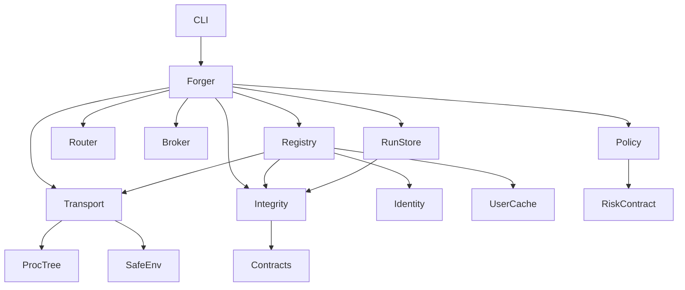
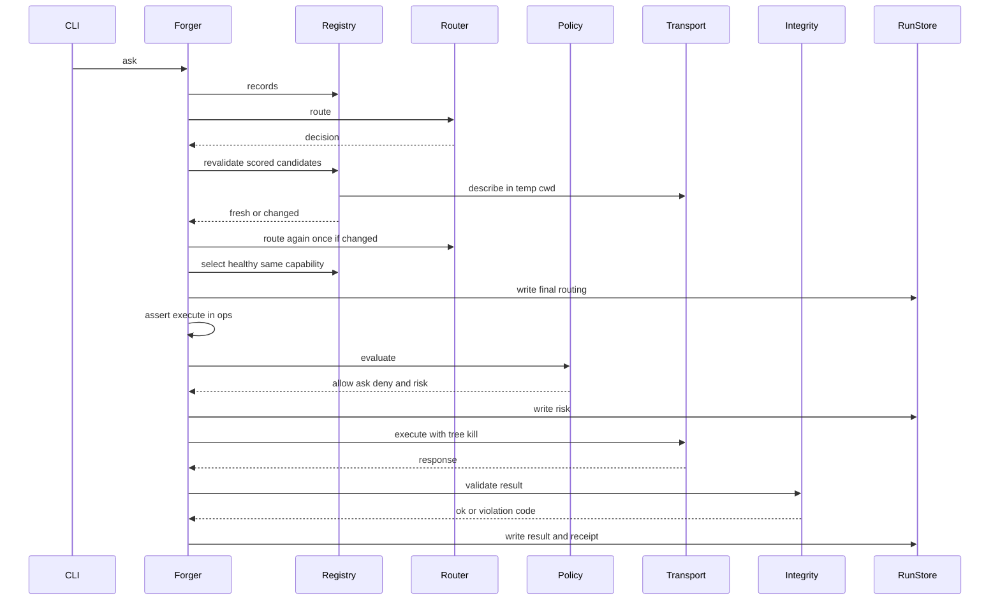
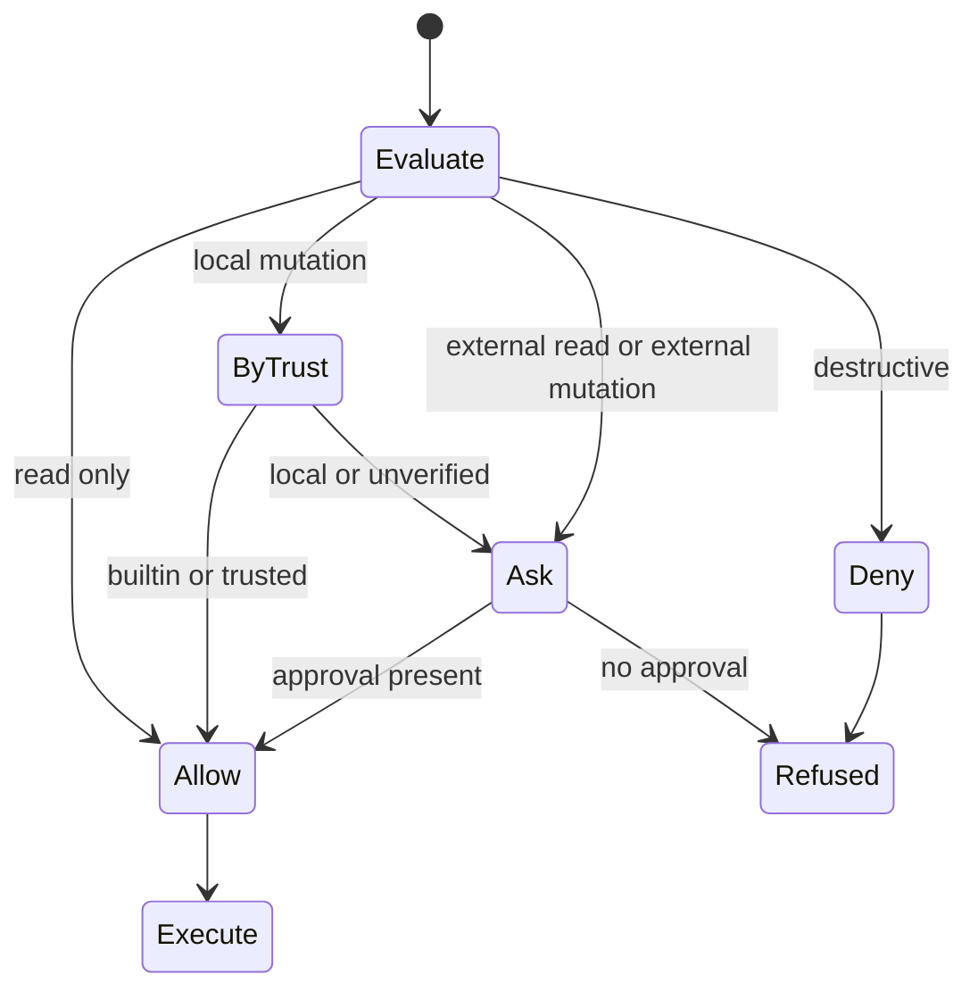

# Design Document — cycle2-reality-hardening (Wave A)

## Overview

**Purpose**: Esta spec endurece o core de The Forge entregue no Cycle 1. Ela fecha os gaps encontrados na auditoria de 2026-10-02 antes que os adapters reais (Wave B) e a composição multi-provider (Wave D) passem a depender do core. Também entrega o primeiro CI do projeto.

**Users**: mantenedores (CI, gates), operadores (policy, trust, cache) e autores de providers (regras de protocolo mais estritas e documentadas).

**Impact**: muda o fluxo `ask` em quatro pontos: validação de integridade, revalidação do provider selecionado, decisão de policy antes do execute e kill da árvore de processos. O cache do registry sai do workspace. O Forge Protocol continua em `forge/v1`, e toda mudança de contrato é aditiva e opcional para providers.

### Goals
- Nenhum `ExecutionResult`, `ContextPack` ou receipt semanticamente inválido aceito ou persistido como sucesso (1.x).
- Providers adversariais não produzem sucesso falso, não escapam do timeout e não degradam o host (2.x).
- Routing determinístico, imune a inflação de sinais, com fallback restrito à mesma capability (3.x).
- Trust não escalável, cache não envenenável pelo projeto, identidade observada registrada (4.x).
- Ambiente mínimo documentado, cwd controlado, limites de isolamento explícitos (5.x).
- Decisão `allow/ask/deny` e `RiskAssessment` por execução (6.x).
- CI real com gates mecânicos em Linux e Windows (7.x).

### Non-Goals
- Adapters reais, conformance de integração e taxonomia de capabilities (`real-provider-integration`).
- Context tiers, git, cache de fingerprints e economy (`context-intelligence-v2`).
- `ExecutionPlan`, explain completo, replay e taxonomia formal de erros (`cross-forge-foundation`).
- Paridade agentic e consolidação final de documentação (`agentic-maintainability`).
- Sandbox de SO, assinatura de providers e nível de confiança `medium`.

## Boundary Commitments

### This Spec Owns
- Invariantes relacionais de contratos e o módulo que as valida (`contracts/integrity.py`).
- Regras de protocolo aplicadas pelo core: checagem de `ops`, `kind`, `op` opcional, `producer` (id e versão), negociação robusta e kill de árvore.
- Regras de pontuação de routing: limites, deduplicação, sinais não discriminantes, estado de capability e fallback por mesma capability.
- Localização, formato e revalidação do cache do registry. Fingerprint local de identidade do provider.
- Ambiente e cwd entregues a providers.
- Policy engine (`policy/`) e o contrato `RiskAssessment` v1.
- Constantes de códigos de erro novos e existentes (`errors.py`), sem formalizar a taxonomia.
- Workflows de CI, scripts de gate e classificação de testes por markers.
- ADRs 0009–0013 e as seções de `docs/` tocadas por estas mudanças.

### Out of Boundary
- Formato de saída de `explain` além de exibir o artefato `risk`. A explicação completa é da Wave D.
- Qualquer conhecimento de domínio de Spark ou API, e qualquer adapter.
- Seleção de contexto (tiers, git, cache), exceto validar o `ContextPack` que já existe.
- Interface interativa de aprovação: há só a flag `--approve` e o arquivo de policy do usuário.
- Instalação ou download de providers.

### Allowed Dependencies
- Python stdlib ≥ 3.11 (inclui `ctypes`, `tomllib`, `tempfile`) no runtime. Nenhuma dependência nova de runtime.
- Dev-only: `pytest`, `hypothesis`, `ruff`, `mypy`, `jsonschema` (já existem) e `build` (novo).
- Direção de imports (obrigatória): `contracts.codes → contracts → errors/security → protocol → registry → routing/context → policy → runs → forger → cli`. Um módulo só importa módulos à sua esquerda. `policy` recebe dados do registry (manifest, trust) como argumentos tipados e importa apenas `contracts`; não importa `registry`, `forger` nem `cli`. `contracts/integrity.py` importa apenas `contracts` (incluindo `contracts.codes`). `errors.py` reexporta `Codes` de `contracts.codes` e não importa `integrity`.
- GitHub Actions (`actions/checkout@v7`, `actions/setup-python@v7`) apenas em `.github/workflows/`.

### Revalidation Triggers
- Qualquer mudança em `ExecutionResult`, `Evidence`, `Finding`, `Artifact`, `Response`, `Candidate`, `ReceiptProvider`, `ReceiptInputs` ou `RiskAssessment` exige que Waves B e D revalidem adapters e o executor de plano.
- Mudança nos limites de sinais ou na regra de sinais não discriminantes exige reexecutar a conformance de routing com os manifests reais (Wave B).
- Mudança no local do cache ou no formato de fingerprint exige revalidar a documentação de instalação de providers.
- Mudança na tabela padrão de policy ou na semântica `trusted`/`local` exige revalidar os adapters reais, que expõem `operation_class`.
- Mudança de códigos `FORGE-*` exige revalidar a taxonomia da Wave D.

## Architecture

### Existing Architecture Analysis
- Pipeline síncrono e local: `cli.commands.cmd_ask` → `Forger.ask` → `_run` (registry → scan → route → health/fallback → context → execute → parse → persist → receipt).
- Contratos são dataclasses `frozen, kw_only` com `from_dict` genérico. Erros de transporte usam `TransportError(code, detail)`, e o resto usa `ForgeError` (`UsageError`, `PersistenceError`).
- Padrões preservados: tudo é persistido via `RunStore.write` (redação e hash do conteúdo em disco). O routing é uma função pura de `(task, records, files, deps)`. A injeção de transporte por `transport_factory` mantém os testes sem subprocesso real quando conveniente.
- Débito técnico resolvido: códigos inline, fallback entre capabilities, cache dentro do projeto e kill só do filho direto.

### Architecture Pattern & Boundary Map



**Architecture Integration**:
- Padrão: núcleo em pipeline com validadores puros nas bordas, no estilo ports and adapters. O transporte é a porta para os providers, e `integrity` e `policy` são funções puras.
- Fronteiras: `integrity` decide se um dado é válido, `policy` decide se uma execução pode ocorrer, `registry` decide qual manifest é verdadeiro e `forger` só orquestra.
- Componentes novos: `integrity` (códigos específicos), `proctree` (kill-tree por plataforma), `identity` (fingerprint), `policy` (governança) e `risk` (contrato).
- Conformidade com as invariantes do projeto: stdlib-only, integração só via protocolo, routing determinístico, sucesso só com `ExecutionResult` válido e persistência só via `redact`.

### Technology Stack

| Layer | Choice / Version | Role in Feature | Notes |
|-------|------------------|-----------------|-------|
| CLI | stdlib `argparse` (existente) | flag `--approve` em `ask` | sem mudança de nome canônico |
| Runtime | Python ≥ 3.11 stdlib | validação, policy, kill-tree (`ctypes`), cache dir | 0 deps runtime (gate) |
| Data / Storage | arquivos JSON locais | cache do registry em diretório de cache do usuário; artefato de run `risk` | escrita atômica (existente) |
| Infra / CI | GitHub Actions, `actions/checkout@v7`, `actions/setup-python@v7` | gates de PR, compat e providers reais | `persist-credentials: false` |
| Dev tooling | pytest, hypothesis, ruff, mypy strict, jsonschema, PyPA `build` | testes, fuzz, lint, tipos, schemas, empacotamento | `build` é dev-dep nova |

## File Structure Plan

### Directory Structure
```
src/theforge/
├── errors.py                     # reexporta Codes (sem importar integrity)
├── contracts/
│   ├── codes.py                  # NOVO: classe Codes (constantes FORGE-*), módulo mais à esquerda
│   ├── integrity.py              # NOVO: invariantes relacionais (result, context pack, receipt, manifest limits)
│   ├── risk.py                   # NOVO: RiskAssessment v1 + PolicyDecision
│   ├── base.py                   # from_dict(strict=...)
│   ├── types.py                  # SHA256_RE + check_sha256(); limites de manifest; CATCH_ALL_GLOBS
│   ├── result.py                 # hash format em Artifact/Evidence
│   ├── context.py                # hash format em ContextFile
│   ├── receipt.py                # ReceiptProvider identidade; ReceiptInputs.risk_sha256
│   ├── envelope.py               # Response.op opcional
│   ├── routing.py                # Candidate.state
│   ├── manifest.py               # limites de sinais/capabilities por manifest
│   └── schema.py                 # exporta RiskAssessment; additionalProperties=false p/ contratos core
├── protocol/
│   ├── proctree.py               # NOVO: spawn em grupo/job + kill da árvore (POSIX/Windows)
│   ├── transport.py              # usa proctree; valida kind/op/producer.id
│   └── negotiate.py              # entradas malformadas/duplicadas
├── registry/
│   ├── identity.py               # NOVO: ProviderFingerprint (executável, versão, stat de argv)
│   ├── config.py                 # + user_cache_dir()
│   ├── registry.py               # cache no user cache dir; revalidate(); producer checks; cwd temp
│   └── health.py                 # cwd temp; producer.id check
├── routing/router.py             # caps, dedupe, non-discriminating globs, state, confidence
├── policy/
│   ├── __init__.py
│   ├── engine.py                 # NOVO: evaluate() → PolicyDecision; load_policy()
│   └── assess.py                 # NOVO: build_risk_assessment()
├── security/env.py               # filtro de padrões de credencial + justificativa documentada
├── runs/store.py                 # artefato "risk"; leitura strict; validate_receipt na escrita
├── forger/orchestrator.py        # fluxo novo: ops check, revalidate, policy, integrity, fallback mesma capability
└── cli/{main,commands,render}.py # --approve; exit/refused por policy; explain mostra risk

tests/
├── conftest.py                   # bloqueio de rede em sessão; markers por arquivo
├── fixtures/providers/bad_forge.py  # novos modos adversariais
├── test_integrity.py             # 1.x
├── test_protocol_adversarial.py  # 2.x
├── test_proctree.py              # 2.5
├── test_fuzz_contracts.py        # 2.9 (hypothesis)
├── test_router_adversarial.py    # 3.x
├── test_registry_cache.py        # 4.x
├── test_env_isolation.py         # 5.x
├── test_policy.py                # 6.x
└── test_ci_gates.py              # 7.3, 7.4, 7.5 (gates locais equivalentes ao CI)

scripts/ci/
├── check_zero_deps.py            # tomllib + Requires-Dist do wheel
└── fresh_install.py              # venv novo, instala wheel, doctor/init/echo fora do repo

.github/workflows/
├── ci.yml                        # PR/push: matriz Linux+Windows × 3.11–3.14
├── compat.yml                    # semanal/manual: macOS
└── real-providers.yml            # semanal/manual, não bloqueante

docs/adr/
├── 0009-registry-cache-location.md
├── 0010-policy-model.md
├── 0011-ci-support-matrix.md
├── 0012-os-sandbox-research.md
└── 0013-provider-identity.md
```

### Modified Files
- `pyproject.toml`: adiciona markers (`unit`, `contract`, `integration`, `e2e`, `slow`, `security`, `real_provider`) e a dev-dep `build`. Mantém `-m 'not slow and not real_provider'` como padrão.
- `src/theforge/context/broker.py`: comportamento inalterado (Broker no diagrama); o pack produzido passa a ser verificado por `validate_context_pack` no Forger. Evolução do broker pertence a `context-intelligence-v2`.
- `tests/test_registry.py`, `tests/test_doctor.py`: as asserções sobre `.forge/registry` passam a usar o diretório de cache isolado.
- `src/theforge/registry/config.py`: `user_cache_dir()`; resolução de `argv` relativo em `load_entries`.
- `src/theforge/state.py`: `SUBDIRS` deixa de incluir `registry`; `init_workspace` remove `.forge/registry` legado com aviso.
- `schemas/*.schema.json`: regenerados, com novo `RiskAssessment.schema.json`.
- `tests/fixtures/providers/fixture_forge.py` e `providers/echo/provider.py`: passam a emitir `producer.version` igual à versão do manifest e hashes válidos (já emitem; testes garantem).
- `docs/protocol.md`, `docs/provider-authoring.md`, `docs/security.md`, `docs/cli.md`, `docs/architecture.md`: novas regras e limites.

## System Flows

### Fluxo `ask` endurecido



Decisões do fluxo:
- A revalidação cobre todos os candidatos que pontuaram, antes da decisão final. Uma divergência invalida as entradas e refaz `records` e `route` uma única vez (limitação `registry-revalidated`). Uma segunda divergência termina em `provider_failure` com `FORGE-REGISTRY-MANIFEST-CHANGED`.
- Providers sem `execute` em `ops` já são excluídos no routing, e a policy acontece antes de qualquer processo de execute. `ask` e `deny` produzem outcome `refused` com `error.unlock` preenchido para `ask`.
- Uma violação de integridade produz `provider_failure`. O resultado inválido não é gravado como `result`; apenas o receipt com `error` é escrito.

### Estados de decisão de policy



A policy do usuário pode reconfigurar qualquer regra. A policy do projeto só pode endurecer, ou seja, mover uma regra para a direita em `allow → ask → deny`.

## Requirements Traceability

| Requirement | Summary | Components | Interfaces | Flows |
|-------------|---------|------------|------------|-------|
| 1.1 | evidence IDs únicos | Integrity, Forger | `validate_result` | ask |
| 1.2 | finding IDs únicos | Integrity | `validate_result` | ask |
| 1.3 | evidence_ids resolvem | Integrity | `validate_result` | ask |
| 1.4 | artifact path contido | Integrity | `validate_result`, `check_artifact_path` | ask |
| 1.5 | formato SHA-256 | Contracts types | `check_sha256` | parse |
| 1.6 | producer id/versão | Integrity, Registry, Health, Forger | `check_producer` | describe, health, ask |
| 1.7 | ContextPack bytes | Integrity, Broker | `validate_context_pack` | ask |
| 1.8 | receipt ↔ result | Integrity, RunStore | `validate_receipt` | ask |
| 1.9 | manifest inválido | Contracts manifest, Integrity | `validate_manifest_limits` | describe |
| 1.10 | campos desconhecidos | Contracts base, Schema, RunStore | `from_dict(strict)` | persist/read |
| 1.11 | testes por invariante | test_integrity | — | — |
| 2.1 | execute fora de ops | Router, Forger | filtro de roteabilidade, `_require_op` | ask |
| 2.2 | request_id/protocol/kind/op | Transport | `SubprocessTransport.call` | todos |
| 2.3 | stdout excedido | Transport, ProcTree | `_run` | todos |
| 2.4 | stderr limitado/redigido | Transport | `_run` | todos |
| 2.5 | timeout mata árvore | ProcTree | `spawn`, `kill_tree` | todos |
| 2.6 | JSON/status/timestamp/exit inválidos | Transport, Contracts, Integrity | `call`, `check_timestamp` | ask |
| 2.7 | negociação | Negotiate | `choose_protocol` | describe |
| 2.8 | provider adversarial | bad_forge | modos | testes |
| 2.9 | fuzz decode | test_fuzz_contracts | hypothesis | testes |
| 3.1 | determinismo | Router | `route` | ask |
| 3.2 | volume não vence, dedupe, catch-all | Router, Integrity | `types_matched`, sinais não discriminantes, `CATCH_ALL_GLOBS` | ask |
| 3.3 | ambíguo | Router | `route` | ask |
| 3.4 | "melhore performance" ambíguo | Router + fixtures | `route` | ask |
| 3.5 | Glue → provider de dados | Router + fixture-spark | `route` | ask |
| 3.6 | OpenAPI → provider de API | Router + fixture-api | `route` | ask |
| 3.7 | níveis de confiança | Router (decisão: manter high/low) | `Confidence` | — |
| 3.8 | estado de capability | Router, Contracts routing | `Candidate.state` | ask, explain |
| 3.9 | fallback mesma capability/ação | Forger | `_fallback_order` | ask |
| 3.10 | falha explícita sem fallback | Forger | `_select_healthy` | ask |
| 3.11 | testes adversariais de routing | test_router_adversarial | — | — |
| 4.1 | trust de projeto ignorado | Registry config | `load_entries` | refresh |
| 4.2 | semântica de trust | Policy, docs | `DEFAULT_RULES` | policy |
| 4.3 | cache adulterado | Registry, Forger | `revalidate(candidates)` antes da decisão final | ask |
| 4.4 | cache fora do projeto + migração | Registry config/registry | `user_cache_dir`, `_cache_path` | refresh |
| 4.5 | invalidação por fingerprint | Identity, Registry | `fingerprint`, `_read_cache` | records |
| 4.6 | identidade no receipt | Forger, Contracts receipt | `ReceiptProvider` | ask |
| 4.7 | ADR identidade | docs/adr/0013 | — | — |
| 5.1 | sem credenciais no env | SafeEnv | `safe_env` | todos |
| 5.2 | testes por categoria | test_env_isolation | env-probe | — |
| 5.3 | justificativa das variáveis | security.md, env.py | `ALLOWED_ENV` | — |
| 5.4 | cwd controlado | Registry, Health, Forger | `cwd=` | todos |
| 5.5 | cwd ≠ sandbox | docs/security.md | — | — |
| 5.6 | operation_class declarativo | docs, RiskAssessment.source | `RiskAssessment` | policy |
| 5.7 | ADR sandbox | docs/adr/0012 | — | — |
| 6.1 | decisão registrada | Policy, RunStore | `evaluate`, artefato `risk` | ask |
| 6.2 | defaults e regra mais severa | Policy | `DEFAULT_RULES`, `assess_dimensions`, `evaluate` | policy |
| 6.3 | ask sem aprovação | Forger, CLI | `--approve`, `FORGE-POLICY-APPROVAL-REQUIRED` | ask |
| 6.4 | deny | Forger | `FORGE-POLICY-DENIED` | ask |
| 6.5 | dimensões de risco | Policy assess, Contracts risk | `build_risk_assessment` | ask |
| 6.6 | origem declarativa | Contracts risk | `RiskAssessment.source` | ask |
| 7.1 | matriz PR | ci.yml | jobs `test` | CI |
| 7.2 | wheel + fresh install | ci.yml, fresh_install.py | job `package` | CI |
| 7.3 | zero deps | check_zero_deps.py | job `package` | CI |
| 7.4 | metadados/entry points | fresh_install.py | job `package` | CI |
| 7.5 | classificação de testes | conftest, pyproject | markers | — |
| 7.6 | offline falha | conftest | `_block_network` | testes |
| 7.7 | providers reais separados | real-providers.yml | — | CI |
| 7.8 | macOS e 3.14 | compat.yml, ADR 0011 | — | — |

## Components and Interfaces

| Component | Domain/Layer | Intent | Req Coverage | Key Dependencies | Contracts |
|-----------|--------------|--------|--------------|------------------|-----------|
| Codes | contracts.codes | constantes `FORGE-*` em um único lugar | 1.x, 2.x, 6.x | — | State |
| Integrity | contracts | invariantes relacionais com códigos | 1.1–1.4, 1.6–1.9, 2.6 | Contracts (P0) | Service |
| ContractStrictness | contracts | hash format, strict parse, schema closure | 1.5, 1.10 | base (P0) | Service |
| RiskContract | contracts | `RiskAssessment` v1 | 6.1, 6.5, 6.6 | types (P0) | State |
| ProcTree | protocol | spawn isolado + kill da árvore | 2.3, 2.5 | stdlib ctypes/os (P0) | Service |
| Transport | protocol | validação de envelope e limites | 2.2–2.6 | ProcTree (P0), SafeEnv (P0) | Service |
| Negotiate | protocol | seleção de versão robusta | 2.7 | — | Service |
| Identity | registry | fingerprint local do provider | 4.5, 4.6 | stdlib (P1) | Service |
| Registry | registry | cache no diretório do usuário, revalidação, producer | 1.6, 1.9, 4.1, 4.3–4.5, 5.4 | Transport (P0), Identity (P1), Integrity (P0) | Service, State |
| Router | routing | scoring limitado e estado de capability | 3.1–3.8, 3.11 | manifest (P0) | Service |
| Policy | policy | `allow/ask/deny` + `RiskAssessment` | 4.2, 6.1–6.6 | RiskContract (P0), config (P1) | Service |
| SafeEnv | security | ambiente mínimo | 5.1–5.3 | — | Service |
| Forger | forger | orquestração com os novos gates | 1.x, 2.1, 3.9, 3.10, 4.6, 5.4, 6.1–6.4 | todos acima (P0) | Service |
| RunStore | runs | artefato `risk`, leitura strict, validação de receipt | 1.8, 1.10, 6.1 | Integrity (P0) | State |
| CLI | cli | `--approve`, mapeamento de outcomes | 6.3, 6.4 | Forger (P0) | Service |
| TestHarness | tests | markers, bloqueio de rede, providers adversariais, fuzz | 1.11, 2.8, 2.9, 3.11, 5.2, 7.5, 7.6 | pytest, hypothesis (dev) | — |
| CIWorkflows | infra | gates de PR, compat e providers reais | 7.1–7.8 | GitHub Actions (External P0) | Batch |

### contracts.codes

#### Codes

| Field | Detail |
|-------|--------|
| Intent | Fonte única de códigos de erro `FORGE-*` |
| Requirements | 1.1–1.9, 2.1–2.7, 4.3, 6.3, 6.4 |

**Responsibilities & Constraints**
- Declara as constantes. Os literais inline existentes migram para cá sem mudar o valor, o que preserva a compatibilidade dos receipts.
- As famílias seguem o prefixo existente (`FORGE-PROTO-*`, `FORGE-PROVIDER-*`, `FORGE-HEALTH-*`), e as novas famílias são `FORGE-RESULT-*`, `FORGE-CONTEXT-*`, `FORGE-RECEIPT-*`, `FORGE-REGISTRY-*` e `FORGE-POLICY-*`.

```python
class Codes:
    PROTO_NOT_JSON = "FORGE-PROTO-NOT-JSON"  # existente
    PROTO_OP_MISMATCH = "FORGE-PROTO-OP-MISMATCH"  # novo
    PROTO_OP_UNSUPPORTED = "FORGE-PROTO-OP-UNSUPPORTED"  # novo
    PROTO_PRODUCER = "FORGE-PROTO-PRODUCER"  # existente, ampliado
    RESULT_DUP_EVIDENCE = "FORGE-RESULT-DUP-EVIDENCE"
    RESULT_DUP_FINDING = "FORGE-RESULT-DUP-FINDING"
    RESULT_DANGLING_EVIDENCE = "FORGE-RESULT-DANGLING-EVIDENCE"
    RESULT_ARTIFACT_PATH = "FORGE-RESULT-ARTIFACT-PATH"
    CONTEXT_BYTES = "FORGE-CONTEXT-BYTES"
    RECEIPT_INVALID = "FORGE-RECEIPT-INVALID"
    REGISTRY_MANIFEST_CHANGED = "FORGE-REGISTRY-MANIFEST-CHANGED"
    MANIFEST_LIMITS = "FORGE-MANIFEST-LIMITS"
    POLICY_APPROVAL_REQUIRED = "FORGE-POLICY-APPROVAL-REQUIRED"
    POLICY_DENIED = "FORGE-POLICY-DENIED"
    # ... demais existentes (SCHEMA, MISMATCH, VERSION, SPAWN, TIMEOUT, OVERSIZE, EXIT,
    #     PROVIDER-BLOCKED/UNTRUSTED/NOT-READY, HEALTH-FAILED/UNAVAILABLE, USAGE, INTERNAL)
```

### contracts

#### Integrity

| Field | Detail |
|-------|--------|
| Intent | Validar invariantes que cruzam campos e objetos |
| Requirements | 1.1, 1.2, 1.3, 1.4, 1.6, 1.7, 1.8, 1.9, 2.6 |

**Responsibilities & Constraints**
- Funções puras, sem I/O. A contenção de path é puramente léxica, e o caminho nunca é aberto (1.4).
- Lança `IntegrityError(ContractError)` com `code`, `detail` e `field`. Coleta todas as violações e lança a primeira em ordem determinística. A lista completa vai em `IntegrityError.violations`.

**Dependencies**
- Inbound: Forger, Registry, RunStore e a Broker (validação pós-construção), todas P0.
- Outbound: nenhuma fora de `theforge.contracts`.

**Contracts**: Service [x]

##### Service Interface
```python
@dataclass(frozen=True)
class Violation:
    code: str
    detail: str
    field: str | None


class IntegrityError(ContractError):
    code: str
    violations: tuple[Violation, ...]


def validate_result(result: ExecutionResult, *, expected: Producer) -> None: ...
def check_artifact_path(path: str) -> Violation | None: ...
def check_producer(actual: Producer, *, expected: Producer, field: str) -> Violation | None: ...
def validate_context_pack(pack: ContextPack) -> None: ...
def validate_receipt(receipt: ExecutionReceipt, *, result_sha256: str | None) -> None: ...
def validate_manifest_limits(manifest: ForgeManifest) -> tuple[Violation, ...]: ...
def check_timestamp(value: str, *, field: str) -> Violation | None: ...
```
- Preconditions: os objetos já passaram por `from_dict`, ou seja, estão estruturalmente válidos.
- Postconditions: um retorno sem exceção garante as invariantes:
  - IDs de evidence e de finding são únicos.
  - Toda referência resolve.
  - Todo artifact tem path relativo POSIX, sem `..`, sem drive nem UNC, e não vazio.
  - `producer.id` e `producer.version` são iguais a `expected`.
  - Os timestamps são ISO-8601 UTC parseáveis.
- `validate_context_pack`: `used_bytes ≤ budget_bytes`, `used_bytes == Σ files.bytes` e caminhos de arquivo relativos e contidos.
- `validate_receipt`: `status ∈ {ok, partial}` exige `result_sha256` igual ao hash persistido. `refused` e `provider_failure` exigem `error` (regra que já existe).
- `validate_manifest_limits` retorna violações por capability. O Registry exclui as capabilities violadoras (com aviso) e marca o provider `invalid` quando nenhuma capability resta ou quando o limite de capabilities por manifest é excedido (1.9, 2.8).

**Implementation Notes**
- Limites de manifest em `contracts/types.py`: `MAX_CAPABILITIES = 256`, `MAX_KEYWORDS = 64`, `MAX_GLOBS = 32`, `MAX_DEPENDENCIES = 32`, `MAX_ACTIONS = 16`. São valores iniciais; mudá-los é um gatilho de revalidação.
- Risco: providers do Cycle 1 com timestamps em formato diverso. Echo e as fixtures usam `utc_now()`, e o formato aceito é qualquer ISO-8601 com sufixo `Z` ou offset `+00:00`.

#### ContractStrictness

| Field | Detail |
|-------|--------|
| Intent | Formato de hash nos contratos, parse estrito e fechamento de schemas core |
| Requirements | 1.5, 1.10 |

**Contracts**: Service [x]
```python
SHA256_RE: Final = re.compile(r"^[0-9a-f]{64}$")


def check_sha256(value: str, *, field: str) -> None: ...  # ValueError → ContractError via from_dict


def from_dict(cls: type[T], data: object, path: str = "$", *, strict: bool = False) -> T: ...


CLOSED_SCHEMAS: Final[tuple[type, ...]] = (RoutingDecision, ExecutionReceipt, RiskAssessment)
```
- `__post_init__` de `Artifact.sha256`, `ContextFile.sha256` e `Evidence.hash` (quando não `None`) chamam `check_sha256`.
- `strict=True` rejeita chaves desconhecidas com `ContractError("{path}.{key}: unknown field")`, recursivamente. Quem usa: `RunStore.read_contract`, `Registry._read_cache` (via `RegistryCacheEntry`) e `Forger` ao reler artefatos próprios.
- `schema.py` emite `additionalProperties: false` só para `CLOSED_SCHEMAS`, artefatos que nunca cruzam o protocolo. `TaskSpec` e `ContextPack` vão até os providers dentro de `ExecuteRequest` e evoluirão na Wave C, então seus schemas continuam abertos; a rigidez deles vem de `from_dict(strict=True)` quando o core os relê. Contratos vindos de providers (`ForgeManifest`, `ExecutionResult`, `Evidence`, `Response`, `HealthReport`) continuam abertos. A política fica documentada em `docs/protocol.md` (1.10).

#### RiskContract

| Field | Detail |
|-------|--------|
| Intent | Registro persistido da avaliação de risco e da decisão de policy |
| Requirements | 6.1, 6.5, 6.6 |

**Contracts**: State [x]
```python
RiskLevel = Literal["yes", "no", "unknown"]
Decision = Literal["allow", "ask", "deny"]


@dataclass(frozen=True, kw_only=True)
class RiskDimensions:
    read_only: RiskLevel
    local_mutation: RiskLevel
    external_read: RiskLevel
    external_mutation: RiskLevel
    destructive: RiskLevel
    credentials: RiskLevel  # "unknown" até providers declararem
    cross_account: RiskLevel  # "unknown" até providers declararem


@dataclass(frozen=True, kw_only=True)
class PolicyDecision:
    decision: Decision
    rule: str  # ex.: "default.local_mutation.trusted"
    reason: str
    approved: bool  # True quando ask foi satisfeito por --approve
    unlock: str | None


@dataclass(frozen=True, kw_only=True)
class RiskAssessment:
    schema: Literal["theforge/RiskAssessment/v1"]
    producer: Producer
    created_at: str
    run_id: str
    provider_id: str
    capability: str
    action: str
    operation_class: OperationClass
    source: Literal["provider_declaration"]
    dimensions: RiskDimensions
    policy: PolicyDecision
    limitations: list[str]
    unknowns: list[str]
```
- Invariante: `source` é sempre `provider_declaration` e `limitations` sempre contém `"operation_class is a provider declaration, not sandbox enforcement"` (5.6, 6.6).

### protocol

#### ProcTree

| Field | Detail |
|-------|--------|
| Intent | Iniciar o provider isolado em grupo ou job e encerrar toda a árvore |
| Requirements | 2.3, 2.5 |

**Contracts**: Service [x]
```python
@dataclass
class SpawnedProcess:
    proc: subprocess.Popen[bytes]
    tree_kill_supported: bool  # False → limitação registrada


def spawn(argv: Sequence[str], *, cwd: Path, env: Mapping[str, str]) -> SpawnedProcess: ...
def kill_tree(sp: SpawnedProcess, *, grace_seconds: float = 2.0) -> None: ...
def close(sp: SpawnedProcess) -> None: ...  # libera o handle do job (Windows)
```
- POSIX: `Popen(..., start_new_session=True)`. `kill_tree` envia `killpg(SIGTERM)`, espera a graça e envia `killpg(SIGKILL)`, ignorando `ProcessLookupError`.
- Windows: cria um Job Object (`ctypes`, `JOB_OBJECT_LIMIT_KILL_ON_JOB_CLOSE`, sem breakaway), inicia o processo com `CREATE_SUSPENDED`, atribui ao job e só então retoma (`NtResumeProcess` via `ctypes`). Isso fecha a janela em que launchers de console scripts criariam o interpretador real fora do job. Encerra com `TerminateJobObject`. Se o job falhar, retoma o processo, usa `taskkill /T /F /PID` como fallback e marca `tree_kill_supported=False` (limitação registrada).
- POSIX: a nova sessão desliga o Ctrl-C do terminal para os filhos, então o transporte chama `kill_tree` em todo `finally` (inclusive `KeyboardInterrupt`).
- Postcondition: depois de `kill_tree`, nenhum descendente continua vivo, exceto os que escaparam deliberadamente (novo `setsid` ou daemon no POSIX), limitação documentada.

#### Transport

| Field | Detail |
|-------|--------|
| Intent | Chamada de protocolo com validação completa de envelope |
| Requirements | 1.6, 2.2, 2.3, 2.4, 2.6 |

**Contracts**: Service [x]
```python
class ProviderTransport(Protocol):  # assinatura inalterada (fakes de teste continuam válidos)
    def call(
        self,
        op: str,
        payload: dict[str, Any],
        *,
        timeout: float,
        cwd: Path | None = None,
        check_protocol: bool = True,
    ) -> Response: ...
```
- Todo chamador do core passa `cwd` controlado (5.4); `cwd=None` permanece aceito só por compatibilidade de fakes de teste e é proibido no core (teste unitário verifica os chamadores).
- A checagem de `producer` (id e versão) **não** fica no transporte: é feita pelos chamadores (`Registry._describe`, `check_health`, `Forger`) via `integrity.check_producer`, mantendo a interface `ProviderTransport` estável.
- A validação segue esta ordem:
  1. JSON (`PROTO-NOT-JSON`).
  2. `from_dict(Response)` (`PROTO-SCHEMA`); `kind` errado já falha aqui, pois `kind` é `Literal["Response"]` (2.2).
  3. `request_id` (`PROTO-MISMATCH`).
  4. `op`, quando presente, igual ao pedido (`PROTO-OP-MISMATCH`).
  5. `protocol` (`PROTO-VERSION`).
- `Response` ganha `op: str | None = None`, opcional para manter Protocol v1. Os providers de referência passam a emitir o campo.
- Timeout, oversize, `KeyboardInterrupt` e qualquer exceção chamam `kill_tree` no `finally` enquanto o processo estiver vivo. O stderr continua truncado em 64 KiB, e somente `redact_text(stderr)[-500:]` sai do transporte. stderr nunca é persistido bruto (2.4).

#### Negotiate

```python
def major(protocol: str) -> int | None: ...  # aceita só ^forge/v([1-9][0-9]{0,2})$
def choose_protocol(
    offered: list[str], supported: tuple[str, ...] = SUPPORTED_PROTOCOLS
) -> str | None: ...
```
- A seleção ignora entradas malformadas, deduplica e é independente da ordem. Uma lista vazia ou sem versão comum resulta em `None`, e o registro fica `incompatible` (2.7).

### registry

#### Identity

| Field | Detail |
|-------|--------|
| Intent | Fingerprint local e observável de um provider |
| Requirements | 4.5, 4.6 |

**Contracts**: Service [x]
```python
@dataclass(frozen=True, kw_only=True)
class ProviderFingerprint:
    executable: str  # caminho resolvido de argv[0] (shutil.which) ou argv[0]
    file_stats: list[
        tuple[str, int, int]
    ]  # (path, size, mtime_ns) de cada argv existente como arquivo
    digest: str  # sha256 canônico dos campos acima


def fingerprint(entry: ProviderEntry) -> ProviderFingerprint: ...
```
- Limitação documentada (ADR 0013): o fingerprint não cobre o código importado por módulos. A revalidação pré-execute (4.3) compensa isso para o provider selecionado.

#### Registry

| Field | Detail |
|-------|--------|
| Intent | Fonte da verdade sobre manifests, com cache seguro e revalidação |
| Requirements | 1.6, 1.9, 4.1, 4.3, 4.4, 4.5, 5.4 |

**Contracts**: Service [x] / State [x]
```python
def user_cache_dir() -> Path: ...


# $THEFORGE_CACHE_DIR | win32: %LOCALAPPDATA%\theforge\Cache | darwin: ~/Library/Caches/theforge
# | $XDG_CACHE_HOME/theforge (se absoluto) | ~/.cache/theforge


class Registry:
    def __init__(
        self,
        forge_dir: Path,
        *,
        user_dir: Path | None = None,
        cache_dir: Path | None = None,
        transport_factory: TransportFactory = ...,
        timeout: float = DESCRIBE_TIMEOUT,
        allow_unverified: bool = False,
    ) -> None: ...
    def records(self, *, persist: bool = True) -> list[RegistryRecord]: ...
    def revalidate(self, provider_ids: Sequence[str]) -> list[RevalidationOutcome]: ...
    def invalidate(self, provider_id: str) -> None: ...


@dataclass(frozen=True)
class RevalidationOutcome:
    status: Literal["fresh", "changed", "unreachable"]
    record: RegistryRecord
```
- Cache: `<cache_dir>/registry/<id>-<entry_digest[:12]>.json`, desserializado para a dataclass interna `RegistryCacheEntry{schema: "theforge/RegistryCache/v2", entry, entry_digest, fingerprint, state, manifest, manifest_sha256, protocol, written_at}` com `strict=True`. Um `fingerprint` diferente do atual invalida a entrada (4.5).
- Escrita via `tempfile.mkstemp(dir=<cache_dir>/registry)` + `os.replace` (nome temporário único, seguro para `ask` concorrentes e para o Windows). Falha de escrita do cache gera **aviso** em `registry.warnings` e nunca `PersistenceError`: o cache é otimização regenerável.
- Migração: o diretório legado `.forge/registry/` passa a ser ignorado. `theforge init` e `registry refresh` removem os arquivos legados com aviso. Como o cache é regenerável, não há perda funcional (4.4). `state.SUBDIRS` deixa de criar `registry`.
- O cwd de describe e health é um `tempfile.TemporaryDirectory(prefix="theforge-", ignore_cleanup_errors=True)` por chamada (5.4).
- `config.load_entries` resolve entradas relativas de `argv` que existam como arquivo para caminhos absolutos, relativos ao diretório do arquivo de configuração; entradas relativas que parecem caminho (contêm separador) e não existem geram `UsageError` claro. Assim o cwd temporário não quebra providers configurados com caminho relativo, e `fingerprint()` sempre lê caminhos absolutos.
- `_describe` verifica `response.producer.id == entry.id` e `response.producer.version == manifest.version` (1.6) e aplica `validate_manifest_limits` (1.9). `check_health` verifica `producer.id == entry.id` e `producer.version == record.manifest.version` (1.6). O downgrade de trust de projeto permanece em `config.load_entries` (`config.py:76-82`), já existente e coberto por teste (4.1).
- `revalidate(ids)` faz describe dos providers indicados e compara o `manifest_sha256` de cada um com o registro em uso, retornando um `RevalidationOutcome` por provider.

### routing

#### Router

| Field | Detail |
|-------|--------|
| Intent | Escolha determinística com sinais limitados |
| Requirements | 3.1–3.8, 3.11 |

**Contracts**: Service [x]
```python
# CATCH_ALL_GLOBS e os limites de manifest vivem em contracts/types.py (integrity os usa; o router não os redefine)


def route(
    task: TaskSpec,
    records: Sequence[RegistryRecord],
    files: Sequence[str],
    dependencies: set[str],
    *,
    allow_unverified: bool = False,
) -> RoutingDecision: ...
```
- A decisão usa apenas `types_matched`: presença por tipo (dependência, glob, keyword), de 0 a 3, e `rank_key = [types_matched]`. As contagens por tipo, sobre sinais normalizados e deduplicados, ficam em `MatchedSignals` apenas para explicação e **nunca** desempatam. Dois ou mais candidatos com o maior `types_matched` dão `ambiguous`, e um maior `types_matched < MIN_SIGNAL_TYPES` também (3.2, 3.3). Declarar mais sinais, portanto, não aumenta o score.
- Um sinal comum a todos os candidatos roteáveis que pontuaram (mesmo glob, dependência ou keyword normalizada) é não discriminante: não conta para `types_matched` e fica em `limitations` (`non-discriminating signal 'x' shared by all candidates`). A regra é entre providers e não depende do tamanho do workspace.
- Globs catch-all (que casam qualquer arquivo independentemente de nome ou extensão: `*`, `**`, `**/*`, `*.*`, `**/*.*`) são rejeitados estaticamente por `validate_manifest_limits` com `FORGE-MANIFEST-LIMITS`; a capability é excluída com aviso. Globs por extensão (`*.md`, `*.scala`) são permitidos: são sinais legítimos, e sobreposição entre providers é tratada pela regra de sinal não discriminante.
- Capabilities de providers cujo manifest não declara `execute` em `ops` não são roteáveis para `ask` (2.1, 3.10). `Forger._require_op` permanece como asserção defensiva.
- Entradas de `records` e `files` são ordenadas antes do processamento. A saída depende só do conteúdo (3.1).
- No caminho por sinais, `Candidate.rank_key` passa a ter um único elemento (o caminho explícito já usa `[trust_rank]`). `Candidate.state` vem da capability. Se o selecionado for `heuristic` ou `unresolved`, `confidence.level = "low"` e o estado aparece em `confidence.unresolved` (3.8).
- Níveis de confiança: mantidos `high`/`low`. 3.7 é opcional e não é ativado nesta wave, e a decisão está registrada em research.md.

### policy

#### Policy

| Field | Detail |
|-------|--------|
| Intent | Decidir se uma execução pode ocorrer e registrar o risco |
| Requirements | 4.2, 5.6, 6.1–6.6 |

**Dependencies**
- Inbound: Forger (P0).
- Outbound: `contracts` (P0). Os diretórios de config chegam como argumentos (`user_dir`, `forge_dir`), sem importar `registry`.

**Contracts**: Service [x]
```python
Rule = Literal["allow", "ask", "deny"]


@dataclass(frozen=True)
class PolicyConfig:
    rules: Mapping[str, Rule]  # chaves: "read_only", "external_read", "external_mutation",
    # "destructive", "local_mutation.<trust>"


DEFAULT_RULES: Final[Mapping[str, Rule]] = {
    "read_only": "allow",
    "local_mutation.builtin": "allow",
    "local_mutation.trusted": "allow",
    "local_mutation.local": "ask",
    "local_mutation.unverified": "ask",
    "external_read": "ask",
    "external_mutation": "ask",
    "destructive": "deny",
}


def load_policy(*, user_dir: Path, forge_dir: Path, warnings: list[str]) -> PolicyConfig: ...
def assess_dimensions(
    *, operation_class: OperationClass, execution: ExecutionInfo
) -> RiskDimensions: ...
def evaluate(
    *, dimensions: RiskDimensions, trust: TrustLevel, config: PolicyConfig, approved: bool
) -> PolicyDecision: ...
def build_risk_assessment(
    *,
    run_id: str,
    provider_id: str,
    capability: Capability,
    action: str,
    dimensions: RiskDimensions,
    decision: PolicyDecision,
) -> RiskAssessment: ...
```
- `load_policy` lê `policy.toml` do usuário (pode afrouxar ou endurecer) e `.forge/config/policy.toml` do projeto (só endurece; tentativas de afrouxar são ignoradas com aviso).
- `evaluate` é pura e aplica a regra **mais severa** (`allow < ask < deny`) entre todas as dimensões marcadas `yes`. `rule` registra a dimensão determinante. Assim, uma capability `read_only` com `requires_network=true` resulta em `ask` via `external_read` (6.2), o que prepara o caso `collect_*` da Wave B. `ask` com `approved=True` vira `allow` com `approved=True`, e `deny` nunca é satisfeito por aprovação.
- Dimensões:
  - `operation_class` define `read_only`, `local_mutation`, `external_read`, `external_mutation` e `destructive` como `yes` ou `no`.
  - `manifest.execution.requires_network` igual a `True` força `external_read = "yes"`.
  - `credentials` e `cross_account` ficam `unknown`.
- `trusted` e `local` (4.2): a única diferença comportamental, além do desempate de routing, é a regra `local_mutation.<trust>`. A documentação fica em `docs/security.md` e no ADR 0010.

### security

#### SafeEnv
```python
ALLOWED_ENV: Final[Mapping[str, str]]  # nome → justificativa (documentação gerada a partir daqui)
CREDENTIAL_PATTERNS: Final[tuple[re.Pattern[str], ...]]


def safe_env(source: Mapping[str, str] | None = None) -> dict[str, str]: ...
```
- O allowlist atual é mantido. A remoção de `HOME` e `USERPROFILE` foi rejeitada porque o Python filho precisa delas (`Path.home()`) e o `SYSTEMROOT` é obrigatório no Windows.
- Uma segunda passada remove qualquer variável cujo nome case com padrões de credencial (`AWS_*`, `*_TOKEN`, `*_SECRET*`, `*_PASSWORD`, `*_API_KEY`, `*CREDENTIAL*`, `SSH_AUTH_SOCK`, `*_PROXY` com userinfo), como defesa em profundidade.
- Cada variável mantida tem a justificativa em `ALLOWED_ENV`, refletida em `docs/security.md` (5.3).

### forger

#### Forger (fluxo `_run` revisado)
- Revalidação antes da decisão final de routing (4.3): depois do primeiro `route()`, se o status for `routed` ou `ambiguous`, `registry.revalidate` é chamado para todos os providers em `decision.candidates`.
  - Se algum retornar `changed`, as entradas são invalidadas, `records()` e `route()` são refeitos **uma única vez**, e a limitação `registry-revalidated: <ids>` é anexada à decisão final. Uma segunda divergência resulta em `provider_failure` com `FORGE-REGISTRY-MANIFEST-CHANGED`.
  - `unreachable` remove o provider dos candidatos da decisão refeita.
  - Em `no_route` não há revalidação.
- O artefato `routing` é gravado **somente** depois da decisão final (pós-revalidação e pós-fallback), com `fallbacks_used` e limitações consolidados.
- `_require_op(record, "execute")` fica como asserção defensiva antes de policy e execute; o filtro real acontece no router (2.1).
- `_fallback_order` aceita apenas candidatos com a mesma `capability` e que ofereçam a ação resolvida (3.9). Sem candidato saudável, o resultado é `provider_failure` com os códigos tentados em `fallbacks_used` (3.10).
- Policy:
  1. `load_policy`, `evaluate(approved=capability in request.approvals)`, `build_risk_assessment` e `store.write(run_id, "risk", ...)`.
  2. `ask` sem aprovação resulta em `refused` com `POLICY_APPROVAL_REQUIRED` e `unlock="--approve <capability>"`.
  3. `deny` resulta em `refused` com `POLICY_DENIED` (6.1–6.4).
- `validate_context_pack` roda sobre o pack construído **antes** de gravá-lo e de enviá-lo. Uma violação é erro do core (`FORGE-INTERNAL`, detalhe `FORGE-CONTEXT-BYTES`), não do provider (1.7).
- Pós-execute:
  1. `from_dict(ExecutionResult)`.
  2. `validate_result(result, expected=Producer(record.entry.id, record.manifest.version))`.
- Receipt:
  - `ReceiptProvider` ganha `executable: str | None`, `fingerprint: str | None`, `observed_version: str | None` (4.6).
  - `ReceiptInputs` ganha `risk_sha256: str | None`.
  - `validate_receipt` é chamado antes de gravar.
- `AskRequest` ganha `approvals: frozenset[str]`.

### runs

#### RunStore
- `ARTIFACTS = ("task", "routing", "risk", "context", "result", "receipt")`.
- Novo `read_contract(run_id, name, cls: type[T]) -> T` usa `from_dict(..., strict=True)` com o mapa `ARTIFACT_TYPES = {task: TaskSpec, routing: RoutingDecision, risk: RiskAssessment, context: ContextPack, result: ExecutionResult, receipt: ExecutionReceipt}`. `read` e `read_optional` (dicts) permanecem para `explain` e compatibilidade. `write("receipt")` exige que o receipt passe por `validate_receipt` com o hash real do `result` gravado (1.8).

### cli
- `theforge ask ... --approve CAPABILITY` (repetível) preenche `AskRequest.approvals`.
- `EXIT_BY_STATUS` não muda: policy `ask`/`deny` vira `refused`, que sai com o código 4. A mensagem inclui `unlock`.
- `explain` lista o artefato `risk` quando ele existe: decisão, regra e dimensões. A explicação completa é da Wave D.

### tests

#### TestHarness
- `conftest.py`:
  - a fixture autouse `_isolated_user_cache` aponta `THEFORGE_CACHE_DIR` para um diretório temporário por teste, junto ao `_isolated_user_config` existente. Nenhum teste escreve no cache real do usuário, e testes de adulteração não contaminam outros.
  - `pytest_configure` bloqueia rede no nível da sessão:
    - patch em `socket.socket.connect`, `socket.socket.connect_ex`, `socket.create_connection` e `socket.getaddrinfo`;
    - loopback e `AF_UNIX` são permitidos;
    - o marker `allow_network` libera.
  - `pytest_collection_modifyitems` aplica markers por arquivo usando uma tabela `FILE_MARKERS`. Um teste sem categoria falha a coleta (7.5, 7.6).
- `bad_forge.py` ganha os modos:
  - de integridade de resultado: `dup-evidence`, `dup-finding`, `dangling-ref`, `artifact-traversal`, `artifact-absolute`, `bad-hash`;
  - de envelope e protocolo: `bad-timestamp`, `unknown-status`, `wrong-kind`, `wrong-op`, `describe-wrong-producer`, `health-wrong-producer`, `wrong-version-producer`, `no-execute-op`, `malformed-protocols`, `duplicate-protocols`;
  - de tamanho, árvore e spam: `stderr-flood`, `spawn-grandchild`, `capability-spam`, `keyword-spam`, `wide-glob`;
  - de ambiente e operação: `env-probe-full`, `mutating` (declara `local_mutation`), `destructive`.
- Fixtures de routing para 3.4–3.6: os manifests `fixture-spark.json` e `fixture-api.json` já existentes, mais um workspace "ambíguo" sem sinais de arquivo.

### infra

#### CIWorkflows

| Field | Detail |
|-------|--------|
| Intent | Gates automáticos de qualidade e compatibilidade |
| Requirements | 7.1–7.8 |

**Contracts**: Batch [x]
- **`ci.yml`**:
  - Trigger: `pull_request` e `push` em `main`.
  - Job `test`, com matriz `os: [ubuntu-latest, windows-latest]` × `python: ["3.11","3.12","3.13","3.14"]` e `fail-fast: false`. Passos:
    1. `pip install -e .[dev]`
    2. `ruff check .`
    3. `mypy`
    4. `python -m theforge.contracts.schema <tmp>` mais o teste de paridade
    5. `pytest -m "not slow and not real_provider"`
  - Job `package` (ubuntu e windows, 3.11). Passos:
    1. `python -m build`
    2. `python scripts/ci/check_zero_deps.py dist/*.whl`
    3. `python scripts/ci/fresh_install.py dist/*.whl`
  - `permissions: contents: read`. Todo checkout usa `persist-credentials: false`.
- **`compat.yml`**: trigger `schedule` semanal e `workflow_dispatch`. Matriz `macos-latest × [3.11, 3.14]`. Não é gate de PR (7.8).
- **`real-providers.yml`**: trigger `workflow_dispatch` e `schedule` semanal. Checkout de `EdgarSocrates98/spark-forge-aws` e `EdgarSocrates98/api-forge` em `path:` separados, com token de secrets apenas nos steps de checkout. Roda `pytest -m real_provider`. Nunca é exigido para merge (7.7). O conteúdo dos testes `real_provider` é da Wave B; aqui só existe o esqueleto, que roda zero testes.
- **`check_zero_deps.py`**: falha se `project.dependencies` não estiver vazio (via `tomllib`) ou se o wheel contiver um `Requires-Dist` sem marcador `extra ==` (7.3).
- **`fresh_install.py`**:
  1. Cria um venv novo em um diretório temporário fora do repositório e instala o wheel sem `-e`.
  2. Roda `pip check`.
  3. Verifica os entry points `theforge` e `forge` via `importlib.metadata` e a execução de `theforge --help` e `forge --help`.
  4. Executa, em workspace temporário, `theforge doctor`, `theforge init` e `theforge ask "echo hello" --capability demo.echo`, exigindo exit 0 (7.2, 7.4).
- Decisões de matriz (ADR 0011): 3.14 entra no gate por estar em GA. 3.15 fica fora até GA. macOS fica fora do gate de PR por custo e roda semanalmente.

## Data Models

### Domain Model
- **Run** (agregado, em `.forge/runs/<id>/`): `task → routing → risk → context → result → receipt`.
  - O receipt referencia os hashes dos artefatos.
  - O `result` só existe se passou por integridade.
  - O `risk` existe sempre que se chegou a um provider selecionado.
- **RegistryCacheEntry v2** (diretório de cache do usuário): `{schema, entry, entry_digest, fingerprint, state, manifest, manifest_sha256, protocol, written_at}`.

### Data Contracts & Integration
Todas as mudanças são aditivas, com defaults:
- `Response.op` (opcional).
- `Candidate.state` (default `"supported"`).
- `ReceiptProvider.executable`, `.fingerprint`, `.observed_version` (opcionais).
- `ReceiptInputs.risk_sha256` (opcional).
- Novo contrato exportado: `RiskAssessment` v1.

Os schemas são regenerados com `python -m theforge.contracts.schema schemas`. Providers do Cycle 1 continuam válidos, exceto se violarem integridade, o que é intencional.

## Error Handling

### Error Strategy
- **Falha cedo, antes de iniciar processos** (UsageError, policy, ops): outcome `refused` ou `no_route`, com `unlock` quando houver ação possível.
- **Falha de provider** (transporte, schema, integridade, producer): outcome `provider_failure` com código específico. O resultado inválido não é persistido, e o receipt sempre é.
- **Erro interno**: `FORGE-INTERNAL` (existente), sem traceback na CLI.

### Error Categories and Responses

| Categoria | Códigos | Outcome | Exit |
|-----------|---------|---------|------|
| Uso | `FORGE-USAGE` | `no_route` | 2 |
| Policy | `FORGE-POLICY-APPROVAL-REQUIRED`, `FORGE-POLICY-DENIED`, `FORGE-PROTO-OP-UNSUPPORTED` | `refused` | 4 |
| Protocolo | `FORGE-PROTO-*` | `provider_failure` | 4 |
| Integridade | `FORGE-RESULT-*`, `FORGE-CONTEXT-BYTES`, `FORGE-PROTO-PRODUCER` | `provider_failure` | 4 |
| Registry | `FORGE-REGISTRY-MANIFEST-CHANGED`, `FORGE-MANIFEST-LIMITS` (aviso, provider excluído) | `provider_failure` ou aviso | 4 / 0 |
| Persistência | `FORGE-RECEIPT-INVALID` (core inconsistente) | erro interno | 70 |

### Monitoring
Cada decisão nova fica rastreável no run: `routing.limitations`, o artefato `risk`, `receipt.error` e `receipt.limitations`. O stderr de provider só aparece redigido.

## Testing Strategy

### Unit
- `test_integrity.py`: para cada invariante de 1.1–1.9 (evidence duplicada, finding duplicado, referência pendente, path absoluto, `..`, drive/UNC, hash maiúsculo ou curto, producer com id ou versão divergente, `used_bytes` > budget, `used_bytes` diferente da soma, receipt ok sem hash, manifest com 300 capabilities), um caso válido e um inválido com o código esperado.
- `test_contracts_base.py`: o modo estrito rejeita chave desconhecida em nível aninhado, e o modo tolerante a aceita (1.10).
- `test_policy.py`: a tabela padrão de `evaluate` para cada `operation_class` × trust; `read_only` com `requires_network=true` resulta em `ask`. A policy de projeto que tenta afrouxar é ignorada com aviso. `deny` resiste a `approved=True`. `RiskAssessment` registra `source=provider_declaration` e `credentials=unknown` (6.x, 4.2, 5.6).
- `test_router_adversarial.py`:
  - provider de spam (3 globs no mesmo arquivo, keywords comuns e `pyspark`) contra fixture-spark no case_a: nunca vence sozinho;
  - keywords duplicadas; glob `*` rejeitado no manifest; dependência declarada por todos (não discriminante); nomes comuns (`README.md`); monorepo com sinais dos dois domínios;
  - repositório Glue com 30 `*_job.py` continua roteando para a capability de dados;
  - permutações de ordem de records e files via hypothesis, que devem dar a mesma decisão;
  - capability `heuristic`, que deve dar confiança `low` (3.1–3.3, 3.8, 3.11).
- `test_protocol.py` (estendido): negociação para `[v1]`, `[v1,v2]`, `[v2]`, `["forge/vX"]`, `["forge/v1","forge/v1"]` e `["other/1"]` (2.7).

### Integration
- `test_protocol_adversarial.py`: cada modo novo do `bad_forge.py`, passando pelo `Forger` completo. O outcome deve ser `refused` ou `provider_failure` com o código esperado, e nenhum artefato `result` pode ser gravado (1.x, 2.1–2.6, 2.8).
- `test_proctree.py`: um provider que cria um neto `sleep` e dá timeout, e outro interrompido por exceção no chamador (caminho `finally`). Após o retorno, o PID do neto não existe, verificado com `os.kill(pid, 0)` no POSIX e `OpenProcess` no Windows (2.5).
- `test_registry_cache.py`:
  - o cache fica fora de `.forge` e dentro de `THEFORGE_CACHE_DIR`;
  - dois `Registry` gravando o mesmo cache de forma intercalada não falham, e erro de escrita vira aviso;
  - cache adulterado de um provider **não selecionado** que forçaria empate é detectado antes da decisão final;
  - um cache adulterado (capability extra injetada) é detectado pela revalidação antes do execute;
  - alterar o mtime do script do provider invalida a entrada;
  - o diretório legado `.forge/registry` é removido por `init` e `refresh`;
  - o receipt contém `fingerprint` (4.3–4.6).
- `test_env_isolation.py`: o `env-probe-full` recebe um ambiente com uma variável de cada categoria de 5.1 definida no pai, e nenhuma chega ao provider. O `cwd-probe` em describe, health e execute nunca é o cwd do pytest (5.1, 5.2, 5.4).
- `test_fuzz_contracts.py`: hypothesis gera dicts e JSON arbitrários para `from_dict` de cada contrato exportado e para `Response`. Só podem surgir `ContractError` ou sucesso (2.9).

### E2E
- `test_e2e.py` (estendido):
  - "Analise este Glue job lento" com fixture-spark e fixture-api gera `routed` para a capability de dados;
  - "Revise este contrato OpenAPI" gera `routed` para a de API;
  - "melhore performance" em um workspace sem sinais gera `ambiguous`;
  - o provider de dados unhealthy, sem fallback de mesma capability, gera `provider_failure` explícito;
  - um `providers.toml` de projeto com `trust = trusted` é rebaixado para `unverified` e não executa (3.4–3.6, 3.10, 4.1).
- `test_cli.py`: `ask` com o provider `mutating` e trust `local` sai com exit 4 e a mensagem `--approve`. Com `--approve`, sai com exit 0, e o `risk.policy.approved` resultante é `true` (6.3).

### CI gates
- `test_ci_gates.py` (marker `slow`): executa `check_zero_deps.py` e `fresh_install.py` localmente, usando os mesmos scripts do CI (7.2–7.4).
- O teste de coleta falha quando um arquivo de teste não tem categoria mapeada em `FILE_MARKERS` (7.5).

## Security Considerations
- Modelo de ameaça desta wave: repositório analisado malicioso, provider malicioso ou defeituoso e tentativa de escalar trust. Fora do modelo: usuário local mal-intencionado com escrita no próprio home.
- Controles adicionados:
  - integridade de resultados;
  - producer verificado em todas as operações;
  - revalidação do manifest antes do execute;
  - cache fora do projeto;
  - policy de projeto que só endurece;
  - kill da árvore de processos;
  - ambiente com defesa em profundidade.
- Limitações explícitas (`docs/security.md`, ADR 0012):
  - não há sandbox: cwd não isola, e o provider lê o home e o filesystem com as permissões do usuário;
  - `operation_class` é uma declaração do provider;
  - o fingerprint não cobre o código importado;
  - o bloqueio de rede nos testes não cobre processos filhos.

## Performance & Scalability
- Custo adicional por `ask`: um describe do provider selecionado (timeout de 10 s) e a validação de integridade, que é O(n) em evidence, findings e artifacts.
- Nenhum budget numérico foi definido nesta wave. Os budgets saem do baseline medido em `context-intelligence-v2`.

## Migration Strategy
- O cache do registry não é migrado: ele é regenerado no primeiro `records()`, e os arquivos legados são removidos por `init` e `refresh` com aviso.
- Runs antigos (Cycle 1) continuam legíveis. A leitura estrita de artefatos antigos aceita a ausência dos campos novos opcionais. O artefato `risk` ausente é tratado como "não registrado (run anterior ao Cycle 2)".
- Providers de terceiros só são afetados se violarem invariantes. A política tolerante a campos desconhecidos de provider é mantida.
