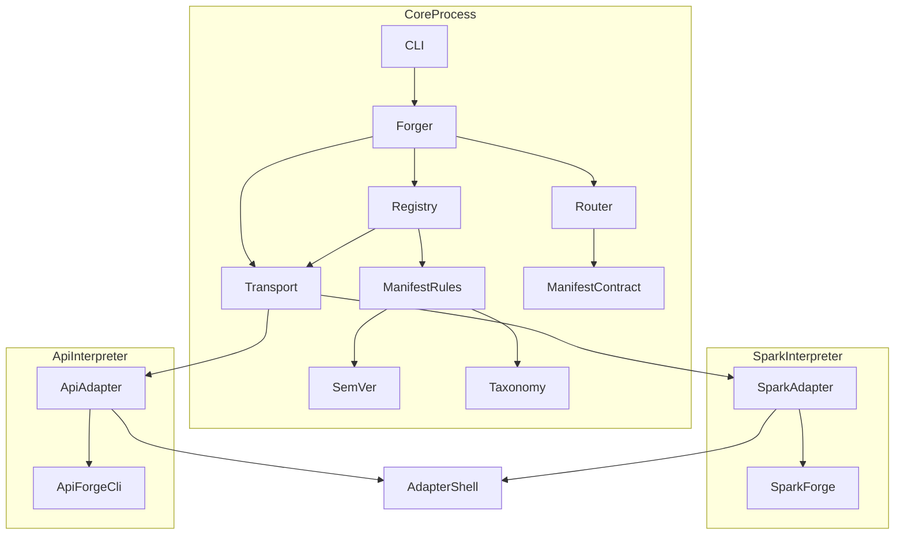
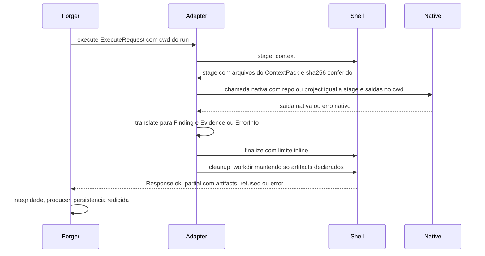
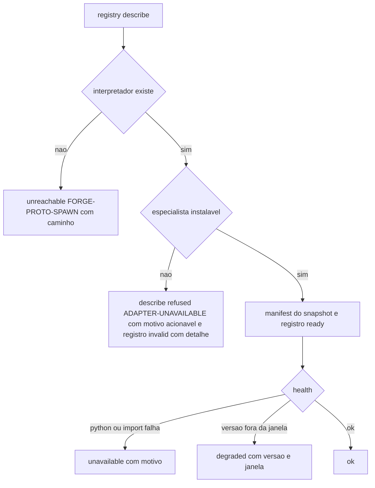

# Design Document — real-provider-integration (Wave B)

## Overview

**Purpose**: Esta spec faz The Forge descobrir, verificar e executar o Spark Forge e o API Forge **reais** via Forge Protocol v1, expondo por padrão só capabilities read-only e offline. Também separa a conformance em offline e de integração, torna versionamento e compatibilidade explícitos e testados e dá ao catálogo de capabilities uma taxonomia validada.

**Users**: usuários de dados e de APIs (delegação a especialistas reais), mantenedores (conformance, matriz de compatibilidade, CI de providers reais) e autores de providers (taxonomia, regra de versão).

**Impact**: dois adapters novos, distribuídos à parte do pacote `theforge` e instalados no interpretador de cada especialista. O core muda em pontos pequenos e aditivos: validação SemVer da versão do manifest, regras de taxonomia aplicadas junto dos limites de manifest, campos opcionais `aliases`/`deprecated`/`replaced_by` em `Capability`, notas de alias/depreciação/sobreposição no routing e detalhe acionável quando describe é recusado. O protocolo continua `forge/v1`; nenhum contrato de resultado muda.

### Goals
- describe/health/execute reais de Spark Forge e API Forge via protocolo, com resultados íntegros e rastreáveis aos IDs nativos (1.1–1.4, 2.1–2.4).
- Exposição padrão restrita a read-only/offline e nenhum arquivo nativo no workspace do usuário (1.5, 1.6, 2.5, 2.6).
- Saídas grandes viram resultado parcial com artifacts; ausência do especialista vira mensagem acionável (1.7, 1.8, 2.7, 2.8).
- Conformance offline no CI principal e de integração no workflow de providers reais, com contrato de ambiente documentado (3.x).
- Regras de versão, validação SemVer, janela de suporte e matriz de compatibilidade testada (4.x).
- Taxonomia de capabilities documentada e aplicada; aliases e depreciação determinísticos (5.x).

### Non-Goals
- Capabilities que exigem rede ou credenciais (`collect_*`, `integration.*`, `git.read-context`, `external.apply`) e capabilities que escrevem estado nativo persistente (`scan`, `case_*`, `code_*`, `change_*`, receipts). Não há opt-in nesta wave.
- Mudanças nos repositórios irmãos (decisão do ADR 0014; alvo futuro).
- Tiers de contexto, git, cache de fingerprints, revalidação TOCTOU no core, economy e telemetria (`context-intelligence-v2`).
- `ExecutionPlan`, handoff Spark → API, explain completo e taxonomia formal de códigos `FORGE-*` (`cross-forge-foundation`).
- Instalação automática de Forges especialistas.

## Boundary Commitments

### This Spec Owns
- Os dois adapters (`adapters/sparkforge`, `adapters/apiforge`): tradução entre Forge Protocol v1 e as superfícies públicas nativas, tabela de capabilities expostas, snapshot da superfície nativa, modo replay, janela de versão do especialista, mapeamento de erros e de evidência.
- Validação SemVer da versão de manifest e regras mecânicas de taxonomia no core, com os códigos `FORGE-MANIFEST-VERSION` e `FORGE-MANIFEST-TAXONOMY`.
- Campos opcionais `aliases`, `deprecated`, `replaced_by` de `Capability` e sua resolução/explicação no routing e na CLI `capabilities`.
- Detalhe acionável no registro quando describe é recusado.
- Conformance offline dos adapters, conformance de integração (`real_provider`), contrato de ambiente `THEFORGE_REAL_*`, matriz de compatibilidade e seu teste.
- Mudanças em `real-providers.yml` (dois interpretadores, contrato de ambiente, falha visível) e na instalação dos adapters em `ci.yml`/`compat.yml`.
- `docs/real-providers.md`, `docs/versioning.md`, `docs/capabilities.md`, ADR 0014 (local dos adapters) e ADR 0017 (taxonomia), e as seções de `docs/protocol.md`, `docs/provider-authoring.md`, `docs/architecture.md`, `docs/security.md` e `README.md` tocadas por estas mudanças.

### Out of Boundary
- Qualquer regra, análise ou conhecimento de domínio de Spark ou OpenAPI no core; o core não sabe que existem "Spark" ou "API".
- Routing interno, grafo de impacto, workspace e `next-step` do API Forge; journal, case e code index do Spark Forge.
- Seleção de contexto além de consumir o ContextPack existente; hash revalidado pelo provider como obrigação de protocolo, `ContextFile.sha256` e detecção de drift (são de `context-intelligence-v2`; o staging do adapter confere sha256 por conta própria, os adapters declaram `context_revalidation = "hash"` e seguem a regra de `Evidence.hash` do AdapterShell).
- Composição entre providers e reprodutibilidade.
- Sandbox de SO e enforcement de `operation_class` (ADR 0012 continua valendo).

### Allowed Dependencies
- Core: Python stdlib ≥ 3.11; nenhuma dependência de runtime nova. Direção de imports: a cadeia estendida pelas waves paralelas, `contracts.codes → contracts → errors/security/diagnostics → profiles → protocol → registry → routing/context → workspace → planning → policy → runs → explain → forger → cli` (`profiles` vem de `context-intelligence-v2`; `diagnostics`, `workspace`, `planning` e `explain` vêm de `cross-forge-foundation`). Esta spec não cria módulo nessa cadeia além de `contracts/semver.py` e `contracts/taxonomy.py`, que importam só `contracts`, e é independente de `profiles`, `diagnostics`, `workspace`, `planning` e `explain`: as mudanças em `registry`, `routing`, `forger` e `cli` não acrescentam import desses módulos, e a tabela de timeouts por perfil é copiada pelos adapters, não importada. A cadeia vale tanto antes quanto depois do merge daquelas waves.
- Adapters: Python stdlib ≥ 3.10; importam **apenas** o próprio pacote e, dentro do interpretador do especialista, as superfícies públicas `sparkforge` (`sparkforge.adapters.tools.call_tool` em execute, `sparkforge.adapters.tools.TOOLS` só no módulo `record`, `sparkforge.__version__` em health) e `apiforge` (CLI `apiforge.cli:app` em processo filho, `apiforge.__version__` em health, `apiforge.capabilities.registry.load_capabilities` só no módulo `record`). Nunca importam `theforge`. O core nunca importa adapters nem especialistas.
- Testes: os adapters instalados em modo editável no ambiente de desenvolvimento; especialistas reais só nos testes `real_provider`.
- CI: `actions/checkout` e `actions/setup-python` já fixados por SHA; segredo `SIBLING_REPOS_TOKEN` só no `with.token` dos checkouts dos irmãos.

### Revalidation Triggers
- Mudança em `Capability`/`ForgeManifest` (campos, invariantes), nas regras de taxonomia ou na regra SemVer: revalidar adapters, fixtures e `cross-forge-foundation` (consome as capabilities).
- Mudança na tabela de capabilities expostas de um adapter, no mapeamento de findings/evidence ou nos IDs de evidence: revalidar `cross-forge-foundation` (handoff usa esses IDs) e regenerar fixtures de replay.
- Nova versão de um Forge especialista fora da janela `SUPPORTED_SPECIALIST`: atualizar snapshot, janela e matriz de compatibilidade.
- Mudança no contrato de ambiente `THEFORGE_REAL_*` ou nos caminhos `siblings/*`: revalidar `real-providers.yml` e `docs/real-providers.md`.
- Mudança da raiz de `artifacts[].path` (cwd do execute): revalidar consumidores de artifacts (Wave D).
- Seam com `context-intelligence-v2`: aquela wave acrescenta campos opcionais v1 (`Capability.context`, `ForgeManifest.context_revalidation`, `ExecutionResult.context_request`, tiers do `ContextPack`), códigos `FORGE-CONTEXT-REQUEST-*` e o contrato `RunTelemetry`. Esta spec não os redefine: os adapters os tratam como ausentes/opcionais e ignoram tiers que não conhecem. As duas waves alteram `Capability` e regeneram `schemas/ForgeManifest.schema.json`; quem fizer merge por último regenera o schema e reexecuta a paridade. Exceção: os adapters já declaram `ForgeManifest.context_revalidation = "hash"` (ignorado por cores sem o campo); adoção dos demais campos (`Capability.context`, `context_request`, itens com `lines`) é revalidação futura. A tabela de timeouts de execute por perfil passa a ser de `context-intelligence-v2` (`theforge/profiles.py`): o AdapterShell copia os valores vigentes (60/180/600 s) e qualquer mudança nessa tabela exige atualizar o teto de 85% dos adapters.
- Seam de evidência e revalidação com `context-intelligence-v2`: aquela wave trata `Evidence.hash` não nulo diferente de `ContextFile.sha256` do item de mesmo `location.path` como drift reportado pelo provider (rebaixa a evidência e força `partial`), e registra `undeclared` quando o manifest não declara `context_revalidation`. Os adapters seguem a regra de `Evidence.hash` desta spec (ver AdapterShell) e declaram `context_revalidation = "hash"`. Revalidar adapters, a regra de hash e os testes 6.3 e 7.2 quando mudar: a semântica de `ContextFile.sha256` (arquivo inteiro × intervalo `lines`), a regra de correspondência evidência ↔ item, os valores de `RevalidationStrategy` ou a obrigação de revalidação de `docs/protocol.md`. Adoção de itens com `lines` (excerpt/requested) pelo staging também é revalidação desta seam.
- Seam com `cross-forge-foundation` (tarefa de prova): aquela wave decompõe "Projete um pipeline Spark que produza dados para uma API" sobre `tests/fixtures/workspaces/cross/` (fixture dela) esperando exatamente uma melhor capability por provider: `spark-forge/pyspark.static-analysis` e `api-forge/api.analyze`. O teste 6.4 desta spec é a checagem do lado B dessa seam: mudança nos sinais, na tabela de capabilities expostas, no texto da tarefa de prova, no workspace `cross` ou em `MIN_SIGNAL_TYPES` exige reexecutá-lo; falha corrige-se no catálogo dos adapters, nunca com regra de domínio no core.
- Códigos `FORGE-*`: `docs/errors.md`, `CODE_FAMILIES` e `tests/golden/forge_codes.json` são de `cross-forge-foundation` e passam a ser a lista canônica testada. Os códigos desta spec (`FORGE-MANIFEST-VERSION`, `FORGE-MANIFEST-TAXONOMY`) entram nessa lista por quem fizer merge por último; `docs/protocol.md` pode manter tabela curta, sempre com link para `docs/errors.md`.
- Versão de The Forge: `test_compat_matrix.py` exige em `docs/versioning.md` uma linha para o `theforge.__version__` atual. Regra: toda wave que altera `theforge.__version__` acrescenta a linha correspondente na matriz no mesmo commit (gatilho de revalidação para `context-intelligence-v2`, `cross-forge-foundation` e waves seguintes).
- Numeração de ADR congelada: 0014 (local dos adapters) e 0017 (taxonomia) são desta spec; 0015 e 0016 de `context-intelligence-v2`; 0018 e 0019 de `cross-forge-foundation`; 0020 de `agentic-maintainability`. Nenhum número é renumerado nem substituído pelo "próximo livre".

## Architecture

### Existing Architecture Analysis
- O core já entrega o que os adapters precisam: cwd controlado (temporário em describe/health, `.forge/runs/<id>/work` em execute), ambiente mínimo sem credenciais, integridade de resultado, verificação de `producer`, limites de manifest aplicados em um ponto (`Registry._apply_limits`), policy por `operation_class`.
- Fixtures (`fixture-spark`, `fixture-api`) continuam como providers de teste do core; os adapters não as substituem.
- `real-providers.yml` já faz checkout dos irmãos em `siblings/` e roda `pytest -m real_provider`; falta interpretador 3.12, instalação e contrato de ambiente.

### Architecture Pattern & Boundary Map



**Architecture Integration**:
- Selected pattern: ports and adapters através do processo. O Forge Protocol é a porta; cada adapter é um processo no interpretador do especialista (ADR 0001, ADR 0014).
- Boundaries: o core só vê `argv` e envelopes; o conhecimento de cada superfície nativa vive na tabela de mapeamento do adapter correspondente.
- Existing patterns preserved: regras de manifest aplicadas no registry com exclusão por capability e aviso; códigos só em `contracts/codes.py`; tudo persistido pelo `RunStore` (redação); markers por arquivo de teste.
- New components rationale: `SemVer` e `Taxonomy` (4.4, 5.2) são funções puras ao lado de `validate_manifest_limits`; `AdapterShell` evita duplicar o envelope nos dois adapters.

### Technology Stack

| Layer | Choice / Version | Role in Feature | Notes |
|-------|------------------|-----------------|-------|
| Core | Python ≥ 3.11 stdlib | semver, taxonomia, aliases, notas de routing | sem dependência nova |
| Adapters | Python ≥ 3.10 stdlib, hatchling | providers Forge Protocol v1 | distribuições `theforge-sparkforge-adapter` 0.1.0 e `theforge-apiforge-adapter` 0.1.0 |
| Especialistas | `sparkforge-aws` 0.5.x (Python ≥ 3.10); `apiforge` 0.1.x (Python 3.12) | superfície nativa | instalados por quem usa; nunca no ambiente do core |
| Testes | pytest (marker `real_provider`), PyYAML (já em dev) | conformance offline e de integração | |
| CI | GitHub Actions, `setup-python` 3.11 e 3.12 | workflow de providers reais | gatilhos inalterados |

## File Structure Plan

### Directory Structure
```
adapters/
├── sparkforge/
│   ├── pyproject.toml                 # theforge-sparkforge-adapter 0.1.0, requires-python >=3.10, dependencies = []
│   ├── README.md                      # instalação no interpretador do Spark Forge e registro
│   └── src/theforge_sparkforge/
│       ├── __init__.py                # PROVIDER_ID, VERSION, SUPPORTED_SPECIALIST
│       ├── __main__.py                # entrada: serve(...) com handlers describe/health/execute
│       ├── _shell.py                  # AdapterShell (cópia idêntica à do apiforge)
│       ├── catalog.py                 # tabela capability → ações → tools, sinais, bindings, exclusões
│       ├── native_catalog.json        # snapshot gravado de TOOLS (nome, anotações, required) + versão de origem
│       ├── backend.py                 # LiveBackend (call_tool) e ReplayBackend (--replay)
│       ├── translate.py               # facts/findings nativos → Evidence/Finding; erro nativo → ErrorInfo
│       └── record.py                  # regrava native_catalog.json a partir do Spark Forge instalado
└── apiforge/
    ├── pyproject.toml                 # theforge-apiforge-adapter 0.1.0, requires-python >=3.10, dependencies = []
    ├── README.md
    └── src/theforge_apiforge/
        ├── __init__.py                # PROVIDER_ID, VERSION, SUPPORTED_SPECIALIST, REQUIRED_PYTHON
        ├── __main__.py
        ├── _shell.py                  # cópia idêntica
        ├── catalog.py                 # VERB_MAP capability → verbo/entradas/ações/sinais; motivos de exclusão
        ├── native_matrix.json         # snapshot gravado da matriz pública + versão de origem
        ├── backend.py                 # LiveBackend (CLI apiforge em processo filho) e ReplayBackend
        ├── translate.py               # case findings/facts → Finding/Evidence; linha AF-* → ErrorInfo
        └── record.py                  # regrava native_matrix.json a partir do API Forge instalado
src/theforge/contracts/
├── semver.py                          # SemVer 2.0.0: parse_semver
└── taxonomy.py                        # validate_taxonomy → Violation(FORGE-MANIFEST-TAXONOMY)
tests/
├── real_providers.py                  # contrato de ambiente THEFORGE_REAL_*: skip/fail com motivo, argv
├── test_manifest_rules.py             # semver, taxonomia, aliases/depreciação no contrato e no registry
├── test_adapter_shell.py              # shell comum: envelope, staging, spill, processo nativo, cópias idênticas, piso 3.10
├── test_adapter_sparkforge.py         # adapter Spark em replay
├── test_adapter_apiforge.py           # adapter API em replay
├── test_adapters_core.py              # adapters em replay vistos pelo core (registry, Forger, receipt, sem drift, tarefa de prova)
├── test_real_providers_env.py         # contrato de ambiente THEFORGE_REAL_* (unit)
├── test_capability_catalog_doc.py     # catálogo de docs/capabilities.md × describe em replay
├── test_real_providers.py             # conformance de integração (marker real_provider)
├── test_compat_matrix.py              # matriz de compatibilidade × versões reais do código
└── fixtures/
    ├── native/sparkforge/             # saídas nativas gravadas (health, tools por ação, erros, saída grande)
    ├── native/apiforge/               # saídas nativas gravadas (doctor, casos, linhas AF-*)
    └── workspaces/{spark,api}/        # workspaces pequenos de exemplo (job PySpark + requirements pyspark; OpenAPI + app FastAPI + requirements fastapi; bundle)
docs/
├── real-providers.md                  # instalar/registrar adapters; contrato de ambiente; troubleshooting
├── versioning.md                      # regras de versão + matriz de compatibilidade (fonte única)
├── capabilities.md                    # taxonomia + catálogo inicial com origem nativa de cada capability
└── adr/
    ├── 0014-provider-adapter-location.md
    └── 0017-capability-taxonomy.md
```

### Modified Files
- `src/theforge/contracts/manifest.py` — `Capability.aliases/deprecated/replaced_by`; invariantes de alias em `ForgeManifest.__post_init__`; `ForgeManifest.resolve`.
- `src/theforge/contracts/codes.py` — `MANIFEST_VERSION`, `MANIFEST_TAXONOMY`.
- `src/theforge/registry/registry.py` — checagem SemVer; `_apply_limits` → `_apply_manifest_rules` (limites + taxonomia); detalhe do erro de describe recusado.
- `src/theforge/routing/router.py` — resolução de alias no caminho explícito; notas `capability-alias`, `capability-deprecated`, `capability-overlap`.
- `src/theforge/forger/orchestrator.py` — `_unexecutable_request` usa `ForgeManifest.resolve`.
- `src/theforge/cli/commands.py`, `src/theforge/cli/render.py` — colunas e avisos de alias/depreciação/sobreposição em `capabilities list|search`.
- `schemas/ForgeManifest.schema.json` — regenerado (`python -m theforge.contracts.schema schemas`).
- `tests/test_conformance.py` — `PROVIDER_ARGVS` com os dois adapters em replay.
- `tests/test_router.py`, `tests/test_registry.py`, `tests/test_cli.py`, `tests/test_schemas.py` — casos de alias, depreciação, sobreposição, versão e taxonomia.
- `tests/test_ci_workflows.py` — novas propriedades dos workflows.
- `tests/conftest.py` — `FILE_MARKERS` para os arquivos novos (`test_manifest_rules.py`: unit, contract; `test_adapter_shell.py`, `test_adapter_sparkforge.py`, `test_adapter_apiforge.py`: integration, contract; `test_adapters_core.py`: integration; `test_real_providers_env.py`: unit; `test_capability_catalog_doc.py`: unit; `test_real_providers.py`: real_provider, integration; `test_compat_matrix.py`: unit).
- `pyproject.toml` — `mypy.files` inclui `adapters/sparkforge/src` e `adapters/apiforge/src`; override `ignore_missing_imports` para `sparkforge.*` e `apiforge.*`. Cada `adapters/*/pyproject.toml` declara `[tool.ruff] extend = "../../pyproject.toml"` com `target-version = "py310"`, para o lint barrar sintaxe acima do piso do Spark Forge.
- `.github/workflows/ci.yml`, `.github/workflows/compat.yml` — instalação editável dos adapters.
- `.github/workflows/real-providers.yml` — dois interpretadores, venvs por especialista, contrato de ambiente, sem `continue-on-error` e sem tolerância a seleção vazia.
- `docs/protocol.md`, `docs/provider-authoring.md`, `docs/architecture.md`, `docs/security.md`, `README.md` — códigos novos, SemVer, taxonomia, aliases, raiz de `artifacts[].path`, adapters reais e contenção.

## System Flows

### Execute de uma capability real



- A policy decide antes de iniciar o adapter; capabilities expostas são todas `read_only` com `requires_network = false`, então a regra padrão é `allow`.
- Erros nativos nunca viram falha de transporte: o adapter sempre sai com exit 0 e um envelope.
- Arquivos com hash divergente do ContextPack não são copiados para `stage/`; o resultado registra a limitação.
- Antes de responder, em todo desfecho (inclusive `refused`, `error` e timeout), o adapter apaga `stage/` e as saídas nativas que não são artifacts declarados; no cwd do run sobram só os paths de `artifacts[]`.

### Disponibilidade do especialista



- Registros `invalid` e `unreachable` não são cacheados (ADR 0009), então instalar o especialista depois resolve sem limpar cache.

## Requirements Traceability

| Requirement | Summary | Components | Interfaces | Flows |
|-------------|---------|------------|------------|-------|
| 1.1 | manifest do Spark derivado da superfície real | SparkForgeAdapter, NativeSnapshot | `describe`, `catalog.CAPABILITIES` | — |
| 1.2 | health Spark sem rede/credenciais | SparkForgeAdapter | `health` | Disponibilidade |
| 1.3 | resultado rastreável a findings nativos | SparkForgeAdapter, Translate, AdapterShell | `translate_spark`, `evidence_hash` | Execute |
| 1.4 | erro nativo → resposta estruturada | SparkForgeAdapter, AdapterShell | `spark_error`, `serve` | Execute |
| 1.5 | só read-only/offline expostos | SparkForgeAdapter | `catalog.eligible` | — |
| 1.6 | estado nativo fora do workspace | AdapterShell, SparkForgeAdapter | `stage_context`, cwd, `cleanup_workdir` | Execute |
| 1.7 | saída grande → parcial + artifacts | AdapterShell | `finalize` | Execute |
| 1.8 | ausente → mensagem acionável | SparkForgeAdapter, Registry | describe `refused`, `record.error` | Disponibilidade |
| 1.9 | sem domínio Spark no core | Boundary, SparkForgeAdapter | — | — |
| 2.1 | manifest do API derivado da matriz | ApiForgeAdapter, NativeSnapshot | `describe`, `VERB_MAP` | — |
| 2.2 | health API sem rede/credenciais | ApiForgeAdapter | `health` | Disponibilidade |
| 2.3 | evidência referencia evidência nativa | ApiForgeAdapter, Translate, AdapterShell | `translate_case`, `evidence_hash` | Execute |
| 2.4 | `AF-*` preservado | ApiForgeAdapter | `af_error` | Execute |
| 2.5 | só supported/heuristic + read_only | ApiForgeAdapter | `catalog.eligible` | — |
| 2.6 | arquivos auxiliares fora do workspace | AdapterShell, ApiForgeAdapter | `stage_context`, `APIFORGE_CACHE=off`, cwd, `cleanup_workdir` | Execute |
| 2.7 | interpretador indisponível → motivo | ApiForgeAdapter, Registry | `health`, describe `refused` | Disponibilidade |
| 2.8 | saída grande → parcial + artifacts | AdapterShell | `finalize` | Execute |
| 2.9 | sem duplicar conceitos do API Forge | Boundary, ApiForgeAdapter | — | — |
| 3.1 | conformance offline | OfflineConformance, ReplayBackend | `--replay` | — |
| 3.2 | conformance de integração separada | IntegrationConformance | marker `real_provider` | — |
| 3.3 | contrato de ambiente documentado | RealProviderEnv, Docs | `THEFORGE_REAL_*` | — |
| 3.4 | skip com motivo | RealProviderEnv | `require_forge` | — |
| 3.5 | modo obrigatório falha | RealProviderEnv | `THEFORGE_REAL_PROVIDERS_REQUIRED` | — |
| 3.6 | cobertura describe/health/execute/ausência/skew | IntegrationConformance | casos por Forge | Disponibilidade |
| 3.7 | workflow real visível, não bloqueante | CIWorkflows | `real-providers.yml` | — |
| 4.1 | regras de versão documentadas | Docs | `docs/versioning.md` | — |
| 4.2 | matriz com janela | Docs, CompatMatrix | tabela em `docs/versioning.md` | — |
| 4.3 | matriz testada | CompatMatrix | `test_compat_matrix.py` | — |
| 4.4 | versão não SemVer → invalid | SemVer, Registry | `parse_semver`, `_describe` | — |
| 4.5 | especialista fora da janela → degraded | SparkForgeAdapter, ApiForgeAdapter | `health`, `SUPPORTED_SPECIALIST` | Disponibilidade |
| 4.6 | ADR local dos adapters | Docs | ADR 0014 | — |
| 5.1 | regras de taxonomia documentadas | Docs, Taxonomy | `docs/capabilities.md` | — |
| 5.2 | violação → capability rejeitada | Taxonomy, Registry | `validate_taxonomy`, `_apply_manifest_rules` | — |
| 5.3 | catálogo inicial da auditoria real | SparkForgeAdapter, ApiForgeAdapter, Docs, OfflineConformance | `catalog.py`, `docs/capabilities.md`, drift test, tarefa de prova roteada em replay | — |
| 5.4 | sobreposição explicada | Router, CapabilitiesCLI | nota `capability-overlap` | — |
| 5.5 | alias/depreciação determinísticos | ManifestContract, Router, CapabilitiesCLI | `ForgeManifest.resolve`, notas | — |
| 5.6 | colisão de alias → invalid | ManifestContract | `ForgeManifest.__post_init__` | — |
| 5.7 | ADR de taxonomia | Docs | ADR 0017 | — |

## Components and Interfaces

| Component | Domain/Layer | Intent | Req Coverage | Key Dependencies | Contracts |
|-----------|--------------|--------|--------------|------------------|-----------|
| SemVer | core contracts | gramática SemVer 2.0.0 | 4.4 | — | Service |
| Taxonomy | core contracts | regras mecânicas de taxonomia | 5.1, 5.2 | manifest (P0) | Service |
| ManifestContract | core contracts | aliases/depreciação em `Capability` | 5.5, 5.6 | base (P0) | State |
| Codes | core contracts | `FORGE-MANIFEST-VERSION/TAXONOMY` | 4.4, 5.2 | — | State |
| Registry | core registry | versão + taxonomia + detalhe de describe recusado | 1.8, 2.7, 4.4, 5.2, 5.6 | SemVer, Taxonomy (P0) | Service |
| Router | core routing | alias, depreciação, sobreposição | 5.4, 5.5 | ManifestContract (P0) | Service |
| CapabilitiesCLI | core cli | listagem com alias/depreciação/sobreposição | 5.4, 5.5 | Registry (P1) | Service |
| AdapterShell | adapters | envelope, staging, regra de `Evidence.hash`, spill, limpeza do cwd, processo nativo | 1.3, 1.4, 1.6, 1.7, 2.3, 2.4, 2.6, 2.8 | stdlib (P0) | Service |
| SparkForgeAdapter | adapters | provider do Spark Forge | 1.1–1.9, 4.5, 5.3 | `sparkforge` (External P0) | Service |
| ApiForgeAdapter | adapters | provider do API Forge | 2.1–2.9, 4.5, 5.3 | `apiforge` CLI (External P0) | Service |
| NativeSnapshot | adapters | superfície nativa gravada + `record` | 1.1, 2.1, 5.3 | especialista (External P1) | Batch |
| RealProviderEnv | tests | contrato de ambiente | 3.3, 3.4, 3.5 | pytest (P0) | State |
| OfflineConformance | tests | conformance em replay, sem drift, tarefa de prova | 1.3, 2.3, 3.1, 5.3 | adapters (P0) | — |
| IntegrationConformance | tests | conformance contra Forges reais | 3.2, 3.6, 1.x, 2.x, 4.5, 5.3 | RealProviderEnv (P0) | — |
| CompatMatrix | tests/docs | matriz testada | 4.2, 4.3 | docs/versioning.md (P0) | — |
| CIWorkflows | infra | instalação dos adapters e workflow real | 3.1, 3.7 | GitHub Actions (External P0) | Batch |
| Docs | docs | versionamento, taxonomia, providers reais, ADRs | 3.3, 4.1, 4.2, 4.6, 5.1, 5.3, 5.7 | — | — |

### Core (`src/theforge`)

#### SemVer

| Field | Detail |
|-------|--------|
| Intent | Validar `ForgeManifest.version` segundo SemVer 2.0.0 |
| Requirements | 4.4 |

**Responsibilities & Constraints**
- Função pura em `contracts/semver.py`. Aceita exatamente a gramática SemVer 2.0.0: `MAJOR.MINOR.PATCH`, pré-release e build opcionais, sem zeros à esquerda em identificadores numéricos, sem `v` inicial, ASCII apenas.
- Não compara versões no core: janela de especialista é responsabilidade do adapter (4.5).

**Contracts**: Service [x]

##### Service Interface
```python
@dataclass(frozen=True, kw_only=True)
class SemVer:
    major: int
    minor: int
    patch: int
    prerelease: tuple[str, ...] = ()
    build: tuple[str, ...] = ()


def parse_semver(text: object) -> SemVer | None: ...  # None = malformada; nunca lança
```

#### Taxonomy

| Field | Detail |
|-------|--------|
| Intent | Regras verificáveis da taxonomia de capabilities |
| Requirements | 5.1, 5.2 |

**Responsibilities & Constraints**
- Função pura em `contracts/taxonomy.py`, no estilo de `validate_manifest_limits`: devolve violações com código `FORGE-MANIFEST-TAXONOMY` e `field` iniciando em `capabilities[i]`, para o Registry excluir só a capability violadora.

| Regra | Valor |
|---|---|
| Segmentos do ID | 2 ou 3: `namespace.subject[.qualifier]` |
| Tamanho | segmento 1–32 caracteres; ID ≤ 64 |
| Namespaces reservados | `forge`, `theforge` |
| Segmentos genéricos proibidos (qualquer posição) | `all`, `any`, `misc`, `general`, `generic`, `default`, `other`, `stuff`, `tool`, `tools`, `util`, `utils` |
| Ação | `^[a-z][a-z0-9-]{0,31}$` |
| Alias | mesmas regras do ID |
| `replaced_by` | formato de ID (pode apontar para outro provider) |

- As regras não mecânicas (granularidade, escolha de namespace, sobreposição intencional, versionamento por nova capability) ficam em `docs/capabilities.md` e no ADR 0017.

**Contracts**: Service [x]

##### Service Interface
```python
def validate_taxonomy(manifest: ForgeManifest) -> tuple[Violation, ...]: ...
```
- Ordem determinística: por capability, na ordem declarada: ID, aliases, ações, `replaced_by`.

#### ManifestContract (mudança aditiva em `ForgeManifest` v1)

| Field | Detail |
|-------|--------|
| Intent | Declarar aliases e depreciação de capability |
| Requirements | 5.5, 5.6 |

```python
@dataclass(frozen=True, kw_only=True)
class Capability:
    ...  # campos existentes inalterados
    aliases: list[str] = field(default_factory=list)
    deprecated: bool = False
    replaced_by: str | None = None


class ForgeManifest:
    def resolve(self, name: str) -> tuple[Capability, bool] | None: ...

    # (capability, via_alias): ID canônico primeiro, depois alias; None se nenhum
```
- Invariantes novas em `ForgeManifest.__post_init__`: alias único no manifest e diferente de todo ID de capability do manifest; `replaced_by` diferente do próprio ID. Violação → `ContractError` → provider `invalid` (5.6), como IDs duplicados.
- Campos opcionais com default: providers existentes continuam válidos; cores antigos ignoram os campos. `schemas/ForgeManifest.schema.json` é regenerado.

#### Codes (aditivo)

```python
class Codes:
    MANIFEST_VERSION: Final = "FORGE-MANIFEST-VERSION"  # versão fora de SemVer: provider invalid
    MANIFEST_TAXONOMY: Final = (
        "FORGE-MANIFEST-TAXONOMY"  # capability fora da taxonomia: aviso, excluída
    )
```
- Valores nunca mudam depois de publicados. Lista canônica testada: `docs/errors.md` (com `CODE_FAMILIES` e o golden de `cross-forge-foundation`; se aquela wave já estiver em `main`, os dois códigos entram nos três no mesmo commit, família `registry`, como aquela spec já mapeia `MANIFEST_*`); `docs/protocol.md` mantém tabela curta com link para `docs/errors.md`.

#### Registry (modificado)

| Field | Detail |
|-------|--------|
| Intent | Aplicar versão e taxonomia no ponto em que já aplica limites; erro acionável de describe |
| Requirements | 1.8, 2.7, 4.4, 5.2, 5.6 |

**Responsibilities & Constraints**
- Em `_describe`, depois da checagem de `producer`: `parse_semver(manifest.version) is None` → `state="invalid"`, `error="FORGE-MANIFEST-VERSION: version '<v>' is not SemVer 2.0.0 (MAJOR.MINOR.PATCH)"` (valor truncado em 64 caracteres).
- `_apply_limits` vira `_apply_manifest_rules`: concatena `validate_manifest_limits` e `validate_taxonomy`; cada capability violadora é excluída com aviso `<id>: capability '<cap>' excluded (<código>: <detalhe>)`; nenhuma restante → `invalid`. A semântica atual de `FORGE-MANIFEST-LIMITS` não muda.
- Describe com status ≠ ok: `error = "describe <status> <code>: <detail>"`, com `detail` redigido (`security.redact_text`) e truncado em 500 caracteres.

**Implementation Notes**
- Integration: o cache guarda o manifest já filtrado; nenhuma migração (ADR 0009: divergência de hash descreve de novo).
- Risks: providers de terceiros com versões `1.0`/`v1.2.3` deixam de rotear. Mitigação: mensagem acionável e nota de migração em `docs/provider-authoring.md`.

#### Router (modificado)

| Field | Detail |
|-------|--------|
| Intent | Resolver aliases, avisar depreciação e explicar sobreposição |
| Requirements | 5.4, 5.5 |

**Responsibilities & Constraints**
- Caminho explícito (`--capability X`): primeiro os providers roteáveis que declaram `X` como ID canônico; só se nenhum o fizer, os que o declaram como alias. Dentro do grupo, o desempate atual (trust, depois id). `Selection.capability` é sempre o ID canônico; `TaskSpec.requested_capability` mantém o que foi pedido.
- Notas novas em `RoutingDecision.limitations` (ordenadas, texto estável):
  - `capability-alias: 'X' resolved to '<canônico>' (<provider>)`
  - `capability-deprecated: '<id>' (<provider>) is deprecated; replaced_by '<id>'` ou `…; no replacement declared`
  - `capability-overlap: '<id>' declared by <a>, <b>; tie-break trust then id` (explícito) e `capability-overlap: '<id>' declared by <a>, <b>` (sinais, quando mais de um provider pontua a mesma capability)
- Nenhum peso novo: alias e depreciação não mudam ranking nem confiança.

**Contracts**: Service [x] (assinatura de `route` inalterada)

**Implementation Notes**
- Integration: `Forger._unexecutable_request` usa `ForgeManifest.resolve`, para que um alias declarado sem `execute` gere `FORGE-PROTO-OP-UNSUPPORTED` como o ID canônico.

#### CapabilitiesCLI (modificado)

| Field | Detail |
|-------|--------|
| Intent | Mostrar aliases, depreciação e sobreposição na listagem |
| Requirements | 5.4, 5.5 |

- `theforge capabilities list|search` (texto e `--json`) ganham `aliases`, `deprecated`, `replaced_by` e `declared_by` (providers que declaram o mesmo ID). Capability depreciada gera `theforge: warning: capability '<id>' (<provider>) is deprecated; replaced_by '<id>'` em stderr. `search` também casa por alias.

### Adapters (`adapters/`)

#### AdapterShell

| Field | Detail |
|-------|--------|
| Intent | Envelope Forge Protocol v1 e mecânica comum aos dois adapters |
| Requirements | 1.3, 1.4, 1.6, 1.7, 2.3, 2.4, 2.6, 2.8 |

**Responsibilities & Constraints**
- `_shell.py`, stdlib-only, compatível com Python 3.10, copiado byte a byte nos dois adapters (um teste garante igualdade). Não importa `theforge`.
- `serve`: lê `argv[-1]` como op e flags do adapter antes dela (`--replay <dir>`, `--assume-specialist-version <v>`); lê o request do stdin; sempre exit 0 com `Response` (`protocol: forge/v1`, `kind: Response`, `op` ecoado, `request_id` ecoado, `producer` = id registrado + `VERSION`). Op desconhecida → `refused` (`ADAPTER-OP-UNSUPPORTED`); `protocol ≠ forge/v1` fora de describe → `refused` (`ADAPTER-PROTOCOL-UNSUPPORTED`); JSON inválido → `error` (`ADAPTER-REQUEST-INVALID`); capability ou ação não declarada → `refused` (`ADAPTER-CAPABILITY-UNSUPPORTED`, `ADAPTER-ACTION-UNSUPPORTED`); exceção não prevista → `error` (`ADAPTER-INTERNAL`, só o tipo da exceção, sem traceback).
- `stage_context`: copia para `<cwd>/stage/` só os arquivos do `ContextPack`; cada caminho é relativo, contido em `workspace_root` após `resolve` (symlink para fora é recusado) e com sha256 igual ao do pack. Arquivo ausente, fora da raiz ou divergente não é copiado e vira limitação (`context file '<p>' skipped: <motivo>`). Item com `lines` (excerpt/requested de `context-intelligence-v2`, cujo `sha256` é do intervalo) não é copiado nesta wave e vira a limitação `context file '<p>' skipped: line-range items not supported by this adapter`, em vez de ser comparado com o hash do arquivo inteiro e reportado como divergente. `StagedInput` guarda, por arquivo copiado, o sha256 conferido.
- Regra de `Evidence.hash` (vale para os dois adapters): quando não nulo, é o sha256 (hex minúsculo) exatamente do conteúdo em `location.path` que o `ContextFile` correspondente cobre: o arquivo inteiro para itens sem `lines`; o intervalo `lines` para itens excerpt/requested (não copiados nesta wave). Como o adapter só entrega ao especialista cópias conferidas, o valor válido é o sha256 registrado em `StagedInput` para aquele arquivo. Hash nativo (Spark `provenance.artifact_sha256`, API `source.sha256`) só é copiado quando, naquela evidência, é igual a esse sha256 conferido; caso contrário, ou quando `location.path` não é um arquivo copiado para `stage/`, `Evidence.hash = null`. Nunca há hash de outro conteúdo (texto normalizado, payload parseado, artefato diferente de `location.path`). Consequência: `Evidence.hash` nunca diverge de `ContextFile.sha256` para o mesmo path, e o adapter não gera drift reportado falso em `context-intelligence-v2`.
- `cleanup_workdir`: chamado por `serve` depois de `finalize` em todo desfecho de execute (`ok`, `partial`, `refused`, `error`, timeout; em `finally`). Apaga `<cwd>/stage/` (cópias do conteúdo do ContextPack, inclusive o `.sparkforge/` nativo criado sob `repo`) e todo arquivo ou diretório do cwd que não é path de `artifacts[]` da resposta (ex.: `traces.db`, `.apiforge/`, saídas nativas já traduzidas). Mantém só os artifacts declarados (`native/full-output.json` do spill, arquivos de caso do API Forge), cujo sha256 já foi calculado. Falha de remoção vira limitação `workdir cleanup incomplete: <path>`, nunca erro do execute. Não atua em describe/health (o core já apaga o diretório temporário).
- Entrada exigida ausente (pack vazio ou nenhum arquivo casa com o que a ação precisa): o adapter não chama o especialista e devolve `partial` sem findings, com a limitação `no input: expected <globs>` e `unknowns: ["input:<nome>"]`. Não é recusa: o provider funcionou e não havia o que analisar (comportamento exigido pela conformance existente, que executa toda capability com contexto vazio).
- `finalize`: monta o `ExecutionResult` (`schema`, `producer`, `created_at` UTC). Se o JSON passar de `INLINE_LIMIT = 4 MiB`, mantém findings em ordem nativa até caber, junto da evidence que eles referenciam, grava a saída nativa completa em `<cwd>/native/full-output.json`, adiciona o artifact (path relativo ao cwd do execute, sha256 minúsculo), status `partial` e a limitação `output truncated: <n> of <m> findings inline; full native output in artifact native/full-output.json`.
- `run_native`: subprocesso com `shell=False`, `cwd` dado, ambiente recebido do core + ajustes explícitos do adapter (nunca credenciais), stdout/stderr com teto, timeout = 85% do timeout de execute do perfil (`economy` 60 s, `balanced` 180 s, `max` 600 s, lidos de `task.budget_profile`). Timeout → `error` `ADAPTER-NATIVE-TIMEOUT`.

**Contracts**: Service [x]

##### Service Interface
```python
OpHandler = Callable[["Request", Path], "Reply"]  # request validado, cwd


@dataclass(frozen=True)
class AdapterOptions:
    replay: Path | None
    assume_specialist_version: str | None


def serve(
    *, provider_id: str, version: str, handlers: Mapping[str, Callable[[AdapterOptions], OpHandler]]
) -> int: ...
def stage_context(
    payload: Mapping[str, object], cwd: Path
) -> StagedInput: ...  # files, root, limitations
def finalize(result: ResultDraft, cwd: Path) -> Reply: ...
def evidence_hash(
    path: str | None, native_hash: object, stage: StagedInput
) -> str | None: ...  # regra de Evidence.hash
def cleanup_workdir(
    cwd: Path, keep: Collection[str]
) -> tuple[str, ...]: ...  # keep = paths de artifacts[]; devolve limitações
def run_native(
    argv: Sequence[str], *, cwd: Path, env: Mapping[str, str], timeout: float
) -> NativeOutcome: ...
def refuse(
    code: str, detail: str, *, field: str | None = None, unlock: str | None = None
) -> Reply: ...
```
- Postconditions: toda resposta tem `producer` igual ao manifest; todo resultado passa nas regras de integridade do core (IDs únicos, referências resolvidas, paths de artifact relativos POSIX, hashes minúsculos, `created_at` UTC); todo `Evidence.hash` não nulo é igual ao sha256 conferido do arquivo em `location.path`; depois de um execute, o cwd contém só os paths de `artifacts[]`.
- Os dois manifests declaram `context_revalidation = "hash"` (campo opcional de `context-intelligence-v2`): o adapter confere o sha256 de cada arquivo ao copiar para `stage/`, e o especialista lê só essa cópia, dentro do cwd do run. Cores sem o campo o ignoram (forward-compat de `forge/v1`), então a declaração não depende da ordem de merge; com ela, runs reais não carregam a limitação `undeclared`.

#### SparkForgeAdapter

| Field | Detail |
|-------|--------|
| Intent | Provider Forge Protocol v1 do Spark Forge real |
| Requirements | 1.1–1.9, 4.5, 5.3 |

**Responsibilities & Constraints**
- Registro: id `spark-forge`, `argv = ["<python do Spark Forge>", "-m", "theforge_sparkforge"]`, trust do usuário (`trusted` ou `local`). `SUPPORTED_SPECIALIST = ">=0.5.0,<0.6.0"`.
- `describe` (sem importar `sparkforge.adapters.tools`, que custa ~6 s): verifica `importlib.util.find_spec("sparkforge")`; ausente → `refused` `SPARKFORGE-ADAPTER-UNAVAILABLE` com detalhe acionável (`sparkforge is not importable with <sys.executable> (Python <x.y>); install sparkforge-aws >=0.5,<0.6 in this interpreter`). Caso contrário, deriva o manifest de `catalog.CAPABILITIES` × `native_catalog.json`: uma ação só é declarada se a tool existe no snapshot com `readOnlyHint = true`, `openWorldHint = false` e argumentos obrigatórios que o binding sabe preencher. Capability sem ações elegíveis não é declarada. `operation_class = read_only`, `state = supported`, `execution = {local, offline, requires_network: false}`, `domains = ["data-engineering"]`. `limitations` lista os grupos não expostos com motivo.
- Catálogo inicial (`catalog.py`; origem: auditoria de 2026-10-03; ação = nome da tool sem `sparkforge_`/`analyze_`, `_` → `-`):

| Capability | Tools nativas (ações) |
|---|---|
| `pyspark.static-analysis` | analyze_pyspark, analyze_call_graph, analyze_graph |
| `spark.runtime-analysis` | analyze_event_log, analyze_sql_metrics, analyze_plan |
| `streaming.analysis` | analyze_streaming, _transport, _flink, _cdc, _schema_registry, _event_driven, _streaming_ops, _streaming_integrations, _streaming_composition, _glue_streaming |
| `glue.analysis` | analyze_glue_job_runs, analyze_catalog_schema, analyze_glue_resource_link, glue_dependency_audit |
| `emr.analysis` | analyze_emr_cluster, analyze_emr_serverless, analyze_emr_eks |
| `athena.analysis` | analyze_sql, analyze_athena_workgroup |
| `iceberg.analysis` | analyze_iceberg, iceberg_assess_upgrade |
| `parquet.footer-analysis` | analyze_parquet_footer |
| `terraform.analysis` | analyze_terraform, analyze_terraform_diff |
| `orchestration.analysis` | analyze_controlm_jobs, analyze_step_functions, analyze_sfn_history, analyze_airflow_dag, analyze_orchestration |
| `data-quality.analysis` | analyze_data_quality, analyze_dq_ai, dq_ai_assess, analyze_data_observability |
| `lakeformation.access-analysis` | analyze_lakeformation_grants, analyze_iam_access, lakeformation_access_graph, lakeformation_matrix, lakeformation_architect |
| `cloudwatch.analysis` | analyze_cloudwatch, analyze_cloudwatch_logs, analyze_error_signatures |
| `platform.graph-analysis` | analyze_platform_graph, platform_ecosystem, lakehouse_catalog, dbt_artifacts, duckdb_microscope, forge_lab, s3_listing, consumers |
| `migration.assessment` | migration_assess, release_describe, release_diff, controlm_describe |
| `finops.performance-analysis` | benchmark, workload, analyze_workload, capacity, finops, tune, gain, simulate, economy_report |

  Não expostos (motivo em `limitations`): 17 `collect_*` (AWS/rede + escrita), `collect_verify` (opera sobre artefatos de coleta AWS), escritores locais (`scan`, `case_*`, `debate_*`, `arbitrate`, `funcval_*`, `sdd_stamp`, `report_sign`, `change_sandbox/propose`, `receipt_emit`, `code_*`), `doctor` (sonda a cadeia de credenciais AWS), `judge`/`fuse`/`rules_lookup`/`validate_output`/`root_cause` (consumidos internamente pela ação de análise ou sem entrada por arquivo). Sinais (`keywords`, `file_globs`, `dependencies`) de cada capability vêm do domínio da tool (ex.: `pyspark.static-analysis`: `pyspark`, `spark`, `*.py`, `pyspark`), sem glob catch-all; a tabela completa fica em `docs/capabilities.md`.
- `health` (sem rede, sem `doctor`): (1) Python ≥ 3.10; (2) `find_spec("sparkforge.adapters.tools")`; (3) `sparkforge.__version__` (ou `--assume-specialist-version`) dentro de `SUPPORTED_SPECIALIST`; (4) snapshot presente e legível. (1)/(2)/(4) falham → `unavailable` com o motivo; (3) fora da janela → `degraded` com `found <v>, supported >=0.5.0,<0.6.0`.
- `execute`: `stage_context`; importa `call_tool`; chama a tool da ação com `repo = <cwd>/stage`, argumentos de arquivo preenchidos pelo binding a partir dos arquivos em `stage/` e, quando a tool aceita, `detail_level = "summary"` e `limit = 200`. Se a saída tem facts, chama `sparkforge_judge` sobre eles (o mesmo encadeamento da CLI nativa `analyze --out` → `judge --facts`) para obter findings. `next_cursor` não nulo em qualquer chamada → `partial` com `paginated: <tool> returned <k> of <n> items`.
- Tradução (`translate.py`): `Fact{id, kind, measures, subject{file, line}, provenance.artifact_sha256}` → `Evidence{id: fact.id, epistemic: observed, subject: kind, claim: resumo de measures (≤ 500 caracteres), location: path relativo ao workspace (caminho em `stage/` remapeado) + line, hash: `evidence_hash(location.path, provenance.artifact_sha256, stage)`}` — pela auditoria, `artifact_sha256` é calculado por extrator, às vezes sobre o texto decodificado (`text.encode("utf-8")`) ou sobre o payload parseado, e `provenance.artifact` pode diferir de `subject.file`; como não está provado que seja o sha256 dos bytes de `location.path`, só é copiado quando igual ao sha256 conferido no staging (prefixo `sha256:` removido antes de comparar), senão `hash = null`; `Finding{rule_id, title, severity P0..P4, evidence}` → `Finding{id: "<rule_id>#<n>" (n por ordem nativa), title: "<rule_id>: <title>", severity: P0→critical, P1→high, P2→medium, P3→low, P4→info, evidence_ids: fact ids presentes}`. Fact referenciado e ausente → referência descartada com limitação (nunca evidence inventada).
- Erros: `KeyError` de `call_tool` → `refused` `SPARKFORGE-TOOL-UNKNOWN`; `{"error", "exit_code", "error_code"?}` → `refused` com `code = "SPARKFORGE-" + error_code` (ou `SPARKFORGE-TOOL-ERROR`), `detail = error`, `unlock` de `required_approval` quando houver.
- Contenção: cwd do execute (`.forge/runs/<id>/work`) recebe `stage/`, o `.sparkforge/` de `repo` (sob `stage/`) e o `traces.db` do ledger; nada é escrito no workspace do usuário (1.6). Depois da tradução, `cleanup_workdir` apaga `stage/` (com `.sparkforge/`) e `traces.db`; só `native/full-output.json` (quando houve spill) permanece, como artifact declarado.

**Dependencies**
- External: `sparkforge-aws` 0.5.x — `call_tool`, `TOOLS` (só em `record`), `__version__` (P0).
- Inbound: Transport do core (P0).

**Contracts**: Service [x]

##### Service Interface
```python
CAPABILITIES: tuple[CapabilitySpec, ...]  # catalog.py


@dataclass(frozen=True)
class CapabilitySpec:
    id: str
    description: str
    actions: tuple[tuple[str, str], ...]  # (ação, tool nativa)
    signals: SignalsSpec
    bindings: Mapping[str, ArgBinding]  # tool -> como preencher argumentos a partir de stage/


def eligible_actions(spec: CapabilitySpec, snapshot: NativeCatalog) -> tuple[str, ...]: ...
def translate_spark(
    native: Mapping[str, object], judged: Mapping[str, object] | None, stage: StagedInput
) -> ResultDraft: ...
def spark_error(native: Mapping[str, object]) -> Reply: ...
```

**Implementation Notes**
- Validation: o binding de argumentos é verificado contra `inputSchema.required` do snapshot; ação sem binding não é declarada.
- Risks: o import de `sparkforge.__init__` precisa ser leve para o health; se não for, ler a versão com `importlib.metadata.version("sparkforge-aws")` e registrar a divergência possível (auditoria: metadados podem estar velhos).

#### ApiForgeAdapter

| Field | Detail |
|-------|--------|
| Intent | Provider Forge Protocol v1 do API Forge real |
| Requirements | 2.1–2.9, 4.5, 5.3 |

**Responsibilities & Constraints**
- Registro: id `api-forge`, `argv = ["<python 3.12 do API Forge>", "-m", "theforge_apiforge"]`. `SUPPORTED_SPECIALIST = ">=0.1.0,<0.2.0"`, `REQUIRED_PYTHON = (3, 12)`.
- Fala com o API Forge pela CLI pública num processo filho do mesmo interpretador (`sys.executable -c "from apiforge.cli import app; app()" <verbo> …`, via `run_native`), com `cwd` = cwd do adapter e `APIFORGE_CACHE=off`. Não usa `CapabilityResult` (projeção sem execução) nem `apiforge_call`.
- `describe`: Python ≠ 3.12 ou `find_spec("apiforge")` ausente → `refused` `APIFORGE-ADAPTER-UNAVAILABLE` com motivo explícito (`API Forge requires Python 3.12; this adapter runs on <x.y> at <path>` ou `apiforge is not importable …`) (2.7). Caso contrário, deriva do snapshot `native_matrix.json` uma capability por registro elegível: `state ∈ {supported, heuristic}`, `risk = read_only` e presente em `VERB_MAP`. ID igual ao `capability_id` nativo; `state` nativo preservado (`heuristic` → confiança baixa no router). Todo registro não elegível vai para `limitations` com motivo.
- `VERB_MAP` inicial (auditoria de 2026-10-03):

| Capability | Estado | Verbo nativo | Entradas tiradas de `stage/` | Ações |
|---|---|---|---|---|
| `api.analyze` | supported | `analyze --contract <c> --project <stage> --out-dir <cwd>/case --detail-level summary` | um contrato OpenAPI (`openapi.yaml`, `openapi.json`, `*.openapi.yaml`, `*.openapi.json`) + arquivos de projeto | `analyze` |
| `api.change-control` | supported | `change-control run --bundle <b> --out-dir <cwd>/change-control` | um `*change-bundle*.json` (`af-change-bundle/1`) | `run` |

  Não expostos no conjunto inicial: `api.next-step` (exige `--phase`, sem campo em `ExecuteRequest` v1), `api.provenance` e `*.inspect` (sem verbo offline único), `*.verify-runtime` (probes em `tests/fixtures` do repositório, ausentes numa instalação do pacote), `git.read-context` e `integration.*` (rede e token), `git.plan` (`unresolved`, `local_reversible`), `external.apply` (`unsupported`, `external_mutation`).
- `health` (sem rede): (1) Python 3.12; (2) `find_spec("apiforge")`; (3) versão (`apiforge.__version__` ou `--assume-specialist-version`) na janela; (4) `apiforge doctor` com cwd temporário: `ready → ok`, `degraded|unresolved → degraded`, `blocked → unavailable`. (1)/(2) → `unavailable` com motivo; (3) → `degraded` com versão e janela.
- `execute`: `stage_context`; escolhe as entradas exigidas pelo verbo entre os arquivos em `stage/` (mais de um candidato → o primeiro em ordem lexicográfica, com limitação; nenhum → `partial` sem findings com `no input: expected <globs>`, como no AdapterShell); roda o verbo; lê do diretório de saída os arquivos públicos do caso (`findings.json`, `facts.json`, manifest de artefatos). Nunca usa `--fail-on`.
- Tradução: `Finding{finding_id, rule_id, status, severity, title, evidence: fact_ids}` → `Finding{id: finding_id, title: "<rule_id>: <title>", severity, evidence_ids}`; `status = not_applicable` é omitido e contado em `limitations`. `Fact{fact_id, kind, source{path, sha256, line}}` → `Evidence{id: fact_id, subject: kind, claim: resumo, location: path relativo ao workspace + line, hash: evidence_hash(location.path, source.sha256, stage), epistemic: observed (capability supported) | inferred (heuristic)}`. A auditoria mostra `source.sha256` calculado por extrator, na maioria sobre os bytes do arquivo, mas sem garantia uniforme; por isso só é copiado quando igual ao sha256 conferido do arquivo em `stage/`, senão `hash = null`. Arquivos do caso viram `artifacts` (path relativo ao cwd, sha256 calculado pelo adapter).
- Erros: exit ≠ 0 com linha `AF-CODE: detail (field=…; unlock=…)` em stderr → exit 2 = `refused`, exit 3 ou `AF-CLI-INTERNAL` = `error`; `error.code` = código `AF-*` intacto, `field` e `unlock` preservados (2.4). Sem linha `AF-*` reconhecível → `error` `APIFORGE-ADAPTER-NATIVE-FAILURE` com o fim do stderr (≤ 500 caracteres).
- Contenção: `.apiforge/economy.jsonl`, caso e saídas ficam no cwd; cache desligado (2.6). Depois da tradução, `cleanup_workdir` apaga `stage/`, `.apiforge/` (com `economy.jsonl`) e toda saída do caso que não virou artifact; permanecem só os arquivos do caso declarados em `artifacts[]` e, quando houve spill, `native/full-output.json`.

**Dependencies**
- External: `apiforge` 0.1.x em Python 3.12 — CLI `apiforge.cli:app`, matriz pública (só em `record`), `__version__` (P0).

**Contracts**: Service [x]

##### Service Interface
```python
VERB_MAP: Mapping[str, VerbSpec]


@dataclass(frozen=True)
class VerbSpec:
    argv: tuple[str, ...]  # verbo e flags fixas
    inputs: tuple[InputSpec, ...]  # (flag, globs aceitos, obrigatório)
    actions: tuple[str, ...]
    signals: SignalsSpec
    output_dir: str  # relativo ao cwd


def eligible(record: Mapping[str, object]) -> tuple[bool, str]: ...  # (exposta, motivo)
def translate_case(case_dir: Path, stage: StagedInput, *, heuristic: bool) -> ResultDraft: ...
def af_error(exit_code: int, stderr: str) -> Reply: ...
```

#### NativeSnapshot

| Field | Detail |
|-------|--------|
| Intent | Superfície nativa gravada, regravável a partir do especialista real |
| Requirements | 1.1, 2.1, 5.3 |

- `native_catalog.json` (Spark): `{specialist_version, recorded_at, tools: {name: {annotations, required: [...]}}}` gerado de `TOOLS`. `native_matrix.json` (API): `{specialist_version, recorded_at, capabilities: [{capability_id, state, risk, limitations}]}` gerado de `load_capabilities()`.
- `python -m theforge_sparkforge.record` / `python -m theforge_apiforge.record`, executados no interpretador do especialista, regravam o snapshot de forma determinística (chaves ordenadas, sem `recorded_at` variável entre execuções idênticas além do próprio campo).
- A conformance de integração compara snapshot × superfície viva; divergência falha o teste com o diff resumido (drift).

### Testes e CI

#### RealProviderEnv (contrato de ambiente)

| Field | Detail |
|-------|--------|
| Intent | Dizer aos testes onde estão os Forges reais e se são obrigatórios |
| Requirements | 3.3, 3.4, 3.5 |

| Variável | Valor | Efeito |
|---|---|---|
| `THEFORGE_REAL_SPARKFORGE_PYTHON` | caminho absoluto de um interpretador com `sparkforge-aws` e `theforge-sparkforge-adapter` | habilita a integração do Spark Forge |
| `THEFORGE_REAL_APIFORGE_PYTHON` | caminho absoluto de um interpretador 3.12 com `apiforge` e `theforge-apiforge-adapter` | habilita a integração do API Forge |
| `THEFORGE_REAL_PROVIDERS_REQUIRED` | `1` | pré-requisito ausente vira falha em vez de skip |

- Lidas só pelo harness (`tests/real_providers.py`) para montar o `argv` gravado no `providers.toml` do usuário isolado do teste; nunca chegam ao provider (a allowlist de `security/env.py` não muda).
- Pré-requisitos por Forge, nesta ordem, cada um com motivo explícito: variável definida → arquivo existe → `python -c "import <adapter>, <especialista>"` sai 0 (timeout 60 s). Ex.: `THEFORGE_REAL_APIFORGE_PYTHON not set (API Forge needs Python 3.12; see docs/real-providers.md)`.

```python
@dataclass(frozen=True)
class RealForge:
    provider_id: str  # "spark-forge" | "api-forge"
    python: Path
    adapter_module: str
    specialist_module: str


def require_forge(
    name: Literal["spark", "api"],
) -> RealForge: ...  # pytest.skip ou pytest.fail com motivo
```

#### OfflineConformance

| Field | Detail |
|-------|--------|
| Intent | Conformance dos adapters sem rede, AWS, credenciais nem irmãos |
| Requirements | 1.3, 2.3, 3.1, 5.3 |

- `--replay <dir>` substitui só a fronteira nativa: as checagens de interpretador e de importabilidade do especialista (describe e health) são trocadas pelo `environment.json` gravado (`{python, specialist_version}`), de modo que o replay roda em qualquer Python ≥ 3.10 sem o especialista instalado; health lê `health.json`; execute lê `<capability>.<action>.json` (saída nativa) ou `<capability>.<action>.error.json` (`{exit_code, stderr}` ou `{error, exit_code, error_code}`). Ação sem nenhuma das duas gravações → `error` `ADAPTER-REPLAY-MISSING` com o nome do arquivo esperado no detalhe: em replay o especialista nunca é chamado e nenhum resultado é inventado. O caminho sem entrada (`no input`) é decidido antes de consultar a gravação, então execute com contexto vazio ou sem arquivo compatível não exige gravação. Cada diretório passado a `--replay` é um cenário completo (`environment.json`, `health.json` e gravações de execute): `tests/fixtures/native/<adapter>/default/` é o cenário saudável usado pela conformance offline, e cada outro desfecho (erro nativo, saída grande, saúde degradada/indisponível, estados do doctor) fica em `tests/fixtures/native/<adapter>/scenarios/<nome>/`. Se `.json` e `.error.json` existirem para a mesma ação, a gravação de erro prevalece. Describe usa o snapshot empacotado, igual ao modo real. As gravações ficam em `tests/fixtures/native/{sparkforge,apiforge}/`. As do Spark Forge são gravadas do Spark Forge real local; as do API Forge são montadas a partir do formato de caso e das fixtures do repositório irmão (Python 3.12 ausente localmente) e ficam marcadas como provisórias (`"provenance": "hand-built"`) até a primeira execução do workflow real. A conformance de integração verifica drift de execute: a saída nativa viva da mesma ação tem as mesmas chaves de topo e o mesmo formato de IDs que a gravação correspondente.
- `tests/test_conformance.py` ganha `spark-forge-replay` e `api-forge-replay` em `PROVIDER_ARGVS`; a suíte existente roda contra eles.
- `tests/test_adapter_{shell,sparkforge,apiforge}.py` e `tests/test_adapters_core.py`: erro nativo → `refused` com código preservado (`AF-*`, `SPARKFORGE-*`); saída acima de `INLINE_LIMIT` → `partial` + artifact íntegro; arquivo com hash divergente → omitido + limitação; item com `lines` → omitido + limitação; nada gravado fora do cwd; depois do execute o cwd contém só os paths de `artifacts[]` (inclusive em `refused`/`error`/timeout); `evidence_hash` devolve `null` para hash nativo ausente, malformado, diferente do conferido ou de path não copiado para `stage/`; describe declara `context_revalidation = "hash"`; `_shell.py` idêntico; capabilities não elegíveis em `limitations`; especialista ausente → describe `refused` com motivo; versão fora da janela → health `degraded`; capabilities declaradas passam em `validate_taxonomy`; versões dos adapters são SemVer.
- Sem drift de contexto (`test_adapters_core.py`): execute pelo `Forger` de cada capability gravada sobre os workspaces de exemplo `tests/fixtures/workspaces/{spark,api}/`, em replay; para toda evidência com `hash` não nulo, existe item do `ContextPack` com o mesmo `location.path` e `hash == ContextFile.sha256`. Quando `context-intelligence-v2` estiver em `main`, o mesmo teste também exige `provider_reported_drift(pack, result)` vazio, nenhuma limitação `context-drift:` e estratégia de revalidação registrada `hash` (não `undeclared`).
- Tarefa de prova de `cross-forge-foundation`, lado B da seam (`test_adapters_core.py`): `route()` sem capability pedida, com intent "Projete um pipeline Spark que produza dados para uma API", sobre os manifests dos dois adapters em replay (`default`) e os arquivos e dependências do workspace `cross` (`tests/fixtures/workspaces/cross/`, fixture de `cross-forge-foundation`; enquanto ela não existir em `main`, a combinação dos workspaces de exemplo `spark` + `api` desta spec, que tem a mesma composição: job PySpark com `requirements` `pyspark`, OpenAPI + app FastAPI com `requirements` `fastapi`). Agrupando `decision.candidates` por provider, cada provider tem exatamente uma melhor capability por `rank_key[0]`, com `rank_key[0] ≥ MIN_SIGNAL_TYPES`: `spark-forge` → `pyspark.static-analysis`, `api-forge` → `api.analyze`. Quando a fixture `cross` existe, ela é obrigatória (sem skip).

#### IntegrationConformance

| Field | Detail |
|-------|--------|
| Intent | describe/health/execute, ausência e version skew contra os Forges reais |
| Requirements | 1.1, 1.2, 1.3, 1.6, 1.8, 2.1, 2.2, 2.3, 2.6, 2.7, 3.2, 3.6, 4.5, 5.3 |

- `tests/test_real_providers.py` (markers `real_provider`, `integration`), parametrizado por Forge, pelo core (`Registry`, `check_health`, `Forger.ask`) com `providers.toml` de usuário isolado e `trust = "trusted"`:
  - describe: `ready`, versão SemVer, nenhuma capability de rede/credencial, todas passam na taxonomia; snapshot igual à superfície viva (drift).
  - health: `ok` ou `degraded` com motivo; o ambiente do provider não tem credenciais.
  - execute: uma capability exposta sobre `tests/fixtures/workspaces/{spark,api}/` termina `ok`/`partial`, `result` íntegro e IDs de evidence iguais a IDs nativos (`f_xxxxxx` / `fact_id`); o workspace não ganha `.sparkforge/` nem `.apiforge/` fora de `.forge/runs/<id>/work`; depois do run, `work/` contém só os paths de `artifacts[]` (sem `stage/`, `.sparkforge/`, `traces.db`, `.apiforge/`); todo `Evidence.hash` não nulo é igual ao `ContextFile.sha256` do mesmo path (sem drift reportado falso com hashes nativos vivos).
  - ausência: interpretador inexistente → `unreachable` com `FORGE-PROTO-SPAWN` e o caminho; interpretador sem o especialista (o Python do próprio teste) → `invalid` com `*-ADAPTER-UNAVAILABLE` e motivo no `error`.
  - version skew: `--assume-specialist-version 9.9.9` → health `degraded` com versão e janela.
  - drift de execute: chaves de topo e formato de IDs da saída nativa viva iguais aos da gravação de replay da mesma ação.

#### CompatMatrix

| Field | Detail |
|-------|--------|
| Intent | Matriz de compatibilidade testada |
| Requirements | 4.2, 4.3 |

- Fonte única: tabela "Matriz de compatibilidade" em `docs/versioning.md` com colunas `The Forge`, `Forge Protocol`, `theforge-sparkforge-adapter`, `sparkforge-aws`, `theforge-apiforge-adapter`, `apiforge`, `Suporte até`. `tests/test_compat_matrix.py` (unit) verifica: há linha com `theforge.__version__`; as versões dos adapters (dos `pyproject.toml`) aparecem nessa linha; `SUPPORTED_SPECIALIST` de cada adapter é igual à janela da tabela; o major de protocolo da linha está em `SUPPORTED_PROTOCOLS`.
- Janela de suporte documentada: a versão atual de The Forge e a anterior (minor) são suportadas; um adapter suporta um minor do especialista por vez (pré-1.0).
- Regra de manutenção, escrita em `docs/versioning.md`: toda wave (ou release) que altera `theforge.__version__` acrescenta a linha da nova versão na matriz no mesmo commit; o teste falha nomeando a versão sem linha. É gatilho de revalidação para as waves seguintes (ver Revalidation Triggers).

#### CIWorkflows (modificado)

| Field | Detail |
|-------|--------|
| Intent | Instalar adapters na suíte offline e rodar a integração real com dois interpretadores |
| Requirements | 3.1, 3.7 |

- `ci.yml` e `compat.yml`: instalação passa a `python -m pip install -e .[dev] -e ./adapters/sparkforge -e ./adapters/apiforge`. O job `package` continua checando só o wheel `theforge` (zero dependências inalterado).
- `real-providers.yml`: gatilhos, permissões e regra do segredo inalterados. Passos: `setup-python` 3.12 e 3.11 (3.11 por último, como interpretador padrão); `.venv-spark` (3.11) com `pip install ./siblings/spark-forge-aws ./adapters/sparkforge`; `.venv-api` (3.12) com `pip install ./siblings/api-forge ./adapters/apiforge`; exporta `THEFORGE_REAL_SPARKFORGE_PYTHON`, `THEFORGE_REAL_APIFORGE_PYTHON` e `THEFORGE_REAL_PROVIDERS_REQUIRED=1` via `$GITHUB_ENV`; `python -m pytest -m real_provider` com o exit code propagado (seleção vazia agora é regressão). `continue-on-error` sai do job: falha fica vermelha no workflow, que continua sem gatilho de PR e nunca bloqueia merge.
- `tests/test_ci_workflows.py` passa a exigir essas propriedades.

#### Docs

| Field | Detail |
|-------|--------|
| Intent | Regras e decisões exigidas pelos requisitos |
| Requirements | 3.3, 4.1, 4.2, 4.6, 5.1, 5.3, 5.7 |

- `docs/versioning.md`: seções separadas para versão de pacote (`theforge`, adapters: SemVer; pré-1.0 minor pode quebrar), versão de protocolo (`forge/vN`, major novo para breaking change), versão de schema de contrato (`theforge/<Name>/vN`; campo opcional novo não muda versão), versão de provider (SemVer obrigatória, `producer.version`), evolução de capability (nova capability + depreciação, aliases); matriz e janela.
- `docs/capabilities.md`: regras de namespace, subject, granularidade, ações, sobreposição, versionamento, depreciação e aliases; tabela de regras mecânicas; catálogo inicial com origem nativa (tool/registro da matriz) e motivo de cada exclusão.
- `docs/real-providers.md`: instalar cada adapter no interpretador do especialista, registrar no `providers.toml` do usuário, contrato `THEFORGE_REAL_*`, regravar snapshots, troubleshooting (spawn, especialista ausente, versão fora da janela).
- ADR 0014 (local dos adapters: critérios acoplamento, independência de release, compatibilidade retroativa, ownership, instalação, segurança, testes e version skew; decisão C; gatilho de migração para entrada nativa; contenção: `.forge/runs/<id>/work/` guarda dados escritos pelo provider, não redigidos, e o adapter reduz o que sobra aos artifacts declarados) e ADR 0017 (taxonomia). Numeração congelada entre as waves: 0014 e 0017 desta spec, 0015 e 0016 de `context-intelligence-v2`, 0018 e 0019 de `cross-forge-foundation`, 0020 de `agentic-maintainability`; sem fallback para outro número.
- `docs/protocol.md`: códigos novos, SemVer, `aliases`/`deprecated`/`replaced_by`, raiz de `artifacts[].path` = cwd do execute. A lista canônica e testada de códigos `FORGE-*` é `docs/errors.md` (de `cross-forge-foundation`); `docs/protocol.md` pode manter uma tabela curta dos códigos de manifest, com link para `docs/errors.md`, sem se declarar fonte. `docs/provider-authoring.md`: taxonomia, SemVer, nota de migração, regra de `Evidence.hash` e `context_revalidation`. `docs/architecture.md`/`README.md`: adapters reais, contenção, capabilities não expostas.
- `docs/security.md`: a invariante "tudo que o core persiste passa por `security.redact`" não cobre `.forge/runs/<id>/work/`: esse diretório guarda dados escritos pelo provider (artifacts declarados, como saída nativa completa e arquivos de caso, que podem conter trechos do código analisado), não redigidos pelo core. Os adapters minimizam o que fica ali (`cleanup_workdir`: sem `stage/`, sem estado nativo, só artifacts declarados); o diretório tem a mesma sensibilidade do workspace e não deve ser publicado.

## Data Models

### Logical Data Model
- `Capability` (contrato `theforge/ForgeManifest/v1`, aditivo): `aliases: list[str]`, `deprecated: bool`, `replaced_by: str | None`. Invariantes: alias único por manifest, alias ∉ IDs do manifest, `replaced_by ≠ id`.
- `RoutingDecision`: sem campo novo; notas em `limitations`.
- Artifacts de adapters: `artifacts[].path` relativo ao cwd do execute (`.forge/runs/<id>/work`), já validado lexicamente pelo core.
- Snapshot nativo (fora do contrato do core): JSON ordenado, versionado por `specialist_version`.

## Error Handling

### Error Strategy
- Core: violações de manifest seguem o padrão existente (provider `invalid` ou capability excluída com aviso); nenhuma exceção nova atravessa a CLI.
- Adapters: todo erro vira envelope com código próprio; o prefixo `FORGE-` é reservado ao core e nunca usado por adapters.

### Error Categories and Responses
| Situação | Resposta | Código |
|---|---|---|
| Interpretador do adapter inexistente | registro `unreachable` | `FORGE-PROTO-SPAWN` (core) |
| Especialista não instalado / Python errado | describe `refused`; registro `invalid` com detalhe | `SPARKFORGE-ADAPTER-UNAVAILABLE`, `APIFORGE-ADAPTER-UNAVAILABLE` |
| Versão do adapter não SemVer | registro `invalid` | `FORGE-MANIFEST-VERSION` |
| Capability fora da taxonomia | capability excluída com aviso | `FORGE-MANIFEST-TAXONOMY` |
| Especialista fora da janela | health `degraded` | — (detalhe no check) |
| Erro nativo tipado | `refused` | `AF-*` intacto; `SPARKFORGE-<error_code>`, `SPARKFORGE-TOOL-UNKNOWN` |
| Erro nativo interno / não reconhecido | `error` | `AF-CLI-INTERNAL`, `APIFORGE-ADAPTER-NATIVE-FAILURE`, `SPARKFORGE-TOOL-ERROR` |
| Entrada exigida ausente no contexto | `partial` sem findings + limitação `no input` | — |
| Chamada nativa estoura o tempo | `error` | `ADAPTER-NATIVE-TIMEOUT` |
| Replay sem gravação da ação pedida | `error` | `ADAPTER-REPLAY-MISSING` |
| Saída grande | `partial` + artifact | — (limitação) |

### Monitoring
- Tudo o que o core persiste (registro de erro, receipt, resultado) passa pelo `RunStore`/`security.redact`. Os adapters não persistem nada fora do cwd do run.
- Exceção explícita à invariante de redação: `.forge/runs/<id>/work/` é escrito pelo provider, não pelo core, e não passa por `security.redact`. Depois de cada execute ali ficam só os artifacts declarados (`cleanup_workdir`); `stage/`, `.sparkforge/`, `traces.db` e `.apiforge/` são apagados. Documentado em `docs/security.md` e no ADR 0014.

## Testing Strategy

### Unit Tests
- `parse_semver`: versões válidas (pré-release, build) e inválidas (`1.0`, `v1.2.3`, `01.2.3`, não ASCII, não string) (4.4).
- `validate_taxonomy`: cada regra da tabela com caso válido e inválido; `demo.echo` e as fixtures continuam válidas (5.2).
- `ForgeManifest`: alias duplicado, alias igual a ID, `replaced_by` igual ao próprio ID → `ContractError`; `resolve` canônico antes de alias (5.5, 5.6).
- Router: canônico × alias entre providers, depreciação com/sem `replaced_by`, `capability-overlap` nos dois caminhos (5.4, 5.5).
- Matriz de compatibilidade × versões do código (4.3).

### Integration Tests
- Registry: versão malformada → `invalid` com `FORGE-MANIFEST-VERSION`; capability fora da taxonomia excluída com aviso; describe `refused` mostra detalhe redigido (1.8, 2.7, 4.4, 5.2).
- Conformance offline dos adapters em replay pela suíte existente (3.1).
- Adapters em replay: erro nativo preservado, spill para artifact, staging com hash divergente, contenção no cwd, `cwd` reduzido aos artifacts declarados depois do execute, exclusões listadas (1.4, 1.6, 1.7, 2.4, 2.6, 2.8).
- Sem drift de contexto nos workspaces de exemplo: `Evidence.hash` nunca diverge de `ContextFile.sha256` do mesmo path (1.3, 2.3; seam com `context-intelligence-v2`).
- Tarefa de prova de `cross-forge-foundation` roteada sobre os manifests em replay: melhor capability única por provider, `pyspark.static-analysis` e `api.analyze` (5.3; checagem do lado B da seam).
- Matriz de compatibilidade: falha nomeando `theforge.__version__` sem linha em `docs/versioning.md` (4.3).
- CLI `capabilities list --json` com alias, depreciação e `declared_by` (5.4, 5.5).

### E2E / Integração real (`real_provider`)
- Para cada Forge: describe, health, execute, ausência (interpretador inexistente e especialista ausente), version skew e drift do snapshot (3.6, 1.x, 2.x, 4.5, 5.3).
- Modo obrigatório: sem variáveis e com `THEFORGE_REAL_PROVIDERS_REQUIRED=1` o teste falha com o motivo; sem a variável obrigatória, pula com o motivo (3.4, 3.5).

## Security Considerations
- Nenhuma capability de rede/credencial exposta; o ambiente do provider continua sem credenciais (allowlist) e os adapters não acrescentam variáveis além de `APIFORGE_CACHE=off`.
- Adapters leem só arquivos do ContextPack, contidos em `workspace_root` e com sha256 conferido; symlinks para fora são recusados.
- Saída nativa grande vai para o cwd do run; artifacts têm path relativo e sha256 calculado pelo adapter (o core valida lexicamente).
- `.forge/runs/<id>/work/` fica fora da invariante "tudo que o core persiste passa por redact": guarda dados escritos pelo provider, não redigidos. Mitigação: `cleanup_workdir` apaga as cópias do contexto (`stage/`) e o estado nativo depois de cada execute, deixando só os artifacts declarados; `docs/security.md` e ADR 0014 registram a exceção e a sensibilidade do diretório.
- `operation_class = read_only` continua sendo declaração, não enforcement (ADR 0012): os especialistas escrevem estado próprio no cwd do run; isso é documentado em `docs/security.md` como escrita contida no diretório de trabalho, não no workspace.
- O segredo `SIBLING_REPOS_TOKEN` continua restrito aos checkouts; as venvs dos especialistas no CI não recebem segredos.

## Performance & Scalability
- Describe dos adapters não importa o especialista pesado (snapshot), ficando abaixo de 1 s; health do Spark idem. Execute do Spark paga ~6 s de import a frio, dentro do orçamento de `economy` (60 s, chamada nativa limitada a 51 s).
- Resultado inline limitado a 4 MiB, metade do teto de 8 MB do transporte.

## Risks
- Piso Python 3.10 dos adapters: o lint com `target-version = py310` e um teste que faz `ast.parse(..., feature_version=(3, 10))` dos fontes dos adapters pegam sintaxe; APIs da stdlib novas (ex.: `datetime.UTC`, `tomllib`) não são pegas mecanicamente. Risco aceito: regra documentada no README dos adapters e revisão; o workflow real roda o Spark Forge em 3.11.
- Gravações do API Forge provisórias até a primeira execução real (ver OfflineConformance).
