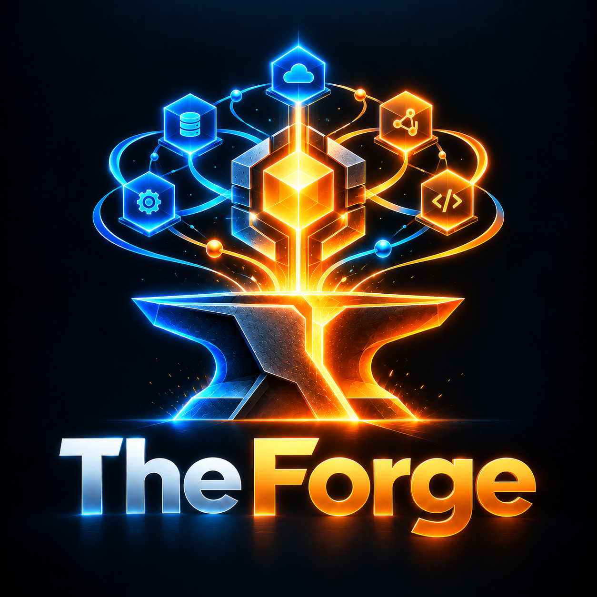

<p align="center">
  
</p>

# The Forge

> Uma entrada. Vários especialistas. Apenas o contexto necessário. Resultado verificável.

The Forge é um control plane local-first. Ele descobre Forges especialistas (Spark Forge AWS, Spark Forge Azure, API Forge, Platform Forge, os Doctors, …), escolhe o provider certo por capability de forma determinística e explicável e registra cada execução com evidência e receipt verificáveis. **The Forger** é o orquestrador interno.

## Instalação (desenvolvimento)

```bash
git clone <repo> the-forger && cd the-forger
python3.11 -m venv .venv                      # qualquer Python >= 3.11
.venv/bin/python -m pip install -e ".[dev]"   # Windows: .venv\Scripts\python
```

O runtime só usa a stdlib. O comando canônico é `theforge`, usado em todos os exemplos; `forge` é um alias de conveniência ([ADR 0008](docs/adr/0008-cli-name.md)). Use `theforge` se `forge` colidir com Foundry ou Laravel Forge no seu PATH. Para rodar a suíte de testes, instale também os adapters (ver [Desenvolvimento](#desenvolvimento)).

## Instalação portátil (uso, não desenvolvimento)

`setup.sh` (POSIX) / `setup.ps1` (Windows) fazem o bootstrap: resolvem um Python compatível, criam um venv isolado em `~/.forge/installs/the-forge`, instalam o **wheel** (não o checkout), gravam o launcher em `~/.local/bin` e registram o manifesto em `~/.forge/installations/the-forge.json`. Depois o checkout pode ser apagado.

```bash
./setup.sh            # ou: pwsh setup.ps1
theforge --version    # smoke test embutido no bootstrap
```

Com o CLI no PATH, a própria forge instala seus host assets em qualquer repo e orquestra a família inteira:

```bash
cd seu-projeto
theforge install apply --yes              # skills + markers gerenciados (.claude/.devin/.agents/.github)
theforge install apply --dry-run          # plano determinístico, sem escrever
theforge install auto --yes               # delega a cada forge registrada em ~/.forge/installations
theforge install status|doctor|repair|uninstall
theforge installations list               # registry do bootstrap (read-only)
```

Cada escrita passa por ledger sha256 com posse: `uninstall` remove só o que é gerenciado, arquivos do usuário e edições manuais sobrevivem. Escopos `project` (padrão), `workspace` e `user`; profiles `minimal`/`recommended`/`full`; hosts `claude`, `devin`, `codex`, `copilot` ou `all`. Contrato e matriz: [docs/portable-installation/](docs/portable-installation/README.md) ([ADR 0058](docs/adr/0058-portable-installation.md)).

## Primeiros passos

Os comandos abaixo assumem o venv ativado (`source .venv/bin/activate`; no Windows, `.venv\Scripts\activate`). Sem ativar, chame `.venv/bin/theforge` (Windows: `.venv\Scripts\theforge`).

```bash
theforge doctor
theforge init
theforge capabilities list
theforge ask "eco olá" --capability demo.echo
theforge explain <run_id>   # o run_id é impresso por `ask`
theforge plan "<tarefa>" --profile max            # só planeja (desfecho planned)
theforge plan "<tarefa>" --profile max --execute  # executa os nós em sequência
```

## Registrar um provider

O `providers.toml` **do usuário** é o único que concede trust. Ele fica em `%APPDATA%\theforge\providers.toml` no Windows e em `$XDG_CONFIG_HOME/theforge/providers.toml` no POSIX (fallback `~/.config/theforge/providers.toml`); `$THEFORGE_CONFIG_DIR` sobrescreve o diretório em qualquer plataforma.

```toml
[[providers]]
id = "my-forge"
argv = ["my-forge-cli", "protocol"]   # "{python}" vira o interpretador atual
trust = "local"                        # trusted | local | unverified | blocked (padrão: unverified)
```

O `providers.toml` de projeto (`.forge/config/providers.toml`) pode declarar providers, mas eles entram sempre como `unverified` e não são executados (nem `describe`) sem `--allow-unverified`. Para confiar num provider de projeto, copie a entrada para o arquivo do usuário. Ids builtin (`echo-forge`) são reservados: usá-los em qualquer `providers.toml` é erro de uso (exit 2). Uma entrada de projeto cujo id já esteja definido no arquivo do usuário é ignorada, com aviso.

Depois rode `theforge registry refresh`. Para começar um provider do zero, `theforge provider init <dir> --id <id>` escreve o scaffold (manifest, esqueleto stdlib, teste de conformidade) e `theforge provider check -- <argv>` roda a bateria de conformidade sem registrar nada ([provider-authoring](docs/provider-authoring.md)).

O `version` do manifest precisa ser SemVer 2.0.0 (senão o provider fica `invalid`, `FORGE-MANIFEST-VERSION`), e cada capability segue a [taxonomia](docs/capabilities.md) (fora dela, a capability é excluída com aviso `FORGE-MANIFEST-TAXONOMY`). Para quem já tem um provider: [nota de migração](docs/provider-authoring.md#nota-de-migração-ciclo-2-wave-b).

## Forges reais

Os Forges reais entram por seis adapters em `adapters/`, instalados no interpretador de cada especialista (o API Forge exige Python 3.12; os Doctors exigem Python ≥ 3.11) e registrados como qualquer provider ([ADR 0014](docs/adr/0014-provider-adapter-location.md)): Spark Forge AWS (`spark-forge-aws`), Spark Forge Azure (`spark-forge-azure`), API Forge (`api-forge`), Platform Forge (`platform-forge`), Forge Doctor Data (`forge-doctor-data`) e Forge Doctor API (`forge-doctor-api`). Só capabilities read-only e offline são expostas; o resto aparece em `limitations` do manifest com o motivo ([catálogo](docs/capabilities.md), [ADR 0017](docs/adr/0017-capability-taxonomy.md)). O estado nativo de cada execute fica em `.forge/runs/<id>/work/` e é reduzido aos artifacts declarados; esse diretório não passa por redaction ([segurança](docs/security.md#exceção-forgerunsidwork)). Instalação, registro, testes de integração e troubleshooting: [docs/real-providers.md](docs/real-providers.md).

### Mapa do ecossistema

- **The Forge** é a plataforma (este repositório); **The Forger** é o orquestrador interno que coordena — routing, budget, planos, receipts.
- **Forges especialistas** engenheiram: Spark Forge AWS (pipelines de dados AWS/PySpark), Spark Forge Azure (pipelines Azure/Fabric — sem equivalência falsa AWS↔Azure), API Forge (construção/evolução de APIs) e Platform Forge (inteligência de plataforma: IaC, k8s, secrets, CI/CD, gitops).
- **Doctors** observam: Forge Doctor Data e Forge Doctor API escaneiam e diagnosticam, produzem evidência e verificam o trabalho dos engenheiros — nunca executam mudanças.
- **Routing** pertence só à Forge (determinístico, de sinais declarados); **verificação** pertence a um provider *diferente* do produtor (`can_verify` declarado).
- **Troca**: evidência tipada com proveniência via `Handoff` — nunca prompts repetidos nem estado interno sincronizado.
- **Adicionar um Forge**: `theforge provider init` + [provider-authoring](docs/provider-authoring.md).
- Visão das relações declaradas: `theforge graph --mesh`.
- **Camada agentic**: `forge-knowledge/` (bootstrap metadata — nunca verdade de runtime, [doc](docs/forge-knowledge.md)), skills `forge-*` canônicas renderizadas por host ([doc](docs/skills.md)) e oito agentes especializados com autoridade fechada ([doc](docs/agents.md)). `theforge knowledge list/show/check` e `theforge agents list/show` expõem os dois registries — `check` confronta o freshness recordado com o registry ao vivo.

## Exit codes

| Código | Significado |
|---|---|
| 0 | sucesso: `ok` / `partial` em `ask` e `plan`, `planned` em `plan` sem `--execute`, `explain`/`replay` sem divergência |
| 1 | `doctor` / `providers health` / `provider check` com falha |
| 2 | uso inválido (inclusive arquivo de plano ilegível, `FORGE-PLAN-FILE`, e run id malformado ou desconhecido) ou workspace não inicializado |
| 3 | `no_route` / `ambiguous` |
| 4 | `provider_failure` / `refused` (inclusive recusa de policy, plano rejeitado e `replay --mode execute` recusado) |
| 5 | falha ao gravar ou ler o run (`theforge: persistence error:`) |
| 6 | divergência de integridade: `explain`, `replay --mode verify` e `replay --mode render` |
| 70 | erro interno inesperado (sem traceback) |
| 130 | interrompido (Ctrl+C) |

Igual à tabela de [docs/cli.md](docs/cli.md#exit-codes-gerais), que detalha o exit de cada subcomando.

## Documentação

Mapa completo por preocupação em [docs/README.md](docs/README.md). Principais:

- [Arquitetura](docs/architecture.md)
- [Forge Protocol v1](docs/protocol.md)
- [Escrevendo um provider](docs/provider-authoring.md)
- [Providers reais: Spark Forge AWS e API Forge](docs/real-providers.md)
- [Capabilities: taxonomia e catálogo](docs/capabilities.md)
- [Versionamento e compatibilidade](docs/versioning.md)
- [Segurança](docs/security.md)
- [CLI](docs/cli.md)
- [Control plane](docs/control-plane.md) (lifecycle dos especialistas, detecção/ativação de hosts, delegação real)
- [Códigos de erro](docs/errors.md) (lista canônica dos códigos `FORGE-*`)
- [Semântica de falha](docs/failure-semantics.md) (modos de falha → código, superfície, recuperação)
- [Ontologia compartilhada](docs/ontology.md) (vocabulário epistêmico e proveniência entre providers)
- [Performance: benchmark, baseline e budgets](docs/performance.md)
- [Capability negotiation v2](docs/capability-negotiation.md) (requirement × offer, gates × signals)
- [Registry sources](docs/registry-sources.md) (local autoritativo; fontes configuradas = metadata não-confiável)
- [Remote discovery](docs/remote-discovery.md) (candidatos por requirement; discovery ≠ instalação)
- [Provider distribution](docs/provider-distribution.md) (InstallationPlan/v2: plano gated, pinned, rollback)
- [Economy observations](docs/economy-observations.md) (ExecutionObservation/v1, GlobalEconomyReceipt, maturidade por surface)
- [Adaptive strategy](docs/adaptive-strategy.md) (shadow champion/challenger — advisory, nunca promove sozinho)
- [Global Stop](docs/global-stop.md) (autoridade cross-provider e decisão receipted)
- [Information Gain](docs/information-gain.md) (ganho qualitativo, sem probabilidades inventadas)
- [Trace federation](docs/trace-federation.md) (trace global + refs nativos opacos)
- [Context ROI](docs/context-roi.md) (utilização medida; recomendação advisory, não causal)
- [Adaptive experiments](docs/adaptive-experiments.md) (champion/challenger governado, sem auto-promoção)
- [A2A bridge](docs/a2a-bridge.md) (experimental: cards/tasks/artifacts ⇄ contratos Forge; agente remoto nunca é provider local)

DX (Standard v1): [handbook do ecossistema](docs/handbook.md) ·
[command reference](docs/reference/commands.md) ·
[skills](docs/reference/skills.md) · [agents](docs/reference/agents.md) ·
[tutorial](docs/tutorials/first-run.md) · [economy](docs/economy.md) ·
[troubleshooting](docs/installation/troubleshooting.md) ·
[EN quickstart](docs/installation/quickstart.en.md)
- [MCP interoperability](docs/interoperability-mcp.md) (MCP = tools ≠ provider; awareness opcional via registry oficial, detecção sem instalação)
- [Contract stability](docs/contract-stability.md) (scorecard forge-contracts: evidência para não extrair)
- [Engineering memory](docs/engineering-memory.md) (conhecimento verificável, isolamento cross-project)
- [Execution targets](docs/execution-targets.md) (alvos declarados, classificação de dados, remote trust)
- [Forge Knowledge](docs/forge-knowledge.md) (bootstrap metadata por especialista; runtime reality vence)
- [Ecosystem skills](docs/skills.md) (`forge-*` canônicas → mirrors por host; freshness auditado)
- [Specialized agents](docs/agents.md) (oito `AgentSpec`, autoridade fechada, sem auto-escalonamento)
- [Installation orchestration](docs/installation-orchestration.md) (knowledge → plano → aprovação → verificação)
- [Cross-forge orchestration](docs/cross-forge-orchestration.md) (produces→consumes, produtor≠verificador)
- [Agentic ecosystem](docs/agentic-ecosystem.md) (mapa da camada agentic: knowledge + skills + agents + auditoria)
- [Loop Factory](docs/loop-factory.md) (fila operacional de specs: `factory/` onde a pasta é o estado; grill gate humano, archive só com aceite)
- [Reality manifests](docs/reality/README.md) (estado real dos especialistas: SHAs, surfaces, drift)
- [Feature freeze](docs/feature-freeze.md) (Cycle 5.1: arquitetura congelada, dogfooding a seguir)
- [Dogfooding](docs/dogfooding.md) (uso em projetos reais + taxonomia de observações)
- [Desenvolvimento com agentes](docs/agentic.md)
- [Índice de ADRs](docs/adr/README.md) e [índice de relatórios](docs/reports/README.md)
- [Relatório do Cycle 5.1](docs/reports/cycle-5.1.md) (reality sync, benchmarks B01–B15, Memory ROI, freeze)
- [Relatório do Cycle 5](docs/reports/cycle-5.md) (Federated Engineering Intelligence: memory, targets, remote trust, strategy governance)
- [Relatório do Cycle 4.1](docs/reports/cycle-4.1.md) (closure, Global Stop, trace federation e adaptive learning) — Cycle 4.1: CLOSED_LOCALLY / REMOTE_VALIDATION_BLOCKED on `0.5.0`
- [Changelog](CHANGELOG.md) e [release checklist](docs/release-checklist.md) (versionamento e fechamento evidence-based)
- [Validation state policy](docs/validation-state-policy.md) (distingue REMOTE_BLOCKED de REMOTE_FAILED sem inventar green/red)
- [Relatório do Cycle 4](docs/reports/cycle-4.md) (Capability Mesh: negociação, discovery, economia adaptativa, A2A/MCP, hardening; provas de realidade)
- [Relatório do Cycle 3.1](docs/reports/cycle-3.1.md) (fechamento; [waves](docs/reports/cycle-3.1-audit.md) documentadas uma a uma)
- [Relatório do Cycle 3](docs/reports/cycle-3.md)
- [Relatório final do Cycle 2](docs/reports/cycle-2.md)
- [Spec do ciclo 1](docs/superpowers/specs/2026-10-02-the-forge-protocol-core-design.md)

## Desenvolvimento

A suíte offline roda os adapters reais em modo replay, então o setup de desenvolvimento os instala editáveis junto com o core:

```bash
.venv/bin/python -m pip install -e ".[dev]" -e ./adapters/sparkforge_aws -e ./adapters/sparkforge_azure -e ./adapters/apiforge -e ./adapters/platformforge -e ./adapters/doctordata -e ./adapters/doctorapi
.venv/bin/python -m pytest            # suite offline
.venv/bin/python -m pytest -m slow    # gates de zero deps e instalação limpa (baixa hatchling)
.venv/bin/python -m pytest -m security   # categoria: unit, contract, integration, e2e, slow, security
.venv/bin/python -m pytest -m real_provider   # Forges reais; ver docs/real-providers.md
.venv/bin/ruff check .
.venv/bin/mypy
.venv/bin/python -m theforge.contracts.schema schemas   # regenerar schemas
.venv/bin/python scripts/agentic/audit_assets.py        # auditoria dos assets agentic; ver docs/agentic.md
```
