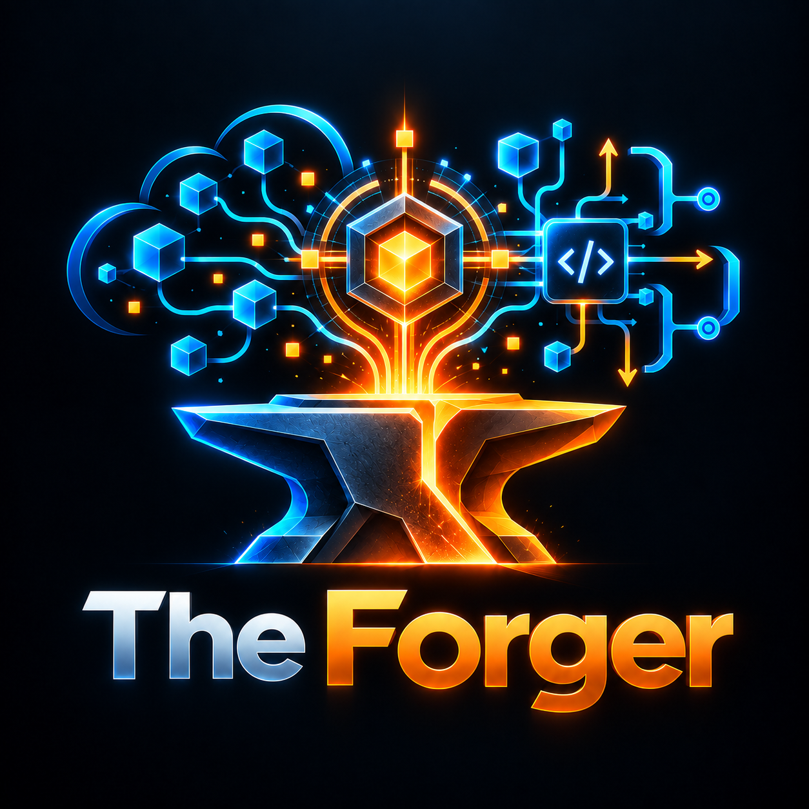

<p align="center">
  
</p>

# The Forge

> Uma entrada. Vários especialistas. Apenas o contexto necessário. Resultado verificável.

The Forge é um control plane local-first. Ele descobre Forges especialistas (Spark Forge, API Forge, …), escolhe o provider certo por capability de forma determinística e explicável e registra cada execução com evidência e receipt verificáveis. **The Forger** é o orquestrador interno.

**Status:** ciclo 1 (protocolo + core local). Os adapters reais de Spark Forge e API Forge chegam no ciclo 2. Hoje o core é provado com o provider nativo `echo-forge` e com providers de teste.

## Instalação (desenvolvimento)

```bash
git clone <repo> the-forger && cd the-forger
python3.11 -m venv .venv                      # qualquer Python >= 3.11
.venv/bin/python -m pip install -e ".[dev]"   # Windows: .venv\Scripts\python
```

O runtime só usa a stdlib. Os comandos são `theforge` e o alias `forge`. Use `theforge` se `forge` colidir com Foundry ou Laravel Forge no seu PATH.

## Primeiros passos

Os comandos abaixo assumem o venv ativado (`source .venv/bin/activate`; no Windows, `.venv\Scripts\activate`). Sem ativar, chame `.venv/bin/theforge` (Windows: `.venv\Scripts\theforge`).

```bash
theforge doctor
theforge init
theforge capabilities list
theforge ask "eco olá" --capability demo.echo
theforge explain <run_id>   # o run_id é impresso por `ask`
```

## Registrar um provider

O `providers.toml` **do usuário** é o único que concede trust. Ele fica em `%APPDATA%\theforge\providers.toml` no Windows e em `$XDG_CONFIG_HOME/theforge/providers.toml` no POSIX (fallback `~/.config/theforge/providers.toml`); `$THEFORGE_CONFIG_DIR` sobrescreve o diretório em qualquer plataforma.

```toml
[[providers]]
id = "my-forge"
argv = ["my-forge-cli", "protocol"]   # "{python}" vira o interpretador atual
trust = "local"                        # trusted | local | unverified | blocked (padrão: unverified)
```

O `providers.toml` de projeto (`.forge/config/providers.toml`) pode declarar providers, mas eles entram sempre como `unverified` e não são executados (nem `describe`) sem `--allow-unverified`. Para confiar num provider de projeto, copie a entrada para o arquivo do usuário. Ids builtin (`echo-forge`) são reservados: usá-los em qualquer `providers.toml` é erro de uso (exit 2). Uma entrada de projeto cujo id já esteja definido no arquivo do usuário é ignorada, com aviso.

Depois rode `theforge registry refresh`.

## Exit codes

| Código | Significado |
|---|---|
| 0 | ok / partial |
| 1 | `doctor` / `providers health` com falha |
| 2 | uso inválido ou workspace não inicializado |
| 3 | no_route / ambiguous |
| 4 | provider_failure / refused |
| 5 | falha ao persistir o run |
| 70 | erro interno inesperado (sem traceback) |
| 130 | interrompido (Ctrl+C) |

## Documentação

- [Arquitetura](docs/architecture.md)
- [Forge Protocol v1](docs/protocol.md)
- [Escrevendo um provider](docs/provider-authoring.md)
- [Segurança](docs/security.md)
- [CLI](docs/cli.md)
- [ADRs](docs/adr/)
- [Spec do ciclo 1](docs/superpowers/specs/2026-10-02-the-forge-protocol-core-design.md)

## Desenvolvimento

```bash
.venv/bin/python -m pytest            # suite offline
.venv/bin/python -m pytest -m slow    # gate de instalação limpa (baixa hatchling)
.venv/bin/ruff check .
.venv/bin/mypy
.venv/bin/python -m theforge.contracts.schema schemas   # regenerar schemas
```
