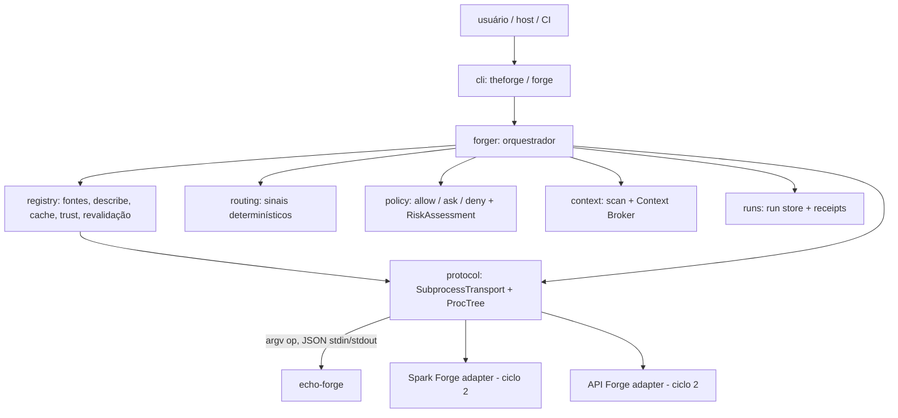

# Arquitetura (ciclos 1 e 2, Wave A)



## Fluxo de `ask`

```mermaid
sequenceDiagram
    participant CLI
    participant Forger
    participant Registry
    participant Provider
    CLI->>Forger: AskRequest (approvals)
    Forger->>Forger: TaskSpec (persistido)
    Forger->>Registry: records()
    Forger->>Forger: route() -> RoutingDecision
    Forger->>Registry: revalidate(candidatos)
    Registry->>Provider: describe (cwd temporário)
    Forger->>Forger: re-route uma vez se algum manifest mudou
    Forger->>Provider: health (cwd temporário), fallback se preciso
    Forger->>Forger: RoutingDecision final (persistido)
    Forger->>Forger: policy -> RiskAssessment (persistido); ask/deny -> refused
    Forger->>Forger: ContextPack validado (persistido)
    Forger->>Provider: execute(task, capability, action, context) (cwd do run)
    Provider-->>Forger: Response(ExecutionResult)
    Forger->>Forger: integridade + producer; ExecutionResult + ExecutionReceipt (persistidos)
    Forger-->>CLI: AskOutcome
```

- A revalidação descreve de novo todos os candidatos pontuados antes da decisão final. Um manifest que diverge do cache invalida a entrada e refaz `records()` e `route()` uma única vez (limitação `registry-revalidated: <ids>`); uma segunda divergência é `provider_failure` com `FORGE-REGISTRY-MANIFEST-CHANGED`. Provider inalcançável sai dos candidatos. Em `no_route` não há revalidação.
- O artefato `routing` só é gravado depois da decisão final, com fallbacks e limitações consolidados.
- Fallback de health aceita só candidatos com a mesma capability e a ação resolvida. Sem candidato saudável, o resultado é `provider_failure` explícito com as tentativas em `fallbacks_used`.
- Um `result` só existe no run se passou pela [integridade](protocol.md#integridade-do-resultado). O receipt sempre é gravado e é validado (`FORGE-RECEIPT-INVALID`) contra o hash real do `result` gravado. Ele registra a identidade observada do provider: `executable`, `fingerprint` e `observed_version` ([ADR 0013](adr/0013-provider-identity.md)).

## Routing
- Explícito (`--capability`): escolhe entre os providers roteáveis que declaram a capability, desempatando por trust e depois por id.
- Por sinais: a decisão usa só a presença por tipo de sinal (dependência, glob, keyword), de 0 a 3. As contagens dentro de cada tipo servem só para explicação e nunca desempatam. Empate, ou menos de 2 tipos casados, resulta em `ambiguous`. Um sinal casado por todos os candidatos não discrimina e vai para `limitations`. O vencedor também precisa ser o único no topo contando os sinais compartilhados.
- Entradas são ordenadas antes do processamento: a decisão depende só do conteúdo, nunca da ordem de descoberta ou do filesystem.
- Capabilities `heuristic` ou `unresolved` resultam em confiança `low`. Providers sem `execute` em `ops` não são roteáveis; a decisão registra a exclusão relevante em `limitations`, e um `--capability` que nenhum outro provider poderia executar é recusado com `FORGE-PROTO-OP-UNSUPPORTED` ([protocol.md](protocol.md)). Limites de manifest e globs catch-all são aplicados no registry ([protocol.md](protocol.md#manifest)).
- Limitação conhecida: sinais genéricos declarados por um único provider confiável ainda podem vencer um provider mais específico (ver [security.md](security.md#limitações-de-isolamento)).

## Responsabilidades

| Módulo | Faz | Não faz |
|---|---|---|
| `contracts` | dataclasses v1, validação, integridade relacional, códigos `FORGE-*`, JSON canônico, schemas | I/O |
| `protocol` | spawn em grupo/Job Object, kill da árvore, timeout, limites de stdout e stderr, validação do envelope, negociação | decidir rota |
| `registry` | carregar entradas, `describe`, negociar protocolo, cache do usuário, fingerprint, revalidação, trust, health | executar tarefas |
| `routing` | ranquear capabilities por presença de sinais declarados | conhecer domínios |
| `policy` | decidir `allow/ask/deny` e montar o `RiskAssessment` a partir da declaração do provider | verificar o que o provider faz |
| `security` | ambiente mínimo do provider, redaction, caminhos seguros | sandbox |
| `context` | listar arquivos com segurança, montar ContextPack por referência | enviar conteúdo de arquivos ao provider (lê os bytes só para calcular sha256 e tamanho) |
| `forger` | orquestrar um run, revalidação, policy, fallback de health, integridade, receipts | lógica de domínio |
| `runs` | persistir artefatos redigidos, hashes, releitura estrita, validação de receipt | interpretar resultados |
| `cli` | parsing, render, exit codes | lógica de negócio |

## Estado

| Local | Classe | Git |
|---|---|---|
| `.forge/config/` | persistent | committable |
| `.forge/runs/<run_id>/` (`task`, `routing`, `risk`, `context`, `result`, `receipt`, `work/`) | persistent local | ignorado |
| `.forge/cache/` | ephemeral | ignorado |
| `<cache do usuário>/registry/<id>-<digest12>.json` | cacheable, fora do projeto ([ADR 0009](adr/0009-registry-cache-location.md)) | — |

O legado `.forge/registry/` não é mais criado; `init` e `registry refresh` o removem com aviso.

## CI
Decisões em [ADR 0011](adr/0011-ci-support-matrix.md).

| Workflow | Quando | O que roda |
|---|---|---|
| `ci.yml` | `pull_request` e `push` em `main` (gate de PR) | Ubuntu e Windows × Python 3.11–3.14: ruff, mypy, paridade de schemas, `pytest -m "not slow and not real_provider"`; job `package`: build, `scripts/ci/check_zero_deps.py` e `scripts/ci/fresh_install.py` (wheel em venv novo, `doctor`, `init` e `ask` com `demo.echo`) |
| `compat.yml` | semanal e `workflow_dispatch` | macOS × 3.11 e 3.14, mesma suíte offline |
| `real-providers.yml` | semanal e `workflow_dispatch`; nunca bloqueia PR | checkout dos repositórios irmãos em `siblings/spark-forge-aws` e `siblings/api-forge` e `pytest -m real_provider` |

- O segredo `SIBLING_REPOS_TOKEN` (fallback `github.token`) só aparece no `with.token` dos checkouts dos irmãos, com `persist-credentials: false`; nunca em `env` nem em `run`. Todos os workflows usam `permissions: contents: read`.
- Os testes são classificados pelos markers `unit`, `contract`, `integration`, `e2e`, `slow`, `security` e `real_provider`; um arquivo de teste sem categoria falha a coleta. A suíte offline bloqueia rede (exceto loopback) dentro do processo do pytest; o marker `allow_network` libera um teste.

## Fora desta wave
Adapters reais (Wave B), LLM/semantic routing, multi-provider (parallel/pipeline/debate), economy avançada, installer, workspace graph, sandbox de SO.
