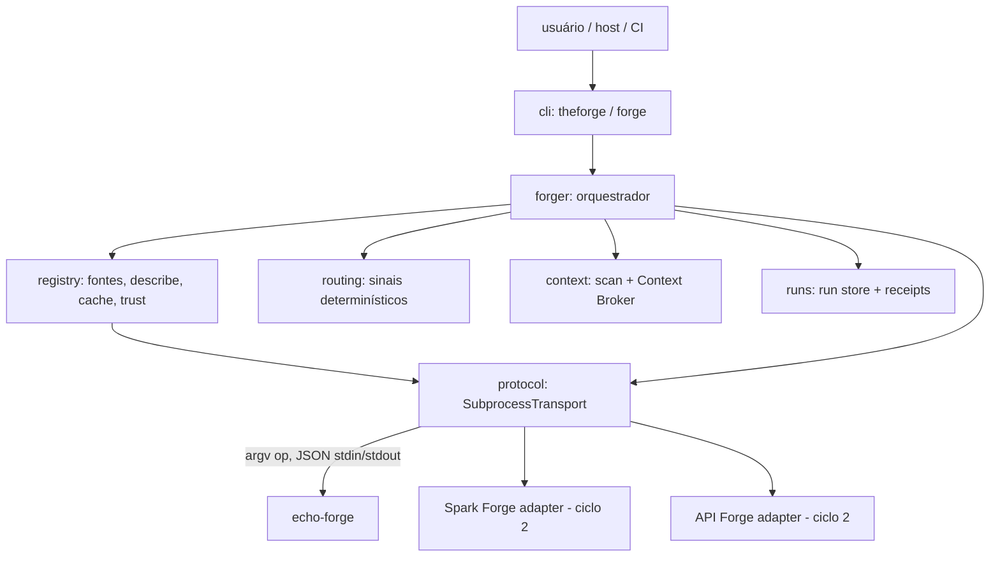
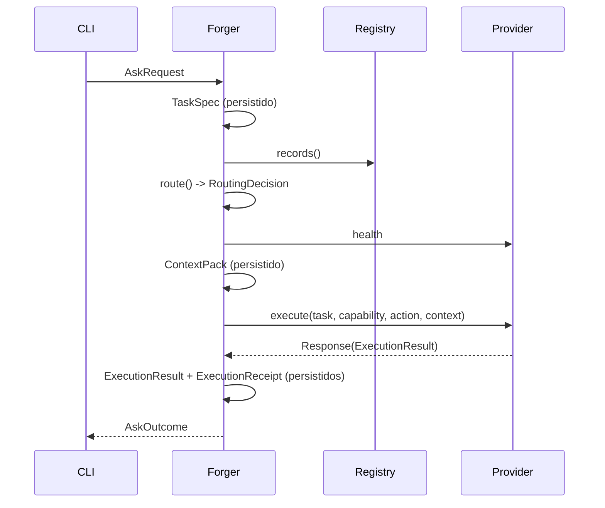

# Arquitetura (ciclo 1)

## Fluxo de `ask`

## Responsabilidades

| Módulo | Faz | Não faz |
|---|---|---|
| `contracts` | dataclasses v1, validação, JSON canônico, schemas | I/O |
| `protocol` | spawn, timeout, limite de stdout, validação do envelope | decidir rota |
| `registry` | carregar entradas, `describe`, negociar protocolo, cache, trust, health | executar tarefas |
| `routing` | ranquear capabilities por sinais declarados | conhecer domínios |
| `context` | listar arquivos com segurança, montar ContextPack por referência | ler conteúdo para o provider |
| `forger` | orquestrar um run, fallback de health, receipts | lógica de domínio |
| `runs` | persistir artefatos redigidos, hashes | interpretar resultados |
| `cli` | parsing, render, exit codes | lógica de negócio |

## Estado `.forge/`

| Dir | Classe | Git |
|---|---|---|
| `config/` | persistent | committable |
| `registry/` | cacheable | ignorado |
| `runs/<run_id>/` | persistent local | ignorado |
| `cache/` | ephemeral | ignorado |

## Fora do ciclo 1
Adapters reais (ciclo 2), LLM/semantic routing, multi-provider (parallel/pipeline/debate), economy avançada, installer, workspace graph.
