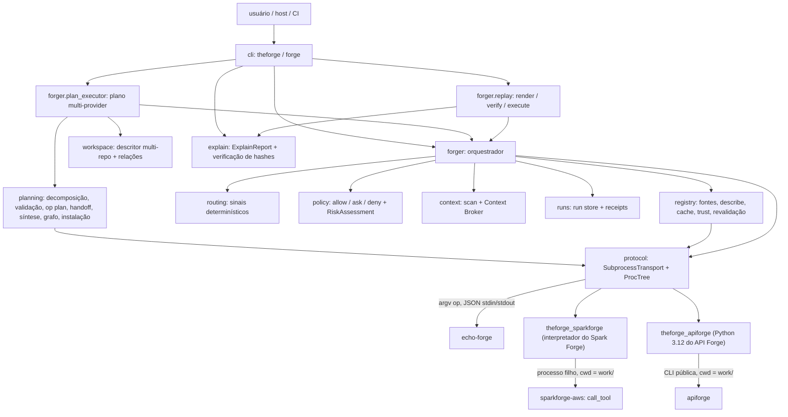

# Arquitetura (ciclos 1–3)



## Fluxo de `ask`

```mermaid
sequenceDiagram
    participant CLI
    participant Forger
    participant Registry
    participant Provider
    CLI->>Forger: AskRequest (approvals)
    Forger->>Forger: TaskSpec (persistido)
    Forger->>Registry: records()
    Forger->>Forger: route() -> RoutingDecision
    Forger->>Registry: revalidate(candidatos)
    Registry->>Provider: describe (cwd temporário)
    Forger->>Forger: re-route uma vez se algum manifest mudou
    Forger->>Provider: health (cwd temporário), fallback se preciso
    Forger->>Forger: RoutingDecision final (persistido)
    Forger->>Forger: policy -> RiskAssessment (persistido); ask/deny -> refused
    Forger->>Forger: git somente leitura + cache de fingerprints
    Forger->>Forger: ContextPack por tiers validado (persistido)
    loop até negotiation_rounds do perfil
        Forger->>Provider: execute(task, capability, action, context) (cwd do run)
        Provider-->>Forger: ExecutionResult com context_request
        Forger->>Forger: pack estendido validado (context-rN persistido)
    end
    Forger->>Provider: execute (rodada final)
    Provider-->>Forger: Response(ExecutionResult)
    Forger->>Forger: integridade + producer; drift (reportado e reverificado); ExecutionResult (persistido)
    Forger->>Forger: VerificationResult (persistido) + nível de reprodutibilidade
    Forger->>Forger: RunTelemetry + ExecutionReceipt (persistidos, em todo desfecho)
    Forger-->>CLI: AskOutcome
```

- A revalidação descreve de novo todos os candidatos pontuados antes da decisão final. Um manifest que diverge do cache invalida a entrada e refaz `records()` e `route()` uma única vez (limitação `registry-revalidated: <ids>`); uma segunda divergência é `provider_failure` com `FORGE-REGISTRY-MANIFEST-CHANGED`. Provider inalcançável sai dos candidatos. Em `no_route` não há revalidação.
- O artefato `routing` só é gravado depois da decisão final, com fallbacks e limitações consolidados.
- **Resolver semântico (tier de fallback, `routing.resolve`, [ADR 0025](adr/0025-semantic-routing-fallback.md)).** Só quando a decisão final de um `ask` não pinado é `ambiguous` e o profile assumido não é `economy`: o primeiro provider `ready` (ordem de id) com a op `resolve` e uma capability `resolves_ambiguity` recebe um `ResolveRequest` mínimo — task, os candidatos elegíveis com os sinais que pontuaram, a razão da ambiguidade e os nomes das tecnologias do workspace (da inteligência de projeto; nunca o repositório). A `RoutingProposal` é revalidada deterministicamente (escolha dentro do conjunto oferecido, capability e ação declaradas) e persistida como `routing-proposal`, ligada ao receipt por `inputs.routing_proposal_sha256`; a seleção validada segue o funil inteiro (health, policy, contexto, verificação). Falha ou rejeição mantém o `ambiguous` com a limitação — a decisão registrada fica com confiança `low` e a proveniência `semantic resolver` explícita.
- Fallback de health aceita só candidatos com a mesma capability e a ação resolvida. Sem candidato saudável, o resultado é `provider_failure` explícito com as tentativas em `fallbacks_used`.
- Um `result` só existe no run se passou pela [integridade](protocol.md#integridade-do-resultado). O receipt sempre é gravado e é validado (`FORGE-RECEIPT-INVALID`) contra o hash real do `result` gravado. Ele registra a identidade observada do provider: `executable`, `fingerprint` e `observed_version` ([ADR 0013](adr/0013-provider-identity.md)).

## Fluxo de `plan`
`theforge plan` (Wave D, [ADR 0018](adr/0018-multi-provider-execution.md)) coordena vários especialistas numa tarefa sem mudar o `ask`: cada nó do plano é um run completo de um único provider, com todas as garantias acima.

```mermaid
sequenceDiagram
    participant CLI
    participant Executor as PlanExecutor
    participant Planning
    participant Workspace
    participant Forger
    participant Provider
    CLI->>Executor: PlanCommand (intent, perfil, --from, --execute, approvals)
    Executor->>Executor: run do plano + task (persistido)
    Executor->>Workspace: describe_workspace (git somente leitura)
    Executor->>Executor: workspace-descriptor (persistido)
    Executor->>Planning: decompose(intent) ou load_plan_file(--from)
    Planning-->>Executor: ExecutionPlan + RoutingDecision
    Executor->>Planning: check_plan (estrutura + registry + perfil)
    Executor->>Provider: plan (só quem declara; cwd temporário)
    Executor->>Provider: health dos providers do plano
    Executor->>Executor: routing, plan, installation (persistidos antes de qualquer nó)
    alt rejeitado, ambiguous/no_route ou sem --execute
        Executor->>Executor: graph, telemetry, receipt de plano
    else --execute
        loop nós em ordem topológica (um por vez)
            Executor->>Planning: build_handoff(inputs do nó)
            Executor->>Forger: ask(provider fixado, nó, handoff, estimativa, approvals)
            Forger->>Provider: execute(ExecuteRequest com handoff)
            Forger-->>Executor: AskOutcome do run do nó
        end
        Executor->>Planning: synthesize + build_graph
        Executor->>Executor: plan-result, graph, telemetry, receipt de plano (persistidos)
    end
    Executor-->>CLI: PlanOutcome
```

- **Workspace.** `describe_workspace` descobre repositórios na raiz e em subdiretórios até 3 níveis (no máximo 64), sem seguir symlinks e ignorando `.git`, `.forge` e os diretórios excluídos da varredura; repositórios aninhados são independentes e a raiz não precisa ser um repositório. Cada repositório recebe o `GitSummary` da [consulta git da Wave C](security.md#consulta-git-somente-leitura), com orçamento total de 20 s de git por descrição (os repositórios que não cabem ficam sem resumo, com limitação). Tecnologias vêm só de arquivos de dependência e de globs declarados por providers, sempre com o caminho de evidência; relações vêm de `.forge/config/workspace.toml` (`depends_on`, explícitas) e da contenção observada no disco. Nada é inferido, e a descrição nunca inicia um processo de provider; `theforge workspace show` usa só os manifests do cache do registry.
- **Decomposição** (`planning.decompose`, sem LLM e sem domínio — tiers 0/1 do planner híbrido). Lê só `RoutingDecision.candidates` do routing por sinais. Por provider, a melhor capability é a de mais tipos de sinal discriminantes; um provider qualifica com pelo menos 2 tipos. Com perfil de um provider, `--capability` ou até um qualificado, a própria decisão vira um nó `route` (ou fica `ambiguous`/`no_route`). Senão os qualificados viram um `pipeline`: primeiro a ordem declarada no grafo de capabilities — `requires` e cadeias produces→consumes entre os qualificados (regra `capability-graph`, evidência da relação declarada) — e o proxy `intent-order` desempata o que o grafo não ordena (posição, na intenção, da primeira keyword casada); cada nó depende do anterior (dependência `inferred`, com a regra e a evidência) e o declara em `inputs`, recebendo o handoff dele. `conflicts` declarados entre qualificados, ciclo nas relações, empate de posição sem relação declarada, provider sem keyword nem relação, empate de capabilities no mesmo provider ou mais qualificados que `max_providers` resultam em `ambiguous`. As regras são proxies do fluxo de dados e podem inferir a dependência errada; `--from FILE` fixa a ordem explicitamente.
- **Planner semântico (tier-2, `planning.propose`).** Só quando a decomposição fica `ambiguous` e o profile não é `economy`: um provider `ready` com capability `proposes_plans` responde o op `plan` com `purpose="proposal"` e `SemanticPlanProposal`; o core materializa `ExecutionPlan` (`source="semantic"`) e `check_plan` revalida tudo — o planner só escolhe dentro do conjunto elegível do routing. Proposta persistida em `semantic-proposal` e linkada no receipt (`PlanRefs.semantic_proposal_sha256`).
- **Validação** (`planning.validate.check_plan`). Reúne todas as violações de uma vez: ids únicos (`^[a-z][a-z0-9-]{0,31}$`), dependências existentes, ciclo, `inputs` fora de `depends_on`, no máximo 8 nós, padrão reservado, `route` com mais de um nó, provider pronto que declara a capability (aliases resolvidos) e a ação, e providers distintos dentro de `max_providers`. Um plano de arquivo passa pela mesma validação; os campos controlados pelo run (`plan_run`, `producer`, `created_at`, `status`, `violations`, `source`, `task_id`) são substituídos e o perfil da linha de comando prevalece. Plano rejeitado termina `refused` com o primeiro código `FORGE-PLAN-*`, sem iniciar nenhum `execute`.
- **Estimativa e instalação.** A [op `plan`](protocol.md#operação-plan) é pedida a cada provider que a declara; a estimativa só endurece a policy do nó. Providers referenciados ausentes, inválidos, inacessíveis, incompatíveis ou com health indisponível entram em no máximo um `InstallationPlan` por run, marcado como somente de planejamento: o core nunca baixa, instala ou executa nada a partir dele.
- **Execução.** Sem `--execute` o plano termina `planned` (exit 0). Com `--execute`, `route` e `pipeline` rodam sequencialmente; `delegate`, `parallel` e `debate` escalonam por nível de dependência num `ThreadPoolExecutor` limitado a `MAX_PARALLEL_NODES` = 4 — os resultados são registrados na ordem topológica (desempate por id), nunca na de conclusão. Cada nó é um `Forger.ask` com o provider **fixado** (roteável ou `no_route`, nunca fallback de health), o vínculo com o plano e o nó (`parent_run`, `plan_node` no receipt), o handoff das dependências (gravado antes do `execute` e enviado como foi gravado), a classe estimada e as aprovações (`--approve` libera só os nós daquela capability). Um nó cujo ancestral não tem resultado válido fica `skipped` com `blocked_by` e `FORGE-PLAN-DEPENDENCY-FAILED`; nós independentes continuam. Em `debate` (≥2 `proposer` + 1 `referee` dependente de todos), o core compõe o `DecisionRecord` a partir da evidência `id="decision"` do referee — sem ela, `unresolved` com a razão em `limitations`. Cada `options[]` cita a posição do proposer verbatim (`position`, `evidence`, `risks` extraídos do resultado que ele produziu).
- **Desfecho.** `ok` se todos os nós são `ok`; `partial` se algum tem resultado válido e algum não é `ok`; senão `refused` se todos os nós tentados foram recusados, e `provider_failure` nos demais casos, com o erro do primeiro nó que falhou. A síntese (`PlanResult.synthesis`) lista por nó provider, capability, ação, status, run, findings com os ids originais e evidências por status epistêmico, mais handoffs, falhas, limitações e incógnitas com o prefixo do nó; ela nunca cria findings nem eleva status epistêmico.
- **Evidence bus.** O handoff entre nós (`planning.handoff`) carrega objetos de conhecimento tipados — decisão, verificação (o resumo do `VerificationResult` do run de origem), findings, evidências (epistemic e `derived_from` verbatim), artifacts (com `artifact_type` inferido do `produces` declarado), constraints e assumptions — cada um com `origin` completa (quem, qual run, qual nó). Conteúdo idêntico de várias origens é enviado uma vez (`also_from` guarda todas), e a necessidade declarada do consumidor (`relations.consumes`) filtra artifacts declaradamente irrelevantes antes do corte de orçamento.
- **Grafo.** `WorkspaceGraph` liga workspace, repositórios, providers, capabilities, nós, evidências e artifacts por arestas de contenção, dependência, declaração, uso, alvo, produção e handoff. Toda aresta tem evidência; inferida exige regra. Aresta inválida é descartada com a limitação `FORGE-WORKSPACE-GRAPH-EDGE`; acima de 2 000 nós, evidências e artifacts são truncados.
- **Persistência.** O run do plano grava `task`, `workspace-descriptor`, `capability-graph`, `routing`, `plan`, `installation` (quando há itens), `semantic-proposal` (planner tier-2), `decision` (debate), `plan-result`, `graph`, `telemetry` e o receipt de `kind = "plan"`, que liga tudo por hash (`PlanRefs` e `telemetry_sha256`). Cada nó é um run próprio em `.forge/runs/<run_id>/`. Erro inesperado vira `provider_failure` com `FORGE-INTERNAL`, diagnóstico redigido (gravado como artefato só com `--debug`) e telemetria.

### Verificação, reprodutibilidade, `explain` e `replay`
- **Verificação.** Todo run de um provider (de `ask` ou de nó) grava `verification` com os quatro níveis ([protocol.md](protocol.md#verificação-do-resultado)); `forger.verification.select_verifier`/`request_verdict` resolvem o nível `independent` via a op `verify` de um provider de identidade distinta que declara `can_verify` ([ADR 0021](adr/0021-independent-verification.md)). Artifact divergente ou veredicto independente `failed` deixam o run `partial`.
- **Reprodutibilidade** (`forger.reproducibility`, [ADR 0019](adr/0019-error-taxonomy-and-reproducibility.md)). Todo receipt registra um nível com motivos: `unknown` sem execução de provider (`no_route`, `ambiguous`, recusa antes do `execute`, `planned`); `non_reproducible` com rede, execução não local ou não offline, classe `external_*`/`destructive`, divergência de contexto ou handoff de nó `non_reproducible`; `reproducible` só com execução determinística declarada, classe `read_only`, fingerprint e hash de contexto registrados, reverificação de contexto executada (não `minimal`), verificação `forge` aprovada, status `ok` e handoff só de nós `reproducible`; os demais casos são `partially_reproducible`. O plano recebe o nível menos reprodutível dos nós, na ordem `non_reproducible` < `unknown` < `partially_reproducible` < `reproducible` (um nó `skipped` tem nível `unknown` e puxa o plano para `unknown`). Runs anteriores a esta versão contam como `unknown`.
- **`explain`** (`explain.report`, `explain.hashcheck`). Monta o `ExplainReport` só lendo o run: cada artefato é lido uma vez, redigido de novo e guardado cru em `artifacts`, e as seções tipadas saem dele; seção sem dado vai para `not_recorded`. A verificação de hashes compara cada hash registrado no receipt (entradas, rodadas de contexto, resultado, telemetria, verificação, handoff e, em runs de plano, `PlanRefs`) com o arquivo em disco, recalcula cada artifact declarado em `work/` e, num plano, confere o receipt de cada nó contra o hash registrado no `plan-result` e verifica esse run (profundidade máxima 1). Nada é escrito e nenhum provider é iniciado; divergência sai com exit 6.
- **`replay`** (`forger.replay`). `render` reconstrói o relatório sem ler o workspace; `verify` soma à verificação de hashes a reverificação, contra o workspace atual, dos itens de contexto registrados (inclusive dos runs de nó); `execute` repete um run de um provider com os parâmetros originais, o provider fixado e `replay_of` apontando o original, e compara os resultados sem campos voláteis. A reexecução é recusada antes de iniciar qualquer provider para runs de plano e de nó (`FORGE-REPLAY-UNSUPPORTED`) e para runs `non_reproducible`/`unknown`, com contexto alterado, com entradas registradas divergentes ou com provider de identidade ou versão diferente (`FORGE-REPLAY-NOT-REPRODUCIBLE`).

## Direção de imports
Obrigatória; vale para os ciclos 1 e 2 (Waves A–D):

`contracts.codes → contracts → errors / security / diagnostics → profiles → protocol → registry → routing / context → workspace → planning → policy → runs → explain → forger → cli`

- `meta` (identidade `PRODUCER`, depende só de `contracts.types`) e `state` (constante `FORGE_DIR_NAME` e localização de `.forge`, depende só de `errors`) são módulos-base no nível de `contracts`/`errors`: qualquer pacote à direita pode importá-los.
- `workspace` importa `contracts`, `security`, `context` (só a consulta git e o `WorkspaceScan`), `routing.signals`, `registry`, `meta` e `state`.
- `planning` importa `contracts`, `errors`, `security`, `profiles`, `protocol`, `registry`, `routing`, `workspace` e `meta`; nunca `policy`, `runs`, `forger` ou `cli` (a comparação de decisões de policy usa só o contrato `PolicyDecision`).
- `explain` importa `contracts`, `errors`, `security`, `context.verify` (hash sem cache), `meta` e `runs`.
- `forger` importa os pacotes à esquerda; `cli` importa `forger`, `explain` e os demais.
- `conformance` (kit de `provider check`: contracts, protocol, `registry.health`, `security.env`, `meta`) e `scaffold` (`provider init`: `contracts.manifest`, `errors`) são folhas consumidas só por `cli` e pelos testes — nada no pipeline de run os importa.
- Nenhum módulo importa adapters ou especialistas.

## Routing
- Explícito (`--capability`): escolhe entre os providers roteáveis que declaram a capability, desempatando por trust e depois por id.
- Por sinais: a decisão usa só a presença por tipo de sinal (dependência, glob, keyword), de 0 a 3. As contagens dentro de cada tipo servem só para explicação e nunca desempatam. Empate, ou menos de 2 tipos casados, resulta em `ambiguous`. Um sinal casado por todos os candidatos não discrimina e vai para `limitations`. O vencedor também precisa ser o único no topo contando os sinais compartilhados.
- Entradas são ordenadas antes do processamento: a decisão depende só do conteúdo, nunca da ordem de descoberta ou do filesystem.
- Pedido por alias resolve para o ID canônico (nota `capability-alias`); alias com canônicos diferentes entre providers vira `ambiguous`. Capability depreciada continua roteável, com nota `capability-deprecated`. ID declarado por mais de um provider gera `capability-overlap` ([ADR 0017](adr/0017-capability-taxonomy.md)).
- Capabilities `heuristic` ou `unresolved` resultam em confiança `low`. Providers sem `execute` em `ops` não são roteáveis; a decisão registra a exclusão relevante em `limitations`, e um `--capability` que nenhum outro provider poderia executar é recusado com `FORGE-PROTO-OP-UNSUPPORTED` ([protocol.md](protocol.md)). Versão SemVer (`FORGE-MANIFEST-VERSION`), limites de manifest, taxonomia (`FORGE-MANIFEST-TAXONOMY`) e globs catch-all são aplicados no registry ([protocol.md](protocol.md#manifest)).
- Limitação conhecida: sinais genéricos declarados por um único provider confiável ainda podem vencer um provider mais específico (ver [security.md](security.md#limitações-de-isolamento)).

## Contexto e perfis
Decisões em [ADR 0015](adr/0015-context-intelligence.md) e [ADR 0016](adr/0016-git-read-only-signals.md); contrato em [protocol.md](protocol.md#contexto-v2).

- **Fase de contexto** (só depois da policy: runs `no_route`, `ambiguous` e `refused` nunca executam git nem leem o cache): `read_git_state` → `FingerprintStore` da raiz → `build_context_pack` (relevância por sinais, tiers, budget, `max_files`) → `validate_context_pack` → artefato `context`. O mesmo `FingerprintStore` atende as rodadas de negociação e é gravado uma vez, depois da última rodada; seus avisos vão para as limitações do receipt.
- **Negociação**: no máximo `negotiation_rounds + 1` chamadas `execute`; cada pack estendido vira `context-r1`/`context-r2`. Resposta com `context_request` nunca vira `result` ([pedido de contexto](protocol.md#pedido-de-contexto)).
- **Pós-execução**: divergência reportada pelo provider sempre se aplica; a reverificação segue o nível do perfil ([regra de divergência](protocol.md#regra-de-divergência)). `metrics.duration_ms` soma todas as rodadas; `context_bytes` é o `used_bytes` do último pack; `tokens` é o do provider quando `measured`/`estimated`, senão `unknown`.

### Perfis
Fonte única: `src/theforge/profiles.py`. Nenhum outro módulo define budgets, timeouts ou rodadas.

| Parâmetro | `economy` | `balanced` | `max` |
|---|---|---|---|
| `budget_bytes` | 65 536 | 262 144 | 1 048 576 |
| `max_files` | 16 | 64 | 256 |
| tiers | metadata, reference | metadata, reference, excerpt, requested | metadata, reference, excerpt, requested |
| `negotiation_rounds` | 0 | 1 | 2 |
| `max_providers` | 1 | 1 | 4 |
| fallback de health | não | sim | sim |
| verificação | `minimal` | `conditional` | `strong` |
| timeout de `execute` (por chamada) | 60 s | 180 s | 600 s |

- **`economy` sem fallback**: só o primário passa pelo health. Se ele falhar, o run é `provider_failure` com a limitação `profile economy: fallback disabled`, mesmo havendo um fallback compatível (antes da Wave C, todo perfil fazia fallback).
- **`auto` (default do CLI)**: depois do routing, `theforge/complexity.py` mede 15 dimensões declaradas (repositórios, tecnologias, providers candidatos, impacto de arquivos, classe de operação, sistemas externos, credenciais, ambiguidade, fan-in de handoff…) num score ponderado 0..1, mapeia para `trivial/low/medium/high/critical` e resolve o perfil efetivo (`economy`/`balanced`/`max`). Dimensões sem evidência ficam não-medidas — cortam `confidence` e viram limitações, nunca são chutadas; abaixo de `min_confidence` vale `fallback` (default `balanced`). Um plano que precisa de N providers força um perfil com `max_providers >= N` (floor estrutural, não score). O resultado vira o artefato `complexity` (`ComplexityAssessment/v1`, schema fechado) linkado ao receipt por `complexity_sha256`; a telemetria registra o perfil efetivo. Pesos, thresholds e o mapa nível→perfil são `complexity.toml` (usuário em `<config>/theforge/`, projeto em `.forge/config/`; projeto sobrescreve por chave; arquivo malformado avisa e usa defaults).
- `max_providers`: um `ask` executa um único provider em qualquer perfil. Em `theforge plan`, é o limite de providers distintos de um plano: só `max` (4) permite decompor uma tarefa em mais de um provider; em `economy` e `balanced` a decomposição usa a própria decisão de routing de um provider (um nó `route` quando ela seleciona um provider, senão o `ambiguous`/`no_route` dela) e, havendo dois ou mais providers qualificados, registra `multi-provider decomposition not allowed by profile` ([fluxo de `plan`](#fluxo-de-plan)).
- Timeout de pior caso: cada rodada tem o timeout inteiro, então `max` pode chegar a 3 × 600 s ≈ 30 min em `execute`.

### Economia

Cada run que resolve um perfil grava o artefato `budget` (`RunBudget/v1`, schema fechado), ligado ao receipt por `inputs.budget_sha256`: os bounds efetivos (contexto, arquivos, chamadas de provider/verificação, timeout, paralelismo, rodadas de negociação) e os `adjustments` aplicados.

- **Promoção limitada (perfil explícito).** `--profile auto` já segue a avaliação de complexidade. Num perfil fixo a avaliação também roda: se o `selected_profile` medido supera o pedido, os campos elásticos (`budget_bytes`, `max_files`, `negotiation_rounds`) promovem **um degrau** (economy→balanced→max) — nunca `max_providers`, `execute_timeout_s` ou `verification`, e nunca mais que um degrau por run. A promoção persiste o `ComplexityAssessment` como evidência e aparece em `budget.adjustments` e nas limitações do receipt.
- **Histórico medido (`.forge/metrics/provider-performance.json`).** Todo run que tentou `execute` atualiza o `ProviderPerformance/v1` do provider+capability: runs, desfechos (`ok`/`partial`/failed), runs com a checagem `forge` aprovada, evidências, artifacts, bytes e arquivos enviados, arquivos citados e latência total. Arquivo malformado falha fechado (ignorado + limitação); escrita falha vira limitação, nunca erro do run.
- **Tie-break secundário (H5).** O histórico só fala depois de trust, policy, compatibilidade e sinais: no routing explícito ordena candidatos de mesmo trust antes do id; no routing por sinais resolve só o empate de `rank_key` — um único vencedor estrito, com a nota `performance-tie-break:` nas limitações. Sem história, com história igual ou abaixo do piso de sinais, a decisão continua `ambiguous`. Não existe ranking subjetivo de "melhor agente".

### Inteligência do projeto

Memória técnica incremental em `.forge/intel/` — nunca memória conversacional ([ADR 0023](adr/0023-project-intelligence.md)).

- **`project.json` (`ProjectIntel/v1`, schema fechado).** O último `WorkspaceDescriptor` computado + `IntelFingerprints`: digests de conteúdo de tudo de que o descriptor deriva (`files`, `repos`, `depfiles`, `manifests`, `relations` em `workspace.toml`). **Não existe campo `validity` gravado** — uma freshness persistida seria exatamente a mentira que I2 proíbe: `freshness()` re-computa os fingerprints na leitura e reporta `current`/`stale` (com as seções) ou `unknown` quando não consegue recomputar. Quem não pode confirmar atualidade nunca diz `current`.
- **Refresh incremental (I1).** `refresh_intel` recomputa os fingerprints, marca as seções cujos inputs mudaram (`paths`, `dependency_files`, `technologies`, `relations`) e reusa verbatim só `technologies` e `dependency_files` — as seções caras (parse de manifests + matching de sinais). Descoberta de repositórios, estado git e relações são sempre recomputados: descoberta é barata, **git é evidência viva, nunca servida do snapshot**, e relações custam uma leitura TOML limitada. O que foi reusado aparece em `intel.reused` e na limitação `intel: reused still-fresh sections:` do run; o que estava velho aparece em `intel: stale sections recomputed:`.
- **`decisions.json` (`DecisionMemory/v1`, schema fechado).** Só decisões reutilizáveis — routing (capability → provider), profile (auto/promoção), pattern do plano, veredicto de debate — cada uma com `basis` registrada (evidência, não opinião). Dedup por identidade `sha256(kind|subject|choice)`: a mesma decisão reafirma a entrada (`corroborations`, trilha de runs ≤16), não duplica. Limitada a 256 entradas, as mais antigas por `updated_at` saem primeiro. `theforge decisions` lê a memória; ela informa, nunca roteia sozinha.
- Ambos os arquivos: escrita atômica, redigidos, falha vira limitação do run; arquivo malformado falha fechado (ignorado + nota `intel:`).
- Custo do git: quando o workspace está dentro de um repositório, a consulta faz 5 processos `git` (orçamento total de 5 s); observado em ~0,7–1,3 s por run nos testes, na máquina Windows do [baseline](performance.md) (não é uma medição do benchmark).

### Telemetria
Todo run grava o artefato `telemetry` (`RunTelemetry` v1, schema fechado) antes do receipt, em qualquer desfecho, e o receipt o referencia por `telemetry_sha256`. Métrica não medida sai `unknown` e é listada em `unknowns`.

- Fases (`scan_ms`, `routing_ms`, `context_ms`, `provider_ms`): o health entra em `routing`; `provider` soma todas as rodadas; as extensões de pack entram em `context`.
- `providers_executed` é no máximo 1 num `ask`. `negotiation_rounds` = número de packs `context-rN` gravados.
- O run de um plano também grava `telemetry` (mesmo contrato), em todo desfecho: `scan_ms` (varredura e descrição do workspace), `routing_ms` (routing, decomposição e validação), `providers_executed` = nós cujo run chegou ao `execute`, `fallbacks_used = 0`, `negotiation_rounds = 0` e o perfil do plano; as métricas por nó ficam `unknown` com a limitação `plan run: per-node metrics are in each node run telemetry`, porque estão na telemetria de cada run de nó.
- `fallbacks_used` = quantidade de providers **unhealthy** tentados (o tamanho de `RoutingDecision.fallbacks_used`), contando o primário. Não é "fallbacks que assumiram": em `economy` com o primário unhealthy o valor é 1, e em `balanced` com fallback bem-sucedido também é 1 (o primário que falhou).
- ROI de contexto (counters medidos do `ask`): `files_cited` (arquivos do pack que a evidência devolvida citou por `subject`/`location.path`), `evidence_returned` e `findings_returned`. Runs sem resultado registram zero explícito; runs de plano deixam `unknown` (cada nó conta o seu).
- `profile` registra os parâmetros efetivos e `effective_tiers`; `provider_revalidation` registra `hash`/`core`/`none` ou `undeclared`; `verification_performed` e `context_drift` registram a reverificação.
- **Spans (Wave J).** O mesmo artefato `telemetry` carrega `spans: Span[]` — o trace local do run: cada fase e cada etapa explícita (`planning`, `provider:<id>`, `negotiation`, `handoff`, `verification`, `synthesis`; `node:<id>` + `handoff` por nó em runs de plano) com `id` em ordem de início, `start_ms`/`duration_ms` medidos no relógio monotônico, `parent` e `status` (`error` quando o bloco lançou). Um artefato só é a telemetria **e** o trace — não há segundo sistema (J1); um export futuro é opcional e o trace local funciona offline (J2). `theforge trace <run>` mostra *o que aconteceu*; `explain` mostra *por quê*.
- Limitação conhecida: se montar a telemetria falhar, o receipt é gravado assim mesmo, sem `telemetry_sha256` e com a limitação `telemetry-unavailable: <Tipo>: <mensagem>`; o status do run não muda. Falha de persistência continua sendo erro, como em qualquer artefato.
- `explain` mostra contexto e telemetria; `trace` mostra a árvore de spans; as seções de texto estão em [cli.md](cli.md#explain).

## Responsabilidades

| Módulo | Faz | Não faz |
|---|---|---|
| `contracts` | dataclasses v1, validação, integridade relacional, códigos `FORGE-*`, JSON canônico, schemas | I/O |
| `protocol` | spawn em grupo/Job Object, kill da árvore, timeout, limites de stdout e stderr, validação do envelope, negociação | decidir rota |
| `registry` | carregar entradas, `describe`, negociar protocolo, cache do usuário, fingerprint, revalidação, trust, health | executar tarefas |
| `routing` | ranquear capabilities por presença de sinais declarados | conhecer domínios |
| `policy` | decidir `allow/ask/deny` e montar o `RiskAssessment` a partir da declaração do provider | verificar o que o provider faz |
| `security` | ambiente mínimo do provider, redaction, caminhos seguros | sandbox |
| `profiles` | tabela única de `economy`/`balanced`/`max` | I/O |
| `complexity` | mede a tarefa pós-routing e resolve `--profile auto`; política em `complexity.toml` | iniciar providers; ler o prompt |
| `economy` | resolve o `RunBudget` do run e promove campos elásticos um degrau quando a avaliação medida supera o perfil pedido | promover além de um degrau; tocar `max_providers`/timeout/verificação |
| `metrics` | histórico medido provider+capability em `.forge/metrics/provider-performance.json` (escrita atômica, falha → limitação) | ranquear "melhor agente"; decidir rota sozinho |
| `intel` | memória técnica incremental em `.forge/intel/`: snapshot fingerprinted do workspace (`ProjectIntel`) + decisões reutilizáveis (`DecisionMemory`); freshness sempre recomputada | cachear estado git; decidir rotas pela memória |
| `capability_graph` | monta o grafo provider/capability/action/artifact_type/technology/repository/domain a partir de manifestos (`relations` declaradas) e do descriptor (observado); responde quem executa/verifica/consome/produz/complementa/conflita e a ordem produces→consumes | inventar relações não declaradas; conhecer domínios |
| `planning/propose` | tier-2 do planner híbrido: escolhe o provider `proposes_plans`, envia `plan` `purpose="proposal"` e materializa a `SemanticPlanProposal` em `ExecutionPlan` revalidado por `check_plan` | aceitar provider/capability/ação inventados; executar a proposta sem validação |
| `context` | listar arquivos com segurança; sinais de relevância; ContextPack por referência e tiers; extensão por pedido; git somente leitura; cache de fingerprints; reverificação de drift | enviar conteúdo de arquivos ao provider (lê os bytes só para calcular sha256 e tamanho); importar `routing`, `policy`, `runs`, `forger` ou `cli` |
| `workspace` | descritor multi-repo: repositórios, git somente leitura por repositório, tecnologias com evidência, relações de `workspace.toml` | iniciar providers; escrever em repositórios; inferir relações |
| `planning` | decomposição determinística, ordem topológica, validação de plano, arquivo de plano, op `plan`, handoff, síntese, grafo, plano de instalação, política de retry (`retry.toml`) | executar nós; importar `policy`, `runs`, `forger` ou `cli` |
| `diagnostics` | diagnóstico redigido de uma exceção (estágio, código, família, causas, quadros `theforge.*`) | exibir traceback; guardar variáveis locais |
| `forger` | orquestrar um run (provider fixado, vínculo de nó, handoff, verificação, reprodutibilidade), revalidação, policy, fallback de health, integridade, receipts; executor de plano (inclusive concorrente), `plan-state`; replay; resume (reuso de nós com integridade verificada) | lógica de domínio |
| `explain` | `ExplainReport` e verificação de hashes de um run | escrever no run; iniciar providers |
| `runs` | persistir artefatos redigidos, hashes, releitura estrita, validação de receipt | interpretar resultados |
| `cli` | parsing, render, mensagens governadas, `--debug`, exit codes | lógica de negócio |

## Estado

| Local | Classe | Git |
|---|---|---|
| `.forge/config/` | persistent | committable |
| `.forge/runs/<run_id>/` (`task`, `routing`, `routing-proposal`, `risk`, `handoff`, `context`, `context-r1`, `context-r2`, `result`, `verification`, `telemetry`, `diagnostic`, `complexity`, `budget`, `receipt`; em runs de plano também `workspace-descriptor`, `plan`, `installation`, `plan-state`, `plan-result`, `capability-graph`, `semantic-proposal`, `decision` e `graph`) | persistent local, redigido | ignorado |
| `.forge/config/workspace.toml` (relações explícitas entre repositórios) | persistent | committable |
| `.forge/metrics/provider-performance.json` (`ProviderPerformance/v1`, histórico medido por provider+capability; fator de desempate apenas) | persistent local, redigido | ignorado |
| `.forge/intel/project.json` (`ProjectIntel/v1`, snapshot fingerprinted do workspace; freshness recomputada na leitura) | persistent local, redigido | ignorado |
| `.forge/intel/decisions.json` (`DecisionMemory/v1`, decisões reutilizáveis deduplicadas) | persistent local, redigido | ignorado |
| `.forge/runs/<run_id>/work/` (cwd do execute; raiz de `artifacts[].path`) | persistent local, escrito pelo provider, **não redigido** ([security.md](security.md#exceção-forgerunsidwork)) | ignorado |
| `.forge/cache/` | ephemeral (reservado, sem uso) | ignorado |
| `<cache do usuário>/registry/<id>-<digest12>.json` | cacheable, fora do projeto ([ADR 0009](adr/0009-registry-cache-location.md)) | — |
| `<cache do usuário>/context/<digest12>.json` (fingerprints de contexto; `digest12` = 12 hex do sha256 da raiz resolvida) | cacheable, fora do projeto ([ADR 0015](adr/0015-context-intelligence.md)); perder o cache só custa tempo | — |

O legado `.forge/registry/` não é mais criado; `init` e `registry refresh` o removem com aviso.

## Adapters reais
Spark Forge e API Forge entram como providers comuns, por dois adapters fora do pacote `theforge` ([ADR 0014](adr/0014-provider-adapter-location.md)): `adapters/sparkforge` (`theforge-sparkforge-adapter`) e `adapters/apiforge` (`theforge-apiforge-adapter`). Instalação e registro em [real-providers.md](real-providers.md).

- **Fronteira.** Cada adapter é stdlib-only, instalado no interpretador do especialista, e nunca importa `theforge`; o core nunca importa um adapter nem um especialista. O core vê só o `argv` registrado e os envelopes JSON.
- **Shell comum.** `_shell.py` (envelope, gates de op/protocolo/capability/ação, `stage_context`, `evidence_hash`, `finalize`, `run_native`, `cleanup_workdir`) é copiado byte a byte nos dois adapters; um teste garante a igualdade. Os códigos de erro dos adapters estão em [protocol.md](protocol.md#códigos-dos-adapters-reais).
- **describe.** Deriva o manifest de uma tabela positiva (`catalog.py`) cruzada com um snapshot gravado da superfície nativa (`native_catalog.json`, `native_matrix.json`), sem importar a superfície de tools. Os IDs seguem a taxonomia do [ADR 0017](adr/0017-capability-taxonomy.md); o catálogo está em [capabilities.md](capabilities.md).
- **Capabilities não expostas.** Só ações read-only, offline e preenchíveis com arquivos do workspace são declaradas. Tools que pedem rede, credenciais AWS ou escrita local, e capabilities `unsupported` ou de mutação do API Forge, ficam em `limitations` do manifest com o motivo e nunca são executáveis.
- **health.** Só checagens locais, sem rede e sem credenciais: interpretador, importabilidade e versão do especialista contra `SUPPORTED_SPECIALIST` (fora da janela → `degraded` com a versão encontrada e a janela). O Spark nunca chama o `doctor` nativo (que sonda credenciais AWS). O API não roda o `apiforge doctor`: confere só que `apiforge.cli` existe (`find_spec`, sem importar), porque importar a CLI leva de 3 a 17 s, acima do orçamento de 10 s; dependência quebrada da CLI aparece no `execute`.
- **execute.** O adapter copia para `<cwd>/stage/` só os arquivos do ContextPack com sha256 conferido (`context_revalidation = "hash"`) e roda o especialista num processo filho com cwd no `work/` do run: no Spark, `python -m theforge_sparkforge.native_call` (`detail_level = "normal"`); no API, a CLI pública com `APIFORGE_CACHE=off` (no `change-control run`, cwd na raiz do workspace copiado). A chamada nativa tem 85% do timeout de execute do perfil (`ADAPTER-NATIVE-TIMEOUT`). Erros nativos viram `refused`/`error` estruturados com o código nativo preservado.
- **Tamanho.** Acima de 4 MiB, o resultado mantém os findings que cabem, grava a saída nativa completa no artifact `native/full-output.json` e vira `partial`; se nem o resultado sem nenhum finding couber, `ADAPTER-OUTPUT-TOO-LARGE` (`error`).
- **Contenção.** Em todo desfecho, `cleanup_workdir` reduz `work/` aos `artifacts[]` declarados; `.sparkforge/`, `traces.db`, `.apiforge/` e caches nunca ficam no workspace do usuário nem no run.
- **Testes.** A conformance offline roda os dois adapters em `--replay` (gravações em `tests/fixtures/native/`) no CI principal; a integração contra os Forges reais (`-m real_provider`) roda no workflow agendado.

## CI
Decisões em [ADR 0011](adr/0011-ci-support-matrix.md).

| Workflow | Quando | O que roda |
|---|---|---|
| `ci.yml` | `pull_request` e `push` em `main` (gate de PR) | Ubuntu e Windows × Python 3.11–3.14: ruff, mypy, paridade de schemas, `pytest -m "not slow and not real_provider"`; job `package`: build, `scripts/ci/check_zero_deps.py` e `scripts/ci/fresh_install.py` (wheel em venv novo, `doctor`, `init` e `ask` com `demo.echo`) |
| `compat.yml` | semanal e `workflow_dispatch` | macOS × 3.11 e 3.14, mesma suíte offline |
| `real-providers.yml` | semanal e `workflow_dispatch`; nunca bloqueia PR | checkout dos repositórios irmãos em `siblings/spark-forge-aws` e `siblings/api-forge`, venv 3.11 (Spark) e 3.12 (API) e `pytest -m real_provider` com `THEFORGE_REAL_PROVIDERS_REQUIRED=1` |

- O segredo `SIBLING_REPOS_TOKEN` (fallback `github.token`) só aparece no `with.token` dos checkouts dos irmãos, com `persist-credentials: false`; nunca em `env` nem em `run`. Todos os workflows usam `permissions: contents: read`.
- Os testes são classificados pelos markers `unit`, `contract`, `integration`, `e2e`, `slow`, `security` e `real_provider`; um arquivo de teste sem categoria falha a coleta. A suíte offline bloqueia rede (exceto loopback) dentro do processo do pytest; o marker `allow_network` libera um teste.

## Fora do ciclo 2
Entrada Forge Protocol nativa em cada Forge (gatilho de migração no [ADR 0014](adr/0014-provider-adapter-location.md#gatilho-de-migração-para-entrada-nativa-b)), LLM/semantic routing, scheduler ou retomada de plano, re-execute de planos, ops `verify` e `estimate`, economy avançada, installer (o `InstallationPlan` só planeja), banco de grafos, sandbox de SO.
