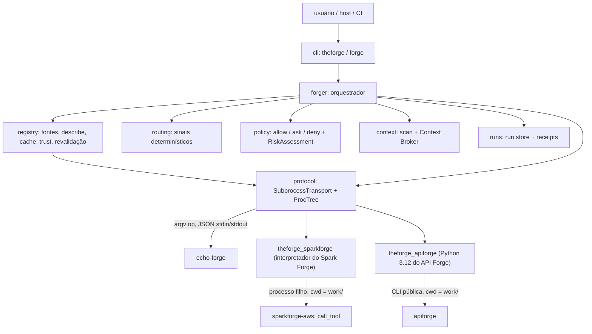

# Arquitetura (ciclos 1 e 2, Waves A e B)



## Fluxo de `ask`

```mermaid
sequenceDiagram
    participant CLI
    participant Forger
    participant Registry
    participant Provider
    CLI->>Forger: AskRequest (approvals)
    Forger->>Forger: TaskSpec (persistido)
    Forger->>Registry: records()
    Forger->>Forger: route() -> RoutingDecision
    Forger->>Registry: revalidate(candidatos)
    Registry->>Provider: describe (cwd temporário)
    Forger->>Forger: re-route uma vez se algum manifest mudou
    Forger->>Provider: health (cwd temporário), fallback se preciso
    Forger->>Forger: RoutingDecision final (persistido)
    Forger->>Forger: policy -> RiskAssessment (persistido); ask/deny -> refused
    Forger->>Forger: ContextPack validado (persistido)
    Forger->>Provider: execute(task, capability, action, context) (cwd do run)
    Provider-->>Forger: Response(ExecutionResult)
    Forger->>Forger: integridade + producer; ExecutionResult + ExecutionReceipt (persistidos)
    Forger-->>CLI: AskOutcome
```

- A revalidação descreve de novo todos os candidatos pontuados antes da decisão final. Um manifest que diverge do cache invalida a entrada e refaz `records()` e `route()` uma única vez (limitação `registry-revalidated: <ids>`); uma segunda divergência é `provider_failure` com `FORGE-REGISTRY-MANIFEST-CHANGED`. Provider inalcançável sai dos candidatos. Em `no_route` não há revalidação.
- O artefato `routing` só é gravado depois da decisão final, com fallbacks e limitações consolidados.
- Fallback de health aceita só candidatos com a mesma capability e a ação resolvida. Sem candidato saudável, o resultado é `provider_failure` explícito com as tentativas em `fallbacks_used`.
- Um `result` só existe no run se passou pela [integridade](protocol.md#integridade-do-resultado). O receipt sempre é gravado e é validado (`FORGE-RECEIPT-INVALID`) contra o hash real do `result` gravado. Ele registra a identidade observada do provider: `executable`, `fingerprint` e `observed_version` ([ADR 0013](adr/0013-provider-identity.md)).

## Routing
- Explícito (`--capability`): escolhe entre os providers roteáveis que declaram a capability, desempatando por trust e depois por id.
- Por sinais: a decisão usa só a presença por tipo de sinal (dependência, glob, keyword), de 0 a 3. As contagens dentro de cada tipo servem só para explicação e nunca desempatam. Empate, ou menos de 2 tipos casados, resulta em `ambiguous`. Um sinal casado por todos os candidatos não discrimina e vai para `limitations`. O vencedor também precisa ser o único no topo contando os sinais compartilhados.
- Entradas são ordenadas antes do processamento: a decisão depende só do conteúdo, nunca da ordem de descoberta ou do filesystem.
- Pedido por alias resolve para o ID canônico (nota `capability-alias`); alias com canônicos diferentes entre providers vira `ambiguous`. Capability depreciada continua roteável, com nota `capability-deprecated`. ID declarado por mais de um provider gera `capability-overlap` ([ADR 0017](adr/0017-capability-taxonomy.md)).
- Capabilities `heuristic` ou `unresolved` resultam em confiança `low`. Providers sem `execute` em `ops` não são roteáveis; a decisão registra a exclusão relevante em `limitations`, e um `--capability` que nenhum outro provider poderia executar é recusado com `FORGE-PROTO-OP-UNSUPPORTED` ([protocol.md](protocol.md)). Versão SemVer (`FORGE-MANIFEST-VERSION`), limites de manifest, taxonomia (`FORGE-MANIFEST-TAXONOMY`) e globs catch-all são aplicados no registry ([protocol.md](protocol.md#manifest)).
- Limitação conhecida: sinais genéricos declarados por um único provider confiável ainda podem vencer um provider mais específico (ver [security.md](security.md#limitações-de-isolamento)).

## Responsabilidades

| Módulo | Faz | Não faz |
|---|---|---|
| `contracts` | dataclasses v1, validação, integridade relacional, códigos `FORGE-*`, JSON canônico, schemas | I/O |
| `protocol` | spawn em grupo/Job Object, kill da árvore, timeout, limites de stdout e stderr, validação do envelope, negociação | decidir rota |
| `registry` | carregar entradas, `describe`, negociar protocolo, cache do usuário, fingerprint, revalidação, trust, health | executar tarefas |
| `routing` | ranquear capabilities por presença de sinais declarados | conhecer domínios |
| `policy` | decidir `allow/ask/deny` e montar o `RiskAssessment` a partir da declaração do provider | verificar o que o provider faz |
| `security` | ambiente mínimo do provider, redaction, caminhos seguros | sandbox |
| `context` | listar arquivos com segurança, montar ContextPack por referência | enviar conteúdo de arquivos ao provider (lê os bytes só para calcular sha256 e tamanho) |
| `forger` | orquestrar um run, revalidação, policy, fallback de health, integridade, receipts | lógica de domínio |
| `runs` | persistir artefatos redigidos, hashes, releitura estrita, validação de receipt | interpretar resultados |
| `cli` | parsing, render, exit codes | lógica de negócio |

## Estado

| Local | Classe | Git |
|---|---|---|
| `.forge/config/` | persistent | committable |
| `.forge/runs/<run_id>/` (`task`, `routing`, `risk`, `context`, `result`, `receipt`) | persistent local, redigido | ignorado |
| `.forge/runs/<run_id>/work/` (cwd do execute; raiz de `artifacts[].path`) | persistent local, escrito pelo provider, **não redigido** ([security.md](security.md#exceção-forgerunsidwork)) | ignorado |
| `.forge/cache/` | ephemeral | ignorado |
| `<cache do usuário>/registry/<id>-<digest12>.json` | cacheable, fora do projeto ([ADR 0009](adr/0009-registry-cache-location.md)) | — |

O legado `.forge/registry/` não é mais criado; `init` e `registry refresh` o removem com aviso.

## Adapters reais
Spark Forge e API Forge entram como providers comuns, por dois adapters fora do pacote `theforge` ([ADR 0014](adr/0014-provider-adapter-location.md)): `adapters/sparkforge` (`theforge-sparkforge-adapter`) e `adapters/apiforge` (`theforge-apiforge-adapter`). Instalação e registro em [real-providers.md](real-providers.md).

- **Fronteira.** Cada adapter é stdlib-only, instalado no interpretador do especialista, e nunca importa `theforge`; o core nunca importa um adapter nem um especialista. O core vê só o `argv` registrado e os envelopes JSON.
- **Shell comum.** `_shell.py` (envelope, gates de op/protocolo/capability/ação, `stage_context`, `evidence_hash`, `finalize`, `run_native`, `cleanup_workdir`) é copiado byte a byte nos dois adapters; um teste garante a igualdade. Os códigos de erro dos adapters estão em [protocol.md](protocol.md#códigos-dos-adapters-reais).
- **describe.** Deriva o manifest de uma tabela positiva (`catalog.py`) cruzada com um snapshot gravado da superfície nativa (`native_catalog.json`, `native_matrix.json`), sem importar a superfície de tools. Os IDs seguem a taxonomia do [ADR 0017](adr/0017-capability-taxonomy.md); o catálogo está em [capabilities.md](capabilities.md).
- **Capabilities não expostas.** Só ações read-only, offline e preenchíveis com arquivos do workspace são declaradas. Tools que pedem rede, credenciais AWS ou escrita local, e capabilities `unsupported` ou de mutação do API Forge, ficam em `limitations` do manifest com o motivo e nunca são executáveis.
- **health.** Só checagens locais, sem rede e sem credenciais: interpretador, importabilidade e versão do especialista contra `SUPPORTED_SPECIALIST` (fora da janela → `degraded` com a versão encontrada e a janela). O Spark nunca chama o `doctor` nativo (que sonda credenciais AWS). O API não roda o `apiforge doctor`: confere só que `apiforge.cli` existe (`find_spec`, sem importar), porque importar a CLI leva de 3 a 17 s, acima do orçamento de 10 s; dependência quebrada da CLI aparece no `execute`.
- **execute.** O adapter copia para `<cwd>/stage/` só os arquivos do ContextPack com sha256 conferido (`context_revalidation = "hash"`) e roda o especialista num processo filho com cwd no `work/` do run: no Spark, `python -m theforge_sparkforge.native_call` (`detail_level = "normal"`); no API, a CLI pública com `APIFORGE_CACHE=off` (no `change-control run`, cwd na raiz do workspace copiado). A chamada nativa tem 85% do timeout de execute do perfil (`ADAPTER-NATIVE-TIMEOUT`). Erros nativos viram `refused`/`error` estruturados com o código nativo preservado.
- **Tamanho.** Acima de 4 MiB, o resultado mantém os findings que cabem, grava a saída nativa completa no artifact `native/full-output.json` e vira `partial`; se nem o resultado sem nenhum finding couber, `ADAPTER-OUTPUT-TOO-LARGE` (`error`).
- **Contenção.** Em todo desfecho, `cleanup_workdir` reduz `work/` aos `artifacts[]` declarados; `.sparkforge/`, `traces.db`, `.apiforge/` e caches nunca ficam no workspace do usuário nem no run.
- **Testes.** A conformance offline roda os dois adapters em `--replay` (gravações em `tests/fixtures/native/`) no CI principal; a integração contra os Forges reais (`-m real_provider`) roda no workflow agendado.

## CI
Decisões em [ADR 0011](adr/0011-ci-support-matrix.md).

| Workflow | Quando | O que roda |
|---|---|---|
| `ci.yml` | `pull_request` e `push` em `main` (gate de PR) | Ubuntu e Windows × Python 3.11–3.14: ruff, mypy, paridade de schemas, `pytest -m "not slow and not real_provider"`; job `package`: build, `scripts/ci/check_zero_deps.py` e `scripts/ci/fresh_install.py` (wheel em venv novo, `doctor`, `init` e `ask` com `demo.echo`) |
| `compat.yml` | semanal e `workflow_dispatch` | macOS × 3.11 e 3.14, mesma suíte offline |
| `real-providers.yml` | semanal e `workflow_dispatch`; nunca bloqueia PR | checkout dos repositórios irmãos em `siblings/spark-forge-aws` e `siblings/api-forge`, venv 3.11 (Spark) e 3.12 (API) e `pytest -m real_provider` com `THEFORGE_REAL_PROVIDERS_REQUIRED=1` |

- O segredo `SIBLING_REPOS_TOKEN` (fallback `github.token`) só aparece no `with.token` dos checkouts dos irmãos, com `persist-credentials: false`; nunca em `env` nem em `run`. Todos os workflows usam `permissions: contents: read`.
- Os testes são classificados pelos markers `unit`, `contract`, `integration`, `e2e`, `slow`, `security` e `real_provider`; um arquivo de teste sem categoria falha a coleta. A suíte offline bloqueia rede (exceto loopback) dentro do processo do pytest; o marker `allow_network` libera um teste.

## Fora desta wave
Entrada Forge Protocol nativa em cada Forge (gatilho de migração no [ADR 0014](adr/0014-provider-adapter-location.md#gatilho-de-migração-para-entrada-nativa-b)), LLM/semantic routing, multi-provider (parallel/pipeline/debate), economy avançada, installer, workspace graph, sandbox de SO.
